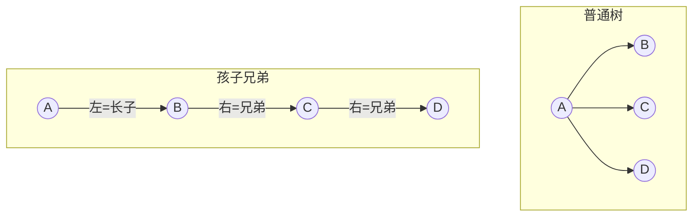
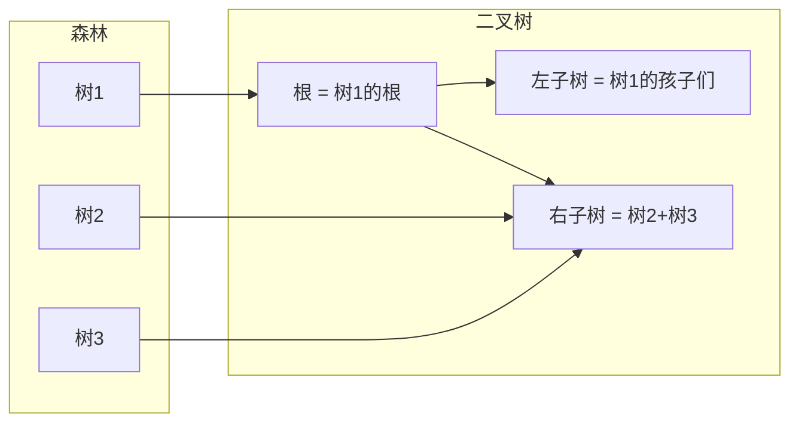

## 本章要义

普通树的孩子个数不固定，不好直接用二叉链表。孩子兄弟表示法把「长子 + 右兄弟」压成两个指针，于是树和森林都能唯一地对应到一棵二叉树。408 考手工转换和遍历对应，几乎不考代码。

## 源笔记勘误

- 四处「概要: 例子」都是空的，转换步骤没有一张示意图。
- 「树的后序：访问子树也按照先序的要求」是笔误。后序访问子树时仍按**后序**。
- 森林定义后直接写「森林转换成**树**的手动方法」，应为转换成**二叉树**。

## 树 → 二叉树

孩子兄弟表示法和二叉链表同构：左指针 = 第一个孩子，右指针 = 下一个兄弟。

手工：

1. 同一双亲的孩子之间加线（兄弟相连）。
2. 每个结点只保留到**最左孩子**的边，其它孩子边擦掉。
3. 把图顺时针旋转约 45°，兄弟线变成右斜。

根的右子树一定空——树的根没有兄弟。

手工一例（源笔记「概要: 例子」全空）：树根 \(A\)，孩子从左到右 \(B,C,D\)；\(B\) 有孩子 \(E,F\)。

1. \(B{-}C{-}D\) 加兄弟线，\(E{-}F\) 加兄弟线。
2. 只留 \(A\to B\)、\(B\to E\)，擦掉 \(A\to C,A\to D,B\to F\)。
3. 顺时针一转：二叉树里 \(A.left=B\)，\(B.right=C\)，\(C.right=D\)，\(B.left=E\)，\(E.right=F\)。

\(A\) 没有右孩子。先根 \(ABEFCD\) 等于这棵二叉树的先序；后根 \(EFBCDA\) 等于它的中序。

## 二叉树 → 树（这棵二叉树必须是某棵树变来的，即根没有右孩子）

1. 沿右孩子链看成一层兄弟，把它们摆平。
2. 每个结点的双亲 = 上一层连着自己的那个结点（进入该层的左孩子边的起点）。
3. 兄弟之间的水平线删掉，改连回共同双亲。

## 森林 → 二叉树

森林是 \(m\)（\(m\ge 0\)）棵互不相交的树。

1. 每棵树先转成二叉树。
2. 第 \(i+1\) 棵树的二叉树，挂到第 \(i\) 棵树根的右指针上。

于是第一棵树的根成为整棵二叉树的根；它的左子树来自第一棵树的子树们，右子树是「其余树组成的森林」。

## 二叉树 → 森林

反复切开根的右孩子指针：每切开一次，就分离出森林里的下一棵树（再按二叉树→树还原）。直到根没有右孩子。

## 遍历对应

树：

- **先根**：根，然后从左到右先根遍历各子树。
- **后根**：从左到右后根遍历各子树，最后根。（源笔记写成「子树按先序」，错。）
- 树一般不谈中根，因为孩子多于两个时「根插在哪两棵子树之间」不唯一。

对应关系（记死）：

- 树的先根 = 它对应二叉树的**先序**
- 树的后根 = 它对应二叉树的**中序**
- 森林的先序 = 对应二叉树的先序
- 森林的中序 = 对应二叉树的中序

层序没有这种干净的一一对应，不要硬套。

## 408 易错点

- 转换后二叉树的左孩子、右孩子含义变了：左 = 孩子，右 = 兄弟。按二叉树性质数「左子树结点」时，数的是原树里「第一棵子树及其后代」，不是「所有孩子」。
- \(n\) 个结点的树转成二叉树后，空右指针更多出现在「没有右兄弟」的结点上；根的右指针必空。
- 空森林对应空二叉树。

## 考研题精练

**题 1**  
树的根转换成二叉树后，根的右孩子（ ）。

A. 一定空 B. 一定非空 C. 是原树的右子树 D. 是原树最大的孩子

**解答：** 树根没有兄弟，右指针必空。**选 A。**

**题 2**  
树的后根遍历对应其孩子兄弟二叉树的（ ）。

A. 先序 B. 中序 C. 后序 D. 层序

**解答：** 后根 = 对应二叉树中序；先根 = 先序。**选 B。**

**题 3**  
森林转二叉树：第二棵树的根挂在（ ）。

A. 第一棵树根的左孩子 B. 第一棵树根的右孩子 C. 第一棵树最右叶子 D. 任意叶子

**解答：** 各树先转二叉树，后一棵根接到前一棵根的右指针。**选 B。**

## 继续阅读

回到 [[ds/04-tree|树与二叉树]] 看存储和哈夫曼。图的生成树是另一种「树」，定义在 [[ds/05-graph|图]]。
