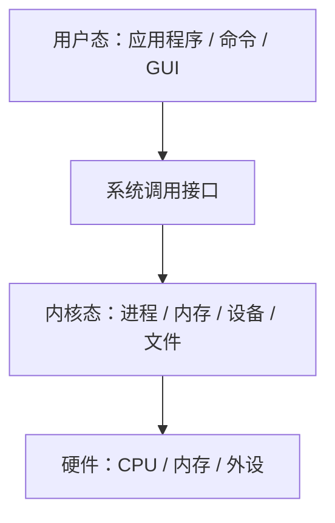

## 本章要义

操作系统是硬件之上的第一层软件：给用户当接口，给硬件当管家，把 CPU、内存、设备、文件抽象成能用的资源。四大特征——并发、共享、虚拟、异步——后面每一章都在落实它们。

## 源笔记勘误

- 整章几乎是标题树，单道批处理、实时、集群、微机 OS 都是空的。
- 并发与并行的箭头写反了一次：「并行 → 宏观并行，微观并行」可以，但后面又用「宏观一起、微观交替」定义并发，两段叠在一起容易混。
- 「进程是资源分配的基本单位」在引入线程后要改口：有线程的系统里，**进程分配资源，线程是调度单位**。
- 微内核只写了「客户/服务器、面向对象」，没写优点和代价。

## 目标和作用

目标：方便、有效（利用率 + 吞吐量）、可扩充、开放。

作用：

1. 用户与硬件之间的接口：命令、系统调用、GUI。
2. 资源的抽象：没有 OS，程序员要直接对寄存器和端口编程。

## 发展（补全空标题）

- **人工操作**：人上机，CPU 等纸带，利用率极差。
- **脱机 I/O**：卫星机先把作业灌到磁带，主机少等慢设备。
- **单道批处理**：磁带上的作业自动接下去，内存里一次一个作业。
- **多道批处理**：内存同时几道作业，一道等 I/O 时另一道用 CPU。宏观并行、微观串行。利用率高、吞吐大，**周转时间长、无交互**。
- **分时**：时间片轮转，多路、独立、及时、交互。
- **实时**：硬实时必须在截止期完成，软实时尽量。
- 网络 / 分布式 / 集群 / 个人机 OS：源笔记点到为止，408 知道「资源共享 + 通信」即可。

## 四大特征

- **并发**：同一时间间隔内多个事件都在推进。并行是同一时刻真正一起发生（多核）。
- **共享**：互斥共享（打印机）与同时访问（可重入代码、磁盘）。并发和共享互为条件。
- **虚拟**：时分复用（一台 CPU 虚成多台）、空分复用（一块内存虚成多个地址空间）。
- **异步**：进程推进速度不可预知，但只要环境相同，结果应当可再现——这靠同步机制保证。

## 主要功能

处理机（进程控制 / 同步 / 通信 / 调度）、存储器（分配、保护、映射、扩充）、设备、文件，以及用户接口（命令 + 系统调用）。现代 OS 再加安全、网络、多媒体。

## 结构

无结构 → 模块化 → 分层（单向调用，易保证正确）→ **微内核**：内核只留中断、时钟、原语、最基本的进程/内存/通信，文件和设备放到用户态服务器。优点：可扩充、可移植、可靠性。代价：消息传递次数多，性能差。源笔记没写代价。

## 408 易错点

- 多道是「内存里同时有多道」，不是「有多个 CPU」。
- 分时的及时性是「人能忍受的响应」，实时的及时性是「对象能忍受的截止期」，数量级不同。
- 并发不是并行。单核也能并发。

## 考研题精练

**题 1**  
下列关于并发与并行的叙述中，正确的是（ ）。

A. 单处理机系统无法实现并发  
B. 并发要求同一时刻有多个事件真正同时发生  
C. 并发是同一时间间隔内多个事件都在推进，单核也可并发  
D. 并行是宏观上一起、微观上交替执行

**解答：** 并发是宏观并行、微观交替（单核靠切换）；并行是同一时刻真正一起（多核）。A、B 把并发当成并行。D 把并发的定义安到并行上。**选 C。**

**题 2**  
多道批处理相对单道批处理，主要提高的是（ ）。

A. 作业的平均周转时间 B. 交互能力 C. CPU 与 I/O 设备的利用率 D. 硬实时截止期保证

**解答：** 一道作业等 I/O 时另一道占用 CPU，利用率和吞吐上去；周转往往更长，仍然没有交互，也不提供实时截止期。**选 C。**

**题 3**  
微内核把文件、设备等放到用户态服务器，主要代价是（ ）。

A. 无法再做保护隔离  
B. 客户/服务器消息传递次数多，性能下降  
C. 不能运行在多处理机上  
D. 不再提供系统调用

**解答：** 优点是可扩充、可移植、可靠性高；代价是频繁消息传递和模式切换。保护仍在，系统调用仍在。**选 B。**

## 继续阅读

进程把「并发」变成可调度的实体：[[os/02-process|进程]]。
