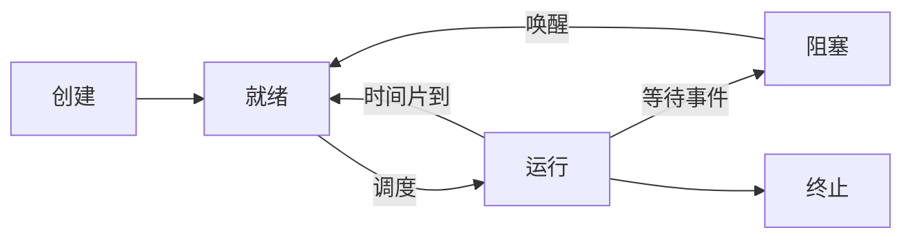

## 本章要义

程序是静态的指令序列；进程是程序的一次执行，有 PCB、有生命期。同步解决协作，互斥解决竞争。线程把「调度」从「分配资源」里拆出来。



## 源笔记勘误

- 「前驱图和程序执行」「程序的并发执行」是空标题。前驱图用结点表示语句、有向边表示先后；并发执行失去封闭性和可再现性，这才必须引入进程。
- 「进程通信又称低级进程通信」反了。信号量交换的是少量信号，叫**低级通信**；共享内存、管道、消息传递才是**高级通信**。
- 引入线程写成「为了简化线程间的通信」——循环定义。应当是：为了降低并发开销，把调度单位变轻，同进程线程共享地址空间，通信也更便宜。
- 生产者-消费者、哲学家、读者写者只有标题。
- PCB 里「内部标识符(端口)」不准确，内部 ident 是整数，不是网络端口。
- 阻塞过程「自己阻塞自己」、唤醒「别人唤醒」这句是对的，要保住。

## 进程

定义（三条互补）：一次执行；在一个数据集合上的活动；资源分配和调度的独立单位（有线程后，调度单位改成线程）。

特征：动态、并发、独立、异步。由程序、数据、PCB 组成。一个程序可对应多个进程。

三态：就绪 ⇄ 运行 → 阻塞 → 就绪。不可能：阻塞→运行（必须先就绪）、就绪→阻塞（没运行就不会自己等事件）。五态加上创建、终止。挂起是对换到外存：静止就绪 / 静止阻塞，用于检查、协调、腾内存、保实时任务。

PCB 是进程存在的唯一标志：标识、处理机状态（寄存器、PC、PSW、栈指针）、调度信息、控制信息。组织：线性表、链接队列、索引。

创建：申请 PCB → 分配资源 → 初始化 → 插入就绪队列。终止：正常 / 异常 / 外界。阻塞是进程自己因事件等待；唤醒由系统和其它进程做。

内核：管态 vs 目态。原语不可分割。

## 同步

间接制约 = 互斥（抢临界资源）；直接制约 = 同步（协作）。临界区四段：进入、临界、退出、剩余。准则：空闲让进、忙则等待、有限等待、让权等待。

软件算法（Peterson 等）难同时满足让权等待。硬件：关中断、TS、Swap，仍忙等。

**记录型信号量**：`wait` 减一，小于 0 则阻塞并挂入等待队列（让权）；`signal` 加一，若仍 ≤0 则唤醒一个。整型信号量不让权。AND 信号量一次申请多种资源，防死锁。信号量集可一次申请 \(d\) 个，并检查下限 \(t\)。

### 生产者-消费者（源笔记空，补）

```
mutex=1, empty=n, full=0
producer: wait(empty); wait(mutex); 放产品; signal(mutex); signal(full);
consumer: wait(full); wait(mutex); 取产品; signal(mutex); signal(empty);
```

`empty/full` 与 `mutex` 的先后不能反，否则死锁。

哲学家：最多允许 4 人同时拿叉，或奇数先左偶数先右，或 AND 信号量一次拿两叉。

读者-写者：读共享、写互斥。第一读者抢写锁，最后读者释放；写者优先要额外信号量。

## 通信

- 共享数据结构 / 共享存储区
- 管道：半双工、亲缘、字节流
- 消息：直接（指名）或间接（信箱）
- 客户-服务器：Socket、RPC

## 线程

进程 = 资源容器；线程 = 调度实体。创建、切换便宜，同进程通信免去地址空间拷贝。实现：KST（内核看得见）、ULT（库实现，一个阻塞则全进程堵）、混合。TCB 保存线程自己的寄存器和栈，地址空间在进程里。

## 408 易错点

- 进程不能从阻塞直接到运行。
- `signal` 可以在 `wait` 之前（初值体现已有资源）。
- 用户级线程，一个线程阻塞在系统调用上，整个进程失去 CPU。
- 低级通信不是「进程通信的别名」。

## 考研题精练

**题 1（PV）**  
生产者-消费者中 `mutex=1, empty=n, full=0`。生产者正确的 `wait` 顺序是（ ）。

A. `wait(mutex); wait(empty);`  
B. `wait(empty); wait(mutex);`  
C. `wait(full); wait(mutex);`  
D. `wait(mutex); wait(full);`

**解答：** 先申请空缓冲区 `empty`，再进临界区 `mutex`。先拿 `mutex` 再 `wait(empty)`：缓冲区满时生产者握着互斥锁去睡眠，消费者无法进入临界区取走产品，双方死锁。C、D 是消费者侧的信号量。**选 B。**

**题 2（PV）**  
记录型信号量 \(S\) 初值为 3。三个进程各执行一次 `wait(S)` 之后，\(S\) 的值与等待队列长度是（ ）。

A. \(S=0\)，队列为空  
B. \(S=-3\)，队列中有 3 个进程  
C. \(S=0\)，队列中有 3 个进程  
D. \(S=3\)，队列为空

**解答：** 每次 `wait` 把 \(S\) 减 1：\(3\to 2\to 1\to 0\)。减到 0 时无人阻塞。再执行一次 `wait` 才会变成负数并入队。**选 A。**

**题 3**  
下列进程状态转换中，不可能发生的是（ ）。

A. 运行 \(\to\) 就绪 B. 就绪 \(\to\) 运行 C. 阻塞 \(\to\) 运行 D. 运行 \(\to\) 阻塞

**解答：** 阻塞必须先被唤醒进入就绪，再经调度才能运行。不存在阻塞直接到运行；就绪也不会自己变成阻塞。**选 C。**

## 继续阅读

谁在何时拿到 CPU、会不会死锁：[[os/03-schedule-deadlock|调度与死锁]]。
