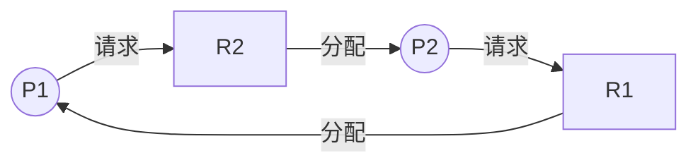

## 本章要义

调度决定谁先用 CPU。批处理看周转，分时看响应，实时看截止期。死锁是一组进程互相等对方手里的资源。处理：预防、避免、检测、置之不理（鸵鸟）。

## 源笔记勘误

- 死锁定义写成「仅由**该进程**中的其他进程」——应为**该组进程**中的其他进程。
- 银行家算法、安全性算法、例题全是空标题。
- 「多队列调度」只有标题；和多级反馈不是同一算法。
- 「可抢占资源不引起死锁」过绝对。CPU、内存通常不当成死锁资源，但死锁的四个条件谈的是**当前这类资源**是否可抢占。
- 循环等待在「每类资源只有一个实例」时才是充要条件。源笔记这句是对的，要保住。

## 调度层次与目标

- 高级（作业）：选哪些后备作业进内存。分时系统往往没有。
- 中级：挂起 / 激活，调节负荷。
- 低级（进程 / 线程）：任何 OS 都有。排队器 + 分派器 + 上下文切换。抢占或非抢占。

共同目标：利用率、公平、平衡、强制策略。批处理还要短周转、高吞吐；分时要快响应；实时要保证截止期、可预测。

CPU 利用率 = 有效 / (有效 + 空闲)。

## 作业调度

作业 = 程序 + 数据 + 说明书。JCB 是作业存在的标志。三态：后备、运行、完成。

- **FCFS**：利于长作业、CPU 繁忙作业。
- **SJF**：平均周转好，要预知时间，饿长作业，无交互。
- **HRRN**：响应比 \(1+等待/服务\)。短作业优先，等得久的长作业也会上来。
- 优先级：静态或动态。

## 进程调度

- **优先级**：非抢占等多完；抢占立刻换。
- **RR**：时间片太短切换开销大，太长退化成 FCFS。\(q\) 略大于一次交互。
- **多队列**：按类型分几个就绪队列，各用各的算法（源笔记空）。例如前台 RR、后台 FCFS。
- **多级反馈**：几个队列，时间片逐级变长，新来进最高层，用完片降一级，底层 RR。对短作业、交互作业友好。
- 保证调度 / 公平分享：按承诺比例给 CPU。

## 实时

可调度条件 \(\sum C_i/P_i \le 1\)（单处理机）。要抢占、要快中断和快分派。

- **EDF**：截止期越早优先级越高。
- **LLF**：松弛度 = 截止期 − 尚需运行 − 当前时间，越小越先。
- 优先级反转：高优先级等低优先级占着的锁，中间优先级再插队。解决：优先级继承，或临界区不可抢占（简单粗暴）。

## 死锁

四必要条件：互斥、请求并保持、不可抢占、循环等待。

**预防**（破坏条件）：一次性申请全部；或拿不到就放光已持有；或资源全序申请。浪费或实现难。

**避免**：保持安全状态。安全 = 存在一个完成序列。

银行家（源笔记空，补步骤）：

1. 进程声明最大需求 `Max`，`Need=Max-Allocation`。
2. 请求 `Request`：若 `Request>Need` 或 `Request>Available` 则错或等待。
3. 试分配：`Available-=Request; Allocation+=; Need-=`。
4. 跑安全性算法：找 `Need≤Available` 的进程，假定它完成并释放，直到全部能完成。不安全则撤回试分配，让进程等待。

**检测**：简化资源分配图，能化成孤立结点则无死锁。时机：每次等待时 / 定时 / 利用率掉下来。

**解除**：抢资源、撤进程（先撤代价小的）、或挂起。

## 408 易错点

- 安全状态一定不死锁；不安全不一定已经死锁。
- SJF 是作业，SPF/SJF 用于进程时叫短进程优先，可抢占版是 SRTF。
- RR 的平均周转通常差于 SJF，响应好。
- 每类资源多个实例时，有环不一定死锁。

## 考研题精练

**题 1（银行家）**  
Available=\((1,0,2)\)。Allocation / Need 为：P0 \((0,1,0)/(1,0,0)\)，P1 \((1,0,0)/(0,1,1)\)，P2 \((1,0,1)/(1,0,2)\)。下列叙述正确的是（ ）。

A. 当前没有任何进程的 Need \(\le\) Available，已经死锁  
B. 存在安全序列 P0, P2, P1  
C. 存在安全序列 P1, P0, P2  
D. 不安全状态就是已经死锁

**解答：** P0 的 Need=\((1,0,0)\le(1,0,2)\)，完成后 Available=\((1,1,2)\)；接着 P2 的 Need=\((1,0,2)\) 可满足，再完成 P1。P1 的 Need 第二维 \(1>0\)，不能排在第一位。A 漏看了 P0；不安全还不是死锁。**选 B。**

**题 2**  
死锁预防中「资源按全序申请」破坏的是四个必要条件里的（ ）。

A. 互斥 B. 请求并保持 C. 不可抢占 D. 循环等待

**解答：** 全序申请使资源分配图无法成环。一次性申请全部、或申请失败就放光已持有，破坏的是请求并保持；剥夺已分配资源破坏不可抢占。**选 D。**

**题 3**  
时间片轮转（RR）中，时间片过大时算法退化为（ ）。

A. SJF B. FCFS C. HRRN D. 多级反馈队列

**解答：** 片大到一次就能跑完，谁先到谁先服务，就是 FCFS。片太小则切换开销吃掉有效时间。**选 B。**

## 继续阅读

内存怎么分给被调度进来的进程：[[os/04-memory|存储器管理]]。
