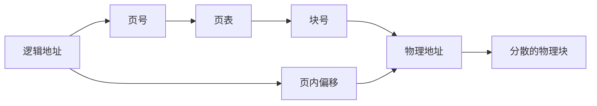

## 本章要义

逻辑地址要变成物理地址。连续分配简单但碎；分页按物理块切，分段按逻辑切。段页式两者都要，访存次数最多。

## 源笔记勘误

- 「目标**模板**」应为目标**模块**。
- next fit 写成「类似哈希左右交叉」不准确。它只是从**上次分配的下一个**空闲区继续找。
- 页内偏移「0-31」只是 32 字节页的例子，不是定义。
- 对换那段写成「每次只调一个作业、时间片到了换出去」，更像早期整作业对换，不是现代按页对换。了解即可。
- 固定分区的优缺点被插在「把内存划分为固定分区」标题下，和动态分区段落缠在一起，阅读时要对号入座：无外碎片、有内碎片的是**固定分区**。

## 装入与链接

编译 → 目标模块 → 链接成装入模块 → 装入内存。

- 绝对装入：编译就定物理地址。
- 可重定位装入：装入时一次性改址，之后不能搬。
- 动态运行时装入：执行时用硬件（基址 / 页表）变换，可分散、可移动。虚拟存储的基础。

链接：静态、装入时动态、运行时动态（DLL）。

## 连续分配

单一连续（DOS）、固定分区、动态分区。

内碎片在分区内部，外碎片在分区之间。固定分区有内无外；动态分区有外无内。

动态分区搜索：

| 算法 | 空闲区顺序 | 特点 |
|------|------------|------|
| 首次适应 FF | 地址低→高 | 查找快，低址碎 |
| 循环首次 NF | 从上次往后 | 更均匀 |
| 最佳适应 BF | 小→大 | 剩下更碎的外碎片 |
| 最坏适应 WF | 大→小 | 大块被啃掉 |

紧凑 + 动态重定位可收外碎片。伙伴系统、快速适应属于索引类，了解。

保护：基址 + 界限，物理地址 = 逻辑 + 基址，越界则错。

## 分页

逻辑空间切成页，内存切成同样大小的页框。最后一页可能有页内碎片。页表：页号 → 块号。PTR 存页表始址和长度，调度时从 PCB 装入。

无快表：先访页表再访数据，两次内存。有 TLB（快表）：命中则一次。有效访问时间 \(h\cdot t_{TLB+mem}+(1-h)(t_{TLB}+2t_{mem})\)（具体公式看题是否把 TLB 和访存分开）。

多级页表：页表自己再分页。反置页表按物理块索引，一项对应一框，适合大虚空间、小物理内存。

分页优点：无外碎片、不必连续、易增长。基本分页仍要求程序**一次全部装入**。这就是下一章请求分页要打破的「一次性、驻留性」。

## 分段与段页

段是逻辑单位：代码、数据、栈，长度可变，二维地址（段号 + 段内）。方便共享、动态增长、动态链接。指令不会跨段，可能跨页。

段页：段号 → 页表始址 → 页号 → 块号 → 块内。无快表要三次访存。

## 408 易错点

- 分页一维，分段二维。
- 页大小必须是 2 的幂，地址切开即可，不用除法。
- 「分段比分页快因为段表短」只有在段数确实少时成立，不是定理。
- 快表是相联存储器，按页号并行匹配。

## 考研题精练

**题 1**  
逻辑地址 16 位，页大小 1 KB。页号占（ ）位，页表最多（ ）项。

A. 6 位，64 项 B. 10 位，1024 项 C. 6 位，1024 项 D. 10 位，64 项

**解答：** \(1\,\mathrm{KB}=2^{10}\)，页内偏移 10 位，页号 \(16-10=6\) 位，页表至多 \(2^6=64\) 项。把页大小的 10 当成页号位数是常见错法。**选 A。**

**题 2（EAT）**  
访存 100 ns，查 TLB 20 ns，快表命中率 80%。有效访问时间是（ ）。

A. 120 ns B. 140 ns C. 160 ns D. 220 ns

**解答：** 命中：TLB + 访数据 \(=120\,\mathrm{ns}\)；不命中：TLB + 访页表 + 访数据 \(=220\,\mathrm{ns}\)。\(\mathrm{EAT}=0.8\times 120+0.2\times 220=140\,\mathrm{ns}\)。等价写法：\(20+100+(1-0.8)\times 100=140\)。**选 B。**

**题 3**  
段页式地址变换在无快表时，访问一次数据需要访存（ ）次。

A. 1 B. 2 C. 3 D. 4

**解答：** 先访段表得页表始址，再访页表得块号，最后访数据，共三次。基本分页无快表是两次。**选 C。**

## 继续阅读

不一次装完、还能换页：[[os/05-virtual-memory|虚拟存储器]]。组成课 cache/TLB 对照 [[co/07-storage|存储层次]]。
