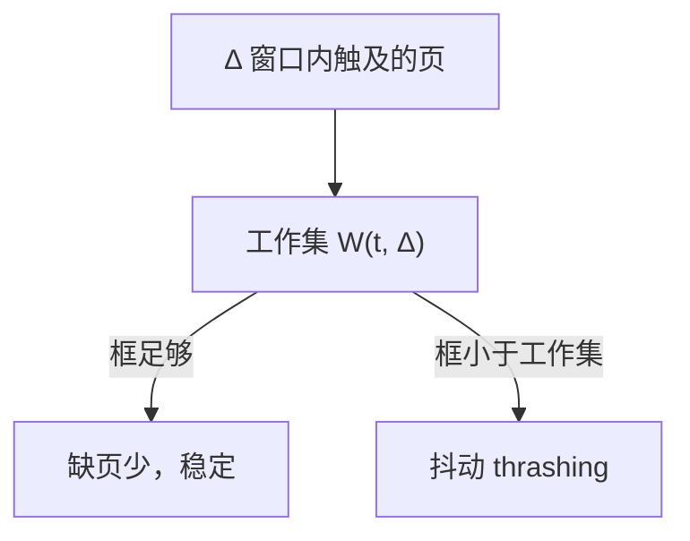

## 本章要义

常规管理有一次性、驻留性：作业必须全进来、一直待着。虚拟存储器靠局部性，只留当前用的页，逻辑上把内存「变大」。最重要的特征是**多次性**（源笔记这句对）。

## 源笔记勘误

- 预调页写成「不能实现」。预调（prefetch）可以做，只是不准；请求调页才是主流。
- Clock 改进型「对修改位 M **思维**判断」是笔误。
- 置换算法没有例题；抖动没有和工作集、缺页率曲线连起来。
- 请求分段只有硬件标题。
- 「国王的大儿子 / 二儿子 / 小儿子」没解释。对应：固定分配局部置换、可变分配全局置换、可变分配局部置换。

## 局部性

时间局部：循环、栈。空间局部：顺序执行、数组。没有局部性，虚存会抖成 thrashing。

虚存特征：离散分配是基础，多次性最重要，加上对换性、虚拟性。用 CPU 时间和外存换内存容量。

## 请求分页

页表项额外字段：状态位 P（在不在内存）、访问位 A、修改位 M、外存地址。

缺页是**内中断**：指令执行中发现页不在，保护现场，调页（必要时置换），恢复后**重执行那条指令**。

### 物理块分配（源笔记「国王三儿子」）

先定**最小物理块数**：一条指令可能触及的最多页数（指令跨页、操作数跨页、间接寻址），少了连一条指令都跑不完。

| 策略 | 框数 | 缺页时换谁 | 对应 |
|---|---|---|---|
| 固定分配局部置换 | 分配时定死 | 只换本进程 | 大儿子：份固定、各管各的 |
| 可变分配全局置换 | 可增可减 | 可抢任何进程的框 | 二儿子：家里共用，谁缺谁拿 |
| 可变分配局部置换 | 按缺页率调 | 只换本进程 | 小儿子：份能调，但不抢别人 |

固定怎么切：平均分配（不公平，小进程浪费）；按比例（按进程大小）；再加权优先权。可变分配看缺页频率：太高就加框，太低就收回。

### 有效访问时间

内存 \(t_m=100\,\mathrm{ns}\)，缺页处理 \(t_f=8\,\mathrm{ms}=8\times 10^6\,\mathrm{ns}\)。若希望 EAT ≤ 200 ns：

\[
\mathrm{EAT}=(1-f)t_m+f\cdot t_f\le 200 \implies f\le \frac{100}{8\times 10^6-100}\approx 1.25\times 10^{-5}
\]

一万次访存只许约 0.125 次缺页。这就是为什么框数必须盖住工作集。

从哪调：对换区（运行过的页）或文件区（没改过的代码页，M=0 可直接丢）。

**PBA（页缓冲）**：换出页先挂到空闲链表（干净）或修改页链表（脏），不立刻写盘。再缺页时若还在链上，等于「免费换回」。脏链表满了再成批写回，减少 thrashing 时的磁盘风暴。

### 请求分段

段表项：基址、长度、存在位、访问位、修改位、外存地址。缺的是**整段**。地址：段号 + 段内偏移，越界则越界中断。段可动态增长，外碎片要用紧凑。现代通用 OS 少用纯请求分段，了解硬件框架即可。工作集是进程在 Δ 窗口内触及的页集合；框 < 工作集 ⇒ 抖动。

## 置换

- **OPT**：淘汰最久以后才用的，无法实现，当标杆。
- **FIFO**：最老的出局。有 Belady 异常（框多了缺页反而多）。
- **LRU**：最久没访问的出局。硬件用计数器或栈。
- **LFU**：次数最少。早期的热点页可能一直占着。
- **Clock（二次机会）**：环形扫访问位，A=1 清零并留下，A=0 换出。改进型看 (A,M)：优先换 (0,0)，再 (0,1)……
- **PBA**：空闲链表和脏页链表，置换先摘链，写回可成批。

抖动：刚换出去又马上要用。原因是给进程的框少于其工作集。应对：降多道、挂起进程、工作集或缺页频率调节框数。

## 408 易错点

- 缺页中断必须重执指令，不能从下一条继续。
- FIFO 才有 Belady 异常，LRU/OPT 没有。
- 修改位置位的页换出要写盘，代价大于只读页。
- 虚存「变大」是逻辑上的，物理内存没变。

## 考研题精练

**题 1（FIFO / LRU）**  
3 个页框，访问串 \(2,3,2,1,5,2,4,5\)。FIFO 与 LRU 的缺页次数分别是（ ）。

A. 5 和 5 B. 6 和 5 C. 6 和 6 D. 5 和 6

**解答：** FIFO 换出最老页：缺 \(2,3,1,5,2,4\)，串中第二次访问 2 与最后的 5 命中，共 6 次。LRU 在装入 5 时换出 3，随后 2 仍在框内，共 5 次。**选 B。**

**题 2（EAT）**  
内存访问 \(100\,\mathrm{ns}\)，缺页处理 \(8\,\mathrm{ms}\)。希望 \(\mathrm{EAT}\le 200\,\mathrm{ns}\)，缺页率至多约为（ ）。

A. \(1.25\times 10^{-5}\) B. \(1.25\times 10^{-2}\) C. \(10^{-3}\) D. \(0.5\)

**解答：** \(\mathrm{EAT}=(1-f)\times 100+f\times 8\times 10^6\le 200\)，故 \(f\le 100/(8\times 10^6-100)\approx 1.25\times 10^{-5}\)。把 8 ms 当成 8 ns 或 8000 ns 会错选数量级。**选 A。**

**题 3**  
下列置换算法中会出现 Belady 异常的是（ ）。

A. OPT B. LRU C. FIFO D. 访问位始终准确时的 Clock

**解答：** 框数增加而缺页反而增多，只发生在 FIFO。OPT、LRU 属于栈算法，无此现象。**选 C。**

## 继续阅读

页从磁盘进来要走 I/O：[[os/06-io|输入输出]]。组成侧的 TLB/cache 见 [[co/07-storage|存储层次]]。
