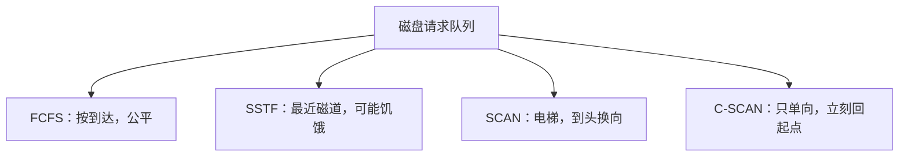

## 本章要义

I/O 软件分层，把「读文件」变成「磁头去哪」。设备独立性让程序写逻辑设备名；SPOOLing 把独占设备虚成共享；磁盘调度决定磁头怎么走。

## 源笔记勘误

- FCFS 的缺点写成「某些进程长期得不到满足」。FCFS **公平**，会饿死的是 **SSTF**（总去最近的，远处一直等）。
- 设备独立性优点第一条写成「以物理设备名使用设备」——那是没有独立性。独立性用**逻辑设备名**，再映射到物理设备，才能重定向。
- 「流设备接口」应为字符设备。叫流也可以，但和 STREAMS 别混。
- 通道瓶颈「结果类似 RS 触发器」不知所云，删。解决是**增加通路（多通路）**而不必增加通道台数。
- 数据组织和格式、磁盘类型几乎空，补最小集合即可。

## 层次与接口

自上而下：用户层库 / 系统调用 → 设备独立性软件 → 驱动程序 → 中断处理 → 硬件。

- 块设备：磁盘，可寻址，DMA。
- 字符设备：键盘、打印机，不可寻址，中断驱动。
- 网络接口单独一类。

控制器夹在 CPU 与设备之间：命令寄存器、状态、数据缓冲、地址译码、差错控制。内存映像 I/O 用访存指令读写这些寄存器。

## 通道

通道是专管 I/O 的弱处理机，和 CPU 共享内存。CPU 发 I/O 指令 → 通道跑通道程序 → 完成再中断 CPU。

- 字节多路：时间片切，连低速。
- 数组选择：高速，一段时间内独占，利用率低。
- 数组多路：高速且多台交叉，利用率好。

## 控制方式

轮询 → 中断 → DMA → 通道。宗旨：少打扰 CPU。和组成课 [[co/08-io|DMA/中断]] 同一套，OS 课多讲软件层次。

## 设备独立性与分配

逻辑名 → LUT → SDT → DCT → COCT → CHCT，设备、控制器、通道都到手才算通路。独立性软件还做缓冲、差错、统一驱动接口、逻辑块。

SPOOLing：输入井 / 输出井 + 缓冲 + 预输入 / 缓输出进程。独占打印机变成「写到输出井」，体现虚拟性。

## 缓冲

缓和速度差、降中断频率、提高并行、匹配粒度。单缓冲：设备与 CPU 串起来仍有等。双缓冲：两边可重叠。环形：多个缓冲 + 指针，本质是生产者-消费者。缓冲池：空 / 输入 / 输出三条链，Getbuf/Putbuf 收容或提取。

## 磁盘

访问时间 = 寻道 \(T_s=m\cdot n+s\) + 旋转等待（常 \(1/(2r)\)）+ 传输 \(b/(rN)\)。

| 算法 | 做法 | 注意 |
|------|------|------|
| FCFS | 请求顺序 | 公平，寻道可能很长 |
| SSTF | 最近磁道 | 平均寻道短，**可能饥饿** |
| SCAN | 电梯，到头换向 | 两端等待更久 |
| CSCAN | 只单向，立刻回起点 | 更均匀 |
| N-Step SCAN / FSCAN | 把请求分批 | 防磁臂被新请求粘住 |

## 408 易错点

- 饥饿是 SSTF 的锅，不是 FCFS。
- SCAN 在两端换向，刚扫过的那边新来的请求要等一整轮。
- SPOOLing 不是「真的分给每人一台打印机」。
- 通道程序在内存，通道自己取。

## 考研题精练

**题 1（SSTF）**  
磁头位于磁道 50，请求队列为 \(20,80,30,90,10\)。SSTF 的服务顺序是（ ）。

A. \(20,10,30,80,90\)  
B. \(30,20,10,80,90\)  
C. \(80,90,30,20,10\)  
D. \(20,30,10,80,90\)

**解答：** 距 50 最近的是 30（距离 20，小于 20/80 的 30）。再到 20（距 10）而不是 10（距 20），然后 10，再转向 80、90。C 是向磁道号增大方向扫的 SCAN。**选 B。**

**题 2（SCAN）**  
同上，磁头在 50 且正向磁道号增大的方向移动。SCAN 的服务顺序是（ ）。

A. \(30,20,10,80,90\)  
B. \(80,90,30,20,10\)  
C. \(20,30,10,80,90\)  
D. \(90,80,30,20,10\)

**解答：** 先沿当前方向服务 80、90，到头换向后再遇到 30、20、10。A 是 SSTF（或向减小方向启动的 SCAN）。**选 B。**

**题 3**  
下列磁盘调度算法中，可能使某些请求长期得不到服务的是（ ）。

A. FCFS B. SSTF C. SCAN D. C-SCAN

**解答：** SSTF 总是挑当前最近的磁道，远处请求可能一直被新来的近处请求插队。FCFS 按到达公平；SCAN / C-SCAN 每一轮扫过都会服务到。**选 B。**

## 继续阅读

磁盘上的数据怎么组织成文件：[[os/07-file|文件管理]]。
