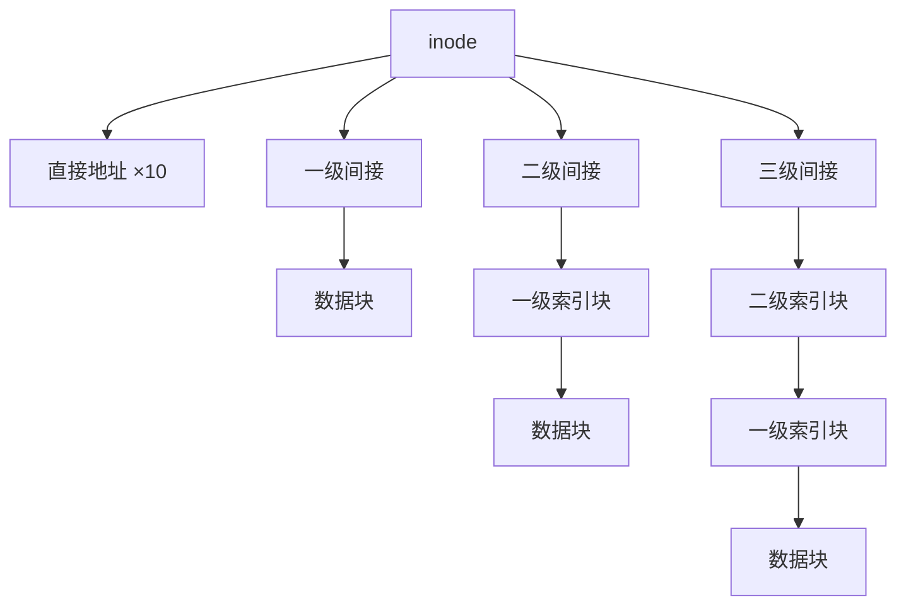

## 本章要义

文件是 OS 对辅存的抽象。用户看见逻辑结构（流或记录），系统看见物理分配（连续、链接、索引）。目录把文件名变成 FCB/inode，保护决定谁能碰。

## 源笔记勘误

- 整章几乎是空标题：类型、物理位置、保护、共享只有「DAG / 快捷方式」两句。
- 没有分配方式、没有空闲盘块管理、没有文件系统一致性。这是 408 文件管理的主干，必须补。
- 「inode(属性)」写在 FCB 里一笔带过，没说 UNIX 把文件名和 inode 分开才能硬链接。

## 逻辑结构

数据项 → 记录 → 文件。无结构文件是字节流（UNIX）。有结构：

- 顺序文件：记录按序，定长可算地址，变长要扫。
- 索引文件：索引表指向每条记录。
- 索引顺序：区间接关键字索引，区内顺序。
- 直接 / 哈希：关键字算出地址。

操作：创建、删、读、写、定位。打开文件把 FCB 拷进内存，避免每次都翻目录。

## 目录

FCB = 文件名 + 属性（UNIX 拆成目录项里的文件名 + inode 号）。单级目录不能重名、查找慢。两级：主目录 + 用户目录，查找从 \(M\times N\) 变成 \(M+N\)。树形：绝对路径从根，相对路径从当前，「`..`」是父目录。DAG / 无环图允许共享。

## 物理分配（源笔记全缺）

- **连续**：文件占连续块。顺序读快，要预知长度，外碎片，文件难增长。
- **链接**：每块带下一块指针。无外碎片，随机访问慢。FAT 把指针抽到一张表，随机访问好一些。
- **索引**：索引块登记所有盘块号。UNIX inode：若干**直接地址** + 一级 / 二级 / 三级间接。小文件不浪费，大文件也能到。

### inode 寻址算题

设盘块 1 KB，块号 4 B，inode 有 10 个直接块 + 1 个一级 + 1 个二级 + 1 个三级。

- 每块能装 \(1024/4=256\) 个块号。
- 直接：10 KB。
- 一级：256 KB。
- 二级：\(256^2\) 块 = 64 MB。
- 三级：\(256^3\) 块 = 16 GB。
- 文件最大 ≈ 10 KB + 256 KB + 64 MB + 16 GB。

随机读文件第 \(N\) 字节：先算逻辑块号 \(N/1024\)，再看落在直接还是第几级间接，**间接块自己也要先读进内存**。这是 408 计算题模板。

### 空闲盘块与变长记录

- **位图**：一位一块，找连续空闲区方便，位图本身占空间。
- **空闲链表**：每空闲块存下一块号，省空间，找连续区难。
- **成组链接**：把一堆空闲块号收在一个「组长」块里，栈式分配，UNIX 经典。

变长记录：顺序文件只能从头扫，或额外做索引（记录号 → 地址）。定长记录地址 = 首址 + (i−1)×记录长，变长没有这个公式。

文件属性在 FCB/inode：类型、长度、建立/修改时间、主、保护码、盘块指针。空文件也有 FCB。

## 共享与保护

- **硬链接**：多个目录项指向同一 inode，引用计数，不能链目录（防环），不能跨文件系统。
- **符号链接**：另存一条路径字符串，就是快捷方式，可跨文件系统，源文件删了会悬空。

保护：口令（粗）、加密（防泄密）、访问控制表 ACL（rwx 对主/组/其他人）。源笔记「文件保护」是空的，考试常考 rwx 和「目录的 x 表示能否进入」。

一致性：写回 vs 写穿，fsck / 日志（journal）在崩溃后修。了解即可。

## 408 易错点

- 空文件也有 FCB，删除文件先放 FCB 再放盘块。
- 目录也是文件，读目录和读普通文件走同一套。
- 硬链接不是拷贝文件内容。
- 连续分配的「一次读很多」和磁盘调度是两层。

## 考研题精练

**题 1（inode）**  
盘块 1 KB，块号占 4 B，inode 含 10 个直接地址以及一级、二级、三级间接各 1 个。一级间接能覆盖的文件大小是（ ）。

A. 1 KB B. 10 KB C. 256 KB D. 64 MB

**解答：** 每块可装 \(1024/4=256\) 个块号，一级间接指向 256 个数据块，共 \(256\,\mathrm{KB}\)。10 KB 是 10 个直接块合计；64 MB 是二级间接 \(256^2\times 1\,\mathrm{KB}\)。**选 C。**

**题 2（inode）**  
同上配置，且 inode 已在内存。访问文件偏移 \(300\,\mathrm{KB}\) 处，至少访盘次数是（ ）。

A. 1 B. 2 C. 3 D. 4

**解答：** 逻辑块号 \(300\,\mathrm{KB}/1\,\mathrm{KB}=300\)。直接块覆盖 0–9，一级间接覆盖 10–265，300 落在二级间接：先读二级索引块，再读其中挂着的一级索引块，最后读数据块，共 3 次。**选 C。**

**题 3**  
关于硬链接与符号链接，正确的是（ ）。

A. 硬链接会拷贝一份文件内容  
B. 硬链接共享同一 inode，符号链接另存路径字符串  
C. 硬链接可以跨文件系统  
D. 符号链接会增加源文件的引用计数

**解答：** 硬链接是多个目录项指向同一 inode，引用计数加一，不能跨文件系统、通常不能链目录。符号链接是另一个文件，里面是路径，可跨文件系统，源文件删除后会悬空。**选 B。**

## 继续阅读

磁盘怎么转见 [[os/06-io|I/O]]。内存里的文件页和 [[os/04-memory|存储器]]、[[os/05-virtual-memory|虚存]] 连在一起。
