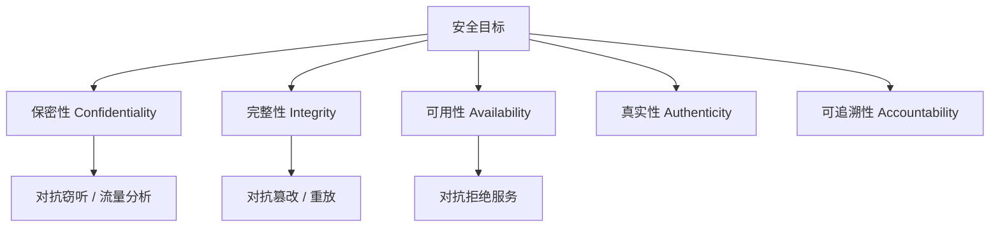

## 本章要义

信息安全先问**要保护什么**（目标），再问**用什么服务对抗哪类攻击**，最后才落到加密、签名这些**机制**。源笔记把三层摊在同一页，容易把「完整性」既当目标又当机制。

## 源笔记勘误

- 拒绝服务写成「阻止对通信设施的**增产**使用」，应为「正常使用」。
- 被动攻击标题「窃听和检测」——第二类是**流量分析**，不是「检测」。
- 安全服务列了 X.800 六项，安全机制只列了八个名字，没有「服务由一种或多种机制实现」。
- 真实性 Authenticity 与认证服务 Authentication 容易混：前者是目标（对方真是他声称的人），后者是达到该目标的服务。
- 数据库课里的「完整性」指数据合法，这里还包含**系统按既定目标运行**（系统完整性）。

## 安全目标

Stallings / 教材常用 CIA，再加两项：

- **保密性 Confidentiality**：未授权者不可用。含数据保密和隐私（个人能控制谁收集、向谁公开）。
- **完整性 Integrity**：数据未被未授权篡改或损坏；系统未被非法操纵。
- **可用性 Availability**：授权用户能持续得到服务，不能被拒绝。
- **真实性 Authenticity**：能验证实体身份，输入来自可信源。
- **可追溯性 Accountability**：行为能唯一追溯到某个实体（审计、取证）。

有的书把不可否认、可控也并进来。复习时能从目标推到攻击类型即可。

## 安全攻击

**被动攻击**（窃听、流量分析）：不改数据。难察觉，关键是**预防**（加密、流量填充），不是事后抓。

**主动攻击**：

- **伪装**：假冒成别的实体，常接着重放认证消息。
- **重放**：把截获的合法消息再送一次。
- **消息修改**：改内容、延迟或打乱顺序。
- **拒绝服务**：让设施不能被正常使用或管理。

主动攻击难以完全预防，要检测 + 恢复。

## 安全服务（ITU-T X.800）

目的：用一种或多种机制反制攻击。

1. **认证**：对等实体认证；数据源认证（如邮件）。
2. **访问控制**：挡未授权使用。
3. **数据保密性**：防被动攻击，含流量保密。
4. **数据完整性**：收到的数据无未授权的改、插、删、重放。
5. **不可否认**：源不可否认、宿不可否认。
6. **可用性服务**：保证授权访问能完成。

## 安全机制

加密、数字签名、访问控制、数据完整性机制、认证交换、流量填充、路由控制、公证。  
加密主要支撑保密，签名支撑认证/不可否认，完整性机制支撑防篡改——一对多，不是一一对应。

## 复习易错点

- 加密解决不了可用性（抗不住 DDoS）。
- 被动攻击「预防重于检测」；主动攻击「检测 + 恢复」同样重要。
- 访问控制是服务，ACL/能力表是实现它的机制。
- 和 [[db/03-relational|数据库完整性]] 用词相同、范围不同。

## 考研题精练

**题 1（CIA）**  
信息安全常说的 CIA 三要素是指（ ）。

A. 保密性、完整性、可用性  
B. 保密性、认证性、审计性  
C. 完整性、不可否认、访问控制  
D. 加密、数字签名、防火墙

**解答：** Confidentiality / Integrity / Availability。认证与可追溯是延伸目标；加密、签名、防火墙是机制，不是目标。**选 A。**

**题 2**  
下列属于被动攻击的是（ ）。

A. 伪装 B. 重放 C. 流量分析 D. 拒绝服务

**解答：** 被动攻击不改数据：窃听、流量分析。伪装、重放、拒绝服务都是主动攻击。被动攻击难察觉，关键是预防而不是事后抓。**选 C。**

**题 3**  
关于安全目标、安全服务与安全机制，说法正确的是（ ）。

A. 完整性既是目标也是机制，二者可以划等号  
B. 加密能够同时保证可用性  
C. 一种安全服务可由一种或多种机制实现  
D. 访问控制是机制，ACL 是服务

**解答：** X.800 里服务由机制支撑，一对多。加密解决不了可用性（抗不住拒绝服务）；访问控制是服务，ACL / 能力表才是机制。**选 C。**

## 继续阅读

机制里最底层的是密码：[[security/02-crypto|密码学]]。网络课的分层安全见 [[cn/01-overview|网络概述]]。
