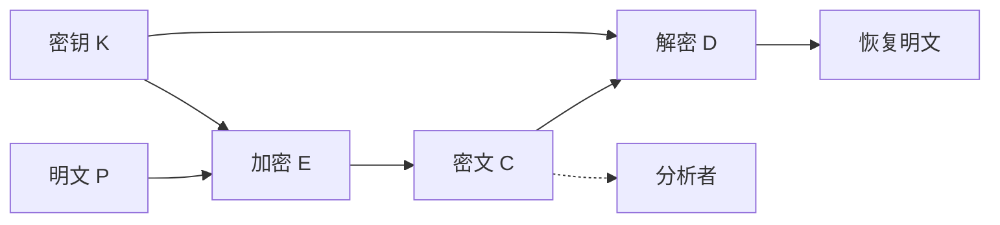

## 本章要义

密码学 = 编码学（怎么藏）+ 分析学（怎么破）。现代默认 **Kerckhoff**：算法公开，秘密只在密钥。经典体制只有代替和置换两条根，现代分组密码仍是这两样的乘积迭代。

## 源笔记勘误

- Encryption 写成 Encrtption；polyalphabetic 写成 ployalphabetic。
- 仿射解密写成 `(y-b)/a`，在模运算里应是乘 \(a^{-1}\)：\(d_K(y)=a^{-1}(y-b)\bmod 26\)。
- 单表代替密钥空间 \(26!\approx 4\times 10^{26}\)，源笔记 `4×1026` 掉了指数。穷举不行，**频率分析**行。
- 一次一密「给出任何等长明文都存在密钥」这句对，所以唯密文下不可破；限制是密钥与消息等长、真随机、只用不重复、安全分发。
- 栅栏例子排版乱，下面重排。
- 隐写术 ≠ 加密：藏的是「这里有消息」，加密藏的是「消息是什么」。

## 基本概念

五元组 \((P,C,K,E,D)\)：明文空间、密文空间、密钥空间，对每个 \(k\) 有 \(d_k(e_k(x))=x\)。

按密钥：

- **对称**：加解密钥相同或易互推。
- **公钥**：两钥不同，从公钥推私钥不可行。

攻击（强度递增）：唯密文 → 已知明文 → 选择明文 → 选择密文。选择文本常指明/密文都能选。

安全：

- **无条件安全**：密文再多也得不到明文（一次一密）。
- **计算安全**：破译代价超过信息价值，或时间超过有效期。

阶段：1949 前是艺术；Shannon 之后成科学；1976 Diffie–Hellman 打开公钥方向。

## 代替密码

每个字符被换成另一个，顺序大体保留。

- **凯撒 / 移位**：\(c=(p+k)\bmod 26\)，\(k=3\) 是凯撒。25 个密钥，暴力即可。
- **仿射**：\(e(x)=ax+b\bmod 26\)，必须 \(\gcd(a,26)=1\) 才有逆，否则不同明文会落到同一密文。例 \(K=(7,3)\)，\(7^{-1}\equiv 15\pmod{26}\)。
- **一般单表**：密钥是 26 字母的一个置换，空间 \(26!\)。用英文频率（e、t、a…）和双字母破。
- **Playfair**：5×5（I/J 合一）。成对加密：同行右移、同列下移、否则取矩形交叉。重复字母先插分隔符（balloon → ba lx lo on）。
- **Hill**：块看成向量，乘可逆矩阵。已知明文可解密钥矩阵。
- **Vigenère**：周期移位。密钥 RADIO 重复加到明文上。Kasiski / 重合指数找周期。
- **一次一密**：与消息等长的真随机密钥，\(c_i=p_i\oplus k_i\)，用完即弃。理论上不可破；密钥供应和分发是死穴。

求 \(\gcd\) 用欧几里得；求乘法逆用扩展欧几里得。源笔记 7 对 96 的逆是 55（\(-41\equiv 55\pmod{96}\)）。

## 置换密码

字母不变，位置变。

- **砖栏（栅栏）**：按对角线写下，按行读出。深度 2：`meet me after the toga party` → `mematrhtgpryetefeteoaat`。
- **列置换**：按矩形写入，按密钥指定的列序读出。多轮可加强，但仍保留单字母频率。
- **转轮机 / Enigma**：若干转子各定义一个单表，每击一键转子步进，得到长周期多表代替。三转子方向 \(26^3=17576\)，再乘插线板组合。破译靠操作失误、已知明文和数学，不是「理论上空间不够」。

## 复习易错点

- 单表代替不怕穷举，怕统计。
- 仿射 \(a\) 不与 26 互素会丢信息。
- 一次一密的密钥若重复使用，立刻退回可破的Vernam。
- 置换不改变频率，代替不改变（或只周期地改变）位置结构，所以要乘积密码。

## 考研题精练

**题 1（凯撒）**  
凯撒密码 \(c=(p+3)\bmod 26\)。明文 `hot` 对应的密文是（ ）。

A. kqw B. krw C. irw D. lrw

**解答：** h→k，o→r，t→w，得到 `krw`。移位密码只有 25 个非平凡密钥，暴力即可。**选 B。**

**题 2（仿射）**  
仿射密码 \(e(x)=ax+b\bmod 26\)。要使映射为双射（可唯一解密），必须满足（ ）。

A. \(\gcd(a,26)=1\)  
B. \(\gcd(b,26)=1\)  
C. \(\gcd(a,b)=1\)  
D. \(a\) 为偶数

**解答：** 解密是 \(d(y)=a^{-1}(y-b)\bmod 26\)，\(a\) 必须与模数互素才有乘法逆。\(26=2\times 13\)，所以 \(a\) 不能是偶数，也不能是 13 的倍数。\(b\) 无此限制。**选 A。**

**题 3**  
一次一密在唯密文条件下不可破，最根本的原因是（ ）。

A. 密钥空间为 \(26!\)  
B. 对任意等长明文都存在把它映到该密文的密钥  
C. 使用了转轮机  
D. 算法本身保密（违背 Kerckhoff 也不要紧）

**解答：** 密文不泄露明文信息：任何等长猜测都能配上一把密钥。单表代替的 \(26!\) 挡不住频率分析；转轮机是多表代替；Kerckhoff 要求算法公开、秘密只在密钥。**选 B。**

## 继续阅读

代替+置换的工业实现：[[security/03-symmetric|对称密码]]。密钥分配难题把人推向 [[security/04-public-key|公钥]]。
