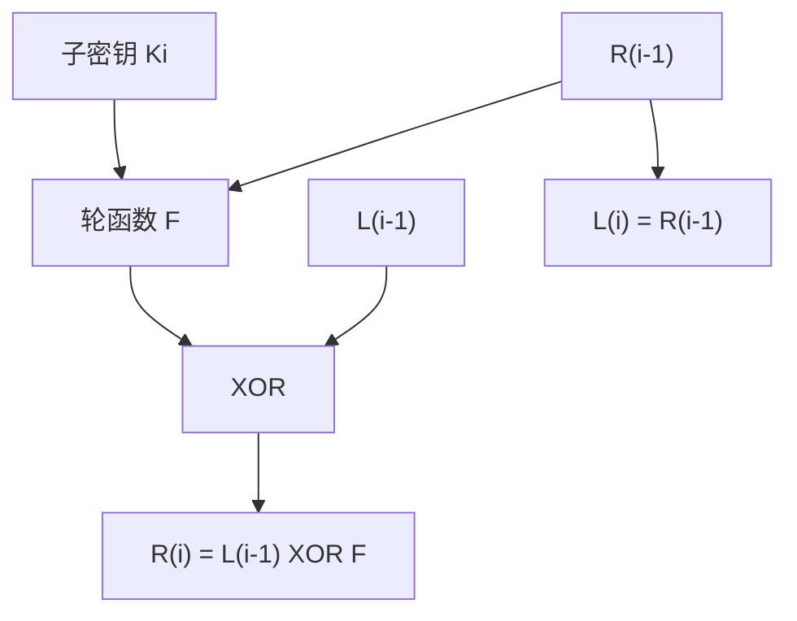

## 本章要义

对称分组密码把明文切成定长块，同一算法同一密钥逐块变换。设计语言是 Shannon 的**扩散**（明文比特打散到许多密文比特）和**混淆**（打乱密文与密钥的统计关系）。Feistel 让解密与加密同结构，只是子密钥逆序。

## 源笔记勘误

- 总结表第一行写成「电码本（CBC）」，应为 **ECB**。后面才是 CBC。
- DES 背景段整节复制了两遍。
- AES/DES「具体细节」只挂了 CSDN 链接，笔记里应能独立复习轮结构。
- 双重 DES 的中间相遇把有效密钥从 112 比特打到约 57 比特量级，所以实用是 3DES 而不是 2DES。
- RC4 已满身伤口（WEP 等），只能当历史；新系统用 AES-CTR / ChaCha20。
- 「分组一般为 64 或 128」：DES 64，AES 128。现在不要新设计 64 比特块（生日界太低）。

## 分组密码与 Feistel

明文分成长度 n 的块，密钥控制下变成等长密文。本质是在巨大置换子集里选一个。迭代多轮：代替（S 盒）+ 置换。

Feistel（n 为偶数，L 轮）：

- \(L_i = R_{i-1}\)
- \(R_i = L_{i-1} \oplus F(R_{i-1}, K_i)\)
- 最后一轮后再交换，输出 \(R_L\|L_L\)

解密：密文当输入，子密钥逆序，公式同形。F 不必可逆。参数：块长、密钥长、轮数、子密钥算法、轮函数复杂度。

## DES 与 AES

**DES**：64 比特块，56 比特密钥（另 8 比特校验），16 轮 Feistel。1977 年 FIPS，1998 年后不再作联邦标准。弱在密钥太短，差分/线性分析也展示了 S 盒设计的微妙。

变形：

- 双重 DES：中间相遇，不推荐。
- **2 钥 3DES**：\(C=E_{K1}(D_{K2}(E_{K1}(P)))\)，兼容单 DES（K1=K2）。168 比特 3 钥版本更硬。

**AES（Rijndael）**：128 比特块；密钥 128/192/256 对应 10/12/14 轮。不是 Feistel，是代替-置换网络（SPN）：

1. 初始 AddRoundKey
2. 前 Nr−1 轮：SubBytes → ShiftRows → MixColumns → AddRoundKey
3. 末轮无 MixColumns

State 看成 4×4 字节阵。相对 DES：块更大、密钥更长、软件更快、S 盒代数结构公开可分析。

## 工作模式

块密码一次只吃一块，长消息要套模式。目的之一：同样明文块不要总得到同样密文块。

| 模式 | 做法 | 特点 | 典型用途 |
|---|---|---|---|
| **ECB** | 每块独立加密 | 相同明文→相同密文，可并行，不能藏结构 | 单块随机数 |
| **CBC** | \(C_i=E_K(P_i\oplus C_{i-1})\)，需 IV | 藏统计；密文错 1 块影响本块和下块明文；自同步 | 通用加密、CBC-MAC |
| **CFB** | 密文反馈进移位寄存器，当流密码 | 可按 s 比特处理；密文错影响寄存器滑过的若干单元 | 面向字节流 |
| **OFB** | 反馈的是加密输出不是密文 | 比特错误不传播；密钥流可预计算；篡改难测 | 噪声信道、语音 |
| **CTR** | 加密计数器再与明文异或 | 全并行、随机访问、加解密同结构 | 高速、IPsec、AES-GCM 的底层 |

ECB 银行转账例子：改掉报文里的账号密文块就能把钱转走——因为块之间无链接。

CBC 完整性：对记录 \| 校验分组做 CBC，取末块当认证码（本质是 CBC-MAC 思想）。源笔记彩票防伪就是这个。

## 流密码与 RC4

流密码按比特/字节与密钥流异或。RC4：256 字节状态 S，KSA 打乱，PRGA 吐密钥流。曾用于 SSL/TLS、WEP。相关密钥和偏差已使它退役。

## 复习易错点

- Feistel 的 F 不可逆没关系，因为异或可逆。
- 3DES 的 EDE 中间那步是解密，为了兼容 DES。
- CBC 明文翻 1 比特，从这一块起密文全变；密文翻 1 比特，只坏两块明文。
- OFB/CTR 是流模式，IV/计数器重用是灾难。
- 源笔记总结表 ECB 那一行的缩写写错，背表前先改。

## 考研题精练

**题 1（DES 轮数）**  
DES 的分组长度、有效密钥长度和 Feistel 轮数分别是（ ）。

A. 64 比特、64 比特、16 轮  
B. 64 比特、56 比特、16 轮  
C. 128 比特、56 比特、10 轮  
D. 64 比特、56 比特、8 轮

**解答：** 块长 64，密钥 64 比特里 8 比特是校验，有效 56；16 轮 Feistel。128 / 10 轮是 AES-128 的数。**选 B。**

**题 2**  
Feistel 结构中轮函数 F 不可逆时，（ ）。

A. 密文将无法解密  
B. 仍可解密，因为异或可逆，子密钥逆序即可  
C. 必须把 F 改成置换才能用  
D. 只能加密、不能解密

**解答：** \(L_i=R_{i-1}\)，\(R_i=L_{i-1}\oplus F(R_{i-1},K_i)\)。解密与加密同结构，子密钥逆序；F 本身不必可逆。**选 B。**

**题 3**  
AES-128 的轮数是（ ），末轮缺少的变换是（ ）。

A. 10 轮，MixColumns  
B. 12 轮，ShiftRows  
C. 14 轮，SubBytes  
D. 10 轮，AddRoundKey

**解答：** 密钥 128/192/256 对应 10/12/14 轮。每轮 SubBytes → ShiftRows → MixColumns → AddRoundKey，末轮去掉 MixColumns。**选 A。**

## 继续阅读

对称密钥怎么分发：[[security/04-public-key|公钥与 DH]]。用分组密码做认证：[[security/05-auth-pgp|MAC 与 PGP]]。
