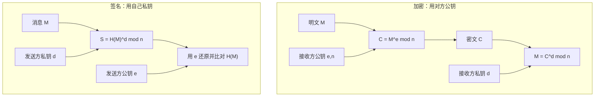

## 本章要义

公钥不取代对称密码：对称快，管数据；公钥慢，管**密钥分配**和**签名**。底座是陷门单向函数——正算容易，无陷门反算难，有陷门（私钥）则易。

## 源笔记勘误

- DH 例子 `Ya = 536 = 50 mod 97` 是 \(5^{36}\)，不是 536。
- RSA 正确性那段 `C = Me mod n` 掉了幂：\(C=M^e\bmod n\)。
- 「安全性没有得到理论证明」说得太绝：是**归约到未被证明的困难问题**（IFP、DLP），不是完全没有依据。
- ElGamal 解密写成 \(y_2(y_1^a)^{-1}\)：注意 \(s=r^a\)，所以 \(s^k=r^{ak}=(r^k)^a=y_1^a\)。
- 数论一堆公式挤在一起。下面只留考试会用的：互素、φ、Fermat、Euler、原根、离散对数。
- 没有中间人攻击。DH 本身不认证，必须另绑身份。

## 对称 vs 公钥

| | 对称 | 公钥 |
|---|---|---|
| 速度 | 快，适合数据 | 慢，适合密钥和签名 |
| 密钥 | 双方共享、难分发、要常换 | 公钥公开，生命周期长 |
| 网络规模 | 密钥数 O(n²)，常要 KDC | 每人一对 |
| 签名 | 难抗抵赖 | 天然能签 |

公钥算法基于数学函数，不是代替/置换。条件：生成密钥对可行；已知公钥加密可行；私钥解密可行；由公钥推私钥不可行；由公钥+密文恢复明文不可行。可选：加解密顺序可交换（RSA 有，不是一切体制都有）。

**陷门单向函数** \(f_k\)：知 x 算 y 易；不知 k 由 y 回 x 不可行；知 k 则易。

应用三件套：加密、签名、密钥交换。一张表分清「谁的钥匙」：保密用**接收方公钥**加密；签名用**发送方私钥**。

## Diffie–Hellman

公开大素数 p 和原根 a。A 选 \(X_a\)，发 \(Y_a=a^{X_a}\bmod p\)；B 对称。共享 \(K=Y_b^{X_a}=Y_a^{X_b}=a^{X_a X_b}\bmod p\)。安全靠 DLP。

例：p=97，a=5，\(X_a=36\)，\(X_b=58\)，\(Y_a=50\)，\(Y_b=44\)，\(K=75\)。

中间人：攻击者与双方各做一次 DH，两边都以为在和对方共享。必须用证书/签名绑住 \(Y_a\)。

## RSA

IFP。选大素数 p≠q，\(n=pq\)，\(\varphi(n)=(p-1)(q-1)\)，选 e 使 \(\gcd(e,\varphi(n))=1\)，\(d\equiv e^{-1}\pmod{\varphi(n)}\)。公钥 \(\{e,n\}\)，私钥 \(\{d,n\}\)。

\[
C=M^e\bmod n,\quad M=C^d\bmod n\quad (M<n)
\]

例：p=7，q=17，n=119，φ=96，e=5，d=77。M=19 → C=66 → 再解回 19。

正确性靠 Euler：\(M^{k\varphi(n)+1}\equiv M\pmod{n}\)（对 n=pq 有推广）。同等强度下 RSA 比 DES/AES 慢几个数量级，所以只加密会话密钥。

## ElGamal

DLP。公开 {p, 原根 r, s=r^a}，私钥 a。加密：随机 k，\(y_1=r^k\)，\(y_2=x\cdot s^k\)，密文 (y1,y2)。解密 \(x=y_2\cdot(y_1^a)^{-1}\bmod p\)。同一明文每次 k 不同，密文不同（非确定性）。密文膨胀约 2 倍。也可做签名，见下一章。

## 数论最小集

- 素数；\(\gcd(a,b)=1\) 则互素。
- \(a\equiv b\pmod n\) 当且仅当 n|(a-b)。
- Fermat：p 素数、p∤a 则 \(a^{p-1}\equiv 1\pmod p\)。
- \(\varphi(n)\)：1..n-1 中与 n 互素的个数。p、q 相异素数则 \(\varphi(pq)=(p-1)(q-1)\)。
- Euler：\(\gcd(a,n)=1\) 则 \(a^{\varphi(n)}\equiv 1\pmod n\)。
- 原根 a：阶等于 \(\varphi(n)\)。p 的原根使 \(1..p-1\) 都可写成 \(a^i\)。
- 离散对数：已知 \(b\equiv a^i\pmod p\) 求 i，难。

## 复习易错点

- 加密：用对方公钥。签名：用自己私钥。钥匙拿反是最常见错。
- RSA 的 e、d 对 φ(n) 互逆，不是对 n。
- DH 不传输共享密钥本身，传输的是公开值 Y。
- ElGamal 的 k 绝不能重用（和 DSA 一样）。

## 考研题精练

**题 1（RSA 的 e / d）**  
RSA 中 \(n=pq\)，选取 \(e\) 满足 \(\gcd(e,\varphi(n))=1\)，则私钥指数 \(d\) 应满足（ ）。

A. \(ed\equiv 1\pmod n\)  
B. \(ed\equiv 1\pmod{\varphi(n)}\)  
C. \(d=e^{-1}\bmod p\)  
D. \(ed\equiv 1\pmod{(p+q)}\)

**解答：** \(d\) 是 \(e\) 模 \(\varphi(n)\) 的乘法逆，不是模 \(n\)。常见错就是把模数写成 \(n\)。**选 B。**

**题 2**  
A 要向 B 发送一份只有 B 能读的机密消息，应当使用（ ）。

A. A 的公钥加密  
B. A 的私钥加密  
C. B 的公钥加密  
D. B 的私钥加密

**解答：** 保密用**接收方公钥**加密，接收方用自己的私钥解开。A 的私钥用来签名，不是用来给 B 保密。**选 C。**

**题 3**  
已知 \(p=7\)，\(q=17\)，\(n=119\)，\(\varphi(n)=96\)，\(e=5\)。则 \(d\) 为（ ）。

A. 77 B. 19 C. 5 D. 96

**解答：** 求 \(5d\equiv 1\pmod{96}\)。\(5\times 77=385=4\times 96+1\)，故 \(d=77\)。例：\(M=19\rightarrow C=66\rightarrow\) 再解回 19。**选 A。**

## 继续阅读

签名、哈希、PGP 如何把对称和公钥焊在一起：[[security/05-auth-pgp|消息认证与 PGP]]。
