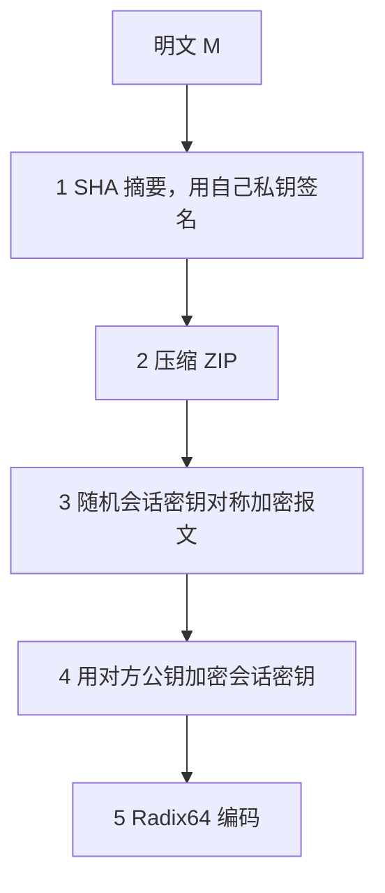

## 本章要义

加密给保密，不自动给「这话真是他写的、中途没改过」。认证要单独做。Hash 出指纹，MAC 在共享密钥下认证，签名用私钥抗抵赖。PGP 把压缩、签名、对称加密、Radix64 焊成一封能走邮件的报文。

## 源笔记勘误

- 标题「数据签名」应为「数字签名」。
- 「ash 函数用来构造 MAC」是 HMAC。
- Hash 需求里「抗强抗攻击」应为**抗强碰撞**。
- 「先加密后签名」有坑：攻击者可剥掉 A 的签名换上自己的，接收者以为密文来自攻击者；争议时还可能要交出私钥。教材推荐**先签名后加密** \(E_{KU_b}(M\|\mathrm{Sig}_A(M))\)。
- MD5 在 1996 后碰撞已出现，只能当历史；考试若问「现在用什么」答 SHA-2/SHA-3。
- 源笔记自称「大体笔记，还有内容没完善」——盲签名/群签名只留定义，下面不展开算法细节。

## 消息认证

目的：确认发送者，确认未被篡改、重放、延迟。

三类函数：

1. **整段加密当认证**：能解密出合法格式就信。对称加密可保密+认证（需冗余/结构化）；公钥只加密无认证，私钥加密（签名）有认证无保密。
2. **MAC**：`MAC = C_K(M)`，定长，密钥共享。收方重算比较。可认证来源和完整性，**不能签名**（双方都能造 MAC）。不必可逆，所以比加密更难逆向。
3. **Hash**：公开、无密钥，变长→定长。传送中必须保护摘要（加密或再套 MAC），否则对手改消息并重算摘要。

HMAC：用 Hash 构造 MAC，密钥参与 ipad/opad 两次压缩。SSL/IPsec/PGP 都用过。

## Hash 需求与生日攻击

实用：任意输入、定长输出、好算。安全：

- **抗原像**（单向性）：给定 h 找 x，H(x)=h，不可行。
- **抗第二原像**（弱无碰撞）：给定 x 找 x′≠x，H(x′)=H(x)，不可行。
- **抗强碰撞**：找任何一对相撞，不可行。强 ⇒ 弱。
- 伪随机性。

Merkle–Damgård：消息分块，末块含长度，\(CV_i=f(CV_{i-1},Y_{i-1})\)。MD5（128 比特，小端）已破。SHA-1 也不再新用。SHA-512：1024 比特块，512 比特摘要。

生日界：m 比特摘要，约 \(2^{m/2}\) 次就能以 1/2 概率找到碰撞。64 比特摘要只对 \(2^{32}\) 量级，不够。数字签名必须配足够长的 Hash。

## 数字签名

认证防第三方，**防不了通信双方互骗**（B 伪造「A 发来的」、A 否认发过）。签名条件：依赖报文、签名者唯一、可验证、抗伪造、可用。

分类：直接 / 仲裁；计算安全 / 无条件安全；一次 / 多次。

**RSA 签名**：\(S=E_{KR_a}(H(M))\)，验 \(D_{KU_a}(S)\stackrel{?}{=}H(M)\)。对全文直接签又慢又暴露明文，所以签摘要。

次序：先签后密。先密后签有替换签名和存证负担。

**ElGamal 签名**：全局 (p,g)，私钥 x，公钥 \(y=g^x\)。签：随机 k，\(r=g^k\bmod p\)，\(s=(H(M)-xr)k^{-1}\bmod(p-1)\)，输出 (r,s)。验 \(y^r r^s \stackrel{?}{=} g^{H(M)}\pmod p\)。k 泄露或重用会暴露 x。

**DSA**：不能加密、不能做密钥交换，只签名。公开 p、160 比特 q|(p-1)、g；私钥 x，公钥 \(y=g^x\)。签 (r,s)，r 先 mod p 再 mod q。验证构造 u1、u2 比 v 与 r。签名比验证快。s≡0 则重签。

特殊签名（了解）：不可否认（验证需签名者合作）、群签名（能验是群员但不能默认指出是谁）、盲签名（签名者不知明文，电子现金/选举）。

## PGP

Zimmermann。算法可拼：签名 DSS/RSA + SHA，加密 CAST/IDEA/3DES/AES + DH/RSA，压缩 ZIP，邮件兼容 Radix64。

发送管道（常见「既签又密」）：

1. SHA 摘要，用自己私钥签。
2. 压缩。
3. 随机会话密钥对称加密报文。
4. 用对方公钥加密会话密钥，附在前面。
5. Radix64；过长则分段（签名只在第一段）。

压缩在签名之后、加密之前：验证不必依赖某一种 ZIP；压缩后再加密更抗统计分析。

密钥：一次会话对称钥、公钥、私钥、口令短语保护的私钥。KeyID = 公钥低 64 比特。每个结点一对环：

- **私钥环**：时间戳、KeyID、加密存放的私钥、UserID。
- **公钥环**：别人的公钥，可用 UserID 或 KeyID 索引。

信任：PGP 没有强制 CA，公钥环上的信任是用户累积的。BBS 上下载的「B 的公钥」被换掉，就会落入中间人——源笔记最后这段要当真。

## 复习易错点

- MAC 共享密钥 ⇒ 不能抗发送方抵赖。
- 生日攻击针对**强碰撞**，复杂度 \(2^{m/2}\) 不是 \(2^{m-1}\)。
- 签名用私钥，加密用对方公钥；PGP 一封信里两把钥匙都出现。
- DSA 的 k 和 ElGamal 一样，重用即爆私钥（历史上出过事故）。

## 考研题精练

**题 1（先签后密）**  
数字签名与加密并用时，教材推荐的次序及理由是（ ）。

A. 先加密后签名，这样攻击者看不到明文  
B. 先签名后加密，避免攻击者剥掉原签名再换上自己的  
C. 只签名不加密即可同时获得保密与抗抵赖  
D. 必须先压缩再签名再加密，否则签名无效

**解答：** 推荐 \(E_{KU_b}(M\|\mathrm{Sig}_A(M))\)。先密后签时，攻击者可去掉 A 的签名、换上自己的，接收者会以为密文来自攻击者；争议时还可能被迫出示明文。PGP 是签 → 压 → 密，压缩在签名之后，不是签名之前。**选 B。**

**题 2**  
关于 MAC 与数字签名，说法正确的是（ ）。

A. MAC 能抗发送方抵赖  
B. 通信双方都能计算 MAC，因此 MAC 不能当作签名  
C. Hash 函数自带密钥，可直接当 MAC 用  
D. 生日攻击的复杂度是 \(2^{m-1}\)

**解答：** MAC 共享密钥，双方都能造，只能认证、不能抗抵赖。Hash 无密钥；生日攻击针对强碰撞，约 \(2^{m/2}\) 次。**选 B。**

**题 3**  
PGP「既签又密」的正确发送管道是（ ）。

A. 加密 → 签名 → 压缩 → Radix64  
B. 签名 → 压缩 → 对称加密报文并公钥加密会话钥 → Radix64  
C. 压缩 → 签名 → 加密  
D. 先加密后签名，压缩可放在任意位置

**解答：** SHA + 自己私钥签 → ZIP → 会话密钥对称加密报文 → 对方公钥加密会话密钥 → Radix64。压缩放在签名之后、加密之前：验证不必绑定某一种 ZIP，压缩后再加密也更抗统计分析。**选 B。**

## 继续阅读

钥匙从哪来：[[security/04-public-key|RSA/DH]]。会话密钥算法：[[security/03-symmetric|AES]]。邮件传输本身：[[cn/06-application|应用层]]。
