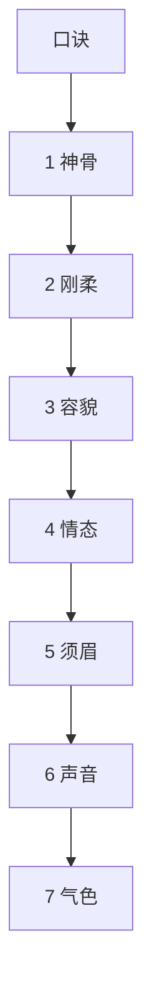

## 本章要义

曾国藩《冰鉴》是一套观人次第，不是医学，也不是识人科学。先神骨，再刚柔，然后容貌、情态、须眉、声音、气色。文人先看神骨：神聚于目，骨聚于面；神分清浊，浊易辨、邪正难辨，要从动静里看是澄清到底，还是托迹于清的败器、隐流。骨看九起与头面主骨，色以青为贵，质以联为贵。刚柔是「先天种子」：外刚柔用五行生克，内刚柔看喜怒、跳伏、深浅。容貌贵「整」与相称，细处看科名星、阴骘纹。情态是神之余，分恒态与时态。须眉主早成晚运，声音分声与音，气色如运，大者一生、小者三月。

文前口诀不是第八篇，只是总诀。底本「神之渭也」是明显讹字，原文已改为「神之谓也」。同书另有一篇曾国藩的[[xuanxue/yuancai|原才]]，讲风俗与造才，不是相面；相术条目可对照[[xuanxue/mayi-01-shiguan|麻衣神相]]，材性品鉴可对照[[xuanxue/renwuzhi-01-jiuzheng|人物志]]。

本章整体**入门**。口诀、神骨、须眉标入门；刚柔、容貌、情态、声音、气色要对照五行与细目，标进阶。图只帮你把口诀和部位对上，不是医学。

*图注：五步环对应《冰鉴》次第：口诀总纲 → 神骨 → 刚柔 → 容貌情态 → 须眉声音气色。术数文献，不是医学。*

## 底本

曾国藩《冰鉴》七篇，youngzs/xuanxue 仓库本。`07_冰鉴.txt` 与此文件字节级重复，已弃用。

## 对读

### 口诀

> 难度：入门

曾国藩相术口诀

**白话：** 曾国藩相术口诀。

邪正看耳鼻，真假看嘴唇；功名看气概，富贵看精神；主意看指爪，风波看脚筋；若要看条理，全在语言中。

**白话：** 看邪正看耳鼻，看真假看嘴唇；看功名看气概，看富贵看精神；看主见看指甲，看风波看脚筋；若要看办事条理，全在说话里。

*图注：七格对应「邪正看耳鼻，真假看嘴唇；功名看气概，富贵看精神；主意看指爪，风波看脚筋；若要看条理，全在语言中」。术数文献，不是医学。*

*图注：同一口诀从部位回推：耳鼻对邪正，唇对真假，指爪对主意，脚筋对风波，语言对条理。术数文献，不是医学。*

### 第一神骨

> 难度：入门

语云：“脱谷为糠，其髓斯存”，神之谓也。“山骞不崩，唯百为镇”，骨之谓也。一身精神，具乎两目；一身骨相，具乎面部。他家兼论形骸，文人先观神骨。开门见山，此为第一。

**白话：** 俗话说：“稻谷脱了壳就是糠，精髓却还在”，这说的就是神。“山体剥落却不崩塌，靠有物镇住”，这说的就是骨。一身的精神，都聚在两眼里；一身的骨相，都聚在脸上。别家兼论形体，文人先看神骨。开门见山，这是第一要务。

*图注：上格对应「一身精神，具乎两目」；中格对应「一身骨相，具乎面部」；下格对应「开门见山，此为第一」。*

*图注：红点在两眼外侧，不遮瞳孔。标签按人物自身左右：照片右侧为左目。对应「一身精神，具乎两目」。术数文献，不是医学。*

文人论神，有清浊之辨。清浊易辨，邪正难辨。欲辨邪正，先观动静；静若含珠，动若木发；静若无人，动若赴的，此为澄清到底。静若萤光，动若流水，尖巧而喜淫；静若半睡，动若鹿骇，别人而深思。一为败器，一为隐流，均之托迹于清，不可不辨。

**白话：** 文人论神，要分清浊。清浊容易辨，邪正难辨。要辨邪正，先看动静：静时像含着明珠，动时像树木发芽；静时旁若无人，动时如箭赴靶，这才是澄澈到底。静时像萤火，动时像流水，尖巧而好淫邪；静时像半睡，动时像受惊的鹿，对人另有深思。一个是败器，一个是暗流，都托迹于“清”，不可不辨。

凡精神，抖擞处易见，断续处难见。断者出处断，续者闭处续。道家所谓“收拾入门”之说，不了处看其脱略，做了处看其针线。小心者，从其不了处看之，疏节阔目，若不经意，所谓脱略也。大胆者，从其做了处看之，慎重周密，无有苟且，所谓针线也。二者实看向内处，稍移外便落情态矣，情态易见。

**白话：** 凡精神，抖擞振作处容易看见，断续处难看见。断的，从他发露处看它怎么断；续的，从他收敛处看它怎么续。道家所谓“收拾入门”：未了处看他是否脱略，已做完处看他针线是否细密。小心的人，从他未了处看：疏节阔目、若不经意，这就是脱略。大胆的人，从他做了处看：慎重周密、没有苟且，这就是针线。二者其实都要看到向内处，稍向外移便落到情态上了，情态容易看见。

骨有九起：天庭骨隆起，枕骨强起，顶骨平起，佐串骨角起，太阳骨线起，眉骨伏犀起，鼻骨芽起，颧骨若不得而起，项骨平伏起。在头，以天庭骨、枕骨、太阳骨为主；在面，以眉骨、颧骨为主。五者备，柱石之器也；一则不穷；二则不贱；三则动履稍胜；四则贵矣。骨有色，面以青为贵，“少年公卿半青面”是也。紫次之，白斯下矣。骨有质，头以联者为贵。碎次之。总之，头上无恶骨，面佳不如头佳。然大而缺天庭，终是贱品；圆而无串骨，半是孤僧；鼻骨犯眉，堂上不寿。颧骨与眼争，子嗣不立。此中贵贱，有毫厘千里之辨。

**白话：** 骨有九起：天庭骨隆起，枕骨强起，顶骨平起，佐串骨像角一样起，太阳骨像线一样起，眉骨如伏犀而起，鼻骨如芽而起，颧骨若不得已而起，项骨平伏而起。在头，以天庭骨、枕骨、太阳骨为主；在面，以眉骨、颧骨为主。五者都具备，是柱石之器；有其一则不穷，有其二则不贱，有其三则行事稍胜，有其四则贵了。骨有色，面上以青为贵，“少年公卿半青面”就是这个意思。紫次之，白最下。骨有质，头以相连为贵，琐碎次之。总之，头上没有恶骨；面好不如头好。然而头大却缺天庭，终是贱品；头圆却无串骨，多半是孤僧；鼻骨冲犯眉毛，堂上长辈不寿。颧骨与眼相争，子嗣不立。这里的贵贱，有毫厘千里之别。

*图注：侧标额、颧，对应「一身骨相，具乎面部」以及「在面，以眉骨、颧骨为主」。术数文献，不是医学。*

### 第二刚柔

> 难度：进阶

既识神骨，当辨刚柔。刚柔，则五行生克之数，名曰“先天种子”，不足用补，有余用泄。消息与命相通，此其较然易见者。

**白话：** 既识神骨，当辨刚柔。刚柔是五行生克之数，名叫“先天种子”：不足用补，有余用泄。这消息与命相通，是比较明显易见的。

*图注：总名对应「名曰“先天种子”」；外刚柔对应「五行为外刚柔」；内刚柔对应「喜怒、跳伏、深浅」。没有「带杀」。术数文献，不是医学。*

五行有合法，木合火，水合木，此顺而合。顺者多富，即贵亦在浮沉之间。金与火仇，有时合火，推之水土者皆然，此逆而合者，其贵非常。然所谓逆合者，金形带火则然，火形带金，则三十死矣；水形带土则然，土形带水，则孤寡终老矣；木形带金则然，金形带木，则刀剑随身矣。此外牵合，俱是杂格，不入文人正论。

**白话：** 五行有合法：木合火，水合木，这是顺而合。顺合的人多富，即便贵也在浮沉之间。金与火相仇，有时却合火；推之水土也都这样。这是逆而合，其贵非常。但所谓逆合：金形带火才是，火形带金则三十岁就死了；水形带土才是，土形带水则孤寡终老；木形带金才是，金形带木则刀剑随身。此外牵强凑合，都是杂格，不入文人正论。

五行为外刚柔，内刚柔，则喜怒、跳伏、深浅者是也。喜高怒重，过目辄忘，近“粗”。伏亦不伉，跳亦不扬，近“蠢”。初念甚浅，转念甚深，近“奸”。内奸者，功名可期。粗蠢各半者，胜人以寿。纯奸能豁达，其人终成。纯粗无周密，半途必弃。观人所忽，十有九八矣。

**白话：** 五行是外刚柔；内刚柔则是喜怒、跳伏、深浅。喜得高、怒得重、过目就忘，近于“粗”。伏也不伉、跳也不扬，近于“蠢”。初念很浅、转念很深，近于“奸”。内里奸的人，功名可期。粗蠢各半的人，比别人长寿。纯奸而能豁达，其人终能有成。纯粗而无周密，半途必弃。看人容易忽略这些，十有八九。

### 第三容貌

> 难度：进阶

容以七尺为期，貌合两仪而论。胸腹手足，实接五行；耳目口鼻，全通四气。相顾相称，则福生；如背如凑，则林林总总，不足论也。

**白话：** 容以七尺之身为期，貌合阴阳两仪来论。胸腹手足，实接五行；耳目口鼻，全通四气。彼此相顾相称则福生；相背相凑，则林林总总，不足论。

容贵“整”，“整”非整齐之谓。短不豕蹲，长不茅立，肥不熊餐，瘦不鹊寒，所谓“整”也。背宜圆厚，腹宜突坦，手宜温软，曲若弯弓，足宜丰满，下宜藏蛋，所谓“整”也。五短多贵，两大不扬，负重高官，鼠行好利，此为定格。他如手长于身，身过于体，配以佳骨，定主封侯；罗纹满身，胸有秀骨，配以妙神，不拜相即鼎甲矣。

**白话：** 容贵“整”，“整”不是整齐的意思。矮不像猪蹲，高不像茅立，肥不像熊吃食，瘦不像寒鹊，这才叫“整”。背要圆厚，腹要突坦，手要温软、弯曲如弓，足要丰满、脚跟像藏着蛋，这也叫“整”。五短之身多贵，两大之相不扬；负重而行的是高官，老鼠般走路的好利，这是定格。又如手长过身、身过于体，配上佳骨，定主封侯；罗纹满身、胸有秀骨，配上妙神，不拜相就中鼎甲。

貌有清、古、奇、秀之别，总之须看科名星与阴骘纹为主。科名星，十三岁至三十九岁随时而见；阴骘纹，十九岁至四十六岁随时而见。二者全，大物也；得一亦贵。科名星见于印堂眉彩，时隐时见，或为钢针，或为小丸，尝有光气，酒后及发怒时易见。阴骘纹见于眼角，阴雨便见，如三叉样，假寐时最易见。得科名星者早荣，得阴骘纹者迟发。二者全无，前程莫问。阴骘纹见于喉间，又主生贵子；杂路不在此路。

**白话：** 貌有清、古、奇、秀之别，总之须看科名星与阴骘纹为主。科名星，十三岁到三十九岁随时可见；阴骘纹，十九岁到四十六岁随时可见。二者都有，是大人物；得其一也贵。科名星见于印堂、眉彩，时隐时现，或如钢针，或如小丸，常有光气，酒后及发怒时容易看见。阴骘纹见于眼角，阴雨便见，如三叉样，假寐时最容易看见。得科名星的人早荣，得阴骘纹的人晚发。二者全无，前程莫问。阴骘纹若见于喉间，又主生贵子；杂路不在此列。

*图注：红点在眉尾外上、斜插入鬓的骨棱，不在印堂正中。原文虽写「科名星见于印堂眉彩」，图按这条骨棱落点。术数文献，不是医学。*

*图注：红点在两目之下、卧蚕以上，不在山根。对应「阴骘纹见于眼角，阴雨便见，如三叉样」。术数文献，不是医学。*

目者面之渊，不深则不清。鼻者面之山，不高则不灵。口阔而方禄千种，齿多而圆不家食。眼角入鬓，必掌刑名。顶见于面，终司钱谷：出贵征也。舌脱无官，橘皮不显。文人有伤左目，鹰鼻动便食人：此贱征也。

**白话：** 眼是脸上的深渊，不深则不清。鼻是脸上的山，不高则不灵。口阔而方，禄有千种；齿多而圆，不会只在家里吃饭。眼角入鬓，必掌刑名。头顶的骨相显现在脸上，终司钱谷：这是出贵之征。舌头短缩无官，脸色如橘皮则不显达。文人伤了左眼，鹰钩鼻动辄伤人：这是贱征。

### 第四情态

> 难度：进阶

容貌者，骨之余，常佐骨之不足。情态者，神之余，常佐神之不足。久注观人精神，乍见观人情态。大家举止，羞涩亦佳；小儿行藏，跳叫愈失。大旨亦辨清浊，细处兼论取舍。

**白话：** 容貌是骨的余象，常补骨之不足。情态是神的余象，常补神之不足。久看观人精神，乍见观人情态。大家举止，即使羞涩也好；小儿行藏，越跳叫越失。大旨也辨清浊，细处兼论取舍。

有弱态，有狂态，有疏懒态，有周旋态。飞鸟依人，情致婉转，此弱态也。不衫不履，旁若无人，此狂态也。坐止自如，问答随意，此疏懒态也。饰其中机，不苟言笑，察言观色，趋吉避凶，则周旋态也。皆根其情，不由矫枉。弱而不媚，狂而不哗，疏懒而真诚，周旋而健举，皆能成器；反之，败类也。大概亦得二三矣。

**白话：** 有弱态，有狂态，有疏懒态，有周旋态。飞鸟依人、情致婉转，是弱态。不衫不履、旁若无人，是狂态。坐止自如、问答随意，是疏懒态。内藏机心、不苟言笑、察言观色、趋吉避凶，是周旋态。都根于真情，不是矫揉造作。弱而不媚，狂而不哗，疏懒而真诚，周旋而健举，都能成器；反之，是败类。大概也能看出二三成。

前者恒态，又有时态。方有对谈，神忽他往；众方称言，此独冷笑；深险难近，不足与论情。言不必当，极口称是，未交此人，故意底毁；卑庸可耻，不足与论事。漫无可否，临事迟回；不甚关情，亦为堕泪。妇人之仁，不足与谈心。三者不必定人终身。反此以求，可以交天下士。

**白话：** 前面说的是恒态，还有时态。正在对谈，神忽然跑到别处；众人正在称赞，他独自冷笑：深险难近，不足与论情。话不一定对，却极口称是；尚未结交此人，就故意诋毁：卑庸可耻，不足与论事。凡事漫无可否，临事迟疑；不太关情，也为之堕泪：妇人之仁，不足与谈心。这三者不必定人终身。反过来求友，可以交天下士。

### 第五须眉

> 难度：入门

“须眉男子”。未有须眉不具可称男子者。“少年两道眉，临老一付须。”此言眉主早成，须主晚运也。然而紫面无须自贵，暴腮缺须亦荣：郭令公半部不全，霍膘骁一副寡脸。此等间逢，毕竟有须眉者，十之九也。

**白话：** 所谓“须眉男子”。没有须眉不具而可称男子的。“少年两道眉，临老一副须。”这是说眉主早成，须主晚运。然而紫面无须也自贵，暴腮缺须也荣：郭令公胡须半部不全，霍膘骁一张寡脸。这类偶尔遇到，毕竟有须眉的十之九。

*图注：眉、须两处，对应「少年两道眉，临老一付须」「此言眉主早成，须主晚运也」。术数文献，不是医学。*

眉尚彩，彩者，杪处反光也。贵人有三层彩，有一二层者。所谓“文明气象”，宜疏爽不宜凝滞。一望有乘风翔舞之势，上也；如泼墨者，最下。倒竖者，上也；下垂者，最下。长有起伏，短有神气；浓忌浮光，淡忌枯索。如剑者掌兵权，如帚者赴法场。个中亦有征范，不可不辨。但如压眼不利，散乱多忧，细而带媚，粗而无文，是最下乘。

**白话：** 眉尚彩，彩就是末梢反光。贵人有三层彩，也有一二层的。所谓“文明气象”，宜疏爽不宜凝滞。一望有乘风翔舞之势，上等；如泼墨者，最下。倒竖者上等，下垂者最下。长的要有起伏，短的要有神气；浓忌浮光，淡忌枯索。如剑者掌兵权，如帚者赴法场。这里也有征兆，不可不辨。但如压着眼不利，散乱多忧，细而带媚，粗而无文，是最下乘。

须有多寡，取其与眉相称。多者，宜清、宜疏、宜缩、宜参差不齐；少者，宜光、宜健、宜圆、宜有情照顾。卷如螺纹，聪明豁达；长如解索，风流荣显；劲如张戟，位高权重；亮若银条，早登廊庙，皆宦途大器。紫须剑眉，声音洪壮；蓬然虬乱，尝见耳后，配以神骨清奇，不千里封侯，亦十年拜相。他如“辅须先长终不利”、“人中不见一世穷”、“鼻毛接须多滞晦”、“短毙遮口饿终身”，此其显而可见者耳。

**白话：** 须有多寡，取其与眉相称。多的，宜清、宜疏、宜缩、宜参差不齐；少的，宜光、宜健、宜圆、宜有情照顾。卷如螺纹，聪明豁达；长如解索，风流荣显；劲如张戟，位高权重；亮若银条，早登廊庙：都是宦途大器。紫须剑眉，声音洪壮；蓬然虬乱，尝见耳后，配以神骨清奇，不千里封侯，也十年拜相。又如“辅须先长终不利”、“人中不见一世穷”、“鼻毛接须多滞晦”、“短毙遮口饿终身”，这些是显而易见的。

### 第六声音

> 难度：进阶

人之声音，犹天地之气，轻清上浮，重浊下坠。始于丹田，发于喉，转于舌，辨于齿，出于唇，实与五音相配。取其自成一家，不必一一合调，闻声相思，其人斯在，宁必一见决英雄哉！

**白话：** 人的声音，如同天地之气，轻清上浮，重浊下坠。始于丹田，发于喉，转于舌，辨于齿，出于唇，实与五音相配。取其自成一家，不必一一合调。闻声如见其人，何必一定见面才决断英雄！

声与音不同。声主“张”，寻发处见；音主“敛”，寻歇处见。辨声之法，必辨喜怒哀乐；喜如折竹，怒如阴雷起地，哀如击薄冰，乐如雪舞风前，大概以“轻”为上。声雄者，如钟则贵，如锣则贱；声雌者，如雉鸣则贵，如蛙鸣则贱。远听声雄，近听悠扬，起若乘风，止如拍琴，上上。“大言不张唇，细言不露齿”，上也，出而不返，荒郊牛鸣。急而不达，深夜鼠嚼；或字句相联，喋喋利口；或齿喉隔断，喈喈混谈：市井之夫，何足比较？

**白话：** 声与音不同。声主“张”，从发声处见；音主“敛”，从歇处见。辨声之法，必辨喜怒哀乐：喜如折竹，怒如阴雷起地，哀如击薄冰，乐如雪舞风前，大概以“轻”为上。声雄的，如钟则贵，如锣则贱；声雌的，如雉鸣则贵，如蛙鸣则贱。远听声雄，近听悠扬，起若乘风，止如拍琴，上上。“大言不张唇，细言不露齿”，也是上等。出而不返，像荒郊牛鸣。急而不达，像深夜鼠嚼；或字句相连、喋喋利口；或齿喉隔断、喈喈混谈：市井之夫，何足比较？

音者，声之余也，与声相去不远，此则从细曲中见耳。贫贱者有声无音，尖巧者有音无声，所谓“禽无声，兽无音”是也。凡人说话，是声散在前后左右者是也。开谈多含情，话终有余响，不唯雅人，兼称国士；口阔无溢出，舌尖无窕音，不唯实厚，兼获名高。

**白话：** 音是声的余韵，与声相去不远，要从细微曲折处见。贫贱者有声无音，尖巧者有音无声，所谓“禽无声，兽无音”。凡人说话，声音散在前后左右。开谈多含情，话终有余响，不唯雅人，兼称国士；口阔而无溢出，舌尖而无轻佻之音，不唯实厚，兼获名高。

### 第七气色

> 难度：进阶

面部如命，气色如运。命固宜整齐，小运亦当亨泰。是故光焰不发，珠玉与瓦砾同观；藻绘未扬，明光与布葛齐价。大者主一生祸福，小者亦三月吉凶。人以气为主，于内为精神，于外为气色。有终身之气色，“少淡、长明、壮艳、老素”是也。有一年之气色，“春青、夏红、秋黄、冬白”是也。有一月之气色，“朔后森发，望后隐跃”是也。有一日之气色，“早青、昼满、晚停、暮静”是也。

**白话：** 面部如命，气色如运。命固然要整齐，小运也当亨泰。所以光焰不发，珠玉与瓦砾同观；文采未扬，明光与布葛同价。大者主一生祸福，小者也主三月吉凶。人以气为主，于内为精神，于外为气色。有终身之气色：“少淡、长明、壮艳、老素”。有一年之气色：“春青、夏红、秋黄、冬白”。有一月之气色：“朔后森发，望后隐跃”。有一日之气色：“早青、昼满、晚停、暮静”。

*图注：印堂与目，对应「面部如命，气色如运」「大者主一生祸福，小者亦三月吉凶」。术数文献，不是医学。*

科名中人，以黄为主，此正色也。黄云盖顶，必掇大魁；黄翅入鬓，进身不远；印堂黄色，富贵逼人；明堂素净，明年及第。他如眼角霞鲜，决利小考；印堂垂紫，动获小利，红晕中分，定产佳儿；两颧红润，骨肉发迹。由此推之，足见一斑矣。

**白话：** 科名中人，以黄为主，这是正色。黄云盖顶，必中魁首；黄翅入鬓，进身不远；印堂黄色，富贵逼人；明堂素净，明年及第。又如眼角霞鲜，必利小考；印堂垂紫，动获小利；红晕中分，定产佳儿；两颧红润，骨肉发迹。由此推之，可见一斑。

色忌青，忌白。青常见于眼底，白常见于眉端。然亦不同：心事忧劳，青如凝墨；祸生不测，青如浮烟；酒色惫倦，白如卧羊；灾晦催人，白如傅粉。又有青而带紫，金形遇之而飞扬，白而有光，土庚相当亦富贵，又不在此论也。最不佳者：“太白夹日月，乌鸟集天庭，桃花散面颊，预尾守地阁。”有一于此，前程退落，祸患再三矣。

**白话：** 色忌青，忌白。青常见于眼底，白常见于眉端。然而也不同：心事忧劳，青如凝墨；祸生不测，青如浮烟；酒色惫倦，白如卧羊；灾晦催人，白如傅粉。又有青而带紫，金形遇之则飞扬；白而有光，土庚相当亦富贵，又不在此论。最不佳的：“太白夹日月，乌鸟集天庭，桃花散面颊，预尾守地阁。”有一于此，前程退落，祸患再三。
