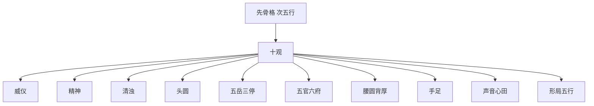

## 本章要义

这是旧题麻衣道者的相书节选，不是四卷完本。本章只收开篇「相说」总诀和「十观」纲领，用来记旧说如何观人。它是**术数文献，不是医学**，不能拿来做健康、性格或命运诊断。

看相的次第：先骨格，次五行，再按十项总断——威仪、精神、清浊、头面、五岳三停、五官六府、腰背、手足、声音与心田、形局五行。部位流年、气色十二宫见后两章。

可与曾国藩《冰鉴》对读：麻衣重部位、形局与官成府就；《冰鉴》重神骨。底本讹字较多，白话按通行文意疏通。

本章**进阶**：十观是分论，骨格、形神、官成府就要一条一条对读，不能只记总诀。

## 底本

旧题麻衣道者《麻衣神相》。本章据 youngzs/xuanxue 仓库 Markdown 合并节选，只收「相说」与「十观」，不是四卷完本。传本有讹字、断句不稳处；原文尽量保持底本用字，白话按通行校读疏通（如「万斟」作「万斛」、「阴鸳」作「阴骘」、「撰血」作「渥血」）。

## 对读

### 相说

> 难度：进阶

大凡观人之相貌，先观骨格，次看五行。

**白话：** 看人的相貌，先看骨格，再看五行。

量三停之长短，察面部之盈亏，观眉目之清秀，看神气之荣枯，取手足之厚薄，观须发之疏浊，量身材之长短，取五官之有成，看六府之有就，取五岳之归朝，看仓库之丰满，观阴阳之盛衰，看威仪之有无，辨形容之敦厚，观气色之喜滞，看体肤之细腻，观头之方圆，顶之平塌，骨之贵贱，骨肉之粗疏，气之短促，声之响亮，心田之好歹，俱依部位流年而推，骨格形局而断。

**白话：** 量一量上中下三停谁长谁短，看面部是丰满还是亏缺；看眉目清不清秀，神气是旺是枯；看手足厚薄，须发疏密清浊；量身材长短；看五官有没有「成」，六府有没有「就」；看五岳是否朝拱，仓库是否丰满；看阴阳盛衰、有没有威仪、形容敦厚与否；看气色是喜是滞，皮肤粗细；看头圆还是方、顶平还是塌；骨是贵相还是贱相，骨肉是匀称还是粗疏；气是不是短促，声音响不响亮，心田好不好。以上都要按部位、流年去推，按骨格、形局去断。

不可顺时趋奉，有玷家传。

**白话：** 不可顺着时势去奉承，以免玷污家传。

但于星宿、富贵、贫贱、寿夭、穷通、荣枯、得失、流年、休咎，备皆周密，所相于人，万无一失。

**白话：** 星宿、富贵、贫贱、寿夭、穷通、荣枯、得失、流年吉凶，都要周密看全；这样相人，旧说才能万无一失。

学者亦宜参详，推求真妙，不可忽诸。

**白话：** 学的人也要参详，把真意求出来，不可随便忽略。

### 十观

> 难度：进阶

*图注：十格分列十观，格间箭头表示由上到下的观人次第：1 威仪「不怒而威」，2 精神「久坐不昧」，3 清浊「清贵浊厚」，4 头圆「头为一身之主」，5 五岳三停「匀称为贵」，6 五官六府「官成府就」，7 腰背「腰圆背厚」，8 手足「厚软为富」，9 声音心田「声清心善」，10 形局五行「按局取断」。对应相说「先观骨格，次看五行」，再依本节十观总断。术数文献，不是医学。*

#### 一取威仪

如虎下山，百兽自惊。如鹰升腾，狐兔自战。不怒而威，不但在眼，亦观颧骨神气取之。

**白话：** 像老虎下山，百兽自己会惊；像苍鹰升空，狐兔自己会颤。不必发怒就有威严。威不只在眼睛里，颧骨上的神气也要一起取。

#### 二看精神

身如万斟之舟，驾于巨浪之中，摇而不动，引之不来，坐卧起居，神气清灵。久坐不昧，愈加精彩。如日东升，刺人眼目。如秋月悬镜，光辉皎洁。面神眼神，俱如日月之明。辉辉皎皎，自然可爱；明明洁洁，久看不昏。如此相者，不大贵亦当小贵，富亦可许，不可妄谈定。

**白话：** 「万斟」当作「万斛」。身子像万斛大船驶在巨浪里：摇它不动，拉它不来；坐卧起居，神气清而灵。坐得久也不昏，越看越有光彩。像太阳刚升，刺人眼目；像秋月当空，光洁如镜。面上的神、眼里的神，都像日月那样明。亮堂堂，自然可爱；清清白白，看久了也不昏。这样的相，就算不是大贵，也当有小贵，富也可以许——只是不可信口断死。

#### 三取清浊

但人体厚者自然富贵，清者纵瘦神长，必以贵推之。浊者有神谓之厚，厚者多富。浊而无神谓之软，软者必孤，不孤则夭。

**白话：** 体貌厚实的人，旧说多主富。清的人即使瘦，只要神长，仍以贵来推。浊而有神，叫作厚，厚的人多富；浊却无神，叫作软，软的人旧说主孤，不孤就会夭。孤夭是术数话，不是医学。

*图注：三格对照「清而瘦，可许贵」「浊有神，谓之厚，多富」「浊无神，谓之软，孤或夭」。对应本段「清者纵瘦神长，必以贵推之。浊者有神谓之厚，厚者多富。浊而无神谓之软，软者必孤，不孤则夭」。术数文献，不是医学。*

#### 四看头圆

但人头为一身之主，四肢之元。头方者顶高，则为居尊天子。额方者顶起，则为辅佐良臣。头圆者，富而有寿。额阔者，贵亦堪夸。顶平者，福寿绵远。头扁者，早岁钝貄。额塌者，少年虚耗。额低者，刑克愚顽。额门杀重者，早年困苦。部位倾陷，发际参差者，照依刑克兼观，不可一例而言，有误相诀。

**白话：** 头是一身之主、四肢之元。头方而顶高，旧说是至尊之相；额方而顶起，旧说是辅佐之臣。头圆，富而能寿；额阔，贵也说得过去；顶平，福寿较长。「钝貄」当作「钝滞」：头扁，早年迟滞；额塌，少年虚耗；额低，主刑克、愚顽；额上杀纹重，早年困苦。部位塌陷、发际参差的，要兼看刑克，不可拿一条口诀套所有人，以免把相诀用错。

#### 五看五岳三停

左颧为东岳，俱要中正，不可粗露倾塌。额为南岳，亦喜方正，不宜撇竹低塌。右颧为西岳，亦与左颧相同。地阁为北岳，喜旺方圆隆满，不可尖削歪斜，卷窍兜上。土星为中岳，亦宜方正耸上。印堂五岳成也。书云，五岳俱朝，贵压朝班，亦且钱财自旺。

**白话：** 左颧是东岳，要中正，不可粗露、倾塌。额是南岳，喜方正，不宜像撇竹那样低塌。右颧是西岳，要求与左颧相同。地阁是北岳，喜旺、方圆、隆满，不可尖削歪斜、往上兜卷。鼻（土星）是中岳，也要方正上耸。印堂一带五岳才算成。书上说：五岳都来朝拱，贵可以压朝班，钱财也容易旺。

*图注：红点与引线分别标额为南岳、人物自身左颧为东岳（照片右侧）、右颧为西岳、鼻为中岳（土星）、下巴地阁为北岳。对应「左颧为东岳……额为南岳……右颧为西岳……地阁为北岳……土星为中岳」及「五岳俱朝」。术数文献，不是医学。*

三停者，额门、准头、地角，此面部三停也。又为三财，又为三主、又名三表，俱要平等。上停长少年忙，中停长福禄昌，下停长老吉祥，三停平等，一生衣禄无亏。若三停尖削、歪斜、粗露，俱不利也，可照流年部位气色而推，不可一体而断。

**白话：** 三停指额门、准头、地阁，是脸上的三段，又称三财、三主、三表，要大致匀称。上停长，少年忙；中停长，福禄昌；下停长，晚年吉；三停平等，一生衣禄不缺。若尖削、歪斜、粗露，都不利，要按流年、部位、气色细推，不可一刀切。

*图注：红点与引线分标上停、中停、下停三条横带：上停发际到眉（额门一带）、中停眉到准头、下停准头到地阁。对应「三停者，额门、准头、地角，此面部三停也……俱要平等」。术数文献，不是医学。*

#### 六取五官六府

眉为保寿官，喜清高疏秀弯长，亦宜高目一寸，尾拂天仓，主聪明富贵，机巧福寿，此保寿官成也。若粗浓黄淡，散乱低压，乃刑伤破败，此一官不成也。

**白话：** 眉是保寿官。喜清、高、疏、秀、弯、长，高出眼睛约一寸，眉尾扫向天仓：主聪明富贵、机巧福寿，此官成。若粗浓、黄淡、散乱、低压，主刑伤破败，此官不成。

眼为监察官，黑白分明，或风眼、象眼、牛眼、龙虎眼、鹤眼、猴眼、孔雀眼、鸳鸯眼、狮眼、喜鹊眼，神藏不露，黑如漆，白如玉，波长射耳，自然清秀有威，此监察官成也。若蛇、蜂、羊、鼠、鸡、猪、鱼、马、火轮四白等眼，赤白纱侵，睛圆黑白混杂，兼神光太露，昏昧不清，此监察官不成也。又且愚顽凶败。

**白话：** 「风眼」当作「凤眼」。眼是监察官。黑白分明；凤、象、牛、龙虎、鹤、猴、孔雀、鸳鸯、狮、喜鹊这类眼，神藏不露，黑如漆、白如玉，眼波长伸向耳，清秀有威，此官成。蛇、蜂、羊、鼠、鸡、猪、鱼、马、火轮四白这类眼，赤白纱侵睛，睛圆、黑白混杂，神光太露或昏昧不清，此官不成，旧说还主愚顽凶败。

耳为采听官，不论大小，要轮廓分明，喜白过面，水耳、土耳、金耳、牛耳、圆棋耳、贴脑耳、对面不见耳，高眉一寸，轮厚廓坚，红润姿色，内有长毫，孔小不大，此采听官成也。或鼠耳、木耳、火耳、箭羽耳、猪耳，轮飞廓反，不好之耳，或低小软弱，此采听官不成也。不利少年损六亲。

**白话：** 耳是采听官。不论大小，要轮廓分明；喜白得超过面色。水、土、金、牛、圆棋、贴脑、对面不见耳这类，高出眉毛约一寸，轮厚廓坚，色红润，内有长毫，耳孔小而不大，此官成。鼠、木、火、箭羽、猪耳，轮飞廓反，或低小软弱，此官不成，不利少年，兼损六亲。

鼻为审辨官。亦宜丰隆耸直有肉，伏犀龙虎鼻，狮牛胡羊鼻，截问盛囊悬胆鼻，端正不歪不偏、不粗不小。此审辨官成也。若狗鼻、鱼、鹰嘴、剑峰、反吟、复吟、三曲、三弯、露孔、仰灶、扁弱、露脊、露骨、太大、孤峰，况又凶恶，贫苦无成，刑恶奸贪。此审辨官不成也。

**白话：** 「截问」当作「截筒」。鼻是审辨官。要丰隆、耸直、有肉。伏犀、龙虎、狮、牛、胡羊，以及截筒、盛囊、悬胆这类鼻，端正不歪不偏、不太粗也不太小，此官成。狗鼻、鱼鼻、鹰嘴、剑峰、反吟、复吟、三曲三弯、露孔、仰灶、扁弱、露脊露骨、太大、孤峰，又带凶恶之相，旧说贫苦无成、刑恶奸贪，此官不成。

口为出纳官，唇红齿白、两唇齐丰，人中深长，仰月弯弓、四字口方，牛龙虎口，两唇不反不昂，不掀不尖，此出纳官成也。或猪狗羊口、覆船、宴鱼纫鱼、鼠食羊食、唇短齿露、唇黑唇皱、上唇薄下唇反、须黄焦枯粗浊，此出纳官不成也。

**白话：** 口是出纳官。唇红齿白，两唇齐而丰，人中深长；仰月、弯弓、四字方口，牛、龙、虎口；两唇不翻不昂、不掀不尖，此官成。猪狗羊口、覆船口、宴鱼纫鱼、鼠食羊食，唇短齿露，唇黑唇皱，上薄下翻，须黄焦枯粗浊，此官不成。

书云，但一官成者，掌十年之贵禄富丰，不成者，必主十年困苦。

**白话：** 书上说：一官成，管十年贵禄富足；不成，管十年困苦。

*图注：箭头分别指眉、眼、鼻、口、耳五处。对应「眉为保寿官」「眼为监察官」「耳为采听官」「鼻为审辨官」「口为出纳官」，以及「一官成者，掌十年之贵禄富丰」。术数文献，不是医学。*

六府者，天庭日月二角为天府，宜方圆明净，不宜露骨，天府成也。或削低塌偏尖，天府不成也。主初年运塞。

**白话：** 六府：天庭与日月二角是天府，要方圆明净、不露骨，天府成；削、低、塌、偏、尖，天府不成，主初年运塞。

两颧为人府。宜方正插鬓，不粗不露，齐揖方拱，此人府成也。若粗露高低，尖圆绷鼓，此人府不成也。主中年运否。

**白话：** 两颧是人府，要方正插鬓、不粗不露、齐揖方拱，人府成；粗露高低、尖圆绷鼓，人府不成，主中年运否。

地角边腮为末景地府，喜府地阁悬壁，木昏不惨，不尖不歪，不粗不大，地府成也。若高低粗露，削尖耳后见重腮，地府不成也。

**白话：** 「木昏」当作「不昏」。地阁边腮是地府（晚年），喜地阁如悬壁，不昏不惨，不尖不歪，不粗不大，地府成；高低粗露、削尖，耳后见重腮，地府不成。

书云，一府就掌十年之富盛，相反者主十年之凶败？

**白话：** 书上说：一府就，管十年富盛；相反，管十年凶败。末句问号是底本残留，当作陈述。

*图注：六点标左右天仓（天府，对应「天庭日月二角为天府」）、左右颧府（人府，对应「两颧为人府」）、左右地库（地府，对应「地角边腮为末景地府」）。引线指向这六处骨肉，不指向五官。术数文献，不是医学。*

#### 七取腰圆背厚

三甲三壬，体肤细嫩可也。背厚阔，腰硬腰圆，最嫌背脊成坑，背薄肩垂，肩昂颈削。腰宜圆宜硬，宜大宜平，不可细小软弱，崎弯无屁股，臀薄尖削露，臀宜平厚，不宜大窍。胸宜平满，骨莫粗露。项下双绦；心窝不陷，腹宜有囊如葫芦。脐下肉横生，不宜尖削。或如鹊肚、鸡胸、狗肚，此不湛也。

**白话：** 「不湛」当作「不堪」。背有三甲、腹有三壬，皮肤细嫩更好。背要厚阔，腰要硬圆；最嫌背脊成坑、背薄肩垂、肩耸颈削。腰宜圆、硬、大、平，不可细软、歪弯、没有屁股；臀薄尖削外露也不好，臀要平厚，不宜大窍。胸要平满，骨头不要粗露。项下有双绦，心窝不陷，腹要像葫芦那样有囊；脐下横生肉，不宜尖削。鹊肚、鸡胸、狗肚，都算不堪。

书云。腰圆背厚，方保玉带朝衣，骤然不豫，慷慨过人，必主发达富盛。胸平腹囊，故宜紫袍挂体，虽不出前，不入凡流，必须发达。背如三甲，项后肉厚，两肩绷肉厚、腹如三壬，脐下肉长，两腿边肉长。书云、背负三山如护甲，脐深纳李腹垂箕，如此之相必大贵，不贵之时富可夸。但头大无肉，腹大无囊，不是农夫必是屠傅，不是粗人定是木作。若尖削陷软，狗肚鸡胸，纵富必无结果。书云，男子腰小，难主家财亦且夭折。凸胸露臀，当成穷酸，男子为仆，女子为婢，相中最宜推详、不可忽略。

**白话：** 「屠傅」当作「屠户」。书上说：腰圆背厚，才保得玉带朝衣；即使一时不顺，只要慷慨过人，终主发达富盛。胸平、腹有囊，才说得上紫袍在身；即便不是顶尖，也不入凡流，终须发达。背如三甲：项后肉厚、两肩绷肉厚；腹如三壬：脐下肉长、两腿边肉长。又说：背负三山如护甲，脐深能纳李、腹垂如箕，这样的相必大贵，不贵也富。若头大无肉、腹大无囊，不是农夫就是屠户，不是粗活就是木作。尖削陷软、狗肚鸡胸，纵然富也难有结果。男子腰小，难主家财，兼主夭折。凸胸露臀，当成穷酸；男为仆、女为婢。这一条最要细看，不可忽略。夭折是术数话，不是医学。

#### 八取手足

宜细嫩隆厚、掌有八卦，纹路鲜明，或如撰血尖起三峰、奇纹异纹，节如鸡弹，指尖相称，指大相停，掌平如镜，或软如绵，龙虎相吞、掌厚背厚，腕扁肘圆，足背有肉、足底有纹有痣掌略带弯，手背不宜粗露，筋骨指节不宜漏缝。

**白话：** 「撰血」当作「渥血」，「鸡弹」当作「鸡卵」。要细嫩隆厚，掌中像有八卦，纹路鲜明；或红如渥血，掌心尖起三峰，有奇纹；指节如鸡卵，指尖匀称，指的粗细相称；掌平如镜，或软如绵；龙虎纹相吞；掌厚、手背也厚；腕扁肘圆；足背有肉，足底有纹有痣，掌略带弯。手背不要青筋粗露，指节不要漏缝。

书云、肿节漏缝神昏神懒。浮筋露骨，身乐心忧。掌红撰血，富贵绵绵。手软如绵、闲且有钱。尖起三峰，招生晚景。掌平如镜，白手兴家。纹露粗率，晚年衣禄平常。但相掌诀法有载于后，宜与前后兼观。

**白话：** 「招生晚景」当作「招主晚景」。书上说：肿节漏缝，神昏神懒。浮筋露骨，身虽乐、心里忧。掌红如渥血，富贵绵长。手软如绵，清闲而有钱。尖起三峰，晚景有收。掌平如镜，白手兴家。纹粗而露，晚年衣禄平常。看掌的细则后文另有，要和前后合起来看。

#### 九取声音心田

书云，要知心里事，但看眼神清。眼乃心之门户，观其眼之善恶，必知心事之好歹，其心正则眸子必正。眼视上其心必高，眼视下心有感思。眼转动而不言、心有疑虑。眼视斜而口是心非，益已害人，言不可听。眼正视，其人中正，入党无偏。眼恶心必恶，眼善心必慈。

**白话：** 书上说：要知道心里的事，先看眼神清不清。眼是心的门户，看眼的善恶，就能推心事的好坏。心正，眸子也正。眼往上看，心气高；眼往下看，心里有事。眼睛转个不停却不说话，心里有疑。眼斜视，口是心非，损人利己，话不可信。眼正视，人中正，跟人不偏私。眼恶则心恶，眼善则心慈。

有阴鸳者，或救人难厄，或救人危险，济人贫穷，救人性命，不淫不乱。财宽量大容物。人俱有紫黄容红气色。发见于眼下，卧蚕之宫，印堂福堂之住，纵相貌不如。其心田好，终有富贵。若相貌堂堂，心事奸险，纵然富贵，不日贫穷。书云；未观相貌先看心田，有相无心相从心灭，有心无相相从心生。昔裴度还带，宋郊渡蚁，廉颇扶危救人过渡，各千金不受，本是不贵之相，后反大贵而阴阳扶之。

**白话：** 「阴鸳」当作「阴骘」。有阴德的人：救人于难、救人于险，济贫救命，不淫不乱，财宽量大、容得下人。这类人眼下卧蚕、印堂福堂一带，常见紫、黄、红润的气色。相貌即使差一点，心田好，终有富贵。若相貌堂堂、心事奸险，纵然富贵，不久也穷。书上说：未观相貌，先看心田；有相无心，相从心灭；有心无相，相从心生。从前裴度还带、宋郊渡蚁，以及传本所记扶危救人、千金不受的故事，本不是贵相，后来反而大贵，说是阴阳来扶助。

声音宜响亮，出自丹田，脐下一寸是。声响如雷灌耳，或如铜钟玉韵，或如瓮中之声，或如铜锣铜鼓，或如金声，或声长尾大如鼓之响，俱要清润，纵相貌不如，亦主富贵。或人小声大，人大声雄，俱要深远，丹田所出，此富贵绵远之相也。夭折贫贱之人，声轻声噎声浮声散声低声小，或如破锣破鼓，语音焦枯，声大尾焦，声雄不圆。书云，富贵之声出于丹田，天贱之人，声出舌端，或有余韵，纵焦枯烈，早年虚耗，晚主发达矣。诀曰：言未举而色先变，话末尽而气先绝，俱天贱之人。观声音，知为相之根本。观阴阳，知为相之元神。形貌莫外乎声音，阴阳部位不好，有此相者，竞许富贵。但声音响亮者，虽贫终能发达，不必狐疑。

**白话：** 「天贱」当作「夭贱」，「话末尽」当作「话未尽」，「竞许」当作「竟许」。声音要响亮，从丹田出（脐下一寸一带）。如雷灌耳，或如铜钟玉韵，或如瓮中之声，或如铜锣铜鼓，或如金声，或声长尾大像鼓响，都要清润。相貌即使差一点，也主富贵。人小而声大、人大而声雄，都要深远、从丹田出来，才是富贵绵远之相。夭折贫贱之人，声轻、噎、浮、散、低、小，或如破锣破鼓，语音焦枯，声大而尾焦，声雄而不圆。书上说：富贵之声出于丹田；夭贱之人，声出舌端。若声音虽焦烈却有余韵，早年虚耗，晚来仍可发达。口诀：话还没出口脸色先变，话还没说完气已经接不上，都是夭贱之征。看声音，是相的根本；看阴阳，是相的元神。形貌再差，只要声音、阴阳好，仍可许富贵。声音响亮的人，虽贫终能发达，不必犹豫。夭折贫贱是术数话，不是医学。

#### 十观形局五行

形局者，乃人一身之大关也。或如龙形、虎形、鹤形、狮形、孔雀形、鹳形、牛形、猴形、豹形、象形、风形、鸳鸯、鹭鸶、骆驼、黄鹏、练雀等形，此富贵形相。或猪形、狗形、羊形、马形、鹿形、鸦形、鼠形、狐狸形，此凶暴贫薄夭折之相也。

**白话：** 「风形」当作「凤形」，「黄鹏」当作「黄鹂」。形局是一身的大格局。龙、虎、鹤、狮、孔雀、鹳、牛、猴、豹、象、凤、鸳鸯、鹭鸶、骆驼、黄鹂、练雀这类，旧说是富贵形。猪、狗、羊、马、鹿、鸦、鼠、狐狸这类，旧说是凶暴、贫薄、夭折之形。这是取类比象，不是动物学，更不是骂人。

五行者，金木水火土也。书云，金得金刚毅深，木得木资财足，水得水文章贵，火得火见机果，土得土厚丰库。金形白色喜白，木形瘦喜青，水喜肥黑，火不嫌尖宜赤色、土喜厚今色宜黄、此五形正局也。合此者富贵福寿，反此者贫贱夭折。但学者凭五行兼骨格，推断相法多端总断。

**白话：** 「今色」当作「色」。五行是金木水火土。书上说：金得金，刚毅深沉；木得木，资财充足；水得水，文章贵；火得火，见机果决；土得土，库仓丰厚。金形白、喜白；木形瘦、喜青；水形肥、喜黑；火形不妨尖、宜赤；土形厚、色宜黄。这是五形正局。合的，富贵福寿；反的，贫贱夭折。学的人要把五行和骨格合起来看，相法头绪多，总要一处一处断，不可单凭一条。
