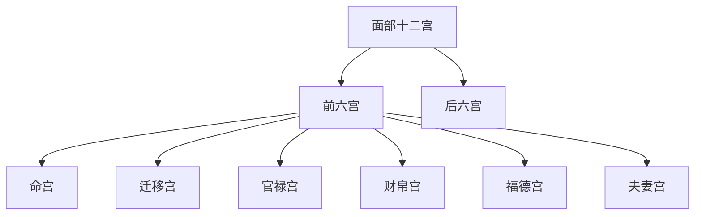

## 本章要义

本章接「相说与十观」，收五法、切相歌、各地论形俗说、气色口诀，以及面部十二宫的位置和**前六宫**详解：命宫、迁移宫、官禄宫、财帛宫、福德宫、夫妻宫。后六宫另章。文末另有一路命宫、迁移宫重出，那一路较散，放到后六宫章作「异文附录」，本章只用较清晰的条目稿，避免两章各贴一遍相同命宫。

这是**术数文献，不是医学**。气色、青筋、黑痣在传本里被拿来讲吉凶，不能当成疾病诊断或体检依据。

五法把观人收成五问：择交看眼，问贵看眼，问富看鼻，问寿看神，求全看声。气色则按节令、五形、生克和正邪（润泽为吉、干焦为凶）来读，还强调「色现而神脱，色也是空」。

本章**进阶**：十二宫分论与气色生克，要按段对读，不能只记宫名。

*图注：五步环对应五法切相之后入前六宫：命、迁、官、财、福、夫。后六宫另章。术数文献，不是医学。*

## 底本

旧题麻衣道者《麻衣神相》。本章据 youngzs/xuanxue 仓库 Markdown 合并节选，不是四卷完本。命宫、迁移宫以本章较清晰的条目稿为准；另一路重出见后六宫章「异文附录」，此处不重复粘贴。已将百科残留标题「折叠官禄宫」「折叠夫妻宫」改回宫名。气色段底本有「当'于清明昧梦」「秋要要白」「色终莫熊」一类讹字，位置条「发往」「眉凌骨」当作发际、眉棱骨；原文仍录底本，白话按通行文意疏通。

## 对读

### 五法

> 难度：进阶

择交在眼，眼恶者怕多薄、交之有害。然露者无心、不可不详审也。

**白话：** 择交看眼睛。眼恶的人，旧说薄情的多，交往容易受害。不过眼神外露的人未必有心机，仍要细审，不可一概而论。

问贵在眼，术有眼无神而贵且寿者。

**白话：** 问贵也看眼。术家又承认：有的人眼无神，却仍贵而且寿——口诀不是死的。

问富在鼻，鼻为土生金、厚而丰隆者必富。

**白话：** 问富看鼻。鼻为土，土能生金；厚而丰隆，旧说必富。

问寿在神。术有神不足而寿且贵者，纵贵亦大富。

**白话：** 问寿看神。也有神不足却寿而且贵的；即便不贵，也常能大富。寿夭是术数话，不是医学。

求全在声、士农工商，声亮必成，不亮无终。

**白话：** 求做事有始有终，看声音。士农工商，声亮则事能成，不亮则难有结果。

上相不出此五法，拘于口耳眉额手足背腹之间者，乃庸相士也。

**白话：** 上相跳不出这五法。只在口、耳、眉、额、手足、背腹上打转的，是庸相士。

*图注：五格为择交在眼、问贵在眼、问富在鼻、问寿在神、求全在声，对应「上相不出此五法」。术数文献，不是医学。*

### 切相歌

> 难度：进阶

入眼方知诀，还观主起中。

**白话：** 眼睛对上了，口诀才起作用；还要看印堂一带的「主」起得如何。

语迟终富显，步紧必贫穷。

**白话：** 说话迟缓，终能富显；步子又碎又急，旧说主贫。

犬眼休为伴、鸡睛莫与逢。

**白话：** 犬眼不要结伴，鸡眼不要相逢。

颈偏同时滞，头小定飘蓬。

**白话：** 颈偏，时运容易滞；头小，一生飘蓬。

骨露财难聚，筋浮病必攻。

**白话：** 骨露则财难聚，筋浮则病易侵。筋浮主病是术数话，不是医学。

唇掀知命天，腹坠禄须丰。

**白话：** 「命天」当作「命夭」。唇掀，旧说主夭；腹下垂，禄容易丰。

腰肥知有福，额广寿如松。

**白话：** 腰肥有福，额广寿如松。

脚长兼耳薄，辛苦道途中。

**白话：** 脚长又耳薄，多在道路上辛苦。

### 论形俗

> 难度：进阶

蜀人相眼。

**白话：** 蜀地看相侧重眼睛。

闽人相骨。

**白话：** 闽地看相侧重骨格。

浙人相清。

**白话：** 浙地看相侧重清气。

淮人相重。

**白话：** 淮地看相侧重厚重。

宋人相口。

**白话：** 宋地看相侧重口。

江西人相色。

**白话：** 江西看相侧重气色。

鲁人相轩昂。

**白话：** 鲁地看相侧重轩昂。

胡人相鼻。

**白话：** 胡地看相侧重鼻。

太原人相重厚。

**白话：** 太原看相侧重重厚。以上都是各地风俗侧重点，不是定律。

### 论气色

> 难度：进阶

天道周岁二十四节气，人面一年气色，亦二十四变。以五行配之。无不验者。

**白话：** 天道一年二十四个节气，人脸上的气色一年也大约二十四变，用五行去配，旧说没有不应验的。

促色最难审，当'于清明昧梦之时观之，又须隔绝、个醉、不近色，乃可决耳，慎之慎之。

**白话：** 「促色」当作气色，「当'于」当作「当于」，「昧梦」当作「昧爽」，「个醉」当作「酒醉」。气色最难审，最好在清明昧爽、神智清明的时候看；还要隔开酒醉、不近色，才好下判断。务必谨慎。

气色半月一换，交一节气，子时既变矣。

**白话：** 气色大约半月一换；交一个节气，从子时起就已经变了。

气色在皮内肉外；隐隐可鞠者，方是真气色。

**白话：** 「可鞠」当作「可掬」。真气色在皮里肉外，隐隐可以掬出来的才算。

气色现而安静者、应之迟，若点点焰动不定者。应之速。

**白话：** 气色现了却安静，应事较迟；像火苗一点一点跳动不定，应事较快。

春要青，夏要红，秋要要白、冬要黑；四季月要黄，此天时气色也。

**白话：** 「秋要要白」衍一「要」字。按时令：春要青，夏要红，秋要白，冬要黑，四季月要黄。这是天时气色。

木形人要青，火形人要红：金形人要白，水形人要黑，土形人要黄，此人身之气色也。

**白话：** 按人：木形要青，火形要红，金形要白，水形要黑，土形要黄。这是人身气色。

木形色青、要带黑忌白。火形色红、要带青忌黑。金形色白，要带黄忌红。水形色黑；要带白忌黄。土形色黄、要带红忌青。此五形生克之气色也。

**白话：** 再按生克：木青宜带黑、忌白；火红宜带青、忌黑；金白宜带黄、忌红；水黑宜带白、忌黄；土黄宜带红、忌青。这是五形生克气色。

青如睛天日求出之色，而有润泽，为正，为吉；如打伤痕而干焦，则为邪为凶。

**白话：** 「睛天日求」当作「晴天日未」。青像晴天日未出时的天色，又有润泽，为正、为吉；像打伤的痕迹而干焦，则为邪、为凶。

红如隙中日影之色，而有润泽，为正，为吉；如打伤痕而焦枯，为邪为凶。

**白话：** 红像缝隙里的日影，又有润泽，为正、为吉；像伤痕而焦枯，为邪、为凶。

白如玉而有润泽，为正，为吉；如粉如雪而起粟，则为邪，为凶。

**白话：** 白如玉而有润泽，为正、为吉；像粉、像雪又起粟粒，则为邪、为凶。

黑如漆而有润泽，为正，为吉；如烟煤蜡而暗，则为邪，为凶。

**白话：** 黑如漆而有润泽，为正、为吉；像烟煤、蜡一样暗，则为邪、为凶。

黄如鹅而有润泽。为正，为吉；如败叶色而焦枯，则为邪凶。

**白话：** 黄如鹅绒而有润泽，为正、为吉；像败叶色而焦枯，则为邪、为凶。

色白主服，红主讼及疮疤破财，如火珠焰发者，主火灾。青主惊恐疾病，黑主大病死亡，黄主疾病尖脱。

**白话：** 「尖脱」当作「失脱」。应事上，旧说：白主孝服，红主争讼、疮疥、破财，红如火珠焰起则主火灾；青主惊恐疾病，黑主大病死亡，黄主疾病、失脱。都是术数应验话，不是医学。

*图注：五格分标青主忧饶、黄主昌、赤主火殃、白主破财、黑主病。对应本段「色白主服，红主讼及疮疤破财……青主惊恐疾病，黑主大病死亡，黄主疾病尖脱」。图用太清五色口诀作对照，条目与麻衣不完全相同。术数文献，不是医学。*

气色虽现，亦要看神色正、而神脱色亦空耳。色邪而神旺，色终莫熊为人害也。

**白话：** 「色终莫熊」当作「色终莫能」。气色虽然现了，还要看神：神正，色才有根；神脱了，色也是空。色邪而神旺，色终究害不了人。

### 位置

> 难度：进阶

*图注：十二处红点与引线标命宫（印堂）、迁移（前额两侧近发际）、官禄（左前额）、财帛（鼻）、福德（眉尾上方）、夫妻（眼尾）、子女（泪堂）、交友（腮）、兄弟（眉）、田宅（上眼睑）、父母（日月角）、疾厄（山根）。对应下列十二条位置原文。术数文献，不是医学。*

命宫——双眉中间印堂部位。

**白话：** 命宫在两眉之间的印堂。

迁移宫——前额两侧靠发际的部分，眉毛上方外侧部。

**白话：** 迁移宫在前额两侧近发际、眉毛外上方。

官禄宫——左前额的中央部，上至发往下至印堂。

**白话：** 「发往」当作「发际」。官禄宫在左前额中央，上到发际、下到印堂。

财帛宫——鼻子部位。

**白话：** 财帛宫在鼻。

福德宫——在眉尾的上方，而眉凌骨又称蓄财骨看财气福气的部位。

**白话：** 「眉凌骨」当作「眉棱骨」。福德宫在眉尾上方；眉棱骨又称蓄财骨，用来看财气福气。

夫妻宫——眼睛的尾部鱼尾及鱼尾外侧奸门部位。

**白话：** 夫妻宫在眼尾鱼尾及外侧奸门。

子女宫——泪堂及卧蚕部位，左男右女。

**白话：** 子女宫在泪堂、卧蚕，旧说左男右女。后六宫条目见下一章。

交友宫——下巴的左右面颊、两腮的内侧的部分。

**白话：** 交友宫在下巴左右、两腮内侧。

兄弟宫——左右两眉毛的位置。

**白话：** 兄弟宫在左右两眉。

田宅宫——两眉之间的上眼睑部位。

**白话：** 田宅宫在两眉之间的上眼睑。

父母宫——在日月角至辅角的部位，左父右母。

**白话：** 父母宫从日月角到辅角，左父右母。

疾厄宫——鼻梁左右位置（又称山根）。

**白话：** 疾厄宫在鼻梁左右，又称山根。

### 命宫

> 难度：进阶

*图注：红点与引线标两眉之间的印堂。对应「命宫——双眉中间印堂部位」。术数文献，不是医学。*

1、命宫有直纹的人，势必神经衰弱，个性偏激，疑神疑鬼，易遭失败。

**白话：** 命宫有直纹的人，旧说势必神经过敏、个性偏激、疑神疑鬼，事情容易失败。神经衰弱是术数夸张，不是医学诊断。

2、命宫低陷的人，除自卑外，生活较艰苦孤独，易有生命危险兼保护力弱。

**白话：** 命宫低陷的人，除了自卑，生活也较清苦孤独；旧说防护力弱、有性命之忧。这是术数夸张，不是医学诊断。

3、命宫狭窄的人，忙碌而操心，为人气量不大，缺乏安全感。猜忌多疑，运程起伏，一生过得不太安足。

**白话：** 命宫狭窄的人，忙碌操心、气量小、缺乏安全感，猜忌多，运势起伏，日子过不安稳。

4、命宫有皱纹之人，运气不顺，颇劳碌。易与上司或别人引起争端、遭到失败。

**白话：** 命宫有皱纹的人，运气不顺、劳碌，容易和上司或旁人起争端，事情容易失败。

5、命宫气色的看法。a.赤红色，必须防止口舌是非，官非诉讼。b.青色，必有惊恐之事发生。c.黑色，必有破财、骨折车祸等事发生。

**白话：** 看命宫气色：赤红，防口舌官非；青，主惊恐；黑，主破财、骨折、车祸一类横事。骨折车祸是术数应验话，不是医学或交通预测。

6、命宫宽大的人，是一个成功的人。

**白话：** 命宫宽大的人，旧说是能成事的人。

7、命宫丰满的人，是一个圆满的命格。容易获得成功与财富。

**白话：** 命宫丰满的人，旧说是圆满之格，成功与财富来得顺。

8、命宫太宽，在二指以上的人，无主见，理想高不切实际。

**白话：** 命宫太宽、约两指以上的人，无主见，理想高而不切实际。

9、命宫太窄，低于一指的人，考虑太少。

**白话：** 命宫太窄、不足一指的人，考虑太少。

10、眉头交锁的人气量狭窄。

**白话：** 眉头交锁的人，气量狭窄。

### 迁移宫

> 难度：进阶

*图注：红点与引线标前额两侧近发际、眉毛外上方。对应「迁移宫——前额两侧靠发际的部分，眉毛上方外侧部」。术数文献，不是医学。*

1、迁移宫低陷的人，不适合外务工作，不宜创业管理。

**白话：** 迁移宫低陷的人，不适合外务，也不宜自己创业管人。

2、迁移宫狭窄不平的人，财源少，不适合贸易工作，安分为妙，免将祖业败光。

**白话：** 迁移宫狭窄不平的人，财源少，不适合做贸易；安分为妙，免得把祖业败光。

3、气色黑暗的人，将有阴灵侵入。

**白话：** 气色黑暗，旧说主阴邪侵扰。仍是术数话，不是驱邪手册。

4、有恶痣、刀疤之类的人，出门会屡遭危险，不适宜经营贸易，出外旅行最好买保险，容易因为工作不稳定而为迁移变动所苦。

**白话：** 有恶痣、刀疤，出门多险，不宜经营贸易；出行最好有保障，也容易因工作不稳而被迫搬来搬去。

5、迁移宫丰隆的人，出外有良好的契机，可以大发展，最适宜经营国际贸易事业的人，财源富足。

**白话：** 迁移宫丰隆，出外有机缘，可大发展，旧说最宜国际贸易，财源较足。

6、迁移宫有骨耸起的人，出外掌握权势，投入军旅界必能显赫一时。

**白话：** 迁移宫有骨耸起，出外能掌权，入军旅也容易显赫一时。

7、迁移宫有痣、疤及气色不佳，不能出国或不顺利成行。

**白话：** 有痣、有疤、气色又差，出国或远行往往不顺、甚至成不了行。

### 官禄宫

> 难度：进阶

*图注：红点与引线标人物自身左前额中央（照片右侧）。对应「官禄宫——左前额的中央部，上至发往下至印堂」。术数文献，不是医学。*

1、官禄宫有疤痕或黑痣的人，小心犯上，自以为才华很好易受长辈的压抑，此亦代表父母或家庭中有事发生，宜从事服务行业。

**白话：** 官禄宫有疤痕或黑痣，小心犯上；自恃才高，反而容易被长辈压，也表示父母或家里有事，旧说宜走服务一行。

2、塌陷的人，事业将有严重的无力感，命运显得挫折与坎坷，易遭困难，多失败。

**白话：** 官禄宫塌陷，事业上无力，路途坎坷，多困难、多失败。

3、有横纹截过的人，少年环境差，挫折多，相当劳苦；好管闲事，喜打抱不平，易惹麻烦；是个神经质、夜晚睡不着的人。

**白话：** 有横纹截过：少年环境差、挫折多、劳苦；又好管闲事、打抱不平，容易惹麻烦；夜里睡不踏实。神经质、失眠是术数话，不是医学。

4、有悬斜纹冲破的人，做事神经兮兮，疑神疑鬼，令人讨厌；个性固执拗强，很霸道；极易碰上意外灾难，宜投保险。

**白话：** 「拗强」即倔强。有斜纹冲破：做事疑神疑鬼，个性固执霸道，也容易碰上意外，宜有保障。意外灾难是术数话，不是风险预测。

5、有黑暗气色的人，小心破产失业，官司口舌，防止身体上疾病，宜赴医院检查以免不可收拾。

**白话：** 气色黑暗：防破产失业、官司口舌；身体不适应去就医，不要拖到不可收拾。就医是常识，不是相术能代替的。

6、端正丰隆的人，代表事业根基的雄厚，事业未来展望极佳，将在事业上大展雄风，人人敬仰。

**白话：** 端正丰隆，事业根基厚，前路也看得开，能在事业上展开，为人敬重。

7、气色黄明透紫的人，运气极佳，万事如意，在官升官，仕民进财，堪称福禄双至。

**白话：** 气色黄明透紫，运气好，官场升迁、民间进财，福禄一起来。

### 财帛宫

> 难度：进阶

*图注：红点与引线标鼻子、准头一带。对应「财帛宫——鼻子部位」。术数文献，不是医学。*

1、鼻子窄小肉薄而陷的人，身体健康不佳，财帛较差、做事易受阻滞、反复且困难，如为女人、其丈夫必定长得不美。

**白话：** 鼻窄小、肉薄又凹陷：体弱、财薄，做事多阻滞反复；若是女子，旧说丈夫相貌也不佳。身体健康不佳是术数话，不是医学。

2、鼻子上有横纹的人，易得暗疾、不易治疗，婚姻与事业易造成失败。

**白话：** 鼻上横纹：旧说暗疾难愈，婚姻事业都易挫。暗疾不是诊断。

3、鼻子有直纹的人，易为养子或收他人为养子，如在鼻头上的直纹，则是五马分尸纹，注意交通外伤。

**白话：** 鼻上直纹：容易过继或收养；若直纹正在鼻头，旧称「五马分尸纹」，要防交通外伤。这是术数应验话，不是交通预测。

4、鼻梁低鼻头尖的人，财运不佳，身体健康状况不佳，如为女人没有好的丈夫运。

**白话：** 梁低而头尖：财运、身体都弱；女子则丈夫运差。身体状况仍非医学。

5、鼻孔仰露的人，财来财去、不易守财，为人较浪费、不为节制。

**白话：** 鼻孔仰露：财来财去，守不住，人也比较浪费。

6、鼻子弯曲断节的人，婚姻易遭失败，三十五至四十岁时身体不佳，经济状况有挫折。

**白话：** 鼻梁弯曲、有断节：婚姻易败，三十五到四十岁身体、经济都容易挫。

7、准头太接近唇边的人，处世经验差、眼光浅，做事没有原则、易受牵制。

**白话：** 准头太贴嘴唇：阅历浅、眼光短，做事没原则，容易被人牵着走。

8、鼻子气色赤红的人，象征是非口舌、犯小人、破财，长期赤红、必见贫穷孤独。

**白话：** 气色赤红：口舌、小人、破财；长期赤红，旧说终见贫孤。

9、鼻子有黑尘的人，此乃生病的迹象，不易存残、财源不佳、有破财迹象，宜防水难、或肾脏有疾病。

**白话：** 「存残」当作「存钱」。鼻上像蒙了黑尘：传本当作病兆，财也留不住，防水难，也有人拿去附会肾脏。仍非医学。

10、鼻子丰耸直的人，表示财帛富足，健康长寿，地位与名望将日趋上升。

**白话：** 鼻丰而耸直：财足、寿长，名位渐升。长寿是术数话，不是医学。

11、鼻子圆匀高贯的人，多福、生活美好，事业崛起、地位崇高。

**白话：** 鼻圆匀高贯：福气、生活、事业、地位都好看。

12、鼻子端方整齐的人，有强大的活力、从事各项工作均可，如为女人必嫁一个好丈夫。

**白话：** 鼻端方整齐：精力足，诸行可做；女子旧说能嫁好丈夫。

13、鼻子气色润泽的人，表示财源广进、事业顺遂，如黄亮光艳如紫、更是万事如意财富大增。

**白话：** 气色润泽：财源事业都顺；黄亮、紫艳，更说万事如意、财富大增。

14、鼻梁低则易聚财，高则会花心，长在鼻翼上的黑痣会漏财。

**白话：** 另有杂说：梁低易聚财，梁高则花心；鼻翼黑痣主漏财。

15、鼻子太长，教人多生疑虑，太短易于暴躁。

**白话：** 鼻太长，多疑；太短，易躁。

### 福德宫

> 难度：进阶

*图注：红点与引线标眉尾上方、蓄财骨一带。对应「福德宫——在眉尾的上方，而眉凌骨又称蓄财骨」。术数文献，不是医学。*

1、福德宫尖削无肉的人，很劳碌，但总是劳多获少，个性孤独，不易获得知音。

**白话：** 福德宫尖削无肉：劳碌而收获少，性孤独，少知音。

2、低陷或有缺陷的人，可以说是一个无福的人，劳碌命不妨外出创业，也许会有一番新气象，小心农历四月份及七月份有灾祸。

**白话：** 低陷或有缺损：旧说无福；劳碌命不妨外出另闯，也许有新局面，又叮嘱农历四月、七月要小心灾祸。时日吉凶是术数习惯，不必当作日历。

3、饱满明洁的人，福气很大，福泽不小，可以安心享乐，事业成功的人，一生很少挫折。

**白话：** 饱满明洁：福气大，可以安享，事业成功，一生少大挫折。

### 夫妻宫

> 难度：进阶

*图注：红点与引线标眼尾鱼尾及外侧奸门。对应「夫妻宫——眼睛的尾部鱼尾及鱼尾外侧奸门部位」。术数文献，不是医学。*

1、若低陷肉薄的人，婚姻生活易生障碍、不易协调，须防止离婚。

**白话：** 夫妻宫低陷肉薄：婚姻易生障碍，难协调，要防离散。

2、若见其上有十字纹的人，会打老婆，而且对老婆很凶，须防止婚姻有始无终。

**白话：** 有十字纹：旧说对配偶狠，婚姻难以有始有终。

3、若见鱼尾蚊，此人劳碌，神经衰弱。

**白话：** 「鱼尾蚊」当作「鱼尾纹」。有鱼尾纹：劳碌，神经过敏。神经衰弱不是医学诊断。

4、若见黑痣，有克妻或夫易兼差，若从事娱乐事业，则人缘特别好。

**白话：** 有黑痣：克妻，或丈夫在外兼差；若做娱乐一行，人缘反而特别好。

5、若见青筋，配偶必体弱多病，有不协调之象。

**白话：** 见青筋：配偶体弱，相处不协调。青筋在传本里被写成病征，仍不是诊断。

6、若见眼尾朝下，此人吝啬，小心异性纠缠、会造婚姻不幸。

**白话：** 眼尾下垂：吝啬，也要防异性纠缠、婚姻不幸。

7、眼尾可看出情绪平定否、眼尾垂则易变、眼尾上翘、则是感觉敏锐、性绪激昂、有骄气、有原则。

**白话：** 「性绪」当作「情绪」。眼尾还能看情绪：下垂则易变，上翘则感觉敏锐、情绪激昂，有骄气也有原则。

8、若眼尾肌肉丰满、气色光润明鲜的人，配偶相当聪慧贤淑，感情佳。

**白话：** 眼尾肌肉丰满、气色光润鲜明：配偶聪慧贤淑，感情好。
