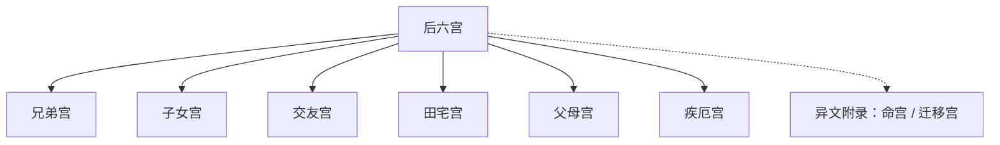

## 本章要义

本章收**后六宫**：兄弟宫、子女宫、交友宫、田宅宫、父母宫、疾厄宫。十二宫的位置表和前六宫（命、迁、官、财、福、夫）详解已见上一章。底本在后六宫之后又重出命宫、迁移宫，条目更碎，还多了悬针纹、印堂口诀等，与前章不是同一条清稿。这里不把那一套再当作正文明细贴一遍，只作「异文附录」，方便对读，避免两章各抄一遍相同命宫。

这是**术数文献，不是医学**。山根青筋、黑气、肾病、车祸、牢狱之类，都是旧说应验话，不能当体检或法律预测。

本章**进阶**：后六宫分论，以及命宫、迁移宫重出异文，要逐条对读，不能只记宫名。

## 底本

旧题麻衣道者《麻衣神相》。本章据 youngzs/xuanxue 仓库 Markdown 合并节选，不是四卷完本。后六宫为正编；文末命宫、迁移宫与前六宫章重出，改作「异文附录」，只记异文，不取代前章详解。已去掉「父母宫[1]」一类百科脚注残留。

## 对读

### 兄弟宫

> 难度：进阶

*图注：红点与引线标左右两眉。对应「兄弟宫——左右两眉毛的位置」。术数文献，不是医学。*

1、眉毛短促的人，脾气不稳定、外观随和、不易与人和睦相处，兄弟姊妹感情不好、纵好也是各自奔忙。

**白话：** 眉短：脾气不稳，外表随和，其实难与人久处；兄弟姊妹感情淡，就算不吵，也是各忙各的。

2、眉毛粗糙、眉稀之人不可交、兄弟无义，易与人相争脾气不佳。眉毛凌乱、兄弟不睦、对工作不满，易有法律诉讼事件发生。

**白话：** 眉粗、眉稀：旧说不可深交，兄弟少义气，容易争，脾气也差。眉乱：兄弟不和，对工作不满，还容易惹上官司。

3、眉毛带旋螺的人，脾气最坏、杀气腾腾，易有法律诉讼事件。

**白话：** 眉中带旋螺：脾气最暴，杀气重，也主争讼。

4、眉毛有间断的人，兄弟姊妹感情会有挫折、易有不和或意外伤亡事故，小心兄弟姊妹间及自己健康方面出问题。

**白话：** 眉有间断：手足之情易挫，不和或意外伤亡都要防，自己的身体也要当心。仍是术数话，不是医学。

5、眉毛有光彩的人，精神活力充足、有服务大众之心，能广受群众的敬重。

**白话：** 眉有光彩：精力足，肯服务众人，容易受敬重。

6、眉毛带棱骨的人，反叛心强、自尊心亦强，眉毛如长得漂亮、兄弟都能发达。

**白话：** 眉带棱骨：反叛心、自尊心都强；若眉形好看，兄弟都能发达。

7、眉毛柔细、长顺、清秀的人，兄弟感情良好、能互相助益，看不得兄弟有苦难、必定鼎力相助，性情温和、争执少。

**白话：** 眉柔细、长顺、清秀：兄弟和睦、能互相帮，见不得手足受苦，性子也温和，争执少。

8、眉上有痣为劫财、忌交友涉及钱财。

**白话：** 眉上有痣，旧说劫财，交友不要掺钱。

9、眉毛每根长一公分朋友多。

**白话：** 俗说：每根眉毛约一公分，朋友多。

10、眉细而密多，爱情热烈浓厚：眉疏而白少，主观、金钱至上、利害冲突时、六亲不认、对先生也不例外。

**白话：** 眉细而密，情爱浓；眉疏而色淡，主观、金钱至上，利害当前六亲不认，对丈夫也不例外。

11、女眉稀薄没多大关系，头头无尾或头浓眉稀、人生中会有一段刻骨铭心的遭遇，33、34左右更须注意。

**白话：** 女子眉稀薄，关系不大；若头重无尾，或头浓尾稀，人生里会有一段刻骨的遭遇，三十三四岁前后更要留意。

12、眉毛或眉尾别长，父母钟爱、孝顺父母、也要求夫婿孝顺娘家。

**白话：** 眉或眉尾生得特别长：父母钟爱，自己孝顺，也要求丈夫孝顺娘家。

13、一字眉：感情丰富、更兼理智、能干、自尊心强、为女强人性格。

**白话：** 一字眉：情理兼备，能干，自尊心强，女强人一路。

### 子女宫

> 难度：进阶

*图注：红点与引线标眼下泪堂、卧蚕。对应「子女宫——泪堂及卧蚕部位，左男右女」。术数文献，不是医学。*

1、若见肌肉干枯低陷或见骨的人，子女不孝，易有争执意，父母与子女无缘，子女健康有问题。

**白话：** 泪堂、卧蚕肉干、低陷或见骨：子女不孝，容易争执，亲子缘薄，孩子身体也差。健康有问题是术数话，不是医学。

2、若见皱纹深痕的人，子女不孝，健康有问题，易收养螟蛉义子。

**白话：** 皱纹深：不孝、健康差，还容易收养义子。健康仍非诊断。

3、若见有黑痣的人，防止患有先天性的疾病，当心对孩子会操心操劳，甚至过分的宠爱。

**白话：** 有黑痣：防先天疾患，对孩子操心过度，甚至溺爱。先天性的疾病不是医学筛查。

4、肌肉丰满，子女必定成器有出息，相当孝顺，并且健康良好。

**白话：** 肌肉丰满：子女成器、孝顺、身体好。

5、若子女宫宽阔，则子女落落大方，子女成群。

**白话：** 部位宽阔：子女落落大方，也主子女多。

### 交友宫

> 难度：进阶

*图注：红点与引线标两腮内侧。点在腮，不在颈侧。对应「交友宫——下巴的左右面颊、两腮的内侧的部分」。术数文献，不是医学。*

1、两腮尖削无肉的人，遇不到知心与忠心的朋友，无法相信他人，疑神疑鬼，晚运不佳。

**白话：** 腮尖削无肉：遇不到知心、忠心的朋友，也不肯信人，疑神疑鬼，晚运差。

2、破陷、伤疤、痣痕的人，易遭下属的攻讦或诬告，宜防水厄。

**白话：** 破陷、伤疤、痣痕：容易被下属攻讦或诬告，旧说还防水厄。

3、腮骨成三角方形的人，精神活力充足，肯苦干，老运极佳的人。

**白话：** 腮骨成三角、方形：精力足，肯苦干，老运好。

4、腮颊肌肉圆丰的人，性格圆满，个性温和，为人忠厚诚实，以善待人。

**白话：** 腮颊圆丰：性格圆、性子温，忠厚诚实，待人善意。

### 田宅宫

> 难度：进阶

*图注：红点与引线标上眼睑。点在睑，不在山根。对应「田宅宫——两眉之间的上眼睑部位」。术数文献，不是医学。*

田宅宫（两眉之间的上眼睑部位）

**白话：** 田宅宫在两眉之间的上眼睑一带。

一、眼睑宽广而美的人1.个性良好温和。2.居住的环境极佳。3.能得长辈照顾提携，获得遗产。

**白话：** 睑宽而美：个性温和，住的环境好，能得长辈提携，也主遗产。

二、上眼睑狭窄而陷的人1.个性较急。2.居住环境较差。3.做房产买卖极易吃亏，不易赚钱。

**白话：** 上睑窄而陷：性急，住处差，做房产买卖容易吃亏、赚不到钱。

三、眼睑有痣或疤的人1.容易变动环境。2.家内易不平安。

**白话：** 睑上有痣或疤：环境多变，家里不安。

四、眼睑表筋显现的人1.要检查内分泌系统。2.否则会影向睡眠不足或失眠。

**白话：** 「影向」当作「影响」。睑上青筋外露：传本叫人去查内分泌，否则影响睡眠。这是把相术话写成医嘱，不可当作诊断。

### 父母宫

> 难度：进阶

*图注：红点与引线标日月角。点在额角，不是发际迁移宫。对应「父母宫——在日月角至辅角的部位，左父右母」。术数文献，不是医学。*

1、日月角低陷或凹凸不平的人，父母亲的缘分淡薄，在其早年时生活环境不佳难受良好照顾。

**白话：** 日月角低陷或凹凸不平：与父母缘薄，早年环境差，难得好好被照顾。

2、日月角偏斜或有伤痕的人，显示父母亲的健康情形及居家情形不好。

**白话：** 日月角偏斜或有伤痕：父母健康、居家都不稳。健康情形是术数话，不是医学。

3、明角气色暗滞的人，父母亲有疾病发生，考试不能过关。

**白话：** 「明角」当作「日月角」。气色暗滞：父母有疾，考试也不利。疾病不是诊断。

4、日月角气色黑暗的人，父母亲的身体有疾病、有重病，很危险。

**白话：** 气色黑暗：父母病重，旧说很危险。仍非医学。

5、日月角黄润光泽的人，表示父母身体健康，且有喜事，考试能顺利过关。

**白话：** 黄润光泽：父母安康，有喜事，考试也顺。

6、日月角丰隆明亮而相对匀配的人，父母亲的健康情形良好，有福气而长寿。

**白话：** 丰隆明亮又左右匀称：父母健康、有福、能寿。长寿不是医学。

7、日月角有痣或瑕疵的人，父母有暗疾或受伤的情形。

**白话：** 有痣或瑕疵：父母有暗疾或受伤。暗疾不是诊断。

### 疾厄宫

> 难度：进阶

*图注：红点与引线标山根（鼻梁上部）。对应「疾厄宫——鼻梁左右位置（又称山根）」。术数文献，不是医学。*

1、山根断裂的人，经常有疾病发生，意外事件大都与生命的安危有关，应远离故乡，出外谋发展。

**白话：** 山根断裂：旧说多病，意外常关系到性命，宜离乡外出谋事。疾病、安危是术数话，不是医学。

2、山根有纹的人，易收他人为养子，或自己被人收养，小心意外灾难，尤其要注意车祸；如为鼻头上的直纹，则为五马分尸之纹，应小心横祸；如为横纹，小心暗疾或挫折，挫折指婚姻及事业挫折。

**白话：** 山根有纹：容易收养或被收养，要防意外，尤其车祸；纹若在鼻头竖直，即所谓「五马分尸纹」，防横祸；若是横纹，防暗疾，以及婚姻、事业上的挫折。车祸、暗疾都不是预测或诊断。

3、印堂出现青筋的人，须预防肾病，防止身体上的日趋衰弱。

**白话：** 印堂青筋：传本附会肾病、身体日衰。不是医学。

4、鼻梁出现青筋的人，防止慢性疾病的出现，如胃肠病、慢性支气管炎、便秘或痔疮等，寒气旺小心险邪入侵。

**白话：** 鼻梁青筋：附会胃肠、慢性支气管炎、便秘、痔疮，寒气重还说防邪侵。这些都不是医学。

5、山根丰满的人，身体强壮，对疾病抵抗力强，夫妇婚姻生活美满，百凤和鸣，财气充足，十足好运。

**白话：** 「百凤和鸣」当作「鸾凤和鸣」。山根丰满：体壮、抗病，夫妇和睦，财气也足。抵抗力仍非医学。

6、山根低陷或有痣及横纹：一生中易车祸，注意40岁41岁有大难；如有痣出现或气色晦滞，休咎与上相同，主身弱多病或贫困。

**白话：** 低陷，或有痣、有横纹：一生易车祸，又点出四十、四十一岁有大难；有痣或气色晦滞，同样主身弱多病或贫困。应验话不可当作预测。

7、山根气色灰暗为生病之前兆，黑气越重，病亦愈重，甚至死亡。

**白话：** 山根灰暗，旧说是病兆，黑气越重病越重，甚至死亡。不是医学。

8、山根上部之痣，多以牢狱之灾应验，在左右侧多半患胃病

**白话：** 山根上部有痣，多拿去应牢狱；左右侧则多说胃病。应验话不可当作法律或医学预测。

### 异文附录：命宫

> 难度：进阶

（双局中间印堂部位）

**白话：** 「双局」当是「双眉」之讹：命宫在两眉中间的印堂。正编以[[xuanxue/mayi-02-qianliugong|前六宫章]]为准，本附录只对校异文。

一、命宫有直纹的人

**白话：** 一、命宫有直纹的人。这一路比前章多点出「悬针纹」的名目。

此种有悬针纹，影响所及势必神经衰弱，个性偏激，易遭失败。疑神疑鬼，易遭失败。

**白话：** 这种直纹又称悬针纹：旧说神经过敏、个性偏激、疑神疑鬼，事情容易失败。神经衰弱不是医学诊断。

二、命宫低陷的人

**白话：** 二、命宫低陷的人。

除自卑外，生活较艰苦孤独。命宫低陷的人，易遭生命危险兼保护力弱。

**白话：** 低陷：除了自卑，生活较清苦孤独；又说防护力弱、有性命之忧。与前章同，仍是术数夸张。

三、命宫狭窄的人

**白话：** 三、命宫狭窄的人。

碌而操心，为人气量不大，缺乏安全感。猜忌多疑，运程起伏，一生过得不太安足。

**白话：** 「碌而操心」显是「忙碌而操心」夺字。狭窄则忙乱操心、气量小、缺乏安全感，猜忌多，运势起伏，日子过不安稳。

四、命宫有皱纹冲破之人

**白话：** 四、命宫有皱纹冲破的人。比前章多了「冲破」二字。

运气不顺，颇劳碌。易与上司或别人引起争端、遭到失败。

**白话：** 皱纹冲破：运气不顺、劳碌，容易和上司或旁人起争端，事情容易失败。

五、命宫气色的看法如何？

**白话：** 五、命宫气色怎么看？条目与前章相同。

1.赤红色，必须防止口舌是非，官非诉讼。

**白话：** 赤红，防口舌官非。

2.青色，必有惊恐之事发生。

**白话：** 青，主惊恐。

3.黑色，必有破财、骨折车祸等事发生。

**白话：** 黑，主破财、骨折、车祸一类横事。骨折车祸是术数应验话，不是医学或交通预测。

六、命宫宽大的人

**白话：** 六、命宫宽大的人。比前章多补了一句器量。

1.是一个成功的人

**白话：** 旧说是能成事的人。

2.智能和器量都相对的增加。

**白话：** 智能和器量都比较大。前章宽大条没有这一句。

七、命宫丰的人

**白话：** 七、命宫丰的人。夺一「满」字。

是一个圆满的命格。容易获得成功与财富。

**白话：** 意思仍是圆满之格，成功与财富来得顺。

附注

**白话：** 附注如下，把宽窄尺寸和印堂口诀补在后面。

命宫：位于两眉之间。

**白话：** 附注再写一遍：命宫在两眉之间。

太宽：二指以上、无主见、理想高不切实际。

**白话：** 太宽约两指以上，无主见、理想不切实际。

太窄：低于一指、考虑太少。

**白话：** 太窄不足一指，考虑太少。

眉头交锁气量狭窄。

**白话：** 眉头交锁，气量窄。以上三条把前章第 8 至 10 条收成尺寸口诀。

隐性悬针纹（此人头脑聪明与人说话之际其脑筋不停的转动）属内劳型、劳心伤神。

**白话：** 多出的是「隐性悬针纹」：说话时脑子不停转，属内劳、劳心伤神。劳心伤神是术数话，不是医学。

印堂宽广双分入鬓、卿相位何疑、交头并印促、背禄奔驰。

**白话：** 相书成句：印堂宽广、双分入鬓，卿相之位不必疑；交头并、印堂促，则背禄奔波。

朝中无交眉之宰相。

**白话：** 又说朝中没有交眉的宰相——与「眉头交锁气量窄」是同一路禁忌。读正编仍以前六宫章为准。

### 异文附录：迁移宫

> 难度：进阶

（前额两侧靠发际的部分，包括边城、驿马，上至山林下至辅角，眉毛上方外侧部）

**白话：** 这一路把迁移宫写得更满：前额两侧近发际，包括边城、驿马，上至山林、下至辅角，眉毛外上方。正编仍用前六宫章那一稿。

一、迁移宫低陷的人

**白话：** 一、迁移宫低陷的人。

1.出外无力，白奔波。

**白话：** 出外无力、白奔波。前章低陷条没有这一句。

2.不适合外务工作，不宜创业管理。

**白话：** 不适合外务，也不宜自己创业管人。与前章相同。

二、迁移宫狭窄不平的人

**白话：** 二、迁移宫狭窄不平的人。

1.财源少，不适合贸易。

**白话：** 财源少，不适合做贸易。

2.安分为妙，免将祖业败光。

**白话：** 安分为妙，免得把祖业败光。

三、气色黑暗的人

**白话：** 三、气色黑暗的人。

1.出外不力。

**白话：** 出外不力。前章没有单独这一句。

2.阴灵侵入。

**白话：** 旧说阴灵侵入。仍是术数话，不是驱邪手册。

四、有恶痣、刀疤之类的人

**白话：** 四、有恶痣、刀疤之类的人。

1.出外小心，会屡遭危险。

**白话：** 出门多险。

2.不适宜经营国贸，出外旅行最好投入保险业。

**白话：** 不宜经营国际贸易。前章作「出外旅行最好买保险」，「投入保险业」当是抄写走样，出行买保障才说得通。

3.屡为工作不稳定而为迁移变动所苦。

**白话：** 容易因工作不稳而被迫搬来搬去。

五、迁移宫丰隆的人

**白话：** 五、迁移宫丰隆的人。

1.出外有良好的契机，可以大发展。

**白话：** 出外有机缘，可大发展。

2.最适宜经营国际贸易事业的人，财源富足。

**白话：** 旧说最宜国际贸易，财源较足。

六、迁移宫有骨耸起的人

**白话：** 六、迁移宫有骨耸起的人。

1.出外掌握权势。

**白话：** 出外能掌权。

2.投入军旅界必能显赫一时。

**白话：** 入军旅也容易显赫一时。

备注：流年——迁移宫有痣、疤及气色不佳，不能出国或不能顺利成行。

**白话：** 备注把有痣、有疤、气色差不能出国，收进「流年」一条。正编仍用前六宫章那一稿；这里只保留部位别名和几处异文。
