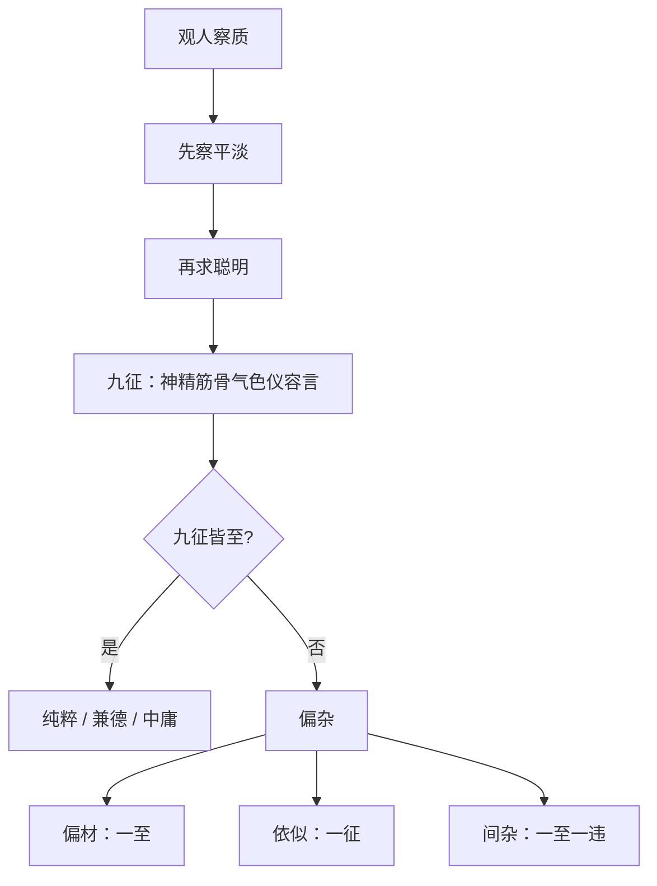

## 本章要义

这篇是整部书的底座。情性本身玄，但人只要有形质，就可以从外征往回推。观人次序很死：**先看平淡，再看聪明**。平淡不是没味道，是五味都能调；一上来就亮、只能走一种节奏的，多半是偏材。

九征是一张表：神、精、筋、骨、气、色、仪、容、言。九条都到，才叫纯粹。分级不要含糊：中庸（兼德而至）→ 德行（具体而微）→ 偏材（一至）→ 依似（一征，像但不是）→ 间杂（一至一违，无恒）。依似最坑，优先防这个。

体别把偏材拆成十二对「能干什么 / 会死在哪」。后半更要紧：这些人进德时不但不拿中庸戒自己的拘或抗，还会用自己的尺度去指别人的短，越修越偏。学和恕救不了——信者把人都当信，诈者把人都当诈。别指望「培养一下就中和了」。

本章**进阶**：九征分论与十二对拘抗，不是部位总诀；宜逐段对读，不要只背分级表。这是鉴人术数文献，不是医学。

## 底本

魏刘邵《人物志》。底本：维基文库十二篇合订，繁转简。弃用 github「观人于微」简体乱排本。本章属进阶，九征与体别宜对照原文逐条看。

## 对读

### 自序

> 难度：进阶

夫圣贤之所美，莫美乎聪明；聪明之所贵，莫贵乎知人。知人诚智，则众材得其序，而庶绩之业兴矣。是以圣人著爻象，则立君子小人之辞。叙诗志，则别风俗雅正之业；制礼乐，则考六艺祗庸之德；躬南面，则援俊逸辅相之材。皆所以达众善而成天功也。天功既成，则并受名誉。

**白话：** 圣贤所赞美的资质，没有比聪明更美的；聪明所看重的，没有比知人更要紧的。真正懂得知人，才算有智，各类人才才能排进合适的位置，各项功业才会兴起来。所以圣人画卦爻，就立下君子、小人的文辞；编次《诗》的情志，就分辨风俗雅正的事业；制定礼乐，就考察六艺里恭敬守恒的德行；自己南面为君，就提拔俊逸来做辅相。这些都是为了让各种善才通达，从而成就天功。天功既成，君臣便一同承受名誉。

是以尧以克明俊德为称，舜以登庸二八为功；汤以拔有莘之贤为名，文王以举渭滨之叟为贵。由此论之，圣人兴德，孰不劳聪明于求人，获安逸于任使者哉？

**白话：** 因此尧因能明扬俊德而受称颂，舜因举用十六相（八元八恺）而立功；汤因提拔有莘氏的贤人（伊尹）而著名，文王因举用渭水边的老人（姜尚）而尊贵。由此说来，圣人兴德，哪有不把聪明用在求人上、而在任使得人之后获得安逸的呢？

是故仲尼不试，无所援升，犹序门人以为四科，泛论众材以辨三等。又叹中庸以殊圣人之德，尚德以劝庶几之论。训六蔽以戒偏材之失。思狂狷以通拘抗之材。疾悾悾而无信，以明为似之难保。又曰察其所安，观其所由，以知居止之行。人物之察也，如此其详。是以敢依圣训，志序人物，庶以补缀遗忘。惟博识君子裁览其义焉。

**白话：** 所以孔子不得任用，没有人援引升进，仍把门人排成德行、言语、政事、文学四科，广泛评论各类人才以分辨三等。又赞叹中庸，用来凸显圣人的德；推崇德行，用来劝勉那些接近圣贤的人。用「六蔽」之训来警戒偏材的过失；思考狂与狷，来疏通过于拘谨或过于激进的人才。厌恶表面诚恳却没有信用的人，以说明「像有德」其实难保。又说：察看他安心于什么，观察他走过的路，从而知道他日常居处的品行。对人物的考察，细到这种地步。因此我敢依照圣训，记下并编排人物，希望能补缀遗忘。只请博识君子裁断、阅览其中的义理。

### 九征

> 难度：进阶

盖人物之本，出乎情性。情性之理，甚微而玄，非圣人之察，其孰能究之哉？凡有血气者，莫不含元一以为质，禀阴阳以立性，体五行而著形，苟有形质，犹可即而求之。

**白话：** 人物的根本，出于情性。情性的道理极为微妙玄奥，不是圣人的明察，谁能穷究呢？凡有血气的生命，无不含着元气作为本质，禀受阴阳以确立性情，体成五行而显现形貌。只要有形质，就可以据此去求。

凡人之质量，中和最贵矣。中和之质，必平淡无味，故能调成五材，变化应节。是故观人察质，必先察其平淡，而后求其聪明。

**白话：** 人的材质，以中和最为贵。中和的资质一定平淡无味，所以能调成五种材德，变化而应合节度。因此观人察质，必须先看他是否平淡，然后再求其聪明。

聪明者，阴阳之精，阴阳清和，则中叡外明。圣人淳耀，能兼二美，知微知章，自非圣人，莫能两遂。故明白之士，达动之机，而暗于玄虑；玄虑之人，识静之原，而困于速捷。犹火日外照，不能内见；金水内映，不能外光。二者之义，盖阴阳之别也。

**白话：** 聪明是阴阳的精华。阴阳清和，就能内里睿智、外表光明。圣人纯粹而光耀，能兼有这两种美，既知隐微又知显著。若非圣人，不能两全。所以明达外露的人，通晓行动的机宜，却暗于深沉的思虑；深思的人，认得静止的本原，却困于迅速敏捷。就像火与日向外照耀，不能向内看见；金与水向内映照，不能向外发光。这两种含义，正是阴阳的分别。

若量其材质，稽诸五物，五物之征，亦各著于厥体矣。其在体也，木骨、金筋、火气、土肌、水血，五物之象也。五物之实，各有所济。

**白话：** 若衡量材质，核之于五行：五行的征象，也各自显现在身体上。在身体上：木应骨、金应筋、火应气、土应肌、水应血，这是五行的表象。五行的实质，各有所成济。

*图注：五格对应「木骨、金筋、火气、土肌、水血，五物之象也」。每格下的弘毅／仁等到下一段才完全展开。术数文献，不是医学。*

是故骨植而柔者，谓之弘毅；弘毅也者，仁之质也。气清而朗者，谓之文理；文理也者，礼之本也。体端而实者，谓之贞固；贞固也者，信之基也。筋劲而精者，谓之勇敢；勇敢也者，义之决也。色平而畅者，谓之通微；通微也者，智之原也。五质恒性，故谓之五常矣。

**白话：** 所以骨正直而柔韧的，叫做弘毅；弘毅是仁的资质。气清而明朗的，叫做文理；文理是礼的根本。体端正而结实的，叫做贞固；贞固是信的基础。筋强劲而精粹的，叫做勇敢；勇敢是义的决断。气色平和而畅达的，叫做通微；通微是智的源头。五种资质有恒定之性，所以叫做五常。

五常之别，列为五德。是故温直而扰毅，木之德也。刚塞而弘毅，金之德也。愿恭而理敬，水之德也。宽栗而柔立，土之德也。简畅而明砭，火之德也。虽体变无穷，犹依乎五质。故其刚、柔、明、畅、贞固之征，著乎形容，见乎声色，发乎情味，各如其象。

**白话：** 五常的分别，列为五德。因此温和正直而又驯顺坚毅，是木之德。刚健充实而又弘大坚毅，是金之德。敦厚恭谨而又条理敬慎，是水之德。宽厚庄栗而又柔和自立，是土之德。简约畅达而又明察针砭，是火之德。虽然体貌变化无穷，仍依着五种资质。所以刚、柔、明、畅、贞固这些征象，显现在形容上，见于声色，发于情味，各自如同其象。

故心质亮直，其仪劲固；心质休决，其仪进猛；心质平理，其仪安闲。

**白话：** 所以心地光明正直的，仪态刚劲稳固；心地美善果决的，仪态进取勇猛；心地平和有条理的，仪态安闲。

夫仪动成容，各有态度：直容之动，矫矫行行；休容之动，业业跄跄；德容之动，颙颙卬卬。

**白话：** 仪态一动就成为容貌，各有态度：正直之容的动作，刚强矫健；美善之容的动作，谨慎有节、步履安详；有德之容的动作，庄严轩昂。

夫容之动作，发乎心气；心气之征，则声变是也。夫气合成声，声应律吕：有和平之声，有清畅之声，有回衍之声。

**白话：** 容貌的动作，发自心气；心气的征象，就是声音的变化。气合成声，声应合律吕：有平和的声音，有清畅的声音，有回旋延衍的声音。

夫声畅于气，则实存貌色；故诚仁，必有温柔之色；诚勇，必有矜奋之色；诚智，必有明达之色。

**白话：** 声音畅达于气，实质就存在于貌色。所以真正仁，必有温柔之色；真正勇，必有矜持奋发之色；真正智，必有明达之色。

夫色见于貌，所谓征神，征神见貌，则情发于目。故仁目之精悫然以端；勇胆之精，晔然以彊。然皆偏至之材，以胜体为质者也。故胜质不精，则其事不遂。是故直而不柔则木，劲而不精则力，固而不端则愚，气而不清则越，畅而不平则荡。

**白话：** 色见于貌，就是所谓征神。征神显现在貌上，情就从眼睛发出。所以仁者目光的精气诚恳而端正；勇者胆气的精气明亮而强盛。然而这些都是偏至之材，以某一种胜过的体性为质。所以胜过的质性若不精纯，事情就不能成功。因此直而不柔就成了呆木，劲而不精就成了蛮力，固而不端就成了愚钝，气盛而不清就流于放纵，畅达而不平就流于放荡。

*图注：两侧圆点标左右目，不遮瞳孔。标签按人物自身左右：照片右侧为左目。对应「征神见貌，则情发于目」。术数文献，不是医学。*

是故中庸之质异于此类。五常既备，包以澹味；五质内充，五精外章，是以目彩五晖之光也。

**白话：** 所以中庸之质与这类不同。五常既已齐备，用平淡之味来包涵；五种资质内里充实，五种精气向外彰显，因此目光有五色光辉。

故曰，物生有形，形有神精。能知精神，则穷理尽性。性之所尽，九质之征也。然则平陂之质在于神，明暗之实在于精，勇怯之势在于筋，彊弱之植在于骨，躁静之决在于气，惨怿之情在于色，衰正之形在于仪，态度之动在于容，缓急之状在于言。

**白话：** 所以说：物生而有形，形有神有精。能知晓精神，就能穷理尽性。性所能穷尽的，就是九种质性的征象。那么：平正或偏颇之质在于神，聪明或愚暗之实在于精，勇或怯之势在于筋，强或弱的支撑在于骨，躁或静的决断在于气，惨戚或喜悦之情在于色，衰颓或端正之形在于仪，态度的动作在于容，缓或急之状在于言。

*图注：九格对应「平陂之质在于神」至「缓急之状在于言」。图末「九征皆至，则纯粹之德」见下一段。术数文献，不是医学。*

其为人也：质素平澹，中叡外朗，筋劲植固，声清色怿，仪正容直，则九征皆至，则纯粹之德也。九征有违，则偏杂之材也。

**白话：** 若为人：资质平淡，内里睿智外表明朗，筋强骨固，声清气色喜悦，仪容端正，那就是九征都到了，是纯粹之德。九征有所违背，就是偏杂之材。

*图注：九个落点把「神、精、筋、骨、气、色、仪、容、言」标在形上，对应「九征皆至，则纯粹之德也」。神落在目。术数文献，不是医学。*

三度不同，其德异称。故偏至之材，以材自名；兼材之人，以德为目；兼德之人，更为美号。

**白话：** 三种程度不同，德的称呼也不同。所以偏至之材，用其所长的材来自称；兼材之人，用德来标目；兼德之人，更有美好的称号。

是故兼德而至，谓之中庸；中庸也者，圣人之目也。具体而微，谓之德行；德行也者，大雅之称也。一至，谓之偏材；偏材，小雅之质也。一征，谓之依似；依似，乱德之类也。一至一违，谓之间杂；间杂，无恒之人也。无恒、依似，皆风人、末流。末流之质，不可胜论，是以略而不概也。

**白话：** 所以兼德而达到极致，叫做中庸；中庸是圣人的名目。各体都有而规模较小，叫做德行；德行是大雅的称呼。只有一种达到，叫做偏材；偏材是小雅的资质。只有一种征象（貌似），叫做依似；依似是乱德之类。一种达到一种违背，叫做间杂；间杂是没有恒性的人。无恒、依似，都是风人末流。末流的资质，不可尽论，所以略过不述。

### 体别

> 难度：进阶

夫中庸之德，其质无名。故咸而不碱，淡而不𨡺，质而不缦，文而不缋；能威能怀，能辨能讷；变化无方，以达为节。是以抗者过之，而拘者不逮。

**白话：** 中庸之德，其质没有固定的名称。所以咸而不至于苦涩，淡而不至于无味，质朴而不至于粗陋无文，有文采而不至于雕缋；能威严也能怀柔，能明辨也能木讷；变化没有定方，以通达为节度。因此过刚过激的人超过了它，过于拘谨的人够不着它。

夫拘抗违中，故善有所章，而理有所失。是故：

**白话：** 拘谨和过激都偏离中道，所以长处有所彰显，而道理有所缺失。因此：

厉直刚毅，材在矫正，失在激讦。

**白话：** 严厉直率刚毅的，才能在于矫正过失，失误在于过激攻讦。

柔顺安恕，每在宽容，失在少决。

**白话：** 柔顺安和宽恕的，长处常在宽容，失误在于缺少决断。

雄悍杰健，任在胆烈，失在多忌。

**白话：** 雄悍豪健的，担当在于胆气刚烈，失误在于忌刻过多。

精良畏慎，善在恭谨，失在多疑。

**白话：** 精良畏慎的，长处在恭谨，失误在多疑。

彊楷坚劲，用在桢干，失在专固。

**白话：** 强楷坚劲的，用处在做骨干，失误在专断固执。

论辨理绎，能在释结，失在流宕。

**白话：** 论辩条理的，能力在解开纠结，失误在流荡不定。

普博周给，弘在覆裕，失在溷浊。

**白话：** 普博周济的，弘大在覆盖宽裕，失误在混杂不择。

清介廉洁，节在俭固，失在拘扃。

**白话：** 清介廉洁的，节操在俭约固守，失误在拘谨闭塞。

休动磊落，业在攀跻，失在疏越。

**白话：** 美善好动磊落的，事业在攀登进取，失误在疏阔越礼。

沉静机密，精在玄微，失在迟缓。

**白话：** 沉静机密的，精到在玄微，失误在迟缓。

朴露径尽，质在中诚，失在不微。

**白话：** 朴实外露、直来直去的，质性在内心诚实，失误在不细微。

多智韬情，权在谲略，失在依违。

**白话：** 多智而藏情的，权变在诡略，失误在依违不定。

及其进德之日，不止揆中庸，以戒其材之拘抗；而指人之所短，以益其失；犹晋楚带剑，递相诡反也。是故：

**白话：** 等到进德之时，不但不拿中庸来衡量、警戒自己材质的过拘或过抗，反而指摘别人的短处，来加重自己的过失；就像晋人楚人都佩剑，却互相指责对方佩剑的方向相反。因此：

彊毅之人，狠刚不和，不戒其彊之搪突，而以顺为挠，厉其抗；是故，可以立法，难与入微。

**白话：** 强毅的人，狠刚不和，不警戒自己过强的冲撞，反而把柔顺看作屈服，更加厉其过抗；因此可以立法，难以入于精微。

柔顺之人，缓心宽断，不戒其事之不摄，而以抗为刿，安其舒；是故，可与循常，难与权疑。

**白话：** 柔顺的人，心思缓慢、决断宽缓，不警戒自己做事抓不住，反而把刚抗看作刺伤，安于自己的舒缓；因此可与循常，难以权衡疑难。

雄悍之人，气奋勇决，不戒其勇之毁跌，而以顺为恇，竭其势；是故，可与涉难，难与居约。

**白话：** 雄悍的人，气奋勇决，不警戒自己勇的毁败跌倒，反而把柔顺看作怯懦，穷竭其势；因此可与共赴危难，难以安于约束。

惧慎之人，畏患多忌，不戒其懦于为义，而以勇为狎，增其疑；是故，可与保全，难与立节。

**白话：** 惧慎的人，畏患多忌，不警戒自己怯于为义，反而把勇看作轻佻，增加疑虑；因此可与保全，难以立节。

凌楷之人，秉意劲特，不戒其情之固护，而以辨为伪，彊其专；是故，可以持正，难与附众。

**白话：** 凌厉楷则的人，执意刚劲独特，不警戒自己性情的固执护短，反而把辩说看作虚伪，加强其专断；因此可以持正，难以附众。

辨博之人，论理赡给，不戒其辞之泛滥，而以楷为系，遂其流；是故，可与泛序，难与立约。

**白话：** 辨博的人，论理充足，不警戒言辞泛滥，反而把楷则看作束缚，放任其流荡；因此可与广泛议论，难以订立约束。

弘普之人，意爱周洽，不戒其交之溷杂，而以介为狷，广其浊；是故，可以抚众，难与厉俗。

**白话：** 弘普的人，意爱周遍和洽，不警戒交游混杂，反而把耿介看作狷狭，扩大其浊；因此可以抚众，难以厉俗。

狷介之人，砭清激浊，不戒其道之隘狭，而以普为秽，益其拘；是故，可与守节，难以变通。

**白话：** 狷介的人，针砭清浊，不警戒其道的隘狭，反而把普博看作污秽，更增其拘；因此可与守节，难以变通。

修动之人，志慕超越，不戒其意之大猥，而以静为滞，果其锐；是故，可以进趋，难与持后。

**白话：** 好动进取的人，志向慕于超越，不警戒意念过于庞杂，反而把静看作滞碍，成其锐进；因此可以进趋，难以持后。

沉静之人，道思回复，不戒其静之迟后，而以动为疏，美其懦；是故，可与深虑，难与捷速。

**白话：** 沉静的人，道思反复，不警戒其静的迟缓落后，反而把动看作疏失，美化其懦；因此可与深虑，难以捷速。

朴露之人，中疑实𥔿，不戒其实之野直，而以谲为诞，露其诚；是故，可与立信，难与消息。

**白话：** 朴露的人，内心凝实如石，不警戒其实的野直，反而把谲看作荒诞，更露其诚；因此可与立信，难以消息权变。

韬谲之人，原度取容，不戒其术之离正，而以尽为愚，贵其虚；是故，可与赞善，难与矫违。

**白话：** 韬谲的人，推度情原来取容，不警戒其术偏离正道，反而把尽诚看作愚蠢，贵其虚；因此可与赞善，难以矫正违失。

夫学所以成材也，疏所以推情也；偏材之性，不可移转矣。虽教之以学，材成而随之以失；虽训之以恕，推情各从其心。信者逆信，诈者逆诈；故学不道，恕不周物；此偏材之益失也。

**白话：** 学是用来成材的，疏导是用来推己之情的；偏材之性，不可移转。虽然教他学习，材成了过失也跟着来；虽然训他恕道，推情仍各从己心。诚信的人把别人也当成诚信，狡诈的人把别人也当成狡诈；所以学不能导入正道，恕不能周遍于物。这就是偏材更加过失之处。
