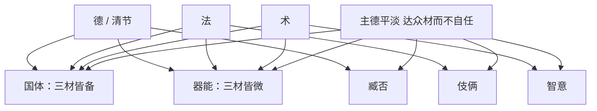

## 本章要义

流业是职业分类，不是道德排名。德、法、术三材是主干：三材全备是国体，微是器能；单支清节 / 法 / 术，再往下流成臧否、伎俩、智意。文章、儒学、口辩、骁雄是另外四条，也是人臣。人君不在十二材里：**主德是平淡，达众材而不自己揽事**。人君跟某一种材同好，那种材就会专政。

材理是「为什么两人谈不拢」。理有四部（道、事、义、情），人有四家之明，再叠九偏之性，就会各把自家心情当成理。观人听其言：七似是装懂的七种样子；六构是辩论里把关系吵崩的六条路。通材才兼八能，而且跟通人同解、跟众人察色顺性。听一个人只会用自己那一套攻别人，就可以判偏。

本章**进阶**：十二流业与材理九偏、七似、六构，是分论不是总诀。这是鉴人术数文献，不是医学。

*图注：五步环对应「三材主干 → 十二流业 → 人君平淡 → 四部四家 → 七似六构」。听言只会用自家尺度攻人即偏。鉴人术数文献，不是医学。*

## 底本

魏刘邵《人物志》。底本：维基文库十二篇合订，繁转简。弃用 github「观人于微」简体乱排本。本章属进阶，流业十二材与材理条目宜逐条对读。

## 对读

### 流业

> 难度：进阶

盖人流之业，十有二焉：有清节家，有法家，有术家，有国体，有器能，有臧否，有伎俩，有智意，有文章，有儒学，有口辨，有雄杰。

**白话：** 人大体分成十二种流业：清节家、法家、术家、国体、器能、臧否、伎俩、智意、文章、儒学、口辨、雄杰。

*图注：十二格对应「盖人流之业，十有二焉」。左列清节、术家、器能、伎俩、文章、口辩，右列法家、国体、臧否、智意、儒学、雄杰。术数文献，不是医学。*

若夫德行高妙，容止可法，是谓清节之家，延陵、晏婴是也。

**白话：** 德行高妙，容止可以给人做法则的，叫做清节之家，延陵季子、晏婴就是。

建法立制，彊国富人，是谓法家，管仲、商鞅是也。

**白话：** 建立法度制度，使国家强、人民富的，叫做法家，管仲、商鞅就是。

思通道化，策谋奇妙，是谓术家，范蠡、张良是也。

**白话：** 思虑通达道化，策谋奇妙的，叫做术家，范蠡、张良就是。

兼有三材，三材皆备，其德足以厉风俗，其法足以正天下，其术足以谋庙胜，是谓国体，伊尹、吕望是也。

**白话：** 兼有德、法、术三材，而且三材都完备：其德足以激励风俗，其法足以匡正天下，其术足以谋划朝廷的胜算，叫做国体，伊尹、吕望就是。

兼有三材，三材皆微，其德足以率一国，其法足以正乡邑，其术足以权事宜，是谓器能，子产、西门豹是也。

**白话：** 兼有三材，而三材都规模较小：其德足以统率一国，其法足以匡正乡邑，其术足以权衡事宜，叫做器能，子产、西门豹就是。

兼有三材之别，各有一流。

**白话：** 兼有三材的分别，又各成一流。

清节之流，不能弘恕，好尚讥诃，分别是非，是谓臧否，子夏之徒是也。

**白话：** 清节的支流，不能弘大宽恕，喜欢讥评诃责、分别是非，叫做臧否，子夏之徒就是。

法家之流，不能创思图远，而能受一官之任，错意施巧，是谓伎俩，张敞、赵广汉是也。

**白话：** 法家的支流，不能创思图远，但能接受一官之任、用心施行巧计，叫做伎俩，张敞、赵广汉就是。

术家之流，不能创制垂则，而能遭变用权，权智有余，公正不足，是谓智意，陈平、韩安国是也。

**白话：** 术家的支流，不能创制垂范，但能遇到变化使用权谋，权智有余、公正不足，叫做智意，陈平、韩安国就是。

凡此八业，皆以三材为本。故虽波流分别，皆为轻事之材也。

**白话：** 以上八业，都以三材为本。所以虽然分流分别，都是办理事务的人才。

能属文著述，是谓文章，司马迁、班固是也。

**白话：** 能写文章著述的，叫做文章，司马迁、班固就是。

能传圣人之业，而不能干事施政，是谓儒学，毛公、贯公是也。

**白话：** 能传授圣人之业，却不能办事施政的，叫做儒学，毛公、贯公就是。

辩不入道，而应对资给，是谓口辩，乐毅、曹丘生是也。

**白话：** 辩才不入正道，但应对充足的，叫做口辩，乐毅、曹丘生就是。

胆力绝众，才略过人，是谓骁雄，白起、韩信是也。

**白话：** 胆力超出众人，才略超过常人的，叫做骁雄，白起、韩信就是。

凡此十二材，皆人臣之任也。

**白话：** 这十二种材，都是人臣的职任。

主德不预焉？主德者，聪明平淡，达众材而不以事自任者也。

**白话：** 人君之德不在这十二材之内吗？人君之德，是聪明平淡，通达众材而不自己揽事的人。

是故，主道立，则十二材各得其任也：

**白话：** 所以主道立起来，十二材就能各得其任：

清节之德，师氏之任也。

**白话：** 清节之德，是师氏之任。

法家之材，司寇之任也。

**白话：** 法家之材，是司寇之任。

术家之材，三孤之任也。

**白话：** 术家之材，是三孤之任。

三材纯备，三公之任也。

**白话：** 三材纯备，是三公之任。

三材而微，冢宰之任也。

**白话：** 三材而规模较小，是冢宰之任。

臧否之材，师氏之佐也。

**白话：** 臧否之材，是师氏的辅佐。

智意之材，冢宰之佐也。

**白话：** 智意之材，是冢宰的辅佐。

伎俩之材，司空之任也。

**白话：** 伎俩之材，是司空之任。

儒学之材，安民之任也。

**白话：** 儒学之材，是安民之任。

文章之材，国史之任也。

**白话：** 文章之材，是国史之任。

辩给之材，行人之任也。

**白话：** 辩给之材，是行人之任。

骁雄之材，将帅之任也。

**白话：** 骁雄之材，是将帅之任。

是谓主道得而臣道序，官不易方，而太平用成。若道不平淡，与一材同好，则一材处权，而众材失任矣。

**白话：** 这叫做主道得而臣道有序，官不改换职分，太平就因此而成。如果为道不平淡，与某一种材同好，就会一种材掌权，而众材失去任用。

### 材理

> 难度：进阶

夫建事立义，莫不须理而定；及其论难，鲜能定之。夫何故哉？盖理多品而人异也。夫理多品则难通，人材异则情诡；情诡难通，则理失而事违也。

**白话：** 建立事业、树立义理，没有不须要「理」来确定的；等到辩论问难，却很少能论定。为什么？因为理有多种，而人又各不相同。理多则难以相通，人材不同则情意诡变；情意诡变而难以相通，就会失理而事情违背。

夫理有四部，明有四家，情有九偏，流有七似，说有三失，难有六构，通有八能。

**白话：** 理有四部，明有四家，情有九偏，流有七似，说有三失，难有六构，通有八能。

*图注：四格对应「理有四部，明有四家」：道理、事理、义理、情理。下一句才把四理写开。术数文献，不是医学。*

若夫天地气化，盈气损益，道之理也。法制正事，事之理也。礼教宜适，义之理也。人情枢机，情之理也。

**白话：** 天地气化、盈虚损益，是道之理。法制正事，是事之理。礼教是否合宜，是义之理。人情的枢机，是情之理。

四理不同，其于才也，须明而章，明待质而行。是故，质于理合，合而有明，明足见理，理足成家。是故，质性平淡，思心玄微，能通自然，道理之家也；质性警彻，权略机捷，能理烦速，事理之家也；质性和平，能论礼教，辩其得失，义礼之家也；质性机解，推情原意，能适其变，情理之家也。

**白话：** 四理不同，落实到才上，必须明才能彰显；明又要靠质性才能运行。所以质性与理相合，合了才有明，明足才能见理，理足才能成家。因此：质性平淡，思心玄微，能通自然，是道理之家；质性警彻，权略机捷，能治理繁杂急速之事，是事理之家；质性和平，能讨论礼教、辩其得失，是义礼之家；质性机敏善解，能推情原意、适应变化，是情理之家。

四家之明既异，而有九偏之情；以性犯明，各有得失：

**白话：** 四家之明已经不同，又有九种偏情；用性来侵犯明，各有得失：

刚略之人，不能理微；故其论大体则弘博而高远，历纤理则宕往而疏越。

**白话：** 刚略的人，不能治理细微；所以论大体则弘博高远，经历纤细之理则放荡疏漏。

抗厉之人，不能回挠；论法直则括处而公正，说变通则否戾而不入。

**白话：** 抗厉的人，不能回转屈曲；论法度正直则约束而公正，说变通则乖戾而不能入。

坚劲之人，好攻其事实；指机理则颖灼而彻尽，涉大道则径露而单持。

**白话：** 坚劲的人，喜欢攻其事实；指点机理则敏锐透彻，涉及大道则径直浅露、所持单薄。

辩给之人，辞烦而意锐；推人事则精识而穷理，即大义则恢愕而不周。

**白话：** 辩给的人，言辞繁而意气锐；推人事则精识穷理，到大义则空阔而不周全。

浮沉之人，不能沉思，序疏数则豁达而傲博，立事要则爁炎而不定。

**白话：** 浮沉的人，不能沉思；排列疏密则豁达广博，确立事之要领则如火焰闪烁而不定。

浅解之人，不能深难；听辩说则拟锷而愉悦，审精理则掉转而无根。

**白话：** 浅解的人，不能深入问难；听辩说则像刀刃相拟而喜悦，审精理则掉转而无根。

宽恕之人，不能速捷；论仁义则弘详而长雅，趋时务则迟缓而不及。

**白话：** 宽恕的人，不能迅速敏捷；论仁义则弘详长雅，趋时务则迟缓不及。

温柔之人，力不休彊；味道则顺适而和畅，拟疑难则濡懦而不尽。

**白话：** 温柔的人，力量不够盛强；体味道则顺适和畅，拟议疑难则濡弱而不能尽。

好奇之人，横逸而求异；造权谲则倜傥而瑰壮，案清道则诡常而恢迂。

**白话：** 好奇的人，横逸而求异；造权谲则倜傥瑰壮，按清净正道则诡异迁阔。

所谓性有九偏，各从其心之所可以为理。

**白话：** 这就是所谓性有九偏，各从自己心里以为可以的当作理。

若乃性不精畅，则流有七似：

**白话：** 至于性不精纯畅达，就会流为七种「似是而非」：

有漫谈陈说，似有流行者。

**白话：** 有人漫谈陈说，好像很流行。

有理少多端，似若博意者。

**白话：** 有人理少而头绪多，好像意旨广博。

有回说合意，似若赞解者。

**白话：** 有人回环其说去合对方之意，好像赞赏而理解。

有处后持长，从众所安，似能听断者。

**白话：** 有人处在后面、持其长处，顺从众人所安，好像能听而能断。

有避难不应，似若有余，而实不知者。

**白话：** 有人避开疑难不应答，好像能力有余，其实不知道。

有慕通口解，似悦而不怿者。

**白话：** 有人羡慕通达、口头解释，好像喜悦其实并不真懂。

有因胜情失，穷而称妙，跌则掎跖，实求两解，似理不可屈者。

**白话：** 有人因求胜而失了情实，穷了就称妙，跌倒了就抓住对方不放，其实两边求个解脱，好像道理不可屈服。

凡此七似，众人之所惑也。

**白话：** 这七似，是众人所迷惑的。

夫辩，有理胜，有辞胜。理胜者，正白黑以广论，释微妙而通之。辞胜者，破正理以求异，求异则正失矣。夫九偏之材，有同、有反、有杂。同则相解，反则相非，杂则相恢。故善接论者，度所长而论之；历之不动则不说也，傍无听达则不难也。不善接论者，说之以杂、反；说之以杂、反，则不入矣。善喻者，以一言明数事；不善喻者，百言不明一意；百言不明一意，则不听也。是说之三失也。

**白话：** 辩论，有以理胜的，有以辞胜的。理胜的人，辨明黑白来推广议论，解释微妙而使之通达。辞胜的人，破坏正理来求新异，求异则正理就失了。九偏之材，有相同的、有相反的、有杂乱的。同则互相理解，反则互相非难，杂则互相迁就扩大。所以善于接论的人，度量对方所长再跟他论；历试而不动就不再说，旁边没有通达的听者就不再问难。不善于接论的人，拿杂的、反的去说对方；拿杂的、反的去说，就入不去。善于比喻的人，一句话能说明几件事；不善于比喻的人，百句话说明不了一个意思；百句话说明不了一个意思，人就不听。这是「说」的三种过失。

善难者，务释事本；不善难者，舍本而理末。舍本而理末，则辞构矣。

**白话：** 善于问难的人，务必解释事情的根本；不善于问难的人，舍本而治理末节。舍本理末，就会构成言辞上的纠缠（辞构）。

善攻彊者，下其盛锐，扶其本指以渐攻之；不善攻彊者，引其误辞以挫其锐意。挫其锐意，则气构矣。

**白话：** 善于攻强的人，先压下对方盛锐的气势，扶住其本来的指向再渐渐进攻；不善于攻强的人，抓住对方误辞来挫其锐意。挫其锐意，就会构成意气之争（气构）。

善蹑失者，指其所跌；不善蹑失者，因屈而抵其性。因屈而抵其性，则怨构矣。

**白话：** 善于追踪过失的人，指出对方跌在何处；不善于追踪过失的人，趁对方屈服去抵触其性情。因屈而抵其性，就会构成怨恨（怨构）。

或常所思求，久乃得之，仓卒谕人；人不速知，则以为难谕。以为难谕，则忿构矣。

**白话：** 有人自己平常思索很久才得到的，仓促拿去告诉别人；别人不能立刻知道，就以为对方难以晓谕。以为难谕，就会构成忿怒（忿构）。

夫盛难之时，其误难迫；故善难者，征之使还。不善难者，凌而激之，虽欲顾藉，其势无由。其势无由，则妄构矣。

**白话：** 盛难的时候，对方的错误难以急迫去揭；所以善于问难的人，征验而使对方自己转回来。不善于问难的人，凌逼而激怒对方，对方即使想顾惜体面，也没有余地。没有余地，就会构成妄言（妄构）。

凡人心有所思，则耳且不能听，是故并思俱说，竞相制止，欲人之听己。人亦以其方思之故，不了己意，则以为不解。人情莫不讳不解，讳不解则怒构矣。

**白话：** 凡人心有所思，耳朵就听不进去。所以一边想一边说，争着制止对方、要人听自己。对方也因为正在想，不明白自己的意思，就以为对方不解。人情没有不忌讳「不解」的，忌讳不解就会构成怒气（怒构）。

凡此六构，变之所由兴矣。然虽有变构，犹有所得；若说而不难，各陈所见，则莫知所由矣。

**白话：** 这六构，是变乱兴起的缘由。然而虽然有变构，仍有所得；如果只说而不问难，各陈所见，就不知道从哪里来的。

由此论之，谈而定理者眇矣。必也：聪能听序，思能造端，明能见机，辞能辩意，捷能摄失，守能待攻，攻能夺守，夺能易予。兼此八者，然后乃能通于天下之理，通于天下之理，则能通人矣。不能兼有八美，适有一能，则所达者偏，而所有异目矣。是故：

**白话：** 由此说来，靠交谈就能论定道理的人极少。必须：聪能听出秩序，思能开创新端，明能看见时机，辞能辩明意旨，捷能抓住过失，守能等待进攻，攻能夺取守势，夺能改换给予。兼有这八者，然后才能通天下之理；通天下之理，才能通人。不能兼有八美，只适有一能，则所通达的是偏的，因而各有不同的名目。因此：

聪能听序，谓之名物之材。

**白话：** 聪能听序，叫做名物之材。

思能造端，谓之构架之材。

**白话：** 思能造端，叫做构架之材。

明能见机，谓之达识之材。

**白话：** 明能见机，叫做达识之材。

辞能辩意，谓之赡给之材。

**白话：** 辞能辩意，叫做赡给之材。

捷能摄失，谓之权捷之材。

**白话：** 捷能摄失，叫做权捷之材。

守能待攻，谓之持论之材。

**白话：** 守能待攻，叫做持论之材。

攻能夺守，谓之推彻之材。

**白话：** 攻能夺守，叫做推彻之材。

夺能易予，谓之贸说之材。

**白话：** 夺能易予，叫做贸说之材。

通材之人，既兼此八材，行之以道，与通人言，则同解而心喻；与众人之言，则察色而顺性。虽明包众理，不以尚人；聪叡资给，不以先人。善言出己，理足则止；鄙误在人，过而不迫。写人之所怀，扶人之所能。不以事类犯人之所婟，不以言例及己之所长。说直说变，无所畏恶。采虫声之善音，赞愚人之偶得。夺与有宜，去就不留。方其盛气，折谢不吝；方其胜难，胜而不矜；心平志谕，无士无莫，期于得道而已矣，是可与论经世而理物也。

**白话：** 通材之人，既兼这八材，又按道来实行：与通人说话，则同样理解而心里明白；与众人说话，则察看气色而顺着其性。虽然明智能包众理，不以之凌人；聪睿资给，不以之抢先。善言从自己出口，理足就停；鄙陋错误在别人那里，有过也不急迫。写出别人所怀的，扶助别人所能的。不拿事类去触犯别人所忌讳护短的，不拿言例来带出自己的长处。说正直的、说权变的，没有畏惧也没有厌恶。采集虫鸣里的善音，称赞愚人偶然所得。夺取与给予都有分寸，去就不滞留。正当对方盛气时，折服道歉不吝惜；正当自己胜了问难，胜了也不骄矜。心平、志向晓谕，无可无不可（底本作「无士无莫」），只期望得道而已。这样的人，才可以跟他讨论经世而治理事物。
