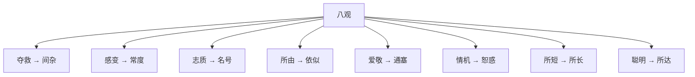

## 本章要义

《八观》是刘邵把观人收成八条可复查的手续，不靠骨相口诀。用法是：先看一种品质被什么夺走、被什么救回来，再看遇事时辞色是否跟得上话，最后才给名号。和 [[xuanxue/renwuzhi-03-caineng|材能]] 衔接：前章论「能各有宜」，本章论「怎么验这人是不是那种能」。和 [[xuanxue/renwuzhi-05-qimiu|七缪]] 对看：八观看什么，七缪讲看走眼的七种理由。和 [[xuanxue/bingjian|冰鉴]] 不同，这里几乎不谈形骨，谈的是情、辞、依、机。

开篇第三观作「志质」，后文设问作「至质」，底本两存。读时按「所至之质」理解即可：偏材身上叠了几种极至之性，名号从这里长出来。

八条里最容易用错的是「观其所短」。短是长的征，不是长本身；有短未必有长，有长则必带那一短。另一条是「依似」：讦看起来都像直，宕看起来都像通，要问他为什么讦、为什么宕。

## 底本

魏刘邵《人物志》。底本：维基文库十二篇合订，繁转简。弃用 github「观人于微」简体乱排本。本文件收《八观》一篇。

## 对读

### 八观

> 难度：艰深

八观者：

**白话：** 所谓八观，是八条看人的办法：

- 一曰观其夺救，以明间杂。
- 二曰观其感变，以审常度。
- 三曰观其志质，以知其名。
- 四曰观其所由，以辨依似。
- 五曰观其爱敬，以知通塞。
- 六曰观其情机，以辨恕惑。
- 七曰观其所短，以知所长。
- 八曰观其聪明，以知所达。

**白话：**

- 第一，看他哪种情欲夺走了正性、哪种善情救回了恶性，用来辨明间杂。
- 第二，看他感触变化时的辞色反应，用来审定平常的度量。
- 第三，看他志向与极至之质，用来知道他会得到怎样的名号。
- 第四，看他行事所由的路子，用来分辨依似——那种靠上来的假象。
- 第五，看他的爱与敬是否真诚，用来知道道路是通还是塞。
- 第六，看他的情欲机关，用来分辨能恕还是易惑。
- 第七，看他的短处，用来知道他的长处。
- 第八，看他的聪明，用来知道他能通达多远。

*图注：八格黄字对应开篇「一曰观其夺救，以明间杂」至「八曰观其聪明，以知所达」；不是骨相部位图。术数文献，不是医学。*

何谓观其夺救，以明间杂？

**白话：** 什么叫观其夺救，以明间杂？

夫质有至有违，若至胜违，则恶情夺正，若然而不然。故仁出于慈，有慈而不仁者；仁必有恤，有仁而不恤者；厉必有刚，有厉而不刚者。

**白话：** 人的质性有极至的一面，也有相违的一面。即便极至压过相违，恶的情欲仍可能夺走正性：看起来像有那种德，其实不是。所以仁从慈来，却有慈而不仁的人；仁一定该有体恤，却有仁而不恤的人；严厉本该带着刚，却有厉而不刚的人。

- 若夫见可怜则流涕，将分与则吝啬，是慈而不仁者。
- 睹危急则恻隐，将赴救则畏患，是仁而不恤者。
- 处虚义则色厉，顾利欲则内荏，是厉而不刚者。
- 然而慈而不仁者，则吝夺之也。
- 仁而不恤者，则惧夺之也。
- 厉而不刚者，则欲夺之也。

**白话：**

- 看见可怜的人就流泪，真要拿出东西来分，却吝啬，这是慈而不仁。
- 看见危急就恻隐，真要赶去救援，却怕惹祸，这是仁而不恤。
- 空谈义理时脸色刚厉，一碰到利欲就内里发软，这是厉而不刚。
- 慈而不仁，是吝啬夺走了它。
- 仁而不恤，是恐惧夺走了它。
- 厉而不刚，是嗜欲夺走了它。

故曰：慈不能胜吝，无必其能仁也；仁不能胜惧，无必其能恤也；厉不能胜欲，无必其能刚也。是故，不仁之质胜，则伎力为害器；贪悖之性胜，则彊猛为祸梯。亦有善情救恶，不至为害；爱惠分笃，虽傲狎不离；助善者明，虽疾恶无害也；救济过厚，虽取人不贪也。是故，观其夺救，而明间杂之情，可得知也。

**白话：** 所以说：慈胜不过吝，就不能断定他真能仁；仁胜不过惧，就不能断定他真能恤；厉胜不过欲，就不能断定他真能刚。因此，不仁的质性占了上风，伎俩和气力就变成害人的器具；贪悖的性子占了上风，强猛就变成闯祸的梯子。也有反过来的：善情把恶救住，就不至于成害；爱惠分得很厚，即便傲慢亲昵，也不离散；助善的心思明白，即便疾恶如仇，也不伤人；救济过了头，即便取于人，也不算贪。所以，看他被什么夺走、被什么救回来，间杂之情就可以知道。

何谓观其感变，以审常度？

**白话：** 什么叫观其感变，以审常度？

夫人厚貌深情，将欲求之，必观其辞旨，察其应赞。夫观其辞旨，犹听音之善丑；察其应赞，犹视智之能否也。故观辞察应，足以互相别识。然则：论显扬正，白也；不善言应，玄也；经纬玄白，通也；移易无正，杂也；先识未然，圣也；追思玄事，叡也；见事过人，明也；以明为晦，智也；微忽必识，妙也；美妙不昧，疏也；测之益深，实也；假合炫耀，虚也；自见其美，不足也；不伐其能，有余也。

**白话：** 人往往貌厚情深。要探求他，必须看他话里的旨意，察他应答唱和的样子。看辞旨，好比听声音的美丑；察应赞，好比看智力够不够用。所以观辞、察应，足以互相参照、彼此识别。由此可以这样分：议论显豁、称扬正当，是「白」；不善于言辞应答，是「玄」；能把玄与白经纬起来，是「通」；移来换去没有准绳，是「杂」；事情还没发生就先看见，是「圣」；能追思玄远之事，是「叡」；临事见识超过常人，是「明」；把明亮藏成晦暗，是「智」；极细极忽的东西也能识破，是「妙」；美好精微并不昏昧，是「疏」；越测越深，是「实」；拼凑起来炫耀，是「虚」；只看见自己的美，是「不足」；不夸自己的能，是「有余」。

故曰：凡事不度，必有其故：忧患之色，乏而且荒；疾疢之色，乱而垢杂；喜色，愉然以怿；愠色，厉然以扬；妒惑之色，冒昧无常；及其动作，盖并言辞。是故，其言甚怿，而精色不从者，中有违也；其言有违，而精色可信者，辞不敏也；言未发而怒色先见者，意愤溢也；言将发而怒气送之者，彊所不然也。

**白话：** 所以说：凡事不合常度，一定有缘故。忧患之色，枯乏而且荒乱；疾病之色，杂乱而且垢污；喜色，愉然而悦；怒色，厉然而扬；妒惑之色，冒昧而且无常。到他动作的时候，这些往往连着言辞一起出来。因此：话说得很欢喜，精气神色却跟不上的，是心里有违背；话有破绽，神色却可信的，是辞令不敏给；话还没出口，怒色先出来的，是愤意满溢；话将要出口，怒气一路送出来的，是硬把心里不以为然的事撑过去。

凡此之类，征见于外，不可奄违，虽欲违之，精色不从，感愕以明，虽变可知。是故，观其感变，而常度之情可知。

**白话：** 凡此之类，征兆都见于外，没法完全掩盖。就算想掩盖，神色也不肯服从。感触一惊，就会显明；即便他在变，也能看出来。所以，看他感变时的样子，平常度量之情就可以知道。

何谓观其至质，以知其名？

**白话：** 什么叫观其至质，以知其名？

凡偏材之性，二至以上，则至质相发，而令名生矣。是故，骨直气清，则休名生焉；气清力劲，则烈名生焉；劲智精理，则能名生焉；智直彊悫，则任名生焉。集于端质，则令德济焉；加之学，则文理灼焉。是故，观其所至之多少，而异名之所生可知也。

**白话：** 凡是偏材之性，若有两种以上的极至，极至之质就会互相引发，美名由此生出。因此：骨直而气清，就生出美好的「休」名；气清而力劲，就生出刚烈的「烈」名；劲智而精于理，就生出「能」名；智直而强毅诚恳，就生出可托付的「任」名。这些都集中在端正之质上，令德就能成就；再加上学，文理就会灼然可见。所以，看他所至之质有多少，各种不同名号从哪里来，就可以知道。

何谓观其所由，以辨依似？

**白话：** 什么叫观其所由，以辨依似？

夫纯讦性违，不能公正；依讦似直，以讦讦善；纯宕似流，不能通道；依宕似通，行傲过节。

**白话：** 纯粹的攻讦，质性已偏，不能公正；依附着攻讦、看起来像直的那种人，会拿攻讦去攻击善人。纯粹的放荡，看起来像流动，却走不上正道；依附着放荡、看起来像通达的那种人，行为傲慢，越过节度。

故曰：直者亦讦，讦者亦讦，其讦则同，其所以为讦则异。通者亦宕，宕者亦宕，其所以为宕则异。

**白话：** 所以说：直的人也讦，讦的人也讦，讦的样子相同，所以要讦的缘故不同。通的人也显得放荡，真正放荡的人也放荡，所以放荡的缘故不同。

然则，何以别之？

**白话：** 那么怎么分别？

- 直而能温者，德也；
- 直而好讦者，偏也；
- 讦而不直者，依也；
- 道而能节者，通也；
- 通而时过者，偏也；
- 宕而不节者，依也；

**白话：**

- 直而能温，是德；
- 直而喜欢攻讦，是偏；
- 只会攻讦并不直，是依；
- 行道而能有节，是通；
- 通达却时时越过，是偏；
- 放荡而不知节，是依。

偏之与依，志同质违，所谓似是而非也。

**白话：** 偏与依，志向看上去相同，质性却相反，这就是所谓似是而非。

是故，轻诺似烈而寡信，多易似能而无效，进锐似精而去速，诃者似察而事烦，讦施似惠而无成，面从似忠而退违，此似是而非者也。

**白话：** 因此：轻易许诺，看起来刚烈，其实少信；把事情看得太容易，看起来有才能，其实没有成效；进得锐，看起来精进，去得也快；专会诃责，看起来明察，事情却更烦；嘴上说施与，看起来像惠，其实办不成；当面顺从，看起来忠，退下去就违背。这些都是似是而非。

亦有似非而是者：大权似奸而有功，大智似愚而内明，博爱似虚而实厚，正言似讦而情忠。夫察似明非，御情之反，有似理讼，其实难别也。非天下之至精，其孰能得其实？故听言信貌，或失其真；诡情御反，或失其贤；贤否之察，实在所依。是故，观其所依，而似类之质，可知也。

**白话：** 也有似非而是的：执大权，看起来像奸，其实有功；大智，看起来像愚，内里却明；博爱，看起来像虚，其实厚；正言，看起来像攻讦，情却是忠。察相似、辨真伪，驾驭情的反面，有点像审理讼案，其实很难分别。不是天下最精微的人，谁能得到实情？所以只听言语、只信外貌，有时会失真；专门用诡情、专走反面去驾驭，有时会把贤人看丢。贤与不肖的观察，关键在他所依的是什么。所以，看他所依，似是一类的质性就可以知道。

何谓观其爱敬，以知通塞？

**白话：** 什么叫观其爱敬，以知通塞？

盖人道之极，莫过爱敬。是故，《孝经》以爱为至德，以敬为要道；《易》以感为德，以谦为道；《老子》以无为德，以虚为道；《礼》以敬为本；《乐》以爱为主。然则，人情之质，有爱敬之诚，则与道德同体；动获人心，而道无不通也。然爱不可少于敬，少于敬，则廉节者归之，而众人不与。爱多于敬，则虽廉节者不悦，而爱接者死之。何则？敬之为道也，严而相离，其势难久；爱之为道也，情亲意厚，深而感物。是故，观其爱敬之诚，而通塞之理，可得而知也。

**白话：** 人道的极致，不过爱与敬。《孝经》把爱当作至德，把敬当作要道；《易》以感为德，以谦为道；《老子》以无为德，以虚为道；《礼》以敬为本；《乐》以爱为主。那么，人情之质若真有爱敬之诚，就与道德同体；一动就能得人心，道路没有不通的。然而爱不能少于敬：爱少于敬，廉节的人会归附，众人却不跟从。爱多于敬，廉节的人会不高兴，但被爱接到的人肯为他去死。为什么？敬作为一种道，严而彼此隔开，势头难以长久；爱作为一种道，情亲意厚，深了就能感动人。所以，看他爱敬是否真诚，通与塞的道理就可以知道。

何谓观其情机，以辨恕惑？

**白话：** 什么叫观其情机，以辨恕惑？

夫人之情有六机：杼其所欲则喜，不杼其所欲则恶，以自代历则恶，以谦损下之则悦，犯其所乏则婟，以恶犯婟则妒；此人性之六机也。

**白话：** 人的情有六个机关：愿望被抒发出来就喜，愿望抒发不出就恶；别人拿自己压过他、历数自己的好处，他就恶；别人谦损、甘居其下，他就悦；触犯他所缺的那一块，他就婟恨；再拿他所厌恶的去碰这婟恨，他就妒。这是人性的六机。

夫人情莫不欲遂其志，故：烈士乐奋力之功，善士乐督政之训，能士乐治乱之事，术士乐计策之谋，辨士乐陵讯之辞，贪者乐货财之积，幸者乐权势之尤。

**白话：** 人情没有不想遂自己志向的。所以：烈士乐于奋力立功，善士乐于督政教化，能士乐于治理乱事，术士乐于计策谋划，辨士乐于凌厉讯问的辞锋，贪者乐于货财堆积，幸进者乐于权势特别突出。

苟赞其志，则莫不欣然，是所谓杼其所欲则喜也。

**白话：** 只要称赞他的志向，没有不欣然的。这就是所谓抒其所欲则喜。

若不杼其所能，则不获其志，不获其志则戚。是故：功力不建则烈士奋，德行不训则正人哀哀，政乱不治则能者叹叹，敌能未弭则术人思思，货财不积则贪者忧忧，权势不尤则幸者悲，是所谓不杼其能则怨也。

**白话：** 若不让他的所能抒发出来，他就达不到志向；达不到志向，就忧戚。因此：功力建不起来，烈士就愤激；德行得不到训导，正人就哀哀不已；政乱治理不好，能者就连声叹息；敌方的能力还没消掉，术人就思虑不歇；货财积不起来，贪者就忧忧不乐；权势不够特别，幸进者就悲伤。这就是所谓不抒其能则怨。

人情莫不欲处前，故恶人之自伐。自伐，皆欲胜之类也。是故，自伐其善则莫不恶也，是所谓自伐历之则恶也。

**白话：** 人情没有不想处在人前的，所以厌恶别人自夸。自夸，都属于想胜过别人的一类。因此，自夸自己的好处，没有人不厌恶。这就是所谓自伐压过别人则恶。

人情皆欲求胜，故悦人之谦；谦所以下之，下有推与之意。是故，人无贤愚，接之以谦，则无不色怿；是所谓以谦下之则悦也。人情皆欲掩其所短，见其所长。是故，人駮其所短，似若物冒之，是所谓駮其所伐则婟也。

**白话：** 人情都想求胜，所以喜欢别人谦；谦是把自己放低，放低就有推让给对方的意思。因此，不论贤愚，用谦来接待，没有不面色和悦的。这就是所谓以谦下之则悦。人情都想掩盖自己的短，显出自己的长。因此，别人驳他的短处，就像被东西当头罩住。这就是所谓驳他所自夸的那一面则婟。

人情陵上者也，陵犯其所恶，虽见憎未害也；若以长駮短，是所谓以恶犯婟，则妒恶生矣。

**白话：** 人情本就陵上。只是冲撞他所厌恶的东西，虽然被憎，还不一定成害；若拿自己的长去驳他的短，就是所谓以恶去犯他的婟，妒恶就生出来了。

凡此六机，其归皆欲处上。是以君子接物，犯而不校，不校则无不敬下，所以避其害也。小人则不然，既不见机，而欲人之顺己。以佯爱敬为见异，以偶邀会为轻；苟犯其机，则深以为怨。是故，观其情机，而贤鄙之志，可得而知也。

**白话：** 这六机，归根都是想处在人上。所以君子待人接物，被冒犯也不计较；不计较，就没有不能敬而下之的时候，用来避开祸害。小人不是这样：既看不见这些机关，又要别人顺从自己。把别人假装出来的爱敬当成对自己特别，把偶尔的邀约聚会当成轻慢；一旦触犯他的机关，就深以为怨。所以，看他的情机，贤与鄙的志向就可以知道。

何谓观其所短，以知所长？

**白话：** 什么叫观其所短，以知所长？

夫偏材之人，皆有所短。故：直之失也讦，刚之失也厉，和之失也懦，介之失也拘。

**白话：** 偏材的人都有短处。所以：直的过失是攻讦，刚的过失是严厉，和的过失是懦弱，介的过失是拘谨。

- 夫直者不讦，无以成其直；既悦其直，不可非其讦；讦也者，直之征也。
- 刚者不厉，无以济其刚；既悦其刚，不可非其厉；厉也者，刚之征也。
- 和者不懦，无以保其和；既悦其和，不可非其懦；懦也者，和之征也。
- 介者不拘，无以守其介；既悦其介，不可非其拘；拘也者，介之征也。

**白话：**

- 直的人若不讦，就无从成就他的直；既然喜欢他的直，就不可责备他的讦。讦，是直的征象。
- 刚的人若不厉，就无从成就他的刚；既然喜欢他的刚，就不可责备他的厉。厉，是刚的征象。
- 和的人若不懦，就无从保住他的和；既然喜欢他的和，就不可责备他的懦。懦，是和的征象。
- 介的人若不拘，就无从守住他的介；既然喜欢他的介，就不可责备他的拘。拘，是介的征象。

然有短者，未必能长也；有长者必以短为征。是故，观其征之所短，而其材之所长可知也。

**白话：** 然而有短处的，未必就能有长处；有长处的，必定拿短处当征象。所以，看作为征象的那一短，他材的所长就可以知道。

何谓观其聪明，以知所达？夫仁者德之基也，义者德之节也，礼者德之文也，信者德之固也，智者德之帅也。夫智出于明，明之于人，犹昼之待白日，夜之待烛火；其明益盛者，所见及远，及远之明难。

**白话：** 什么叫观其聪明，以知所达？仁是德的根基，义是德的节制，礼是德的文采，信是德的巩固，智是德的统帅。智从明来。明对于人，就像白昼等待太阳、黑夜等待烛火；明越盛，所见越远；能照到远处的明，最难。

是故，守业勤学，未必及材；材艺精巧，未必及理；理意晏给，未必及智；智能经事，未必及道；道思玄远，然后乃周。是谓学不及材，材不及理，理不及智，智不及道。道也者，回复变通。是故，别而论之：各自独行，则仁为胜；合而俱用，则明为将。

**白话：** 因此：守着行业勤学，未必赶得上有材；材艺精巧，未必赶得上达理；道理应对很敏捷，未必赶得上智；智能够经营事情，未必赶得上道；对道的思索玄远了，然后才周遍。这就是所谓学不及材，材不及理，理不及智，智不及道。道，是回复而能变通的。所以分开来说：各自单独施行，仁为最优；合在一起用，明做统帅。

故以明将仁，则无不怀；以明将义，则无不胜；以明将理，则无不通。

**白话：** 因此，用明统帅仁，就没有不归怀的；用明统帅义，就没有不胜过的；用明统帅理，就没有不通达的。

然则，苟无聪明，无以能遂。故好声而实不克则恢，好辩而礼不至则烦，好法而思不深则刻，好术而计不足则伪。

**白话：** 那么，如果没有聪明，就无从把事情做成。所以：喜好名声而实力不够，就流于空大；喜好辩论而礼不到位，就流于烦扰；喜好法度而思虑不深，就流于苛刻；喜好权术而计谋不足，就流于虚伪。

是故，钧材而好学，明者为师；比力而争，智者为雄；等德而齐，达者称圣，圣之为称，明智之极明也。

**白话：** 因此，材力相当又都好学，明的人做老师；气力相当而相争，智的人做雄长；德行相当而并列，通达的人被称为圣。圣这个称呼，是明智里极致的明。

是故，观其聪明，而所达之材可知也。

**白话：** 所以，看他的聪明，所能通达的材就可以知道。
