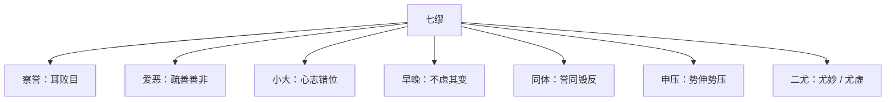

## 本章要义

《七缪》不讲再添一套观人法，讲的是用 [[xuanxue/renwuzhi-04-baguan|八观]] 时会踩的七个坑。核心一句：知人者以目正耳，不知人者以耳败目。名声、爱憎、心志的大小、成材的早晚、同类相吹、处境的伸压、猎奇，都会把眼睛带偏。

最实用的三块：一是「三周」——上等援、下等推、交游之间都能肩称，才算正直之交；只在一边响，终究会毁。二是「心小志大」——小心是防悔，志大是任事；众人往往嫌心小、只壮志大。三是「二尤」——尤妙的人精含于内，尤虚的人硕言瑰姿；早拔多误，不如顺着常度先核实。

同体一段要和偏材对读：性同而材倾则相援，性同而势均则相害。看着都在助「直」、助「明」，其实也可能在毁另一个直、另一个明。读完再看 [[xuanxue/renwuzhi-06-shizheng|效难]]：缪是看走眼，难是看准了也用不上。

*图注：五步环对应八观的七个坑：以目正耳、三周肩称、心小志大、同体相誉、二尤核实。鉴人术数文献，不是医学。*

## 底本

魏刘邵《人物志》。底本：维基文库十二篇合订，繁转简。弃用 github「观人于微」简体乱排本。本文件收《七缪》一篇。

## 对读

### 七缪

> 难度：艰深

七缪：

**白话：** 识人有七种缪误：

- 一曰察誉有偏颇之缪，
- 二曰接物有爱恶之惑，
- 三曰度心有大小之误，
- 四曰品质有早晚之疑，
- 五曰变类有同体之嫌，
- 六曰论材有申压之诡，
- 七曰观奇有二尤之失。

**白话：**

- 第一，考察声誉时有偏颇之缪；
- 第二，待人接物时被爱恶迷惑；
- 第三，度量心志时把小大看错；
- 第四，品评材质时被早晚弄疑；
- 第五，归类变化时有同体之嫌；
- 第六，评论人材时被伸压的情势欺瞒；
- 第七，观察奇才时在「二尤」上失手。

*图注：七格对应开篇「一曰察誉有偏颇之缪」至「七曰观奇有二尤之失」；色块标的是走眼的名目，不是诊病。术数文献，不是医学。*

夫采访之要，不在多少。然征质不明者，信耳而不敢信目。故：人以为是，则心随而明之；人以为非，则意转而化之；虽无所嫌，意若不疑。且人察物，亦自有误，爱憎兼之，其情万原；不畅其本，胡可必信。是故，知人者，以目正耳；不知人者，以耳败目。故州闾之士，皆誉皆毁，未可为正也；交游之人，誉不三周，未必信是也。夫实厚之士，交游之间，必每所在肩称；上等援之，下等推之，苟不能周，必有咎毁。故偏上失下，则其终有毁；偏下失上，则其进不杰。故诚能三周，则为国所利，此正直之交也。故皆合而是，亦有违比；皆合而非，或在其中。若有奇异之材，则非众所见。而耳所听采，以多为信，是缪于察誉者也。

**白话：** 采访的要害，不在听得多还是少。征象和质性看不明白的人，信耳朵，不敢信眼睛。所以：别人以为对，他心里就跟着明白起来；别人以为不对，他的意思就转而变化；即便自己没什么嫌隙，心意也像已经不怀疑了。况且人观察事物，本就会自有误差，再加上爱憎，情由就有万种源头；不把根本疏通，怎么能一定相信？所以，会知人的，用眼睛去校正耳朵；不会知人的，用耳朵败坏眼睛。因此，州里闾里的士人，全都称誉或全都毁谤，都不能当作定论；交游圈子里的人，声誉如果不能在三层关系里走一周，也未必真是那样。质性厚实的人，在交游之间，所到之处一定有人并肩称举：上等的援引他，下等的推举他；如果不能周遍，必定夹着咎责和毁谤。所以偏在上边、失了下边，最终会有毁；偏在下边、失了上边，进用也不会杰出。真正能三周的，才是国家之利，这才是正直之交。因此，全都附和说好，里边也会有违心比附；全都附和说坏，里边或许正有好人。若是奇异之材，本就不是众人能看见的。只靠耳朵听来采信，以多为真，这就是察誉之缪。

夫爱善疾恶，人情所常；苟不明贤，或疏善善非。何以论之？夫善非者，虽非犹有所是，以其所是，顺己所长，则不自觉情通意亲，忽忘其恶。善人虽善，犹有所乏。以其所乏，不明己长；以其所长，轻己所短；则不自知志乖气违，忽忘其善。是惑于爱恶者也。

**白话：** 爱善疾恶，是人情常有的。如果看不明白谁是贤，就可能疏远善人，反而把不善当成善。何以见得？那种夹杂着过错的人，虽然有非，也还有所是；拿他所是的那一面去顺自己的所长，就会不自觉地情通意亲，把恶忘掉。善人虽然善，也还有所欠缺；拿他的欠缺来对照，就显不出自己的长；拿他的长处来对照，又把自己的短看轻了——于是不自觉地志气乖违，把他的善忘掉。这就是惑于爱恶。

夫精欲深微，质欲懿重，志欲弘大，心欲嗛小。精微所以入神妙也，懿重所以崇德宇也，志大所以戡物任也，心小所以慎咎悔也。故《诗》咏文王：“小心翼翼”“不大声以色。”小心也；“王赫斯怒，以对于天下。”志大也。由此论之，心小志大者，圣贤之伦也；心大志大者，豪杰之隽也；心大志小者，傲荡之类也；心小志小者，拘懦之人也。众人之察，或陋其心小，或壮其志大，是误于小大者也。

**白话：** 精神要深微，质性要懿美厚重，志向要弘大，心地要谦小。精微，所以能进入神妙；懿重，所以能撑起德的器宇；志大，所以能戡定事务、担当责任；心小，所以能谨慎过错和后悔。《诗》称文王「小心翼翼」「不大声以色」，这是小心；「王赫斯怒，以对于天下」，这是志大。由此说来：心小而志大的，是圣贤一类；心大而志大的，是豪杰中的隽才；心大而志小的，是傲荡一类；心小而志小的，是拘谨懦弱的人。众人观察时，有的鄙陋他的心小，有的只壮他的志大，这就是误于小大。

夫人材不同，成有早晚：有早智速成者，有晚智而晚成者，有少无智而终无所成者，有少有令材遂为隽器者：四者之理，不可不察。夫幼智之人，材智精达；然其在童髦，皆有端绪。故文本辞繁，辩始给口，仁出慈恤，施发过与，慎生畏惧，廉起不取。早智者浅惠而见速，晚成者奇识而舒迟，终暗者并困于不足，遂务者周达而有余。而众人之察，不虑其变，是疑于早晚者也。

**白话：** 人材不同，成就有早有晚：有早智而速成的，有晚智而晚成的，有少时无智、最终也无所成的，有少时已有美材、终于成为隽器的。这四种道理，不可不察。幼年就显智的人，材智精达；可是在童年开始时，都已有端绪。所以文才先从辞繁显出，辩才先从口齿给利显出，仁从慈恤显出，施与从给得过多显出，谨慎从畏惧显出，廉洁从不妄取显出。早智的人聪明浅而见事快，晚成的人识见奇而节奏慢，终究昏暗的人处处困于不足，终于成事的人周达而有余。众人观察时，不考虑这些变化，这就是疑于早晚。

夫人情莫不趣名利、避损害。名利之路，在于是得；损害之源，在于非失。故人无贤愚，皆欲使是得在己。能明己是，莫过同体；是以偏材之人，交游进趋之类，皆亲爱同体而誉之，憎恶对反而毁之，序异杂而不尚也。推而论之，无他故焉；夫誉同体、毁对反，所以证彼非而着己是也。至于异杂之人，于彼无益，于己无害，则序而不尚。是故，同体之人，常患于过誉；及其名敌，则鲜能相下。是故，直者性奋，好人行直于人，而不能受人之讦；尽者情露，好人行尽于人，而不能纳人之径；务名者乐人之进趋过人，而不能出陵己之后。是故，性同而材倾，则相援而相赖也；性同而势均，则相竞而相害也；此又同体之变也。故或助直而毁直，或与明而毁明。而众人之察，不辨其律理，是嫌于体同也。

**白话：** 人情没有不趋向名利、躲避损害的。名利的路，在于被承认「是」而有所得；损害的源头，在于被判「非」而有所失。所以人不论贤愚，都想让「是」和「得」落在自己身上。最能证明自己为是的，莫过于同体的人。因此偏材之人、交游进取这类人，都亲爱同体而称誉他们，憎恶相反的一类而毁谤他们，对既不同体也不对反的「异杂」只排个次序、并不推尚。推开来讲，没有别的缘故：誉同体、毁对反，正是为了证明对方为非、显明自己为是。至于异杂之人，对对方无益，对自己无害，就只序次而不推尚。因此，同体的人常犯过誉的毛病；等到名声对等了，就很少能互相居下。所以：性直的人意气奋发，喜欢别人对他人也直，却不能接受别人对自己的讦；性情尽露的人，喜欢别人对他人也尽，却不能接纳别人对自己的径直；务名的人乐于看别人进取超过旁人，却不能走在被别人凌越之后。因此，性同而材力一高一低，就互相援助、互相依赖；性同而势均力敌，就互相竞争、互相伤害。这又是同体的变化。所以有时助这个直，同时毁那个直；有时赞这个明，同时毁那个明。众人观察时，分辨不出这套律理，这就是嫌于体同。

夫人所处异势，势有申压：富贵遂达，势之申也；贫贱穷匮，势之压也。

**白话：** 人所处的情势不同，势有伸有压：富贵顺达，是势的伸；贫贱穷匮，是势的压。

上材之人，能行人所不能行，是故，达有劳谦之称，穷有着明之节。

**白话：** 上材之人，能做别人做不到的事。所以显达时有劳苦而谦的名声，穷困时有著明的节操。

中材之人，则随世损益，是故，藉富贵则货财克于内，施惠周于外；见赡者求可称而誉之，见援者阐小美而大之，虽无异材，犹行成而名立。处贫贱则欲施而无财，欲援而无势，亲戚不能恤，朋友不见济，分义不复立，恩爱浸以离，怨望者并至，归非者日多；虽无罪尤，犹无故而废也。故世有侈俭，名由进退：天下皆富，则清贫者虽苦，必无委顿之忧，且有辞施之高，以获荣名之利；皆贫，则求假无所告，而有穷乏之患，且生鄙吝之讼。是故：钧材而进，有与之者，则体益而茂遂；私理卑抑，有累之者，则微降而稍退。而众人之观，不理其本，各指其所在，是疑于申压者也。

**白话：** 中材之人，就随着时世损益。所以凭借富贵，货财充实于内，施惠周遍于外；被他养活的人找可以称道的来称誉他，被他援引的人把小小的美说大；即便没有特异之材，仍然行事成就、名声立住。处在贫贱，想施与却没有财，想援引却没有势，亲戚不能体恤，朋友看不见救济，名分情义再也立不起来，恩爱渐渐离开，怨望的人一齐到来，归咎毁非的一天比一天多；即便没有罪过，仍然无缘无故被废黜。所以世上有侈有俭，名声跟着进退：天下都富，清贫的人虽然苦，必没有委顿垮掉的忧虑，而且还有推辞施与的高名，从而获得荣名之利；天下都贫，求借无处可告，就有穷乏之患，并且生出鄙吝的争讼。因此：材力相当而往前走，有人助成他，就体势增益、茂盛顺遂；被私理压低，又有人拖累他，就微微下降、渐渐后退。众人观察时，不理会这个根本，各人只指着眼前看见的处境，这就是疑于申压。

夫清雅之美，著乎形质，察之寡失；失缪之由，恒在二尤。二尤之生，与物异列：故尤妙之人，含精于内，外无饰姿；尤虚之人，硕言瑰姿，内实乖反。而人之求奇，不可以精微测其玄机，明异希；或以貌少为不足，或以瑰姿为巨伟，或以直露为虚华，或以巧饬为真实。是以早拔多误，不如顺次；夫顺次，常度也。苟不察其实，亦焉往而不失。故遗贤而贤有济，则恨在不早拔；拔奇而奇有败，则患在不素别；任意而独缪，则悔在不广问；广问而误己，则怨己不自信。是以骥子发足，众士乃误；韩信立功，淮阴乃震。夫岂恶奇而好疑哉？乃尤物不世见，而奇逸美异也。是以张良体弱而精彊，为众智之隽也；荆叔色平而神勇，为众勇之杰也。然则，隽杰者，众人之尤也；圣人者，众尤之尤也。其尤弥出者，其道弥远。故一国之隽，于州为辈，未得为第也；一州之第，于天下为椳；天下之椳，世有忧劣。是故，众人之所贵，各贵其出己之尤，而不贵尤之所尤。是故，众人之明，能知辈士之数，而不能知第目之度；辈士之明，能知第目之度，不能识出尤之良也；出尤之人，能知圣人之教，不能究之入室之奥也。由是论之，人物之理妙，不可得而穷已。

**白话：** 清雅之美，写在形质上，观察时很少失误；失误的由来，常常在「二尤」。二尤的产生，和寻常事物不在一列：所以尤妙的人，精含在内，外表没有修饰的姿容；尤虚的人，大话美姿，内里其实乖反。人们求奇，不能用精微去测他的玄机，去辨明那种少见的差异；有的把貌相不足当成才能不足，有的把瑰丽姿容当成巨伟，有的把直露当成虚华，有的把巧饰当成真实。因此过早提拔多半会错，不如顺着次序。顺次，是常度。如果不察核实情，到哪里能不失误？所以：漏过贤人而那贤人后来有成，就悔恨没有早拔；提拔奇士而那奇士后来败了，就忧患在于平时没有辨别；任意独断而自己错了，就后悔没有广问；广问却误了自己，又怨自己不够自信。所以骐骥一迈开步子，众士才发现自己看错了；韩信立了功，淮阴才震动。难道是人们天生厌恶奇才、喜欢怀疑吗？只是尤物不是每个世代都看得见，而奇逸之美又和常人两样。所以张良体弱而精神强，是众智里的隽才；荆轲神色平和而神勇，是众勇里的豪杰。那么，隽杰是众人中的「尤」；圣人是众尤中的「尤」。越是突出的「尤」，他的道路越远。所以一国的隽才，放到一州里只是同辈，还算不上等第；一州的等第，放到天下只是门枢上的一小截；天下这一截里，仍有优有劣。底本「忧劣」即优劣。因此，众人所贵的，各贵那超出自己的「尤」，并不贵「尤」之所以为尤的那一层。所以，众人的明，能知道同辈之士的数目，不能知道等第的尺度；同辈之士的明，能知道等第的尺度，不能识出那超出「尤」的良材；超出「尤」的人，能知道圣人的教化，不能穷究入室的深奥。由此说来，人物的道理精妙，不可能穷尽。
