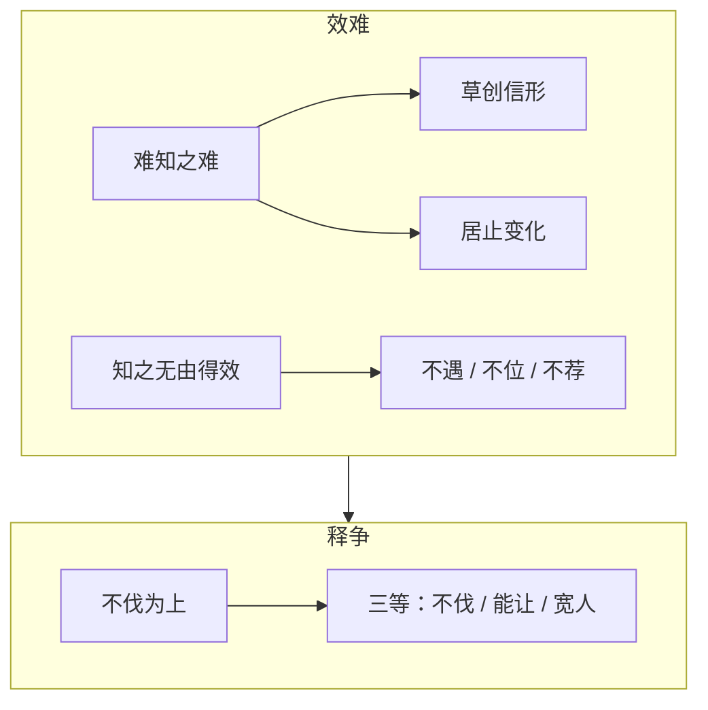

## 本章要义

《效难》把全书收成两句：人难知；知了也难用上。前一层接 [[xuanxue/renwuzhi-05-qimiu|七缪]]——草创信形、居止变化，都是看走眼的来路；后一层才是吏事：识在幼贱、未拔先没、曲高和寡、不在其位、在位而受屈，再加上能识的人不肯荐、肯荐的人不能识。万无一遇、百无一有、十不一合，是比例，不是修辞。

「居视其所安，达视其所举，富视其所与，穷视其所为，贫视其所取」是已经试过之后的办法，不是第一眼相面。和 [[xuanxue/yuancai|原才]] 可对读：那边讲风气造才，这边讲识了也送不进位。

《释争》是全书的德行收束，不是第三套观人术。好胜把「在前」当成锐、把「让」当成辱，结果不是自毁就是互殴。刘邵给的出路是三等：功大不伐，贤而能让，急己宽人。底本「隙至」即春秋晋卿郤至；「荆叔」在前篇已见，本篇用蔺相如、寇恂、陈余张耳、彭宠朱浮作反证。

## 底本

魏刘邵《人物志》。底本：维基文库十二篇合订，繁转简。弃用 github「观人于微」简体乱排本。本文件收《效难》《释争》两篇。

## 对读

### 效难

> 难度：艰深

盖知人之效有二难：有难知之难，有知之无由得效之难。

**白话：** 要把知人用出成效，有两难：一是难以真正知道人，二是知道了也无从收到荐用的实效。

*图注：上格对应「有难知之难，有知之无由得效之难」；红箭头连到下格「释争」，对应后文「不伐」「能让」「急己宽人」三等。术数文献，不是医学。*

何谓难知之难？人物精微，能神而明，其道甚难，固难知之难也。是以众人之察，不能尽备；故各自立度，以相观采：或相其形容，或候其动作，或揆其终始，或揆其儗象，或推其细微，或恐其过误，或循其所言，或稽其行事。八者游杂，故其得者少，所失者多。是故必有草创信形之误，又有居止变化之谬；故其接遇观人也，随行信名，失其中情。

**白话：** 什么叫难知之难？人物精微，要能像神明那样照见，这条路本身就很难，所以本来就是难知之难。因此众人观察，不能完备；于是各自立一套尺度，互相观采：有的看形容，有的等动作，有的度量他的终始，有的拿比拟的形象去揆度，有的推求细微，有的生怕他有过误，有的顺着他说的话，有的考核他做的事。八种办法游移夹杂，所以得的少、失的多。因此一定有草创之际只信外形的误，又有居处行止后来变化的谬。他们接待观察人，跟着行为、听信名声，把中情看丢了。

- 故浅美扬露，则以为有异。
- 深明沉漠，则以为空虚。
- 分别妙理，则以为离娄。
- 口传甲乙，则以为义理。
- 好说是非，则以为臧否。
- 讲目成名，则以为人物。
- 平道政事，则以为国体。

**白话：**

- 所以浅薄的美向外扬露，就以为特异。
- 深明而沉静淡漠，就以为空虚。
- 能分别精妙的道理，就以为是离娄那样的明眼。
- 嘴里能传述甲乙条目，就以为通义理。
- 喜欢说是非，就以为能臧否人物。
- 讲名目、定名称，就以为真懂人物。
- 平铺直叙地谈政事，就以为是国体之材。

犹听有声之类，名随其音。夫名非实，用之不效，故曰：名犹口进，而实从事退。中情之人，名不副实，用之有效；故名由众退，而实从事章。此草创之常失也。故必待居止，然后识之。

**白话：** 这就像听有声音的东西，名称跟着声音走。名称不是实情，拿来用就不奏效。所以说：名声还在口头上往前走，实事已经从行事里往后退。中情充实的人，名声往往不副其实，用起来却有效；所以名声被众人往后退，实事却从行事里彰明。这是草创阶段的常失。所以必须等到看他居处行止，然后才能识。

故居视其所安，达视其所举，富视其所与，穷视其所为，贫视其所取。

**白话：** 因此：闲居时看他安于什么，显达时看他举荐谁，富裕时看他给谁，穷困时看他做什么，贫乏时看他取什么。

然后乃能知贤否。此又已试，非始相也。所以知质未足以知其略，且天下之人，不可得皆与游处。或志趣变易，随物而化：或未至而悬欲，或已至而易顾，或穷约而力行，或得志而从欲；此又居止之所失也。由是论之，能两得其要，是难知之难。

**白话：** 然后才能知道贤与不肖。这又是已经试过之后的办法，不是一开始的相面。由此知道质性，还不足以知道他的方略；况且天下的人，不可能都跟他交游共处。有的志趣变易，随外物而化：有的还没到达，欲望已经悬在前面；有的已经到达，又改换顾盼；有的穷约时努力实行，有的得志后放纵嗜欲。这又是居止观察会失掉的地方。由此说来，能把「草创」和「居止」两头的要害都抓住，才是难知之难。

何谓无由得效之难？上材已莫知，或所识在幼贱之中，未达而丧；或所识者，未拔而先没；或曲高和寡，唱不见赞；或身卑力微，言不见亮；或器非时好，不见信贵；或不在其位，无由得拔；或在其位，以有所屈迫。是以良材识真，万不一遇也；须识真在位识，百不一有也；以位势值可荐致之士，十不一合也。或明足识真，有所妨夺，不欲贡荐；或好贡荐，而不能识真。是故，知与不知，相与分乱于总猥之中；实知者患于不得达效，不知者亦自以为未识。所谓无由得效之难也。

**白话：** 什么叫无从得效之难？上等之材已经难以被知道。有的所识之人还在幼贱之中，未到显达就丧亡；有的所识之人还没提拔就先死了；有的曲高和寡，唱了却看不见应和；有的身卑力微，话说了却不被谅察；有的器能不合时好，不被信任看重；有的自己不在那个位子，无从提拔；有的在那个位子，又被委屈逼迫。因此，良材碰上能识真的人，万不遇一；还须识真的人既在位又能识，百不有一；再以位势正好遇上可以荐致的士，十不合一。有的明足以识真，却有所妨碍、有所争夺，不想贡荐；有的喜欢贡荐，却不能识真。所以，知与不知，彼此夹杂，乱在一大堆人里；真正知道的人，苦于无法把识见送到实效；不知道的人，也自以为还没识到。这就是所谓无从得效之难。

### 释争

> 难度：艰深

盖善以不伐为大，贤以自矜为损。是故，舜让于德而显义登闻，汤降不迟而圣敬日跻；隙至上人而抑下滋甚，王叔好争而终于出奔。然则卑让降下者，茂进之遂路也，矜奋侵陵者，毁塞之险途也。

**白话：** 善以不自夸为最大，贤以自矜为减损。所以舜把位子让给有德的人，显明的道义被上天听见；汤谦降而不迟缓，圣敬一天天上升。郤至喜欢把自己放在人上，被压抑得越来越重；王叔陈生好争，终于出奔。那么，卑让降下，是茂盛前进的顺路；矜奋侵陵，是毁败壅塞的险途。

是以君子举不敢越仪准，志不敢凌轨等；内勤己以自济，外谦让以敬惧。是以怨难不在于身，而荣福通于长久也。彼小人则不然，矜功伐能，好以陵人；是以在前者然害之，有功者人毁之，毁败者人幸之。是故，并辔争先而不能相夺，两顿俱折而为后者所趋。由是论之，争让之途，其别明矣。

**白话：** 因此君子举动不敢越过仪节准绳，心志不敢凌驾轨范等列；对内勤于修己来自我成全，对外谦让来保持敬惧。因此怨难不落在自己身上，荣福能通到长久。那些小人不是这样：矜自己的功、夸自己的能，喜欢拿这些陵人。因此走在前面的，别人就害他；有功的，别人就毁他；毁败了，别人就幸灾乐祸。所以并辔争先却谁也夺不掉谁，两边都顿挫折损，被后到的人趁势取走。由此说来，争与让两条路，分别已经明白。

然好胜之人，犹谓不然，以在前为速锐，以处后为留滞，以下众为卑屈，以蹑等为异杰，以让敌为回辱，以陵上为高厉。是故，抗奋遂往，不能自反也。夫以抗遇贤必见逊下，以抗遇暴必构敌难。敌难既构，则是非之理必溷而难明；溷而难明则其与自毁何以异哉？且人之毁己，皆发怨憾，而变生舋也：必依托于事饰成端末；其于听者，虽不尽信，犹半以为然也。己之校报，亦又如之。终其所归，亦各有半信着于远近也。然则，交气疾争者，为易口而自毁也；并辞竞说者，为贷手以自殴；为惑缪岂不甚哉？

**白话：** 可是好胜的人还是不以为然。他们把处在人前当成迅疾锐进，把处在人后当成留滞，把甘居众下当成卑屈，把踩着同列往上爬当成特异豪杰，把向对手退让当成屈辱，把陵驾在上当成高厉。因此抗奋着一直往前，不能自己折返。拿抗去遇贤人，贤人必显得逊下；拿抗去遇暴人，必构成敌对的祸难。敌难既已构成，是非之理必混浊难明；混浊难明，和自己毁掉自己有什么两样？况且别人毁自己，都从怨憾发出，变故从缝隙里生出来：一定依托某件事，把首尾修饰完整；听的人即便不完全信，也还有一半以为如此。自己再反击报复，也是一样。最终两边各有一半可信的话，传着远近。那么，交气相争的人，等于换一张嘴来毁掉自己；并起辞锋竞相说的人，等于借一只手来殴打自己。这种惑缪，难道还不够深吗？

然原其所由，岂有躬自厚责以致变讼者乎？皆由内恕不足，外望不已：或怨彼轻我，或疾彼胜己。夫我薄而彼轻之，则由我曲而彼直也；我贤而彼不知，则见轻非我咎也。若彼贤而处我前；则我德之未至也；若德钧而彼先我，则我德之近次也。夫何怨哉？

**白话：** 然而追究根由，哪有因为自己厚责自己才惹出变讼的？都是内里恕道不足，对外期望不止：或者怨别人轻视我，或者恨别人胜过自己。我本来薄，别人轻视我，那是我曲而他直；我贤而他不知道，被轻视就不是我的过错。如果他贤而处在我前面，是我的德还没到；如果德相当而他比我先，是我的德只在近次。有什么可怨的？

且两贤未别，则能让者为隽矣；争隽未别，则用力者为惫矣。是故，蔺相如以回车决胜于廉颇，寇恂以不斗取贤于贾复。物势之反，乃君子所谓道也。是故，君子知屈之可以为伸，故含辱而不辞；知卑让之可以胜敌，故下之而不疑。及其终极，乃转祸为福，屈雠而为友；使怨雠不延于后嗣，而美名宣于无穷；君子之道，岂不裕乎！

**白话：** 况且两位贤人还没分别高下时，能让的那一位就是隽才；争隽还没分别时，用力去争的那一位就是疲惫。所以蔺相如用回车避开廉颇，反而决了胜负；寇恂用不开斗，在贾复面前取得了贤名。物事情势的反向，正是君子所谓的道。因此君子知道屈可以变成伸，所以含辱也不推辞；知道卑让可以胜过对手，所以居下也不怀疑。到了终极，就能转祸为福，把仇敌屈成朋友；使怨仇不延到后嗣，美名宣扬到无穷。君子之道，难道不宽裕吗？

且君子能受纤微之小嫌，故无变斗之大讼；小人不能忍小忿之故，终有赫赫之败辱。怨在微而下之，犹可以为谦德也；变在萌而争之，则祸成而不救矣。是故，陈余以张耳之变，卒受离身之害；彭宠以朱浮之隙，终有覆亡之祸。祸福之机，可不慎哉！

**白话：** 而且君子能受纤微的小嫌隙，所以没有变成争斗的大讼；小人不能忍小忿的缘故，终于有赫赫的败辱。怨恨还在微细处就肯居下，还可以成就谦德；变故还在萌芽处就去争，祸就做成而不可救了。所以陈余因为和张耳的变隙，终于身首分离；彭宠因为和朱浮的嫌隙，终于有覆亡之祸。祸福的机关，能不谨慎吗？

是故，君子之求胜也，以推让为利锐，以自修为棚橹；静则闭嘿泯之玄门，动则由恭顺之通路。是以战胜而争不形，敌服而怨不构。若然者，悔吝不存于声色，夫何显争之有哉？彼显争者，必自以为贤人，而人以为险诐者。实无险德，则无可毁之义。若信有险德，又何可与讼乎？险而与之讼，是柙兕而撄虎，其可乎？怒而害人，亦必矣！《易》曰：“险而违者，讼。讼必有众起。”《老子》曰：“夫惟不争，故天下莫能与之争。”是故，君子以争途之不可由也。

**白话：** 因此，君子求胜，把推让当作锋利的兵器，把自我修治当作盾牌和楼橹；静时关上沉默泯然的玄门，动时走恭顺的通路。所以战胜了，争却不露形迹；对手服了，怨却构不起来。能这样，悔吝就不存在于声色之中，哪里还会有显明的争？那些显争的人，一定自以为是贤人，别人却把他看成险诐。如果他其实没有险德，就没有可以毁的道理；如果确实有险德，又何必跟他争讼？险而还跟他讼，等于把犀兕关进槛里还去撩老虎，可以吗？一怒而害人，也是必然的了。《易》说：「险而违者，讼。讼必有众起。」《老子》说：「夫惟不争，故天下莫能与之争。」所以君子认为争途不可走。

是以越俗乘高，独行于三等之上。何谓三等？

**白话：** 因此要越过流俗、乘着高处，独自走在三等之上。什么叫三等？

- 大无功而自矜，一等；有功而伐之，二等；功大而不伐，三等。
- 愚而好胜，一等；贤而尚人，二等；贤而能让，三等。
- 缓己急人，一等；急己急人，二等；急己宽人，三等。

**白话：**

- 全无功劳却自矜，一等；有功而自夸，二等；功大而不自夸，三等。
- 愚而好胜，一等；贤而喜欢压人，二等；贤而能让，三等。
- 对自己宽、对别人急，一等；对自己急、对别人也急，二等；对自己急、对别人宽，三等。

凡此数者，皆道之奇，物之变也。三变而后得之，故人末能远也。夫唯知道通变者，然后能处之。是故，孟之反以不伐获圣人之誉，管叔以辞赏受嘉重之赐；夫岂诡遇以求之哉？乃纯德自然之所合也。

**白话：** 这几项，都是道的奇处、物的变化。变过三层然后才得到，所以人往往走不远。底本「人末能远」，即未能远。只有知道通变的人，然后能处在那一等。所以孟之反因为不自夸得到圣人称誉，管叔因为辞让赏赐受到厚赐；难道是用诡道去求来的吗？乃是纯德自然与之相合。

彼君子知自损之为益，故功一而美二；小人不知自益之为损，故一伐而并失。由此论之，则不伐者伐之也，不争者争之也；让敌者胜之也，下众者上之也。君子诚能睹争途之名险，独乘高于玄路，则光晖焕而日新，德声伦于古人矣。

**白话：** 那些君子知道自己减损反而是增益，所以一件功劳能得到两份美；小人不知道自己增益反而是减损，所以一夸就把功劳和美名一齐失掉。由此说来：不自夸的人，才是真正在被称伐；不争的人，才是真正在争；向对手让的人，才是胜过他；居众人之下的人，才是在众人之上。君子如果真能看见争途名义上的险，独自乘高走在玄路上，光晖就会焕然而日新，德声就能和古人并列。
