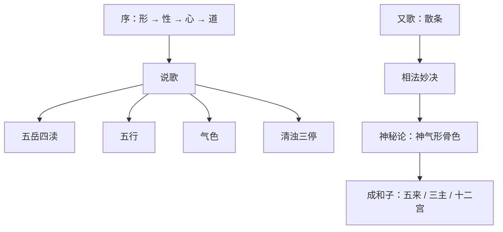

## 本章要义

这是旧题后周王朴《太清神鉴》的入口：四库提要、自序，以及卷一说歌、又歌、相法妙决、神秘论、成和子同论。馆臣已削去王朴之名——正史不载他善相，自序里的林屋洞也和东平入仕的行迹对不上，依托无疑。书里所引篇目多是宋以前本，综核数理往往说中几分，疑出宋人，不是后来术士乱编。

它是**术数文献，不是医学**。歌诀里的刑狱、夭寿、克夫、溺水、法死，都是旧说应验话，不能当体检、法律预测、婚姻指导或性格诊断。可与 [[xuanxue/mayi-01-shiguan|麻衣十观]]、[[xuanxue/bingjian|冰鉴]] 对读：麻衣重部位官府，冰鉴重神骨气色，太清卷一先用韵语把五岳四渎、五行、气色、清浊、三停串起来。部位流年见后章 [[xuanxue/taiqing-02-zhongyang|杂说与中央十三位]]。

读法：先看说歌总纲（造化 → 骨格清奇古怪 → 气色五行 → 清浊），再看又歌散条，然后看神秘论把神、气、形、骨、色排成次第。成和子一段讲五来、三主、十二宫，已经探到卷二的部位表。

*图注：五步环对应序「形性心道」→ 说歌总纲 → 又歌散条 → 神秘论次第 → 成和子探到卷二。术数文献，不是医学。*

## 底本

旧题后周王朴《太清神鉴》。四库入子部术数类，馆臣削去朴名。本章据 youngzs/xuanxue 仓库合并本，合 `00-xu.txt` 与 `01-juan1.txt`。源文件开头残留「女人贱恶部」「女富贵」「女贫贱」「妇人孤独」一类目录碎题，不录入。底本折行已连；夹注多出《人伦风鉴》《玉管照神》《洞元经》。原文尽量保持用字（如「相法妙决」「眼镜」「久母」「伏羲」「散人」），白话按通行文意疏通。

## 对读

### 四库提要

> 难度：入门

《太清神鉴》提要【1】

**白话：** 《太清神鉴》卷前的提要。四库馆臣所写，用来说明这部书从哪里来、为什么削去王朴的名字。

《太清神鉴》六卷，旧本题“后周王朴撰”，乃专论相法之书也。

**白话：** 《太清神鉴》一共六卷，旧本题作后周王朴撰，是专讲相法的书。

考朴事周世宗为枢密使，世宗用兵，所向克捷，朴之筹画为多。

**白话：** 考王朴在周世宗朝做枢密使。世宗用兵，所向往往取胜，王朴的筹划居多。

欧阳修《新五代史》称朴为人明敏多才智，非独当世之务，至于阴阳律法，莫不通焉。

**白话：** 欧阳修《新五代史》说他明敏多才智，不单当世政务，连阴阳、律历、法度都通。

薛居正《旧五代史》亦谓朴多所该综，星纬声律，莫不毕殚。然皆不言其善于相法。

**白话：** 薛居正《旧五代史》也说他学问该博，星纬、声律都穷尽过。可是两部正史都不曾说他善于相法。

且此书前有自序，称“离林屋洞，下山三载，遍搜古今”，集成此书。考朴家世东平，入仕中朝，游迹未尝一至江左，安地有隐居林屋山事？其为依托无疑。

**白话：** 而且这本书前面有一篇自序，自称「离开林屋洞，下山三年，遍搜古今」，才集成此书。考王朴家世东平，入仕中原朝廷，游踪从来没到过江东，哪里来的隐居林屋山这件事？依托是无疑的。底本「安地」按「安得」读。

盖朴以精通术数知名，故世所传奇异诡怪之事，往往皆归之于朴。

**白话：** 只因王朴以精通术数出名，所以世上传奇异诡怪的事，往往都安到他头上。

如王銍《默记》所载，朴与周世宗微行，中夜至五更河旁，见火轮小儿，知宋将代周，其事绝诞妄不可信。

**白话：** 例如王銍《默记》记他和周世宗微服出行，半夜到五更河边，看见火轮小儿，从而知道宋将代周——事情荒诞，绝不可信。

而小说家顾乐道之，宜作此书者，亦假朴名以行矣。

**白话：** 小说家却乐于传说，所以作这本书的人，也就假借王朴的名字来流通。

然其间所引各书篇目，大都皆宋以前本。

**白话：** 然而书中所引各书的篇目，大体都是宋以前的本子。

其综核数理，剖晰义蕴，亦多微中，疑亦出宋人，非后来术士之妄谈也。

**白话：** 它综核术数条理、剖析义理，也往往说中几分，怀疑同样出于宋人，并不是后来术士的妄谈。

其书，《宋史？艺文志》不载，诸家书目亦罕著录，惟《永乐大典》颇散见其文，虽间有缺脱，而缀拾排比，犹可得十之七八。

**白话：** 这本书《宋史·艺文志》不载，各家书目也很少著录，只有《永乐大典》里散见不少文字；虽然间或缺脱，缀拾排比，还能得到十分之七八。底本「宋史？艺文志」当作《宋史·艺文志》。

谨哀辑成编，厘为六卷，朴之名则削而不题，亦祛其伪焉。

**白话：** 于是裒辑成编，分成六卷；王朴的名字削去不题，也是为了去掉作伪。底本「谨哀辑」即四库常用的「谨裒辑」。

乾隆四十六年九月恭校上【2】。

**白话：** 乾隆四十六年九月恭校进呈。

【1】此为《四库全书》子部，术数类所收《太清神鉴》卷前提要，纪昀等撰写。

**白话：** 这是《四库全书》子部术数类所收《太清神鉴》卷前的提要，纪昀等人撰写。

【2】《丛书集成初编》及《守山阁丛书》本皆无末句。今据《四库全书》补。

**白话：** 《丛书集成初编》和《守山阁丛书》本都没有「乾隆四十六年九月恭校上」这一句。现在根据《四库全书》补上。

### 序

> 难度：入门

至人无体，妙万物以为体；至道无方，鼓万物以为用。

**白话：** 至人没有固定的形体，把万物的神妙当作自己的体；至道没有固定的方位，鼓动万物来作为自己的用。

故浑论未判，一气湛然，太极才分，三才备位。

**白话：** 所以浑沦还没分开时，一气澄明；太极一分，天、地、人三才就各就各位。底本「浑论」即浑沦。

是以阴阳无私，顺万物之理以生之；天地无为，辅万物之性以成之。

**白话：** 因此阴阳没有私心，顺着万物的理去生它；天地无所作为，辅助万物的性去成全它。

夫人生居天地之中，虽禀五行之英，为万物之秀者。

**白话：** 人生在天地中间，虽然禀受五行的精华，是万物里秀出的。

其形未兆，其体未分，即夙具其美恶，蕴其吉凶。

**白话：** 可是形体还没有朕兆、躯体还没有分开的时候，美恶就已经先具，吉凶就已经蕴藏。

故其生也，天地岂容巧于其间哉？莫非顺其世，循其理，辅其自然而已。

**白话：** 所以人出生这件事，天地哪里容得在中间耍巧？无非顺着时世、循着条理、辅助自然而已。

故夙积其善，则赋其形美而福禄也；素积其恶，则流其质凶而处夭贱。

**白话：** 因此平素积善，就赋给他美好的形、福禄；平素积恶，就使他的质地凶、处于夭折贫贱。这是术数因果话，不是医学，也不是道德判决书。

此其形则知其性。

**白话：** 看他的形，就知道他的性。

知其性，则尽知其心；尽知其心，则知其道。

**白话：** 知其性，就能尽知其心；尽知其心，就知道他的道。

观形则善恶分，识性则吉凶显著。

**白话：** 观形，善恶就分开；识性，吉凶就显著。

且伏羲日角，黄帝龙颜，舜目重瞳，文王四乳，斯皆古之瑞相，见之间降之圣人也。

**白话：** 伏羲有日角，黄帝有龙颜，舜目重瞳，文王四乳，都是古代的瑞相，看见这些就说是降临的圣人。底本「见之间降」按「见之则降」读。

其诸贤愚修短，犹之指掌，微毫丝末，岂得逃乎？故相论形神之术，自此而兴焉。

**白话：** 其余贤愚、寿命长短，像指着掌纹那样清楚，一毫一丝也逃不掉。所以谈论形神的相术，从此兴起来。

其来极多，其论至冗，许负、袁天罡、陶隐居、李淳风之后，不可胜计。

**白话：** 来源极多，议论极冗。许负、袁天罡、陶隐居、李淳风之后，多得数不清。

然皆穷幽探赜。

**白话：** 他们都能往幽深处探求。

得之至妙，其或紊乱所说，或异或同，至使学者不能贯于一致。

**白话：** 所得也很妙；可是所说或乱、或异或同，弄得学的人贯不成一条。

余自稚岁，潜心于此，考古验今，无不征效。

**白话：** 我从小潜心于此，考古验今，没有不应验的。

遂特离林屋洞，下山三载，遍搜古今，考之极元者，集成一家之书，目之《太清神鉴》。

**白话：** 于是特地离开林屋洞，下山三年，遍搜古今，考其中极玄的，集成一家之书，名叫《太清神鉴》。底本「极元」即极玄。四库已指出林屋洞一事与王朴行迹不合，当作托名自序来读。

以其至大至明，形无不鉴，至清至莹，象无不分。

**白话：** 取义是：极大极明，形体没有照不到的；极清极莹，气象没有分不清的。

然未足夺天地赋形之机，亦可尽人之性形耳。谨序。

**白话：** 然而还不足以夺走天地赋形的机关，也只是可以尽量看清人的性与形罢了。谨序。

### 说歌

> 难度：入门

道为貌兮天与形，默授阴阳秉性情。

**白话：** 道给人容貌，天给人形体，默默授予阴阳，让人秉持性情。

阴阳之气天地真（《人伦风鉴》云：“阴阳之气氛氲。”），化出尘寰几样人。

**白话：** 阴阳之气是天地的真气（《人伦风鉴》作「阴阳之气氛氲」），化出人世间各种各样的人。

五岳四渎皆有神，金木水火土为分。

**白话：** 脸上的五岳、四渎都有神，又按金、木、水、火、土来分。

*图注：对应「五岳四渎皆有神」。额为南岳、两颧东西岳、地阁北岳、鼻为中岳；眼口鼻耳为四渎。术数部位图，不是解剖。*

*图注：对应说歌「五岳……皆有神」。五岳朝拱是后文「部位吉凶各有主」的总图。*

*图注：对应说歌「四渎皆有神」。耳为江、目为淮、口为河、鼻为济，与卷二详论一致。是取象，不是水系学。*

君须识取造化理，相逢始可论人伦。

**白话：** 你必须识得这套造化的理，相逢之后才可以谈论人伦。

贵人骨格定奇异，看之乃为神仙邻。

**白话：** 贵人的骨格一定奇异，看起来像靠近神仙。

若非古怪即清秀，若非端正即停匀（《人伦风鉴》云：“丰姿不嫩仍端异。”）骨格洒落松上鹤（清），头角挺特真麒麟（古）。

**白话：** 若不是古、怪，就是清、秀；若不是端正，就是停匀（《人伦风鉴》强调丰姿不嫩、仍要端异）。骨格洒落像松上的鹤，是清；头角挺特像麒麟，是古。

森森修竹锁流水（秀），峨峨怪石收闲云（怪）。

**白话：** 森森修竹锁住流水，是秀；高高怪石收住闲云，是怪。

昆山片玉已琢出（端），南海明珠光照室（异）。

**白话：** 昆山片玉已经琢出，是端；南海明珠光照满室，是异。

夭桃繁杏媚春华，可怜容易催风日（嫩）。

**白话：** 夭桃繁杏媚于春花，可怜容易被风日催残，是嫩——好看却不耐久。

坐中初看似昂藏，熟视稍觉无晶光。语言泛泛失论序，举动碌碌多仓忙。若人赋得此形相，薄禄为官不久长。

**白话：** 坐在席上初看好像很轩昂，细看却觉得没有晶光；说话泛泛、没有层次，举动忙碌、多仓皇。赋得这种形相的人，旧说官禄薄、做官不久。

坐中初见似尘俗，熟视稍觉多清凉，议论琅琅悉可听，容止悠悠而细长。若人赋得此形相，高名美誉揽金章。

**白话：** 反过来：初看像尘俗，细看却觉得清凉；议论琅琅、句句可听，容止悠悠而细长。赋得这种形相的人，旧说高名美誉、能揽金印。先看神气稳不稳，不要被第一眼骗。

更看面部何气色，数中惟有火多殃，青多忧饶黑多病，白多破财黄乃昌。湛然沉静无瑕翳，青云万里看翱翔。

**白话：** 还要看面部是什么气色。五行气色里，火色多的旧说多灾殃；青多主忧劳，黑多主病，白多主破财，黄才是昌盛。气色澄明沉静、没有瑕翳，才说得上青云万里可以翱翔。青黑白黄是术数五色口诀，不是肝胆皮肤病。

*图注：对应「青多忧饶黑多病，白多破财黄乃昌」。五色配忧、病、破、昌、殃，是说歌气色句，不是诊断。*

富贵贫贱生处意定，但把形神来取证。一部吉兮吉必生，一部凶兮凶必应，部位吉凶各有主，存神定意详观听。

**白话：** 富贵贫贱在出生处已经有意向定了，只要拿形和神来取证。一个部位吉，吉就会生；一个部位凶，凶就会应。部位的吉凶各有所主，要定下神、定下意，仔细看、仔细听。

妙理不过于五行，当究五行之正性。木瘦金方乃常谈，水圆土厚何须竞。不露不粗不枯槁，三停大体求相称。

**白话：** 妙理超不出五行，应当追究五行的正性。木形瘦、金形方，是常谈；水形圆、土形厚，也不必争论。不要露、不要粗、不要枯槁，上中下三停大体要求相称。

*图注：对应「三停大体求相称」。额至眉为上停，眉至准头为中停，准头至地阁为下停。*

火形有禄终须破，奔走贫寒多阻挫（《人伦风鉴》云：“惟有火形尖更露，纵饶得禄终多破。”）。虽因神秀暂荣华，四十之上亦难过。

**白话：** 火形的人即便有禄，终须破败，奔走贫寒、多受阻挫（《人伦风鉴》说火形又尖又露，纵得禄也多破）。虽然因为神秀能暂时荣华，四十岁以上也难过。

其余相法固非一，天收地敛终无失。气和神定最有常，骨耸额宽根本实。

**白话：** 其余相法固然不一，只要天庭收、地阁敛，终究不会大失。气和、神定最有常度；骨耸、额宽，根本才实。

腰背端如万斛舟，瞻视盼顾如星斗。肉隐骨中骨隐体，色隐神中神隐眸。若人赋得此形相，定知不是寻常流。

**白话：** 腰背端正像万斛大船，瞻视盼顾像星斗。肉藏在骨里，骨藏在体里；色藏在神里，神藏在眼里。赋得这种形相的人，旧说不是寻常一流。

气宇汪洋有容物，智量深远多权谋。动作令人不可料，时通亦自为公侯。

**白话：** 气宇像汪洋那样容得下物，智量深远、多权谋。动作让人料不到，时运一通，旧说也能做到公侯。

易喜易怒属浅薄，易骄易满属轻浮，浅薄轻浮神不定，一生自是常常忧。

**白话：** 容易喜、容易怒，属于浅薄；容易骄、容易自满，属于轻浮。浅薄轻浮则神不定，一生往往常在忧里。

欲知富贵何所致，马面（《人伦风鉴》作“马耳”）牛头耸鼻梁。有声有韵骨格清，有颐有面含神光（《人伦风鉴》云：“起坐昂昂多神气。”）

**白话：** 要问富贵从何而来：马面（一作马耳）、牛头、鼻梁高耸；说话有声有韵、骨格清，有颐有面、含着神光（《人伦风鉴》作起坐昂昂、神气多）。

欲知贫者何所分，面带尘埃眼目昏。出语三言不辨两，凹（《人伦风鉴》作“凸”）胸削背仍高臀。赤脉纵横贯双眼，杀人偷盗身无存。

**白话：** 要问贫者怎么分别：脸上带着尘埃，眼目昏；说出三句话辨不清两句；胸凹（一作凸）、背削、臀还高。赤脉纵横贯穿双眼，旧说主杀人偷盗、自身难保。这是口诀取象，不是刑案鉴定。

人生具体皆相同，贵贱相近有西东。冲和而上主轻清，认其清者宜高崇。滞伏而下主重浊，认其浊者皆凡庸。清浊一分知贵贱，贵贱不离清浊中。

**白话：** 人的肢体大致相同，贵贱却像东西两头那样分开。冲和而向上，主轻清，认得清的宜于高崇；滞伏而向下，主重浊，认得浊的都属凡庸。清浊一分，贵贱就知道；贵贱不离开清浊。

大道无形故无相，此理原来本至公（《人伦风鉴》云：“吉凶生于一念中。”）人能移恶归诸善，自然可以消凶灾。人能安分委天命，自然可以济穷通（《人伦风鉴》云：“自然可以起凡庸。叔敖阴德故所劝，上相相心今孰同？”）。予作此诗真有理，寄信贤者莫匆匆（《人伦风鉴》、《洞元经》同）。

**白话：** 大道无形所以无相，这个道理本来至公（《人伦风鉴》说吉凶生于一念）。人能把恶移向善，自然可以消凶灾；人能安分、把穷通交给天命，自然可以济渡穷通（《人伦风鉴》作可以起凡庸，并举孙叔敖阴德、上相先相心）。我作这首诗自认有理，寄语贤者不要匆匆看过。

### 又歌

> 难度：入门

受气成形，三才俱备，清则富贵，浊则灾否。但看贵人，神清气爽，美目秀媚，骨要坚隆。骨肉相继，骨谓之君，肉谓之臣，骨过于肉，君过于臣，此乃贵人，长寿无迍。龙骨吞虎，生必豪富，虎骨吞龙，一世贫穷。

**白话：** 禀受气而形成形体，天、地、人三才都具备。清则富贵，浊则灾祸。看贵人：神清气爽，美目秀媚，骨要坚而隆。骨肉相接：骨是君，肉是臣；骨过于肉，就是君过于臣，旧说这是贵人、长寿没有屯难。龙骨吞虎，生必豪富；虎骨吞龙，一世贫穷。龙虎是取象，不是骨科。

下短上长，富贵吉昌，上短下长，遍走他乡。面黑身白，位至相国；身黑面白，卖尽田宅。面粗身细，一生富贵；面细身粗，贫困而孤。额耸而隆，不受贫穷；额方而广，有田有庄。额骨而高，必为僧道。额上有纹，早年艰辛，若是女子，夫位难停，额窄眉深，卖尽资金，额有伏羲，不富则贵。

**白话：** 下身短、上身长，旧说富贵吉昌；上身短、下身长，遍走他乡。面黑身白，位至相国；身黑面白，卖尽田宅。面粗身细，一生富贵；面细身粗，贫困而孤。额耸而隆，不受贫穷；额方而广，有田有庄。额骨太高，旧说必为僧道。额上有纹，早年艰辛；若是女子，旧说夫位难停。额窄眉深，卖尽资金；额有伏羲（通行相书多作伏犀骨），不富则贵。女相口诀是术数条目，不是婚姻指导。

眉秀而清，四海闻名；眉如初月，衣食不缺。眉骨而高，长受波涛；眉有旋纹，父母不停。八字眉分，一生孤贫，眉头相连，寿短不延，眉生纤毛，上寿坚牢；眉硬如锥，晚岁饥栖。

**白话：** 眉秀而清，四海闻名；眉如新月，衣食不缺。眉骨高，长受波涛；眉有旋纹，旧说父母难留。八字眉分开，一生孤贫；眉头相连，寿短不延；眉生纤毛，上寿坚牢；眉硬如锥，晚岁饥寒栖迟。

两眼藏神，富贵高名；鱼尾插额，位至相国。睛色有黄，为人不良；若是黄紫，刀剑中亡。斜视如流，为性奸偷；三角有光，贼性难防。四白羊睛，杀子不停；反视斗睛，为性不平。睛露脸高，促寿不超。

**白话：** 两眼藏神，富贵高名；鱼尾纹上插到额，旧说位至相国。睛色发黄，为人不良；若黄紫，旧说刀剑中亡。斜视如水流，性奸偷；三角眼有光，贼性难防。四白羊睛，旧说克子不停；反视、斗睛，性子不平。睛露、脸高，促寿。都是取类口诀，不是眼科。

鼻头圆红，不受贫穷。若要清贵，年寿通隆；鼻梁曲陆，一生孤独。鼻如鹰嘴，啄人脑髓；鼻梁骨横，卖尽田园（《人伦风鉴》云：“破尽平生。”）鼻有纵纹，克子不停；鼻头素紫，晚年穷死。

**白话：** 鼻头圆红，不受贫穷。若要清贵，年寿部位要贯通隆起；鼻梁曲折如陆地起伏，一生孤独。鼻如鹰嘴，旧说会伤人；鼻梁骨横，卖尽田园（一作破尽平生）。鼻有纵纹，克子不停；鼻头平素发紫，晚年穷死。

口紫而方，广置田庄（《人伦风鉴》云：“口如吹火，孤寒独坐。”）；口上有纹，失约无成。口薄而轻，亲业如倾；露齿结喉，走遍他州。耳有垂珠，富贵双居（《人伦风鉴》云：“衣禄有余。”）轮廓皆成，一世丰荣（《人伦风鉴》云：“耳内生毫，寿永年高。耳生黑子，多招是非。”）。鼻梁耳返，卖尽田产。耳如箭翅，贫穷破祖；耳耸而朝，富贵年高。

**白话：** 口紫而方，广置田庄（另条：口如吹火，孤寒独坐）；口上有纹，失约无成。口薄而轻，祖业如倾；牙齿外露、结喉，走遍他州。耳有垂珠，富贵双全（一作衣禄有余）。轮廓都成，一世丰荣（又：耳内生毫寿高；耳生黑子多是非）。鼻梁陷而耳反，卖尽田产。耳如箭翅，贫穷破祖；耳耸而朝向面，富贵年高。

发疏而细，位过两制；发粗如麻，贫穷可嗟。女人发拳，克夫连绵；妇人发黄，遍走他乡。手如噀血，衣食不缺；手软如绵，衣食自然。手纹如丝，必为贤士；手纹横生，不聚资金。纹如铁斧，法死众睹（《人伦风鉴》云：“纹如戈矛，法死不留。”）；手上露筋，一世艰辛。

**白话：** 发疏而细，旧说官位超过两制（翰林学士一类）；发粗如麻，贫穷可叹。女人发拳曲，旧说克夫连绵；妇人发黄，遍走他乡。手红如喷血，衣食不缺；手软如绵，衣食自然。手纹如丝，必为贤士；手纹横生，不聚资金。纹如铁斧，旧说法场处死让人看见（一作纹如戈矛）；手上露筋，一世艰辛。噀血是红润之喻，不是出血。

声如破锣，田产消磨；声鸭声喑，家计如倾；声如大铙，一世波涛。舌上有纹，牛马成群；舌如红莲，广有田园；舌短唇长，晚岁慌忙。足下有纹，大旺子孙；足有龟纹，一世清名；足下黑子，富贵贤士。曲背驼腰，子孙不超；鸭步鹅行，富贵家荣（《人伦风鉴》云：“富贵清名。”）。行若蛇行，亲业如倾；蛇胸鹊筋（《人伦风鉴》云：“蛇骨鹤筋”），贫穷贱人。

**白话：** 声如破锣，田产消磨；声像鸭叫或嘶哑，家计如倾；声如大铙，一世波涛。舌上有纹，牛马成群；舌如红莲，广有田园；舌短唇长，晚岁慌忙。足下有纹，大旺子孙；足有龟纹，一世清名；足下黑子，富贵贤士。曲背驼腰，子孙不超；鸭步鹅行，富贵家荣（一作富贵清名）。走路像蛇，祖业如倾；蛇胸鹊筋（一作蛇骨鹤筋），贫穷贱人。声音、步态是相术取象，不是耳鼻喉或骨科诊断。

头大有尖，富贵长年；头大无肩，晚岁孤寒。身大头小，寿数极夭；三停不直，不为贵格。南人北形，富贵高名；北人南形，产业如倾。男人声雌，破却家资；女人声雄，夫主不停。眼下干枯，定杀五夫；齿露声雄，杀夫贫穷。更若有须，不可同居；形容如鬼，杀夫不已。面如哭形，家业不成；面上生靥，夫位高判。形寒额尖，夫位须死；若是男子，亦复如此。

**白话：** 头大而有尖峰，富贵长年；头大却没有肩，晚岁孤寒。身大头小，寿数极夭；三停不直，不算贵格。南方人长成北人形，富贵高名；北方人长成南人形，产业如倾。男人声雌，破尽家资；女人声雄，夫主不停。眼下干枯，旧说克多任丈夫；齿露又声雄，杀夫贫穷。更若有须，不可同居；形容如鬼，杀夫不已。面如哭形，家业不成；面上生靥，夫位高判。形寒额尖，夫位须死；若是男子，也同样不利。这些是旧本女相、男相口诀，不是医学，也不是行为指引。

人中黑子，主养他子；口上生者，吐血而死。泪堂生痣，子孙难继；黑子口旁，是非难防；兰堂生者，富贵寿长。眼下并纹，子息难成；纹理入口，饿死不久。法令入颐，一生富贵；纹入承浆，寿限高强。令纹傍口，财帛难守；鼻准有纹，溺水而死。

**白话：** 人中黑子，主养他人之子；生在口上的，旧说吐血而死。泪堂生痣，子孙难继；黑子在口旁，是非难防；生在兰堂（鼻侧）的，富贵寿长。眼下并排的纹，子息难成；纹理入口，不久饿死。法令纹通入颐，一生富贵；纹入承浆，寿限高。令纹傍着口，财帛难守；鼻准有纹，溺水而死。黑子、纹理吉凶是术数，不是皮肤科。

骨怯神怯，三犯须倾，形重骨刚，寿命延长。三停隆直，富贵无敌；行步身斜，破亲亡家。脑有玉枕，九十为定；鼻梁不正，四十绝命。鼻曲唇掀，寿夭不延（《人伦风鉴》云：“孤独如梦。”）；肥人结喉，寿短不留；带杀双兼，恶死居前。有胸有背，富贵无穷；有背无胸，晚岁孤穷（《人伦风鉴》云：“有胸无背，贫贱如流。”）。声音如嘲，贫贱不贵；身小声雄，位至三公；身大声小，早岁折夭。此法秘之，如金如宝（《人伦风鉴》云：“千字文同上。”）。

**白话：** 骨怯、神也怯，犯到三次就要倾败；形重、骨刚，寿命延长。三停隆直，富贵无敌；走路身子斜，破亲亡家。脑后有玉枕骨，旧说九十为定；鼻梁不正，四十绝命。鼻曲唇掀，寿夭不延（一作孤独如梦）；肥人结喉，寿短不留；带杀的纹和相兼备，恶死在前。有胸有背，富贵无穷；有背无胸，晚岁孤穷（又：有胸无背，贫贱如流）。声音像嘲弄，贫贱不贵；身小而声雄，位至三公；身大而声小，早岁夭折。口诀说此法当密藏如金如宝。

### 相法妙决

> 难度：入门

相人形貌有多般，须辨三停端不端。五岳四渎要相应，或长或短不须论。额要阔兮鼻要直，口分四字多衣食，头圆似月照天庭，眉目弯弯多学识。眉头昂而性必刚，纵理重重入天仓。下视之人多毒害，羊睛四白定孤霜。鼻头屈曲多孤独，项短结喉神不足。男面似女女似男，心悭藏事多淫欲。

**白话：** 相人形貌有许多般，必须先辨三停端不端。五岳、四渎要互相呼应，或长或短不必单论。额要阔，鼻要直；口成四字形，多衣食。头圆像月光照天庭，眉目弯弯多学识。眉头上昂，性必刚；纵理一层层侵入天仓。眼睛下视的人，旧说多毒害；羊睛四白，定主孤霜。鼻头屈曲多孤独；项短、结喉，神不足。男面像女、女面像男，心悭、藏事、多淫欲。三停、五岳、四渎是和说歌同一套总纲。

眼眇虽有小精神，更观黑白须分明。运观有威近秀媚，披缁学道好音声。眼镜黑少白多恶（《玉管照神》云：“黑白分明定知略。”）眉长眼细足人情。眼镜若露唇皮反，男忧恶死女忧产。若是头圆须出家（《玉管照神》云：“若还不是出家，在私必定遭天难。”）。耳无轮廓多破散（《玉管照神》云：“耳无轮廓破纹多，细小无珠命短薄。”）。耳若耸长有轮廓，衣食自然终不薄（《玉管神照》云：“身与腰相应著，忽若偏时终薄落。”）。

**白话：** 眼睛微眇虽然有一点小精神，仍要看黑白分明不分明。远看有威、近看秀媚；披缁学道的人，喜好音声。底本「运观」按「远观」读。眼睛黑少白多，旧说恶（一作黑白分明才知谋略）。眉长眼细，足有人情。眼睛若露、唇皮翻转，男忧恶死、女忧难产。若是头圆，须得出家（一作若不出家，在家必遭天难）。耳无轮廓多破散（又：细小无珠，命短薄）。耳若耸长又有轮廓，衣食终不薄（又：身与腰要相应，一偏就薄落）。底本「眼镜」即眼睛；「披缁」是出家；夹注「玉管神照」即《玉管照神》。

头大身小性悭贫，身大头小多消素，坐要端兮立要直，不直不端无见识。先笑后语定非良，不言不语人难测。面上看来眉不同，一上一下形如虫。如此之人若与交，眷属之人亦不终。仔细看之须寻古，但看金木水火土。相刑相克定取形，若也相生须得地。

**白话：** 头大身小，性悭而贫；身大头小，多消耗。坐要端、立要直，不直不端就无见识。先笑后说话，定非善良；不言不语，人难测。脸上两眉不一样，一上一下像虫形。这样的人若与他交，连眷属也不得善终。仔细看必须寻古法，只看金木水火土。相刑相克，就按那个形来取；若是相生，必须得地。

*图注：对应「但看金木水火土。相刑相克定取形，若也相生须得地」。生则吉、克则破，与说歌「妙理不过于五行」同一套。*

人中斜曲主横死，上唇牵露多辛苦。左眼小而右眼高，久母必定幼年抛。右眼小而左眼反，家财宫中多破散。更须看眼与单重，再拜父母添宗族。南人似北多富贵，北人似南只有名。有背自然能负荷，学堂学馆广中亲，何须眉目定其贵，先看骨兮次看肉。骨肉两般事更别，清亦贵兮浊亦贵。真浊真清方始贵，若还认得浊中清，早当食禄归宫位。清怕浮而浊怕实，更怕眉尾粗是一（《玉管照神》“陈搏先生袖里金”同。）。

**白话：** 人中斜曲，主横死；上唇牵而露，多辛苦。左眼小而右眼高，父母必定幼年抛弃（底本「久母」即父母）。右眼小而左眼翻，家财宫里多破散。还须看眼睛是单眼皮还是双眼皮，关系到再拜父母、添宗族。南人像北人多富贵，北人像南人只有名。有背才能负荷；学堂、学馆广，中亲。何必只拿眉目定贵？先看骨，再看肉。骨与肉是两回事：清也可以贵，浊也可以贵。真浊、真清才开始贵；若还认得浊中之清，早当食禄、归于宫位。清怕浮，浊怕实，更怕眉尾粗——这一条《玉管照神》所引「陈抟先生袖里金」相同。

又云面圆人亦好，更审声音语须小。如此之人若与交，面前背后心难料。大凡相法识根源，金木水火土相连，相克相刑多破败，忽若相生富有年。

**白话：** 又说：面圆的人也不错，还要审声音、说话须小。这样的人若与交，面前背后心思难料。大凡相法要识根源，金木水火土连在一起：相克相刑多破败，若是相生就富有年。

### 神秘论

> 难度：进阶

人之所禀在精神，以火为神水为精。火本藏心心为志，精备而后神方生。神生而后形方备，形备而后色方明。是知色随形所生，气乃逐生各有形。有形不如有骨，有骨不如有神，有神争如有气，神之得气旺于春。大都神气赋于人，神气若油人若灯。神安自然精可实，油清然后灯方明。夜宿此心如寂寂，日居于眼觉惺惺。

**白话：** 人所禀受的在精神：以火为神，以水为精。火本藏于心，心是志；精备了，神才生。神生了，形才完备；形完备了，色才明。所以色是随着形生出来的，气则随着所生而各有其形。有形不如有骨，有骨不如有神，有神哪里比得上有气；神得到气，旺于春。大抵神气赋在人身上，神气像油，人像灯。神安了，精自然可以充实；油清了，灯才明。夜里安宿，这颗心寂寂；白天，神住在眼里，觉得惺惺醒着。火神水精是术数配属，不是生理学。

有时又有清中浊，有时又有浊中清。更兼风韵细数藏，坐久凝然力转强。如此之人堪立事，轻浮浅薄便寻常。其次更看形与骨，骨细皮肤软而滑。要观生就与未就，旋有旋生终可久。或然未好已先盈，花未开而实已生。老人不欲似后生，老者应须要老成。男子不欲带女相，女人不欲似男形。阴反为阳夫早死，老怀嫩色寿星倾。

**白话：** 有时清中有浊，有时浊中有清。再兼风韵细处都藏着，坐得久了仍凝然、力反而转强。这样的人才能立事；轻浮浅薄的，便是寻常。其次再看形与骨：骨细、皮肤软而滑。要看是生就的还是后来才生的；旋有旋生的，终可长久。或者还没有好就已经先盈满，花还没开、果实已经生——那是过早。老人不要像后生，老者应当老成。男子不要带女相，女人不要像男形。阴反为阳，旧说夫早死；老却怀着嫩色，寿星倾覆。

丈夫女人两般评，女要柔兮男要刚，女人属阴本要静，未言先笑定非良。良人有威而少媚，娼妇有媚而少威，令人一见便生侮，所以居身在至微。木要瘦兮金要方，水肥土厚火尖长。形体相生最为吉，若然相克定为殃。金得金，刚毅深；木得木，资财足；水得水，才学贵；火得火，威武播；土得土，多仓库。金不金，反沉吟；木不木，多孤独；水不水，多官鬼；火不火，多凶祸；土不土，多辛苦。（已上形论）

**白话：** 男子、女人两套评法：女要柔，男要刚。女人属阴，本要静；话还没说先笑，定非善良。良人有威而少媚，娼妇有媚而少威——让人一见就生侮慢，所以居身极微贱。木要瘦，金要方，水要肥，土要厚，火要尖长。形体相生最为吉，若是相克定为殃。金得金，刚毅深沉；木得木，资财充足；水得水，才学贵；火得火，威武播扬；土得土，仓库多。金不金，反而沉吟不决；木不木，多孤独；水不水，多官非；火不火，多凶祸；土不土，多辛苦。以上是形论。与麻衣「金得金刚毅深」一套同出。

只于形体本先瘦（木），次后初肥最为要（水生木）。若然始瘦又枯干，木带金兮灾愈繁。一如形体本方正，次后背隆最为应（土生金）。若然始方却又尖，金见火兮实为灾。初中最好末生灾，腰臀都小步不开，初中不好末生好，腹肚初生悬壁倒。有臀有背能负荷，无背无臀空老大。看前虽好未为好，看后须好好到老，马上大兮马下小。更兼藏气与藏神，八座三台官岂小。有财之人面似方。有土之人多在背（守土）。其在清资并极贵，面似月兮神似贝。

**白话：** 只就形体说：本来先瘦（木），后来才开始肥，最为要紧（水生木）。若一开始瘦又枯干，就是木带金，灾越来越多。又如形体本方正，后来背隆起，最为相应（土生金）。若开始方却又变尖，就是金见火，实在是灾。初主、中主最好、末主生灾：腰臀都小、步迈不开。初主、中主不好、末主生好：腹肚像一开始就倒挂的悬壁。有臀有背才能负荷，无背无臀空长老大。看前面虽好还不算好，看后面好才能好到老；马上大、马下小。再兼能藏气、藏神，八座三台的官职岂会小。有财的人面像方形。有土的人多在背上（守土）。至于清贵和极贵，面像月、神像贝。

有时举眼随身起，有时接语如身转。近观有媚远无威，久视方明初似晦。更有一法何所谓，只有锋芒始为贵。器宇潇洒风韵美，如此之人岂常类？信知颧骨有四般，入耳无边寿数宽。插上天仓须两府，发髻之下当守土。清奇古怪秀异端，七者为身亦合论。清而无神谓之寒，异若无神多削弱，端而无神谓之粗，七者有神乃众殊。

**白话：** 有时抬眼随着身子起，有时接话像身子在转。近看有媚、远看无威；久看才明、初看像晦。还有一法：只有锋芒才算贵。器宇潇洒、风韵美，这样的人岂是常类？要知道颧骨有四般：插入耳、没有边际，寿数宽；插上天仓，须得两府之贵；在发髻之下，当守土。清、奇、古、怪、秀、异、端，七者论身也要合起来看。清却无神，叫作寒；异若无神，多削弱；端却无神，叫作粗。七者有神，才和众人不同。

远视之人心必远，视高之人心必高，视平之人心必善，下斜偷视主心豪。眼睛若露终凶死，精神矍铄亦徒劳。须知眉平眼又平，必然为道又为僧。紫衣师号如何得，伏羲骨肉顶中生。眉眼多生神杀现，纵为僧道不成名。少年得第踏青云，眉目分明气骨清。眉目分明气骨俗，只有文章岂有名？更有一般行尸肉，须看肩高与头缩。

**白话：** 远视的人心必远，视高的人心必高，视平的人心必善，下斜偷视主心豪强。眼睛若露，终主凶死，即便精神矍铄也徒劳。要知道眉平、眼也平，必然为道又为僧。紫衣师号怎么得？伏羲（伏犀）骨肉从顶中生出来。眉眼多生、神杀出现，纵为僧道也不成名。少年得第踏青云，要眉目分明、气骨清。眉目分明而气骨俗，只有文章哪有名？还有一种行尸走肉，须看肩高与头缩。

要知南人面似北，身大而肥有水色；欲知北体似南人，体厚形小气薄清。南人似北终须富，北人似南终享荣。富人不过厚其形，贵者当论骨与神。贵在于眼富在耳，贵人同富误于人。不贵似贵终须贵，不贫似贫终须贫。贫中地贵因何识，看取驿马先生骨；富中反贱又何分，胸高骨寒神太昏。借问相中何取寿，认取声名骨又秀，若或气短骨又露，四十之前寿必故。

**白话：** 要知南人面像北人：身大而肥、有水色；要知北人体像南人：体厚形小、气薄而清。南人似北终须富，北人似南终享荣。富人不过形厚，贵者应当论骨与神。贵在眼，富在耳；把贵人当成富人看，会误人。不贵却像贵，终须贵；不贫却像贫，终须贫。贫中藏贵怎么识？看驿马部位先生出的骨。富中反贱怎么分？胸高、骨寒、神太昏。问相中何处取寿？认取声音清、骨又秀；若是气短、骨又露，四十岁之前寿必结束。

耳要白兮口要红，眉清目秀鼻如筒，更兼六府相朝揖，富贵一生到老终。鼻梁安兮山根折，少哭尊亲并骨肉。弟兄无一眉粗短，耳无轮廓主无儿。更有一法须要识，结喉露齿主妨妻。大凡须看气与色，色浮皮外气居皮（皮外者色，皮内者气）。来时如茧去牵丝，去似马尾将欲撒。为福定随日影去，为灾直须终日聚。不拘青黑与红黄，但认发之在何处，若能依部以看之，足知多善与为恶。

**白话：** 耳要白，口要红，眉清目秀、鼻如筒，再兼六府互相朝揖，富贵一生到老。鼻梁安而山根折，少年就会哭尊亲骨肉。弟兄一个也无，因为眉粗短；耳无轮廓，主无儿。还有一法必须识：结喉露齿，主妨妻。大凡须看气与色：色浮在皮外，气住在皮里（皮外是色，皮内是气）。来的时候像茧，去的时候牵成丝；去像马尾将要撒开。为福的，一定随着日影过去；为灾的，须得终日聚着。不管青黑还是红黄，只认它发在何处；若能按部位看，就足以知道多善还是为恶。气色依部而看，不是按西医的血色。

称意之人何所识？看取三光并五泽（三光，两目上，鼻金耸，两耳珠，准头为泽，印堂两金并地阁）。若还诸事不如心，其位自然皆暗黑。形滞之人行步重，神滞之人声必硬，色滞之人面尘埃。飞禽走兽有数般，莫将禽向兽中看，瘦长但向禽中取，肥短之人以兽观。似虎之人取其项，似犀之人取其背，凤要眼长鹤神削。似禽不嫌身瘦小，似兽若肥为最要。禽肥必定不能飞，兽若肥兮安能走？吁嗟流俗不知因，要知飞走取其形。若入正形须大贵，依稀相似出群入。

**白话：** 称心如意的人怎么识？看三光和五泽（三光：两目之上；鼻的金星耸起；两耳垂珠。准头为泽；印堂、两金、地阁也在泽里）。若诸事不如心，这些部位自然都暗黑。形滞的人行步重，神滞的人声音硬，色滞的人满面尘埃。飞禽走兽有好几类，不要把禽拿到兽里看：瘦长的只向禽中取，肥短的人按兽来看。似虎的人取他的项，似犀的人取他的背；凤要眼长，鹤要神削。似禽不嫌身瘦小，似兽若肥最为要。禽肥了一定不能飞，兽若肥了怎么能走？可叹流俗不知道缘故，要知飞走，只取那个形。若进入正形，须得大贵；依稀相似，也能出群。底本「出群入」按「出群人」读。取禽取兽是《易》类比象，不是动物学。

日角龙文虽谓奇，所谓不吉仍何为？三尖五露不入相，所为若善福相随。若不以心而论相，是将人事逆天时，若还人心相应相，相遂心生信有之。大凡微妙不难识，要在心通与眼力。但将此论细推之，长短于中无不得。（《人伦风鉴》同）

**白话：** 日角、龙文虽然称奇，可是如果所为不吉，又有什么用？三尖五露本不入相，所为若善，福仍相随。若不以心来论相，就是拿人事去逆天时；若人心与相相应，相随心生，确实有这样的事。大凡微妙并不难识，要在心通和眼力。只要把这篇论细细推求，长短都在其中，没有得不到的。以上与《人伦风鉴》相同。

### 成和子同论

> 难度：进阶

成和子曰：予常内收视反听，一无所有。纵观万物，见富贵贫贱之不同，未悉其谁与之耶。识者曰：“必造物与之也。”见吉凶寿夭之或异，未悉其谁与之耶，议者曰：“必造物与之也。”如是，则物为其所者，固碌碌矣，而造物者岂真听之也？求其端，方其理，是岂偶然哉？其所以不同者，皆出于自运自化，故有造物者主之而已。若夫于其一无所有，则内焉与道同体，外焉与造化同功？而造物者又焉能去之也？且其形于天地之间，为形相异。生死荣辱，循环无端。（《玉管照神》云：“不能见道，所以出生入死，如循环然，故造物者得而主之也。”）其间不失其本，可以语道，为贵人其庶几焉。如知所谓贵人者何来？其故有自来也。

**白话：** 成和子说：我常常向内收视反听，一无所有。纵观万物，看见富贵贫贱不同，不知道是谁给的。识者说：「一定是造物给的。」看见吉凶寿夭或有差异，不知道是谁给的，议论的人说：「一定是造物给的。」这样的话，被造物所摆布的，固然碌碌；可是造物者难道真是听任不管吗？求它的端绪、方其道理，这哪里是偶然？所以不同，都出于自运自化，因此有造物者在做主而已。至于那「一无所有」的境界，内里与道同体，外在与造化同功，造物者又怎能去掉它？况且人成形在天地之间，形相各异。生死荣辱，循环没有端绪（《玉管照神》说：不能见道，所以出生入死如循环，故造物者得而主之）。其间不失去根本、可以谈道的，作为贵人差不多了。若问所谓贵人从何而来？那是有来处的。

希夷子问成和子曰：“请言其来所自。”成和子曰：其来有五：有自修行中来者，有神仙中来者，有星辰中来者，有神祗中来者，有精灵中来者。希夷子曰：“可以形相别乎？”成和子曰：可。形貌清古，举动恭谨，性善气平，言极至理，虽在朝廷，常有山林之趣，此修行中来者。形貌洒落，举动风雅，性惠气和，言涉方术，虽在朝廷，常有修炼之志，此神仙中来者。形貌显赫，举动严肃，性明气直，言涉造化，虽在朝廷，常有脱尘之意，此星辰中来者。形貌奇异，举动急速，性灵气刚，言涉威猛，虽在朝廷，常有祭祀之敬，此神祗中来者。形貌丑怪，举动强恶，性酷气暴，言涉浮邪，虽在朝廷，常有杀伐之心，此精灵中来者。五者之中，神祗、精灵以威武为贵者，其性稍从善，或增积善根，亦可进乎道也。

**白话：** 希夷子问成和子：「请说说来处。」成和子说：来处有五：从修行中来，从神仙中来，从星辰中来，从神祇中来，从精灵中来。希夷子问：「可以用形相分别吗？」成和子说：可以。形貌清古，举动恭谨，性善气平，说话极合至理，虽在朝廷常有山林之趣，这是修行中来的。形貌洒落，举动风雅，性惠气和，言谈涉及方术，虽在朝廷常有修炼之志，这是神仙中来的。形貌显赫，举动严肃，性明气直，言谈涉及造化，虽在朝廷常有脱尘之意，这是星辰中来的。形貌奇异，举动急速，性灵气刚，言谈涉及威猛，虽在朝廷常有祭祀之敬，这是神祇中来的。形貌丑怪，举动强恶，性酷气暴，言谈涉及浮邪，虽在朝廷常有杀伐之心，这是精灵中来的。五者之中，神祇、精灵以威武为贵的，若性子稍从善，或能增积善根，也可以进于道。这是托名陈抟、成和子的来历说，不是宗教史，更不是医学。

夫人生在世，固多般矣。或为碌碌仕宦，或为区区四民，或进或退，或得或失，或多欢乐，或多忧恼，或初贫穷而终富贵，或始富贵而终贫穷，或始贵而终贱，或始贱而终贵，或富贵而夭，或贫贱而寿，或生于东南而旺于西北，或生于西北而死于东南，以至婚姻、饮食、交游、聚会，不期而致。如响答声，皆缘所作而受报，未尝有毫发之差。昧者由之，而不知也。

**白话：** 人生在世，固然多种多样。或碌碌做官，或区区为士农工商；或进或退，或得或失；或多欢乐，或多忧恼；或初贫终富，或始富终贫；或始贵终贱，或始贱终贵；或富贵而夭，或贫贱而寿；或生在东南而旺于西北，或生在西北而死于东南。以至婚姻、饮食、交游、聚会，不期而至。像回响答声音，都缘于所作所为而受报，不曾有毫发差错。愚昧的人顺着走，却不知道。

希夷子问成和子曰：“可以形相分别，使昧者可以避恶趋善。是亦明之一端也。”成和子曰：事有所行，理有所言，苟使人避恶而趋善，当得阴报，非惟凶咎自远，亦可以识来世之果报不深。则形貌偏枯，气色杂碌，骨虽起而不耸正，面虽开而无肉，故为碌碌仕宦。或眉疏而眼秀，气稍清则为士。或皮粗，或肉重，或气混浊，则为农为商。骨巧而肉薄则为工。或气散而色沉，故为四民。进退得失之不常，盖因形相之不全。

**白话：** 希夷子问：「可以用形相分别，让愚昧的人避恶趋善，这也是明白的一端。」成和子说：事有所行，理有所言。假如能让人避恶趋善，当得阴报；不但凶咎自己远离，也可以知道来世的果报不会深重。于是：形貌偏枯，气色杂乱碌碌，骨虽起却不耸正，面虽开却无肉，所以做碌碌仕宦。或者眉疏眼秀、气稍清，就为士。或者皮粗、肉重、气混浊，就为农为商。骨巧而肉薄，则为工。或者气散而色沉，所以是四民。进退得失不常，都因为形相不全。

骨气浑厚，精神闲暇者，多欢乐；骨气清薄，精神露见者，多忧恼。形神正而气色不开者，始贫而后富；气色嫩而形神不藏者，始富而后贫。五岳相朝而未开，五星分明而未出者，始贱终贵；五岳磊落而俱走，五星分明而踞促，始贵而终贱。部位峻急，气色嫩而面光，故富贵而夭；部位开伏，气色燥而深沉，故贫贱而寿。颐颔连地阁，而龙宫门常有润色，生东南而必旺于西北；神光散人边地，而山林常有润色，虽生西北必定死东南。亦有西北之人旺于东南、东南之人死于西北，其验者，山林、边地之气，但由青、黄、黑、白、赤、休、囚、衰、旺而推之，乃可见矣。

**白话：** 骨气浑厚、精神闲暇的，多欢乐；骨气清薄、精神外露的，多忧恼。形神正而气色还没开的，始贫而后富；气色嫩、形神不藏的，始富而后贫。五岳相朝却还没开、五星分明却还没出的，始贱终贵；五岳磊落却都走散、五星分明却局促的，始贵终贱。部位峻急，气色嫩而面上有光，所以富贵而夭；部位开伏，气色燥而深沉，所以贫贱而寿。颐颔连着地阁，龙宫门常有润色，生在东南必旺于西北；神光散入边地（底本「散人」当作「散入」），山林常有润色，虽生西北必定死在东南。也有西北之人旺于东南、东南之人死于西北的。要验证，看山林、边地的气，只按青、黄、黑、白、赤和休、囚、衰、旺去推，就可以看见。五色休旺是术数，不是地理学。

故婚姻之远近、贵贱、就鱼尾、龙宫气色看之；食禄之远近、荣枯，就官禄、驿马气色看之。大凡气色红黄者为吉，黑白者凶，发深则近，发浅则远。气色和，则聚会交游多喜；气色暴，则聚会交游多恶。以至历清要、遭贬责、受戮辱者，若虽在眸子之瞭眊，精神之秀媚，未有不由用心之太过也。

**白话：** 所以婚姻的远近、贵贱，就鱼尾、龙宫的气色看；食禄的远近、荣枯，就官禄、驿马的气色看。大凡气色红黄为吉，黑白为凶；发得深则应期近，发得浅则应期远。气色和，则聚会交游多喜；气色暴，则聚会交游多恶。以至历任清要、遭到贬责、受戮辱的人，虽然在眸子的明与不明、精神的秀媚上也能看见，没有不是因为用心太过。

希夷子曰：“至理之论，不出与此，窃见世人或以五行取形，或以飞走取形，未知孰是。分三主、九曜、十二宫，亦不可以见，定说可得闻乎？”成和子曰：人禀五行而生，饮天之和，食地之德，未有不由乎五行。因而取禀，须识五行之性，故能理其说而载于形。以飞走取形，则议物理自然之意。如《易》之取象，既以天、地、风、雷、水、火、山、泽之八物，以象八卦；又以牛、马、龙、鸡、豕、雉、狗、羊以配之。其为物也微，其取类也大。以飞走取形亦如之。

**白话：** 希夷子说：「至理之论，不超出这些。我看见世上有的按五行取形，有的按飞禽走兽取形，不知道哪个对。分三主、九曜、十二宫，也不可以一见就定，确定的说法可以听听吗？」成和子说：人禀五行而生，饮天的和气，食地的德，没有不经由五行的。因此取禀必须识五行之性，才能把那套说法安到形上。按飞走取形，是议论物理自然的意思。像《易》的取象：既用天地风雷水火山泽八物来象八卦，又用牛马龙鸡豕雉狗羊来配。物虽微，取类却大。按飞走取形也是这样。底本「不出与此」即「不出乎此」。

其物之为贵者，莫过虬、龙、鸾、凤、龟、鹤、狮子、狻猊之类，其次则麟、虎、猿、猴、犀、象、牛、马。凡此十类者之中，均为物也，自有不同。故虬、龙一类，有飞有蟠，有病有懒；鸾凤一类，有翱有翔，有孤有饥。虬龙则岩 而身长，鸾凤则端正而眼细。虬则小，龙则大，凤为雄兮鸾为雌。骨格相似而神气不正，则取其飞蟠病懒翱翔孤饥之势以况之。鹤则清瘦而胫长，龟则清古而眼雏。二者灵物，其形相类，不求贵达，亦当得道。狮子则昂藏，狻猊则小于狮子也。猿臂长而面圆，猴则面瘦而眼圆，牛则行缓，马则骤而急，其大略如此。然正形故难得也，此特取可贵者而言。以至麋、鹿、彪、豹、狐、鼠、鹑、鸽、鸡、犬、猪、羊、鹅、鸭之类，凡有生有性者，皆可得以取象，非博物元机之士，能触类而推知，亦难知矣。盖取形又不须全似，但以耳目口鼻，行步趋向，得其仿佛皆是也。

**白话：** 物类里贵的，莫过于虬、龙、鸾、凤、龟、鹤、狮子、狻猊之类；其次是麟、虎、猿、猴、犀、象、牛、马。这十类都是物，自己又有不同。所以虬、龙一类，有飞有蟠，有病有懒；鸾凤一类，有翱有翔，有孤有饥。虬龙岩岩而身长（底本「岩 而身长」按「岩岩」读），鸾凤端正而眼细。虬小龙大，凤雄鸾雌。骨格相似而神气不正，就取飞、蟠、病、懒、翱、翔、孤、饥的势来比况。鹤清瘦而胫长，龟清古而眼雏。二者是灵物，形相类似，不求贵达，也当得道。狮子昂藏，狻猊比狮子小。猿臂长而面圆，猴面瘦而眼圆；牛行缓，马骤而急。大略如此。然而正形本来难得，这里只取可贵的来说。至于麋鹿彪豹狐鼠鹑鸽鸡犬猪羊鹅鸭之类，凡有生有性的，都可以取象。不是博物、能见元机的人，能触类推知，也很难。取形又不必全像，只要耳目口鼻、行步趋向，得到仿佛，都算。

呜呼！知人难于知天矣！天有寒暑之可期，人有倾危，则在于反复之间；天有晦明之可见，人有容貌，则在于深厚之间。天有旦暮之可数，人则有朝秉权要暮为逐客、朝处蒿莱而暮致青云者，实难知也，惟用心若鉴之士，则真伪不可逃也。

**白话：** 可叹！知人比知天还难。天有寒暑可以预期，人的倾危却在反复之间；天有晦明可以看见，人的容貌却在深厚之间。天有旦暮可以数，人却有早晨掌握权要、晚上成为逐客，早晨还在蒿莱、晚上就到青云的，实在难知。只有用心像镜子一样的人，真伪才逃不掉。

面有九曜，鼻属金、眼属木、耳属水、口属火、面属土、左颧骨为罗、右颧骨为计、眉为紫气、人中属月孛是也。三主或自下而上为言者，或自上而下为言者，皆不足取，以形之属分可以无疑。夫水生于天一，金则生于四地，金、水形神者，当自天庭至印堂为初主，印堂至准头为中主，准头至地阁为末主。土者，兴中央之正色，发于中宫。如上形人，自准头至印堂为初主，印堂至天庭为中主，准头至地阁为末主。更有兼形则取其多为主，又焉能逃此哉？或曰，面有十二宫，印堂为命宫，天仓、地库为财帛宫，龙虎额角头为兄弟宫，日月角为父母宫，三阴三阳为男女宫，悬壁为奴仆宫，鱼尾为妻妾宫，神光、年寿为疾厄宫，山林、边地为迁移宫，正面为官禄宫，精神、地角、福堂为福德宫。相貌则总而言也，取形之理分三主、九曜、十二宫之法，无以易此。

**白话：** 面上有九曜：鼻属金，眼属木，耳属水，口属火，面属土，左颧为罗睺，右颧为计都，眉为紫气，人中属月孛。三主有人从下往上说，有人从上往下说，都不足取；按形所属来分，可以无疑。水生于天一，金生于地四。金、水形神的人，应当从天庭到印堂为初主，印堂到准头为中主，准头到地阁为末主。土是中央正色，发于中宫。土形的人，从准头到印堂为初主，印堂到天庭为中主，准头到地阁为末主。还有兼形，就取多的那一类为主，又怎能逃出这一套？或者说：面上有十二宫。印堂是命宫；天仓、地库是财帛宫；龙虎、额角、头是兄弟宫；日月角是父母宫；三阴三阳是男女宫；悬壁是奴仆宫；鱼尾是妻妾宫；神光、年寿是疾厄宫；山林、边地是迁移宫；正面是官禄宫；精神、地角、福堂是福德宫。相貌则是总起来说。取形的道理，分三主、九曜、十二宫的方法，没有能替换这一套的。三主的部位表，正接卷二中央直下十三位，见 [[xuanxue/taiqing-02-zhongyang|杂说与中央十三位]]。宫名与 [[xuanxue/mayi-02-qianliugong|麻衣十二宫]] 可对看，条目并不完全同一条清稿。

希夷子曰：“人生天地之间，不止于百千万亿，数其立身以殊，岂可遍言之也？能广此意以观人，知穷易象，乃可得也，何得一为喻？”成和子曰：幽深微妙，天之机也；造化变移，天之理也。论天理以应人可也。泄天之机以惑人，天必罚之。然而皇天无私，惟德是辅，惟善人是为。由是而观，则祸福无不自己求之者。人有常言，虽有穷困而通，否极泰来。居困之时，不能致命遂志，焉可求通？居否之时，不能修德避难，焉可求泰？此《易》所谓贵乎藏器于身、待时而动之君子也。低视而心暗藏，气愚而色不和，小人也。（已上与《玉管照神》论五种相法同）

**白话：** 希夷子说：「人生天地之间，不止百千万亿，立身各异，岂可说遍？能推广这个意思来观人，知道穷尽《易》象，才可以得到，何必拿一件事来比喻？」成和子说：幽深微妙，是天的机；造化变移，是天的理。用天理来应人，可以。泄漏天机来惑人，天必罚之。然而皇天无私，只辅助有德的人，只为善人。由此看来，祸福没有不是自己求来的。人常说：虽有穷困而能通，否极泰来。处在困的时候，不能致命遂志，怎么求通？处在否的时候，不能修德避难，怎么求泰？这就是《易》所谓贵在藏器于身、待时而动的君子。低视而心暗藏，气愚而色不和，是小人。以上与《玉管照神》论五种相法相同。泄天机、阴报是术数劝诫，不是法律或医学。
