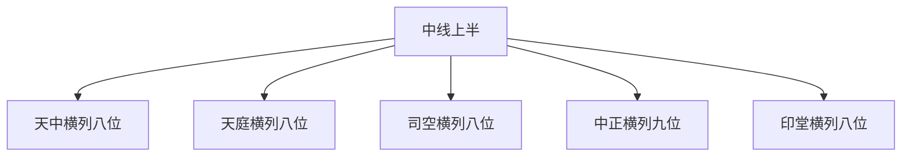

## 本章要义

中央直下十三位是中线。本章把中线**上半**向两边展开：天中横列八位、天庭横列八位、司空横列八位、中正横列九位、印堂横列八位。每一横列一张部位图，条目按骨起、平满、缺陷、色泽、黑痣来断官禄、刑厄、出行、父母、交友。下一章收印堂以下的横列。

它是**术数文献，不是医学**。狱死、兵死、溺死、客亡，都是旧说应验话，不能当法律、军事或旅行预测。读法：先定这一横列在中线哪一位旁边，再看骨肉是否起、色是否润，最后才看痣和恶色。上一章见 [[xuanxue/taiqing-02-zhongyang|杂说与中央十三位]]。

*图注：五步环对应天中、天庭、司空、中正、印堂各一横列，中线上半向两边展开。术数文献，不是医学。*

## 底本

旧题后周王朴《太清神鉴》卷二。据 youngzs/xuanxue 仓库合并本 `02b-henglie-shang.txt`。原文「宜任病之官」按兵职疏通；「有黑之色恶着」按「有黑色恶者」读；「一名额中」等别名照录。折行已连。印堂以下横列另章。

## 对读

### 天中横列八位

> 难度：艰深

天中横列八位

**白话：** 天中这一横列一共八个部位。

*图注：红线横贯天中，由内向外、左右分列。对应原文「天中横列八位」。照片左侧（人物右）由内向外：天狱、左厢、内府、高广；照片右侧（人物左）：阳尺、武库、辅角、边地。「左厢」是部位名，不是「人的左边」。术数部位，不是医学。*

天狱，一名理狱，主刑厄。

**白话：** 天狱这一位，又叫理狱，管刑厄。

平满者不犯刑狱，缺陷及色恶者，多遭狱厄。

**白话：** 平满的不犯刑狱；缺陷以及气色恶的，多遭牢狱之厄。这是术数口诀，不是法律预测。

左厢，主丞相。

**白话：** 左厢这一位，管丞相。

平满者吉利。

**白话：** 平满的吉利。

骨起者与伏犀相连者，当入宰辅。

**白话：** 骨头高起又与伏犀相连的，应当进入宰辅。

陷缺坎者，亦多灾厄。

**白话：** 塌陷缺损、凹成坎的，也多灾厄。

内府，主金玉财宝，骨起平满，家累珠玉，身复仁孝。

**白话：** 内府这一位，管金玉财宝。骨头高起、部位平满，家里堆满珠玉，自身又仁孝。

缺陷者消折，亦狱死。

**白话：** 缺陷的，家财消折，也管狱死。狱死是术数恶格，不是法律预测。

高广，主方伯之座。

**白话：** 高广这一位，管方伯的座位。

丰起者，当任刺史。

**白话：** 丰厚高起的，应当担任刺史。

平，吉利。

**白话：** 平的，吉利。

有黑痣，少丧父母。

**白话：** 有黑痣，少年丧父母。这是术数应验，不是医学。

阳尺，主近佐之官。

**白话：** 阳尺这一位，管近旁辅佐的官职。

肉骨丰起，位佐郡之职。

**白话：** 肉和骨头丰厚高起，职位在佐郡。

缺陷者，主官歇灭。

**白话：** 缺陷的，管官运歇灭。

有黑痣者，客死他乡。

**白话：** 有黑痣的，客死他乡。客死是术数恶格，不是旅行预测。

武库，主兵甲之吏。

**白话：** 武库这一位，管兵甲之吏。

骨肉起者，宜任病之官。

**白话：** 骨肉高起的，宜任兵职（底本「病之官」按兵职读）。

若有瘢疵缺陷者，不宜任此职，亦从军之败。

**白话：** 如果有瘢痕疵点、缺陷，不适合任此职，也管从军失败。

有黑痣兵死。

**白话：** 有黑痣，兵死。兵死是术数恶格，不是军医。

赤色主斗伤，黄色不宜受寄尸兵。

**白话：** 赤色管斗伤，黄色不宜接受委托处理尸体、兵事。斗伤是术数应验，不是外伤科。

辅角，主郡守之位。

**白话：** 辅角这一位，管郡守的位子。

骨起而色明者，主任藩府一名弓弩。

**白话：** 骨头高起而且气色明的，管出任藩府；这一位又叫弓弩。底本「主任藩府一名弓弩」连读。

有黑痣，主兵死。

**白话：** 有黑痣，管兵死。

微黑，主退官，失禄，赤色暴病，或争竞官职。

**白话：** 微微发黑，管退官、失禄；赤色管暴病，或者争夺官职。暴病是术数应验，不是内科。

辅骨大即官大，辅骨小即官小，如无骨不可求官。

**白话：** 辅骨大则官大，辅骨小则官小；如果没有骨，不可求官。

边地者，主边郡之职，亦主远行吉凶。

**白话：** 边地这一位，管边郡的职事，也管远行的吉凶。

肉起吉利。

**白话：** 肉高起，吉利。

边地骨峻起者，主护御之权。

**白话：** 边地骨头高峻隆起的，管护卫、防御的权柄。

黑色，不能远行。

**白话：** 发黑色，不能远行。

陷者，为奴仆使。

**白话：** 塌陷的，被人当奴仆使唤。

有黑之色恶着，不问男女，皆客亡。

**白话：** 有黑色又恶的（底本「有黑之色恶着」按「有黑色恶者」读），不问男女，都客死他乡。
### 天庭横列八位

> 难度：艰深

天庭横列八位

**白话：** 天庭这一横列一共八个部位。

*图注：红线横贯天庭，由内向外、左右分列。对应原文「天庭横列八位」。曰角（日角）、天府、房心、上墓、四煞、战堂、驿马、吊庭。术数部位，不是医学。*

曰角，主公侯之坐。

**白话：** 曰角这一位（即日角），管公侯的座位。

充满洪直骨起者，主御前常坐。

**白话：** 充满、洪大端直、骨头高起的，管在御前常坐。

光泽，行人避道。

**白话：** 有光泽，行人避道。

天府，一名王府，主入朝否藏。

**白话：** 天府这一位，又叫王府，管入朝是好是坏（否臧）。

是故天府枯燥，有官而无道。

**白话：** 所以天府枯燥，有官却无路可走。

房心，主师侍之位。

**白话：** 房心这一位，管师侍的位子。

骨起者，为人之师。

**白话：** 骨头高起的，做别人的老师。

骨起而黄色光泽者，为国师也。

**白话：** 骨头高起而且黄色有光泽的，做国师。

恶者非时主病。

**白话：** 气色恶的，不时管病。病是术数应验，不是诊断。

上墓左右，主父母之位。

**白话：** 上墓左右这两位，管父母。

骨起者宜父母。

**白话：** 骨头高起的，宜于父母。

光泽，子孙满堂，黑痣缺陷，主溺死。

**白话：** 有光泽，子孙满堂；有黑痣、缺陷，管溺死。溺死是术数口诀，不是医学。

枯燥者，父母不能葬。

**白话：** 枯燥的，父母不能安葬。不能葬是术数口诀，不是丧葬规定。

四煞，主手足妨之病，四时煞害之事。

**白话：** 四煞这一位，管手足被妨的病，以及四季煞害的事。病是术数应验，不是骨科。

黄色忧伤损，黑色被贼。

**白话：** 黄色忧伤损，黑色被贼侵害。

引缩缺骨，起居皆忧煞害。

**白话：** 骨往里缩、缺骨，起居都忧虑煞害。

平满光泽者，一生不被害。

**白话：** 平满有光泽的，一生不被害。

战堂，主征战事。

**白话：** 战堂这一位，管征战的事。

色斑恶者战不还，色好平满战胜。

**白话：** 气色斑驳而恶的，出战回不来；气色好、平满，战胜。

缺陷兵死，骨起为将。

**白话：** 缺陷，兵死；骨头高起，做将领。兵死是术数恶格，不是军医。

驿马，主乘骑之事。

**白话：** 驿马这一位，管乘骑的事。

色泽者如乘马去，缺陷者无乘马之禄，色恶者乘马有死。

**白话：** 气色润泽的，像乘马而去（出行有着落）；缺陷的，没有乘马的福禄；气色恶的，乘马有死。乘马有死是术数应验，不是交通预测。

吊庭，主丧亡之事。

**白话：** 吊庭这一位，管丧亡的事。

吊庭白如梨花，父母死。

**白话：** 吊庭白得像梨花，父母死。白气、丧亡是术数气色，不是殡仪。

微白，即披服。

**白话：** 微微发白，就要披上丧服。

及黑痣，丧服多时矣。

**白话：** 如果还有黑痣，丧服要穿很久。
### 司空横列八位

> 难度：艰深

司空横列八位

**白话：** 司空这一横列一共八个部位。

*图注：红线横贯司空，由内向外、左右分列。对应原文「司空横列八位」。额角、上卿、少府、交友、道上、交额、重眉、山林。术数部位，不是医学。*

额角，主公卿之位。

**白话：** 额角这一位，管公卿的位子。

缺陷一生无官。

**白话：** 缺陷，一生没有官职。

骨起为公卿。

**白话：** 骨头高起，做公卿。

一名额中。

**白话：** 又叫额中。

色红黄者大吉。

**白话：** 气色红黄的大吉。

黑色主死，色恶主厄，向人叩头。

**白话：** 黑色管死；气色恶管灾厄，向人叩头（受辱）。死是术数应验，不是医学。

赤色发如豆，主刀兵死。

**白话：** 赤色发得像豆子，管刀兵死。刀兵死是术数恶格，不是军医。

上卿，主正卿之位，亦主家乡，骨肉起而常光泽，为官必亲御座。

**白话：** 上卿这一位，管正卿的位子，也管家乡。骨肉高起又常常有光泽，做官一定亲近御座。

色恶，远离家乡。

**白话：** 气色恶，远离家乡。

少府，主府寺之位。

**白话：** 少府这一位，管府寺的位子。

骨起者任府寺。

**白话：** 骨头高起的，担任府寺的官。

色恶，有官主失职。

**白话：** 气色恶，有官却管失职。

右府黄起，贵人征召，不出季月应之。

**白话：** 右府发黄而起，贵人征召，不出一个季度就会应验。

交友，主朋友之位。

**白话：** 交友这一位，管朋友。

骨起及色红黄者，交友辅强。

**白话：** 骨头高起以及气色红黄的，交到的朋友辅佐得力。

缺陷者一生寡合。

**白话：** 缺陷的，一生少有合得来的人。

色恶，与朋友争竞。

**白话：** 气色恶，与朋友争执竞争。

色青，外妇相爱。

**白话：** 气色青，与外妇相爱。外妇是术数口诀，不是婚姻指导。

色赤，外妇求离。

**白话：** 气色赤，外妇求离。

色白，妻有分离。

**白话：** 气色白，妻子有分离。

道上，主出行之位，亦名衡上。

**白话：** 道上这一位，管出行，也叫衡上。

骨起，一生常在道路。

**白话：** 骨头高起，一生常在道路上。

平满，一生不出游。

**白话：** 平满，一生不出游。

缺陷及色如马肝，主客死道傍。

**白话：** 缺陷以及气色像马肝，管客死路旁。客死是术数恶格，不是旅行预测。

交额，主福禄之位。

**白话：** 交额这一位，管福禄。

骨起肉起及色好者主有福德，黑痣者吉。

**白话：** 骨头高起、肉高起以及气色好的，管有福德；有黑痣的吉。

色恶及缺陷者，一生不崇福德。

**白话：** 气色恶以及缺陷的，一生不崇尚、也得不到福德。

重眉，主勇怯之位。

**白话：** 重眉这一位，管勇还是怯。

骨肉如重眉，主有勇富贵，缺及色恶，皆主怯弱贫贱。

**白话：** 骨肉像重叠的眉，管有勇、富贵；缺损以及气色恶，都管怯弱贫贱。

山林，主野积之象。

**白话：** 山林这一位，管野外积蓄的取象。

山林广厚，必多藏蓄，又多势力。

**白话：** 山林又广又厚，一定多有储藏，又多有势力。

浅薄无势力，不可委任大事。

**白话：** 浅薄就没有势力，不可委任大事。

一名崖色。

**白话：** 又叫崖色。

有黑痣入山林，主被虫伤，亦名四季、天子，即看兵马强壮，四方人物美恶。

**白话：** 有黑痣进入山林，管被虫咬伤。也叫四季、天子：就看兵马是否强壮、四方人物美恶。虫伤是术数应验，不是昆虫学。

色黑，四方有贼。

**白话：** 气色黑，四方有贼。四方有贼是术数应验，不是时政。

黄色，四方安静。

**白话：** 黄色，四方安静。

凡人色黑，不宜远行。

**白话：** 凡人气色黑，不宜远行。
### 中正横列九位

> 难度：艰深

中正横列九位

**白话：** 中正这一横列一共九个部位。

*图注：红线横贯中正，由内向外、左右分列。对应原文「中正横列九位」。龙角、虎角、牛角、辅骨、元角、斧戟、华盖、福堂、郊外。术数部位，不是医学。*

龙角，为显贵之位。

**白话：** 龙角这一位，是显贵的位子。

有骨肉端美、从眉上积起涉额如龙角者，主为使相，女人为后妃。

**白话：** 有骨肉端正美好，从眉上积起来、延到额上像龙角的，管做使相；女人做后妃。

若形盘薄状如蚯蚓者，必多妒忌也。

**白话：** 如果形状盘薄、像蚯蚓，一定多妒忌。

虎角，将帅之位，当主兵权。

**白话：** 虎角这一位，是将帅的位子，应当管兵权。

一名疑路，主行之象也。

**白话：** 又叫疑路，管出行的取象。

色好宜行，色恶慎出，有黑痣者行不远。

**白话：** 气色好宜出行，气色恶要慎出；有黑痣的，走不远。

牛角，主权贵之位。

**白话：** 牛角这一位，管权贵。

骨起如角者，使相之权。

**白话：** 骨头高起像角的，有使相的权柄。

辅骨，乃职制之位。

**白话：** 辅骨这一位，是职制的位子。

骨大者官职大，骨小者官职小，缺陷者终身无禄。

**白话：** 骨大的官职大，骨小的官职小，缺陷的终身没有俸禄。

元角，主官禄之位。

**白话：** 元角这一位，管官禄。

骨起有角者全禄，无角者不可求官。

**白话：** 骨头高起、有角的，官禄齐全；没有角的，不可求官。

斧戟，主金吾之位。

**白话：** 斧戟这一位，管金吾的位子。

骨肉起者有兵革之权。

**白话：** 骨肉高起的，有兵革的权柄。

色好，武选清显。

**白话：** 气色好，武选清贵显达。

陷者兵死。

**白话：** 塌陷的，兵死。兵死是术数恶格，不是军医。

华盖，主邪正之事。

**白话：** 华盖这一位，管邪与正的事。

深厚，主寿有官。

**白话：** 深厚，管长寿、有官。寿是术数话，不是医学。

短促，刑狱少寿。

**白话：** 短促，管刑狱、寿短。

浅薄，殃邪。

**白话：** 浅薄，遭殃、沾邪。

一名厄门。

**白话：** 又叫厄门。

有恶色黑痣及平落，主暴死。

**白话：** 有恶气色、黑痣以及平落，管暴死。暴死是术数口诀，不是病理。

一名皮布，干枯者主经商销折。

**白话：** 又叫皮布，干枯的管经商亏折。销折是术数口诀，不是商业分析。

福堂，主福禄之事。

**白话：** 福堂这一位，管福禄的事。

丰厚者，有官禄，无灾，富寿。

**白话：** 丰厚的，有官禄、无灾、富而且寿。

狭薄者贫夭无官。

**白话：** 狭薄的，贫、夭折、没有官。夭是术数话，不是医学。

一生又遭非横之灾。

**白话：** 一生又遭受飞来横祸。

郊外，主出行之事。

**白话：** 郊外这一位，管出行的事。

若恶色，不可远行。

**白话：** 如果有恶气色，不可远行。

骨起者，一生不可出游。

**白话：** 骨头高起的，一生不可出游。

有黑痣缺陷者，他乡死。

**白话：** 有黑痣、缺陷的，死在他乡。他乡死是术数恶格，不是旅行预测。
### 印堂横列八位

> 难度：艰深

印堂横列八位

**白话：** 印堂这一横列一共八个部位。

*图注：红线横贯印堂，由内向外、左右分列。对应原文「印堂横列八位」。家狱、蚕室、林平、精舍、嫔门、劫门、青路、巷路。命宫在印堂，横列是两旁的展开。术数部位，不是医学。*

家狱，主刑厄之事。

**白话：** 家狱这一位，管刑狱灾厄的事。

平满润泽者，一生不徒囚。

**白话：** 平满润泽的，一生不遭徒刑囚禁。

一名频路。

**白话：** 又叫频路。

若是常不洁者，主多忧，陷缺者狱死。

**白话：** 如果常常不洁净，管多忧；塌陷缺损的，狱死。狱死是术数恶格，不是法律预测。

蚕室，主女工之事。

**白话：** 蚕室这一位，管女工的事。

平满光静，家内宜蚕。

**白话：** 平满、光润安静，家里宜于养蚕。宜蚕是农桑取象，不是养蚕技术。

缺陷，无田蚕。

**白话：** 缺陷，没有田蚕。

色恶，妻妒不良。

**白话：** 气色恶，妻子妒忌、品行不良。这是术数口诀，不是婚姻指导。

林平，主仙道之位。

**白话：** 林平这一位，管仙道。

骨肉起及色常光泽者，修道德。

**白话：** 骨肉高起以及气色常常有光泽的，修道德。

或急或恶缺陷者，服药死。

**白话：** 或急促或恶、有缺陷的，服药死。服药死是术数恶格，不是药学。

精舍，主僧道之位。

**白话：** 精舍这一位，管僧道。

平满色泽，释慧有成。

**白话：** 平满、气色润泽，佛家智慧有成。

缺陷色恶者，释无成。

**白话：** 缺陷、气色恶的，出家没有成就。

嫔门，主要宫嫔之位。

**白话：** 嫔门这一位，管宫嫔（底本「主要」即「主」）。

丰润色好者，妻妇吉庆。

**白话：** 丰润、气色好的，妻妇吉庆。

缺陷者妻妇厄。

**白话：** 缺陷的，妻妇有灾厄。

劫门，主劫盗之位。

**白话：** 劫门这一位，管劫盗。

骨起肉丰及色好者，永不被盗。

**白话：** 骨头高起、肉丰以及气色好的，永不被盗。

有黑痣，常被劫。

**白话：** 有黑痣，常常被劫。被劫是术数口诀，不是治安预测。

发恶色，劫贼。

**白话：** 发出恶气色，为劫贼。为贼是术数口诀，不是法律鉴定。

青路，主私路出入。

**白话：** 青路这一位，管私路出入。

色莹泽好者，出入则吉。

**白话：** 气色莹润好的，出入就吉。

色恶者，不宜出入，则有厄难。

**白话：** 气色恶的，不宜出入，否则有灾厄困难。

巷路，主公路出入。

**白话：** 巷路这一位，管公路出入。

色净平者，出入则获福禄。

**白话：** 气色干净而平的，出入就获得福禄。

色恶者，出入则有凶恶也。

**白话：** 气色恶的，出入就有凶恶。
