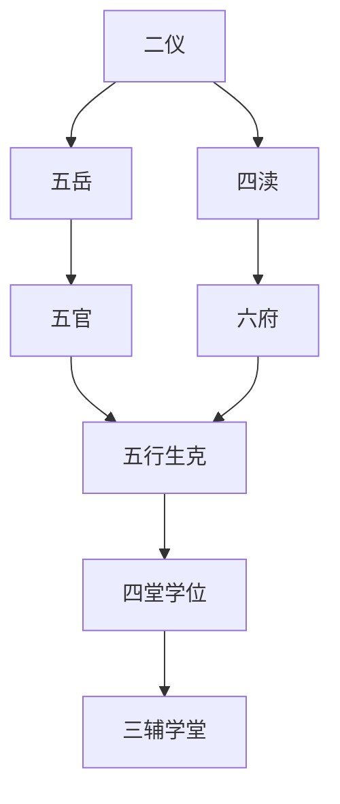

## 本章要义

本章把上一章的横列点收成几套总法：二仪（头天颏地、天庭地角相朝）、五岳（额衡、颏恒、鼻嵩、左泰、右华）、四渎（鼻济、目淮、耳江、口河）、五官、六府，再配五行所生、五脏所出、五表方位与生克比和口诀，最后落到四堂学位与上中下三辅学堂。分论清楚，官职分厘很碎，所以本章**进阶**。五岳四渎的位置可对照[[xuanxue/taiqing-04-henglie-xia|山根至地角横列]]；神气另见[[xuanxue/taiqing-06-shenqi|心术神气]]。

这是**术数文献，不是医学**。五脏所出把眼舌鼻唇耳配肝心肺脾肾，是五行配属，不是解剖或诊断。一官好贵十年、一府好富十年、学堂分厘出将入相，都是旧说品级，不能当仕途证明。

*图注：五步环对应二仪、五岳四渎、五官六府、五行生克、学堂三辅。术数文献，不是医学。*

## 底本

旧题后周王朴撰《太清神鉴》，四库提要以为依托，疑出宋人。本章据 youngzs/xuanxue 仓库卷二「二仪相应」至「三辅学堂」节选。四渎末注「《人伦风鉴》同」。原文尽量保持底本用字；「横岳」「出五主命」「都计无分此也」「令禄」「兵奖」「给谏轻要」一类，白话按通行文意疏通。

## 对读

### 二仪相应

> 难度：进阶

肃肃出乎天，赫赫发乎地。

**白话：** 肃肃之气从天而出，赫赫之气从地而发。

两者交通已成，和而万物生焉。

**白话：** 两者交通已经完成，和谐了，万物就从这里生出来。

此乾坤二仪之应也。

**白话：** 这就是乾坤二仪的感应。

故能富万物，盛德大业，无所不至矣。

**白话：** 所以能富养万物，盛德大业，没有到不了的地方。

且人之二仪者亦有象焉。

**白话：** 人的二仪也有取象。

以头为天，以颏为地，又以天庭象天，地角象地。

**白话：** 拿头当天，拿下巴当地；又拿天庭象天，地角象地。

此两位欲得丰满相朝，上下相应，故亦能富贵福禄矣。

**白话：** 这两位要丰满、彼此朝拱、上下相应，所以也能富贵福禄。

*图注：红点标上停、中停、下停，对应发际到眉、眉到准头、准头到地阁。用来对照本段「以头为天，以颏为地」「天庭象天，地角象地」的上下之象；三停切分与后文三辅学堂不是同一套尺。术数文献，不是医学。*

### 五岳

> 难度：进阶

五岳者，上应天之五星，下镇地之五方。

**白话：** 五岳：上应天上的五星，下镇地上的五方。

高峻敦厚，所以卓然立与乾坤之内者，以其相资而成天地之大也。

**白话：** 它们高峻敦厚，所以能卓然立在乾坤之内，是因为彼此相资，才成得了天地之大。底本「立与」即立于。

人亦有所象焉，故额为横岳，欲得方而广；颔为恒岳，欲得圆而厚；左颧为泰岳，右颧为华岳，左右欲得圆而正；鼻为嵩岳，欲得高而峻。

**白话：** 人面上也有取象：额为横岳（即衡岳），要方而广；颔为恒岳，要圆而厚；左颧为泰岳，右颧为华岳，左右要圆而正；鼻为嵩岳，要高而峻。

*图注：红点标额、鼻、左右颧、地阁。左颧东岳在人物自身左侧（照片右侧）。对应原文「额为横岳」「鼻为嵩岳」「左颧为泰岳，右颧为华岳」「颔为恒岳」。术数文献，不是医学。*

故五岳法，须要丰隆而相朝，高峻而不陷，乃相之贵矣。

**白话：** 所以五岳的法则是：要丰隆而互相朝拱，高峻而不塌陷，才是贵相。

### 四渎

> 难度：进阶

地之四渎者，所以相朝，以接其流通。

**白话：** 地上的四渎，是用来互相朝接、接通流通的。

人之形貌，亦有象焉。

**白话：** 人的形貌也有取象。

且鼻为济，目为淮，耳为江，口为河。

**白话：** 鼻为济，目为淮，耳为江，口为河。

*图注：红线标耳江、目淮、鼻济、口河，对应原文「鼻为济，目为淮，耳为江，口为河」。术数文献，不是医学。*

故四渎欲得端直、清大、明净、流畅、涯岸成就者，则应于神，故贵而多智也。

**白话：** 所以四渎要端直、清大、明净、流畅、涯岸成就，才能应于神，所以贵而多智。

若夫丑而不端，则为愚人。

**白话：** 若生得丑而不端，就是愚人。

毁而陷者，则为贱类也。

**白话：** 毁坏而塌陷的，就是贱类。

（《人伦风鉴》同）

**白话：** 底本注：此段与《人伦风鉴》相同。

*图注：分格对照额衡、颏恒、鼻嵩、左泰、右华，以及耳目口鼻为江河淮济。对应「五岳法，须要丰隆而相朝」与「四渎欲得端直、清大、明净、流畅」。术数文献，不是医学。*

### 五官

> 难度：进阶

五官者，目为监察官，鼻为审辨官，口为出纳官，耳为采听官，眉为保寿官。

**白话：** 五官：目为监察官，鼻为审辨官，口为出纳官，耳为采听官，眉为保寿官。

*图注：红线标眉、眼、鼻、口、耳，对应原文「目为监察官，鼻为审辨官，口为出纳官，耳为采听官，眉为保寿官」。术数文献，不是医学。*

五者欲得清而秀，丰而隆，或一官好，则贵十年。

**白话：** 五者要清而秀、丰而隆。或者一官好，就贵十年。

或有缺陷者，及丑恶者，凶。

**白话：** 或者有缺陷的，以及生得丑恶的，为凶。

### 六府

> 难度：进阶

两目上为二府，两辅頬为四府，两颧骨为六府。

**白话：** 两目之上为二府，两辅颊为四府，两颧骨为六府。底本「頬」即颊。

*图注：图标天仓、颧府、地库；本章正文是「两目上为二府，两辅颊为四府，两颧骨为六府」，两套切分不要混成一图。术数文献，不是医学。*

六府者，欲得平满光而莹。

**白话：** 六府要平满、光而莹。

若一府好乃富十年。

**白话：** 如果一府好，就富十年。

或有缺陷疵瘢黑痣者，凶也。

**白话：** 或者有缺陷、疵瘢、黑痣的，为凶。

### 五行所生

> 难度：进阶

木为仁，主英华茂秀，定贵贱也。

**白话：** 木为仁，主英华茂秀，用来定贵贱。

火为礼，主势威猛烈，定刚柔也。

**白话：** 火为礼，主势威猛烈，用来定刚柔。

金为义，主诛伐刑法、厄难灾危，定寿夭也。

**白话：** 金为义，主诛伐刑法、厄难灾危，用来定寿夭。

水为智，主聪慧明敏，定贤愚也。

**白话：** 水为智，主聪慧明敏，用来定贤愚。

土为信，主要德载万物，定贫富也。

**白话：** 土为信，主厚德载万物（底本「主要德」当作「主厚德」或「主德」），用来定贫富。

### 五脏所出

> 难度：进阶

眼出为肝，又主筋脉爪甲。

**白话：** 眼所出属肝，又主筋脉爪甲。这是五行配属，不是解剖。

心出为舌，又主血气毛发。

**白话：** 心所出属舌，又主血气毛发。仍是术数配属，不是医学。

肺出为鼻，又主皮肤喘息。

**白话：** 肺所出属鼻，又主皮肤喘息。不是呼吸科诊断。

脾出为唇，又主肉。

**白话：** 脾所出属唇，又主肉。

肾出为耳，又主骨齿也。

**白话：** 肾所出属耳，又主骨齿。

### 五表所属之方

> 难度：进阶

耳属北为壬癸水，眼属东方甲乙木，舌属南方丙丁火，鼻属西方庚辛金，面属中央戊巳土。

**白话：** 耳属北，为壬癸水；眼属东方，为甲乙木；舌属南方，为丙丁火；鼻属西方，为庚辛金；面属中央，为戊己土。底本「戊巳」即戊己。

### 五行相生歌

> 难度：进阶

耳有垂珠鼻有梁，金水相生主大昌，眼明耳好多神气，若不为官富更强。

**白话：** 耳有垂珠、鼻有梁，金水相生，主大昌；眼明耳好、神气多，即便不为官，富也更强。

口方鼻直人须贵，金土相生紫绶郎。

**白话：** 口方鼻直，人必贵，金土相生，是紫绶之郎。

唇方眼黑木生火，为人志气多财粮。

**白话：** 唇方眼黑，木生火，为人有志气、多财粮。

舌长唇厚火生土，此人有福中年昌。

**白话：** 舌长唇厚，火生土，此人有福，中年昌。

眼长眉秀足风流，身坐金章朝审堂。

**白话：** 眼长眉秀，足够风流，身坐金章，朝审堂。

### 五行相克歌

> 难度：进阶

耳大唇薄水克火，衣食贫寒空有智。

**白话：** 耳大唇薄，水克火，衣食贫寒，空有智。

唇大耳薄亦如然，此相之人终不贵。

**白话：** 唇大耳薄也一样，此相之人终不贵。

鼻大眼小金克木，一世贫寒受孤独。

**白话：** 鼻大眼小，金克木，一世贫寒、受孤独。

眼大鼻小难为成，虽有资财寿命促。

**白话：** 眼大鼻小，难以有成，虽有资财，寿命短促。寿命是术数话，不是医学。

舌小耳大水克火，急性孤独区人我。

**白话：** 舌小耳大，水克火，急性、孤独，把人我分得很清（底本「区人我」即区别人我）。

耳小舌大亦不仁，悭吝心恶多灾祸。

**白话：** 耳小舌大也不仁，悭吝心恶、多灾祸。

舌大鼻小火克金，钱财方盛祸来侵。

**白话：** 舌大鼻小，火克金，钱财刚盛，祸就来侵。

鼻大舌小招贫苦，寿长无子送郊林。

**白话：** 鼻大舌小，招贫苦，寿长却无子，送到郊林。

眼大唇小木克土，相此之人终不富。

**白话：** 眼大唇小，木克土，此相之人终不富。

唇大眼小贵难求，到老贫寒死无墓。

**白话：** 唇大眼小，贵难求，到老贫寒，死无墓。

### 五行比和相应

> 难度：进阶

耳反须贴肉，鼻仰山根足。

**白话：** 耳要反贴肉，鼻仰而山根充足。

眼露黑睛多，唇反齿如玉。

**白话：** 眼露而黑睛多，唇反而齿如玉。

脸近于眼口，必主公卿福。

**白话：** 脸贴近眼口，必主公卿之福。

只恐寿不延，性气刚难伏。

**白话：** 只怕寿不延长，性气刚而难伏。

*图注：三格分生、克、比和：木→火→土→金→水→木；木克土、土克水、水克火、火克金、金克木；同气相成。对应「五行相生歌」「五行相克歌」与「五行比和相应」。术数文献，不是医学。*

### 四堂学位

> 难度：进阶

一曰眼为官学堂，欲得长而秀清，黑白分明，主有官职。

**白话：** 第一，眼为官学堂，要长而秀清、黑白分明，主有官职。

二曰当门两齿为内学堂，欲得白而平正、密而莹大者，主有忠信德行。

**白话：** 第二，当门两齿为内学堂，要白而平正、密而莹大，主有忠信德行。

三曰额为禄学堂，欲得方而广、莹而峻，主爵禄富贵。

**白话：** 第三，额为禄学堂，要方而广、莹而峻，主爵禄富贵。

四曰耳门之前为外学堂，欲得平满光莹，主聪明学识也。

**白话：** 第四，耳门之前为外学堂，要平满光莹，主聪明学识。

### 三辅学堂

> 难度：进阶

三辅学堂

**白话：** 学堂再分上辅、中辅、下辅三处。下面按上、中、下分说。分厘合参只是旧说品级，不能当仕途证明。

### 上辅学堂

> 难度：进阶

上辅学堂者，身自天中至印左右横列十位，谓之二分部。

**白话：** 上辅学堂：从天中到印堂左右横列十位，叫做二分部。

光润全起，成就平如径寸，主大贵，出将入相，官至二品。

**白话：** 光润全起，成就是平的像径寸那样，主大贵，出将入相，官至二品。

更若中辅全者，位极人臣一品之职。

**白话：** 若中辅也全，位极人臣，一品之职。

上辅有一部缺陷，仍以中下辅参之。

**白话：** 上辅有一部缺陷，仍要用中辅、下辅来参看。

此而不成就，止主参领权务，出五主命，官至二品。

**白话：** 这一部若不成就，只主参领权务。底本「出五主命」难解，或指出五品、主命一类，官仍可至二品。

或中下全陷无部应得，主给承郎。

**白话：** 或者中下全陷、没有部位应得，主给事、承郎一类。

侯武更东西岳起，地角高额相应之时，节戟方面，或中辅更一分应之，必为真宰之位。

**白话：** 若是侯封、武职，又东西岳高起，地角与高额相应，可节戟方面；或者中辅再有一分相应，必为真宰（宰相）之位。

当荣极旺二十年早遂，中限当秉生杀。

**白话：** 正当荣极旺二十年，早早遂意，中限当握生杀之权。

若下辅二分应者亦无缺陷，当主大权。

**白话：** 若下辅二分相应、也没有缺陷，当主大权。

然下辅主繁冗之职，即不能久居相府，当镇方郡，必建旌旗。

**白话：** 可是下辅主繁冗之职，即不能久居相府，当去镇守方郡，必建旌旗。

若下二分与上辅全备，即使相矣。

**白话：** 若下辅二分与上辅都全备，便是宰相。

若上合一分、中辅一分全者，亦主内制清要之位。

**白话：** 若上辅合得一分、中辅一分全，也主内制清要之位。

或只相部合一分五厘，余别无应，形足气清，必给谏御史之职。

**白话：** 或者只相门部位合得一分五厘，其余别无应，但形足气清，必是给谏、御史之职。

更中辅五厘应之，必殊常紧要之位，才名挺动四方。

**白话：** 再有中辅五厘相应，必是非常紧要之位，才名震动四方。

中辅二分全者，应为成就，主卿监使相兵将之权。

**白话：** 中辅二分全，应算成就，主卿监、使相、兵将之权。

或东西岳起，地角朝厚，武官主侯伯之封。

**白话：** 或者东西岳起，地角朝厚，武官主侯伯之封。

中上三分全好者，大权。

**白话：** 中辅、上辅三分全好，主大权。

一为皆小通无滞，一为旺二十年。

**白话：** 一是都小通而无滞，一是旺二十年。

所谓兰膏成就，学堂宽博，真贵人也。

**白话：** 所谓光润如兰膏而成就，学堂宽博，真贵人。

若学堂或圆或方，五分俱起，统摄万邦助国王，侯伯之相。

**白话：** 若学堂或圆或方，五分都起，统摄万邦、辅助国王，是侯伯之相。

以上若一位枯干，恶色、乱纹痕，皆为破陷，虽郡城职位，多滞迍 也。

**白话：** 以上若有一位枯干，或恶色、乱纹痕，都是破陷，虽有郡城职位，也多滞顿迍邅。

### 中辅学堂

> 难度：进阶

中辅学堂者，自山根下至准上两眼正口并额骨六位，谓之一分位。

**白话：** 中辅学堂：从山根下到准上，两眼、正口并额骨六位，叫做一分位。

若位丰隆，或若红紫色光泽，无断纹痕、翳黡黑痣，主都察台阁清资。

**白话：** 若这些部位丰隆，或有红紫色光泽，没有断纹、翳黡、黑痣，主都察、台阁清资。

不然，兵刑之位，一生少滞无灾，有声名。

**白话：** 不然就是兵刑之位，一生少滞无灾，有声名。

更下辅一家全应，必为四品荫深（一作卿监）正郎之职。

**白话：** 再有下辅一家全应，必为四品荫深（一作卿监）正郎之职。

若下辅二分全与中辅俱好，即三公尚书侍郎。

**白话：** 若下辅二分全，与中辅都好，就是三公、尚书、侍郎。

不入两府。

**白话：** 不入两府（中书、枢密）。

有威权重名动朝野，武臣则建节方外将帅之权。

**白话：** 有威权重、名动朝野；武臣则建节于方外，有将帅之权。

其下辅成其中辅有五厘不成就，亦主卿监四品官。

**白话：** 下辅已成，其中辅有五厘不成就，也主卿监四品官。

若中辅全就而龙虎外起，并主三品之位。

**白话：** 若中辅全就，又龙虎外起，并主三品之位。

如形神端静，部位相称，骨气清秀，头角深长，高入发际，主给谏轻要之职。

**白话：** 如形神端静，部位相称，骨气清秀，头角深长、高入发际，主给谏清要之职（底本「轻要」当作「清要」）。

其气昏浊，部位不明，疵瘢黑痣，是谓缺陷有破，乃一生少权，无声多滞，官职歇灭。

**白话：** 若气昏浊，部位不明，有疵瘢黑痣，叫做缺陷有破，乃是一生少权，无声名、多滞，官职歇灭。

凡相人宜细详消息，则不失矣。

**白话：** 凡相人应当细细消息，才不会看走。

### 下辅学堂

> 难度：进阶

下辅学堂者，自元璧下至颐额四位谓之二分位。

**白话：** 下辅学堂：从元璧下到颐颔四位，叫做二分位。底本「颐额」当作颐颔。

二位丰满明泽光润而全成就者，主卿监正郎、兵将藩府、繁剧要务之任。

**白话：** 这两位丰满、明泽光润而全部成就，主卿监正郎、兵将藩府、繁剧要务之任。

如武臣，则防团刺史守边之职。

**白话：** 如是武臣，则是防御、团练、刺史守边之职。

如二分俱备，只左右破陷四厘者，可取准头应之。

**白话：** 如二分都备，只左右破陷四厘，可取准头来应。

亦主有五品、三品职官。

**白话：** 也主有五品、三品职官。

武则诸司使副之位，然须多滞，晚年方达者。

**白话：** 武职则是诸司使副之位，然而须多滞，晚年才发达。

下辅每分即有五厘、两处共成一分者，京官幕职而已。

**白话：** 下辅每一分只有五厘、两处共成一分，不过京官幕职而已。

若中辅兼得二厘，光润丰满，亦可位至员郎。

**白话：** 若中辅兼得二厘，光润丰满，也可位至员郎。

或即上辅两三部中相应合，成一分七厘者，主正郎声望清显。

**白话：** 或者上辅两三部相应合，成一分七厘，主正郎、声望清显。

其上中下三辅合得八厘者，文主令禄幕府之官，武当借职班行之位。

**白话：** 上中下三辅合得八厘，文职主令录、幕府之官（底本「令禄」当作令录），武职当借职班行之位。

若三两处每处二三厘合成一分者，虽无官职，亦主衣食自足。

**白话：** 若三两处每处二三厘合成一分，虽无官职，也主衣食自足。

若上部一分学堂，员郎之位，二分学堂，两眉分制，或中下学堂应之，则将相资财职。

**白话：** 若上部一分学堂，是员郎之位；二分学堂，两眉分制，或中下学堂来应，则是将相、资财之职。

上部学堂二分，其三分者，不入两府，主兵奖之权。

**白话：** 上部学堂二分；其三分者，不入两府，主兵将之权（底本「兵奖」当作兵将）。

共得四分者，出将入相。

**白话：** 共得四分，出将入相。

五分全就者，总摄四方，贵不可言也。

**白话：** 五分全就，总摄四方，贵不可言。

上左右十位二分，中六位一分，下四位二分，都计无分此也。

**白话：** 上辅左右十位为二分，中辅六位为一分，下辅四位为二分，都计五分，此其总分（底本「都计无分此也」当作「都计五分此也」）。

*图注：上停下箭头连中停、下停，标上停主禄初年、中停主寿中年、下停主富晚年。用来对照三辅学堂的上中下层次；口诀切分是发际—眉—准头—地阁，三辅是天中至印、山根至准、元璧至颐的另一套部位尺。术数文献，不是医学。*
