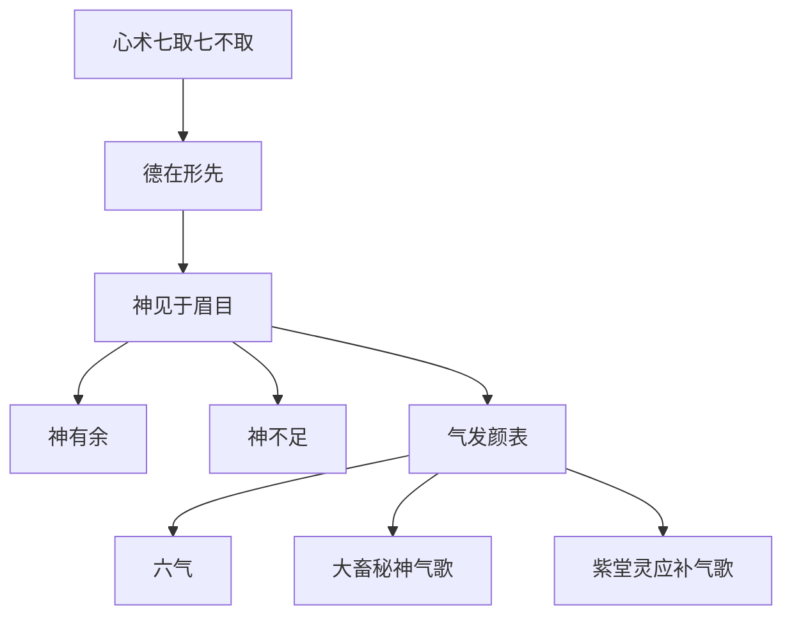

## 本章要义

本章是《太清神鉴》卷三的心术、德、死生、神与气。先论心术七可取、七不可取，再把德放在形前；死生论借神昏、神乱、神浮、神杂来讲「可以相」，不是寿命预测。神分古、清、藏、媚与流散昏浊，并专论神有余、神不足；气充形、形安气，脸上还有青龙、朱雀、勾陈、螣蛇、白虎、玄武六气。文末两首歌诀按部位点气色吉凶，与下一章[[xuanxue/taiqing-07-qise|气色吉凶]]对读。观神可对照[[xuanxue/bingjian|冰鉴]]神骨；部位名称见[[xuanxue/taiqing-05-wuyue-xuetang|五岳学堂]]。

这是**术数文献，不是医学，也不是诊断**。神清浊、龟息、六气、歌诀里的病死狱讼，都是相书套语，不能当体检、精神科或预后。

本章整体**进阶**；两首歌诀按部位应事，标**艰深**。

*图注：五步环对应心术七取、德在形先、神见于眉目、气发颜表、六气歌诀。死生论借神昏乱浮杂，不是寿命预测。术数文献，不是医学。*

## 底本

旧题后周王朴《太清神鉴》，实出宋人，《四库》从《永乐大典》辑为六卷。本章据 youngzs/xuanxue 仓库卷三「心术论」至「紫堂灵应补气歌」全录，不删段。死生论「须臾看浅深而断」「呜呼死生亦大矣」两出，仍并录。底本「德每里」按德美校读；「带人子」通行作列子壶子；「晤尽」按寤尽；「谚语涩缩」按言语；「体貌低催，如遭」下夺文；「咨鲒」按咨嗟；「元武／元光／元色／元坐」多是清讳改玄；「阕廷」即阙廷。夹注「螣蛇（玄武）」与后文元武并列，疑误，原文仍存。

## 对读

卷三

**白话：** 《太清神鉴》卷三。

### 心术论

> 难度：进阶

形不胜貌，心不昧术，久昧者，不明也。

**白话：** 形如果胜不过外貌，心就会被「术」弄昏；昏得久了，便不明。这是心术总起，不是医论。

为物所役，故屈于用心，为事所夺，故谬于择术。

**白话：** 被外物役使，所以用心委屈；被事务抢走，所以择术也错了。

卒至凶咎、悔吝之及也，然后怨天尤人，比比皆是。

**白话：** 等到凶咎、悔恨落到身上，才怨天尤人，这样的人到处都是。

每一念想，未尝不为太息。

**白话：** 每想到这一层，没有不为此长叹的。

然临事制物，正心术而可取者有七，乖心术而不可取者，亦有七。

**白话：** 然而临事处物，心术端正、可以取的有七种；心术乖张、不可取的，也有七种。

所可取者何？一曰忠孝，二曰平等，三曰宽容，四曰纯粹，五曰施惠，六曰有常，七曰刚直。

**白话：** 可以取的是哪些？一是忠孝，二是平等，三是宽容，四是纯粹，五是施惠，六是有常，七是刚直。

其不可取者，一曰阴恶，二曰邪秽，三曰苛察，四曰矜夸，五曰奔竞，六曰谄谀，七曰苟且，此皆出心术之不同，而感于异也。

**白话：** 不可取的：一是阴恶，二是邪秽，三是苛察，四是矜夸，五是奔竞，六是谄谀，七是苟且。这些都出于心术不同，感应也就两样。

此古人有论心择术之戒也，或曰：“心术之不可取与所可取者各有，此于形可得乎？”曰：“貌端气和者忠孝，骨正色静者平等，眉开眼大者宽容，气和闲暇者纯粹，面开准黄者施惠，鼻直神定者有常；刚肃貌古者刚直。

**白话：** 所以古人有论心、择术的告诫。有人问：「心术的可取与不可取各自都有，这在形上能看出来吗？」回答说：「貌端正、气平和的，是忠孝；骨正、色静的，是平等；眉开、眼大的，是宽容；气和、神态闲暇的，是纯粹；面开、准头带黄的，是施惠；鼻直、神定的，是有常；刚肃而貌古的，是刚直。」

有是七者，在所取也。

**白话：** 有这七种，在可取之列。

眼凶神露者险恶，眼下嫩色者邪秽，眼深肉横者苛察，眼有忿气者矜夸，眼急色杂者奔竞，视流容笑者谄谀，气粗身摇者苟且。

**白话：** 眼凶而神外露的，是险恶；眼下嫩色的，是邪秽；眼深而横肉的，是苛察；眼里带着忿气的，是矜夸；眼急而色杂的，是奔竞；目光流动、脸上堆笑的，是谄谀；气粗而身子摇的，是苟且。

有此七者，为心术，在所不取也。

**白话：** 有这七种，属于心术，在不可取之列。

如眼下肉生，龙宫福堂，黄气盘绕，是有阴德之人也。

**白话：** 如果眼下生肉，龙宫、福堂一带黄气盘绕，旧说是有阴德的人。

夫德物无心，临事无物，体道而出，体道而入，世间种种，一无于吾之灵台，果何心术之有哉？所谓心术者，乃以勉人之不及已。

**白话：** 对待万物没有私心，临事也不被外物牵住，体道而出、体道而入，世间种种，一样也不沾我的灵台，那还谈什么心术呢？所谓心术，不过是用来勉励人还做不到这一步的。

惧而行之，亦可以同归乎善，而受道也。

**白话：** 心存戒惧地去实行，也可以同归向善，而承受这个道。

（《玉管照神》“七可取”同）

**白话：** 《玉管照神》「七可取」一节与此相同。

### 论德

> 难度：进阶

德之为义大矣哉！天之有大德也，四时行而长处高；地之有至德也，万物生而长处厚。

**白话：** 德的意义太大了！天有大德，四时运行而天始终处在高处；地有至德，万物生长而地始终处在厚处。

人之有德也，亦若是矣。

**白话：** 人有德，也是这样。

是故人道祐之，人心归之，享长生之荣，且能孝于亲，能忠于君，能和于人，能齐于物。

**白话：** 所以人道保佑他，人心归向他，享长久的荣；并且能孝于亲、忠于君、和于人、齐于物。

为德之先，为行之表。

**白话：** 这是德的领先处，也是行为的表率。

虽未阳赏，必获阴报，未及其身，必及子息。

**白话：** 即使当时没有阳间的赏赐，也必有阴报；报不到他本人，也必报到子孙。

是以善相者，先察其德，后相其形。

**白话：** 所以善相的人，先察他的德，再相他的形。

故德每里而形恶，无妨为君子；形善而行凶，不害为小人。

**白话：** 因此德美（底本「每里」，按「美」「理」一类校读）而形恶，不妨仍是君子；形善而行凶，仍不妨是小人。

荀子曰：“相形不如相心，论心不如论德。

**白话：** 荀子说：「相形不如相心，论心不如论德。」

”此劝人为善也，又言其德为先矣。

**白话：** 这是劝人向善，也是说德要放在前面。

夫形者，譬之匠也。

**白话：** 形，好比工匠。

材既美矣，匠拙则弃之，乃为不材之木也。

**白话：** 材料已经美了，工匠拙，仍会把它丢掉，它就成了不材之木。

人之形美矣，苟无德，则形以虚美，而天祸人损，遭之无疑也。

**白话：** 人的形已经美了，假如没有德，形就是虚美，天祸人损，落到头上是无疑的。

是知德在形先，形居德后，乍可有德而形恶，不可形善而无德矣。

**白话：** 由此知道：德在形先，形居德后。宁可有德而形恶，不可形善而无德。

### 死生论

> 难度：进阶

古之至人以生为劳佚，以死为休息。

**白话：** 古代至人把生看成劳作与安逸，把死看成休息。

是以知来去非我，而可以生可以死也，将独立乎万物之上，斡旋乾坤于太虚之中。

**白话：** 所以知道来去都不属于「我」，可以生也可以死，将独立在万物之上，在太虚之中斡旋乾坤。

果何得死生而相邪？此郑之神巫，见带人子，始以其子不可复治，终则未死而老也。

**白话：** 那还怎么拿死生来相人呢？这就是郑国神巫见壶子的故事（底本「带人子」，通行作列子所记壶子）：起先以为这人不可再治，后来却并未死，一直活到老。

徒下愚而不知道，汩没世事，认己为有，认物为我，以生为可悦，以死为可恶。

**白话：** 只是下愚不知道，沉没在世事里，把「己」认成实有，把外物认成我，以生为可喜、以死为可恶。

内焉所藏于心，思虑萦萦，妄意一生，面目乃变，使人得以相之。

**白话：** 里面所藏的都在心里，思虑缠来缠去，妄念一生，面目就变了，别人这才得以相他。

故神昏者死，神乱者死，神浮者死，神杂者死，以此言谈动止俱失，当不过数旬而死矣。

**白话：** 所以神昏的死，神乱的死，神浮的死，神杂的死；因此言谈举止都失了常，应当不过数十日就死了。——这是术数死候，不是医学诊断。

须臾看浅深而断，然不可拘也。

**白话：** 看神的深浅，片刻之间就能断，然而不可拘泥。

呜呼！死生亦大矣。

**白话：** 唉！死生也是大事啊。

世之迷者，须臾看浅深而断，然不可拘也。

**白话：** 世上迷惑的人，片刻看深浅就下断，然而不可拘泥。

呜呼！死生亦大矣。

**白话：** 唉！死生也是大事啊。

世之迷者，改头换面，沉溺苦海，不知究也。

**白话：** 世上迷惑的人，改头换面，沉溺苦海，不知道追究。

胡不断所寂灭观相，识本来面目，一证人事。

**白话：** 何不在寂灭里观相，识本来面目，一证人事？

如曰不然，未免流转死生之途，而受苦恼也。

**白话：** 如果说不是这样，就免不了流转在死生路上，而受烦恼。

### 论神

> 难度：进阶

神之为道，出而不可见，隐而不可求，故虚而无形也。

**白话：** 神这个道，出来看不见，隐起来求不到，所以虚而没有形。

则是所要之于心，隐而无象也。

**白话：** 那么就要向心里求，它隐而没有象。

则可测之于形，昭昭然见于眉目之上，幽幽然运于五脏之里。

**白话：** 却可以在形上测：明明白白见于眉目之上，深深地运行在五脏里面。

*图注：红标在眼侧，不遮瞳孔。标签按人物自身左右：照片右侧为左目。对应「昭昭然见于眉目之上」。一身精神具乎两目，是术数观神，不是眼科。*

故人云晤尽则神游于眼，六德则神思于心，是神出处于形而为之表，犹日月之光，外照万物，而其神隐于日月之内也。

**白话：** 所以人说：寤尽了，神就游到眼里；六德（与下句「六昧」对，底本如此）则神思在心里。神从形里出来，做形的外表，如同日月的光，外照万物，而神仍隐在日月之内。

且夫人之眼明则神清，昏则神浊。

**白话：** 人的眼明，神就清；眼昏，神就浊。

清则六德多，六昧少；浊则六昧多，六德少。

**白话：** 清则六德多、六昧少；浊则六昧多、六德少。

夫梦之境界，盖神游于心，而所游远亦出五脏六腑之间，与夫耳目视听之内也。

**白话：** 梦的境界，是神游于心；所游再远，也不出五脏六腑之间，以及耳目视听之内。

其所游之象与所见之事，或因想而成，或遇事而至，亦吾一身所自有也。

**白话：** 所游的象、所见的事，或因心想而成，或遇事而至，也是我一身自己有的。

故梦中所见之事，乃在吾一身之中，非出吾一身之外矣。

**白话：** 所以梦中所见的事，是在我一身之中，不是出到一身之外。

故白眼禅师说梦有五境：一曰虚境，二曰实境，三曰过去境，四曰现在境，五曰未来境。

**白话：** 所以白眼禅师说梦有五境：一虚境，二实境，三过去境，四现在境，五未来境。

是神躁则境生，神静则境灭。

**白话：** 神躁则境生，神静则境灭。

则知是境也，由人动静而生者也。

**白话：** 由此知道：这些境，是由人的动静生出来的。

夫望其形，或洒然而清，或翘然而秀，或皎然而明，或凝然而莹，眉目耸动，精彩射人，皆由神发于内，而见于表也。

**白话：** 望他的形，或洒然清，或翘然秀，或皎然明，或凝然莹，眉目耸动，精彩射人，都是神从内发，而见于外表。

其神清而和、明而彻者，富贵之象也；昏而浊、柔而怯者，贫薄之相也。

**白话：** 神清而和、明而彻的，是富贵之象；昏而浊、柔而怯的，是贫薄之相。

实而静者其神和（《玉管》云：“详而静者其神安，虚而急者其神躁。

**白话：** 实而静的，神就和（《玉管》说：「详而静的神安，虚而急的神躁。」

”）故于君子善养其性者，无暴其气。

**白话：** ）所以君子善于养性的，不要让气暴烈。

其气不暴，则形安。

**白话：** 气不暴，形就安。

形安而神不全者，未之有也。

**白话：** 形安了而神却不全的，从来没有。

又云：气者，阴阳之移人，无寒暑之故，不其难乎？仿佛之间，变则有气。

**白话：** 又说：气是阴阳用来移人的，没有寒暑的缘故，难道不难吗？仿佛之间，一变就有气。

神则同乎气，而有所主也。

**白话：** 神与气相同，却有所主持。

及乎气变而有形，神止乎形而有寓也。

**白话：** 等到气变而有了形，神就止在形里而有所寄寓。

变而有生，神则未尝生。

**白话：** 变而有生，神却未曾生。

变而有死，神者未尝死。

**白话：** 变而有死，神却未曾死。

古之得道者，不染尘埃，不役于事，为知神之妙，与太虚同体知神之微，与造化同用，则为圣人至人、神人。

**白话：** 古代得道的人，不染尘埃，不被事役使，因为知道神的妙，与太虚同体；知道神的微，与造化同用，那就是圣人、至人、神人。

为用如此，是形在人事间者，神则藏于心，发现于眉目之间。

**白话：** 作用到这一步，形还在人事之间的人，神就藏在心里，发现在眉目之间。

*图注：图式借冰鉴「文人先观神骨」口诀：神具两目、骨具面部。用来对照本节「神藏于心，发现于眉目之间」，不是太清原图。*

犹未失其本真。

**白话：** 还没有失去本真。

则以古为上，清次之，藏次之，媚又次之。

**白话：** 那么以古为上，清次之，藏次之，媚又次之。

如流散昏浊，是其从谬至迷，一至如此，不足论也。

**白话：** 至于流散、昏浊，是从谬误走到迷惑，到了这一步，不足论了。

耸然不动，视之有威，谓之古。

**白话：** 耸然不动，看去有威，叫作古。

澄然莹澈，视之可爱，谓之清。

**白话：** 澄然莹澈，看去可爱，叫作清。

怡然洒落，视之难舍，谓之媚。

**白话：** 怡然洒落，看了难以舍开，叫作媚。

各得其体格神气而赋之，未有不为公卿。

**白话：** 各自得到体格神气而赋给他，没有不做公卿的。

达而上，则神仙矣。

**白话：** 再往上通达，就是神仙了。

媚虽有贵，乃阿谀谗佞之人。

**白话：** 媚虽然也有贵，却是阿谀谗佞的人。

虽在朝廷，身之进退，亦何足数？似明不明，似峻不峻，谓之流散。

**白话：** 即使在朝廷，身子的进退，又何足数？似明不明、似峻不峻，叫作流散。

似醉不醉，似困不困，谓之昏浊。

**白话：** 似醉不醉、似困不困，叫作昏浊。

呜呼！人之丧精失灵，不知神之所谓。

**白话：** 唉！人丧精失灵，不知道神究竟是什么。

以至为万物同出入于机，不知觉也。

**白话：** 以至于和万物一同从机关里出入，自己却不知道、不觉察。

### 论神有余

> 难度：进阶

神之有余者，眼色清莹，顾盼不斜，眉秀而长，精彩耸动，容貌澄澈，举止汪洋。

**白话：** 神有余的人：眼色清莹，顾盼不斜，眉秀而长，精彩耸动，容貌澄澈，举止汪洋。

洒然远视，若秋月之照霜天；巍然近瞩，似和风之动春花。

**白话：** 洒然远视，像秋月照霜天；巍然近看，像和风动春花。

临事刚毅，如猛兽而步深山；处众超逸，似丹凤而翔云路。

**白话：** 临事刚毅，如猛兽走在深山；处众超逸，似丹凤翔在云路。

其坐也，若介石不动；其卧也，如栖鸟不摇。

**白话：** 他坐着，像介石一样不动；他睡着，像栖鸟一样不摇。

其形也，洋洋然如平水之流。

**白话：** 他的形，洋洋然像平水之流。

昂昂然如孤峰之耸。

**白话：** 昂昂然像孤峰高耸。

言不妄发，性不妄躁，喜怒不动其心，荣辱不易其操。

**白话：** 话不妄发，性不妄躁，喜怒动不了他的心，荣辱改不了他的操守。

万态纷错于前而心恒一。

**白话：** 万态错杂在眼前，而心始终如一。

斯皆谓神有余也。

**白话：** 这些都叫作神有余。

神余者，皆为上贵之相。

**白话：** 神有余的，都是上贵之相。

凶灾难入，天禄永保其终矣。

**白话：** 凶灾难入，天禄能保到终了。

### 论神不足

> 难度：进阶

神之不足者：不醉似醉，常如病酒；不愁似愁，常如忧戚；不睡似睡，如睡才觉；不笑似笑，忽如惊忻。

**白话：** 神不足的：不醉却像醉，常如病酒；不愁却像愁，常如忧戚；不睡却像睡，像刚睡醒；不笑却像笑，忽然像又惊又喜。

不嗔似嗔，不喜似喜，不惊似惊，不痴似痴，不畏似畏。

**白话：** 不嗔像嗔，不喜像喜，不惊像惊，不痴像痴，不畏像畏。

容止昏浊，似染癫痫；神色惨怆，常如有失。

**白话：** 容止昏浊，像染了癫痫；神色惨怆，常像有所失落。

恍惚仓皇，常如恐惧。

**白话：** 恍惚仓皇，常像恐惧。

谚语涩缩，似羞隐藏。

**白话：** 言语涩缩，像害羞隐藏。（底本「谚语」，按「言语」校读。）

体貌低催，如遭。

**白话：** 体貌低垂催折，像遭受了……（底本「如遭」下夺文。）

色初鲜而后暗，语先快而后讷。

**白话：** 色起初鲜明、后来暗淡，话先痛快、后来迟钝。

此皆谓神不足也。

**白话：** 这些都叫作神不足。

神不足者，多招牢狱枉厄。

**白话：** 神不足的，多招牢狱、冤枉灾厄。

有官亦主失位矣。

**白话：** 有官也主失位。

### 论气

> 难度：进阶

论一人之至好，御二气以成德，交通而和也，则万物遂其性命；乖戾不调也，则万物失其理。

**白话：** 论一个人的至善，驾驭阴阳二气来成就德。二气交通而和，则万物遂其性命；乖戾不调，则万物失其理。

此乃天地之气，见乎变化也。

**白话：** 这是天地之气，见于变化。

石蕴玉而山辉，渊藏珠而川媚。

**白话：** 石里蕴着玉，山就有辉；渊里藏着珠，川就妩媚。

由夫至精之宝，见忽山川也。

**白话：** 由于那至精之宝，见于山川。（底本「见忽」，按「见乎」校读。）

万物之情美，莫不发乎气，而见乎色矣。

**白话：** 万物之情的美，没有不发于气、而见于色的。

夫形者，质也。

**白话：** 形，是质。

气者，用也。

**白话：** 气，是用。

气所以充乎质，质所谓运于气，是以由气以保形，由形以安气。

**白话：** 气用来充满质，质用来运行气，所以由气保形，由形安气。（底本「质所谓运于气」，按「质所以运于气」读。）

故质宏则气宽，神安则气静，得失不足以动其气，喜怒不足以乱其神，则于德为有容，于量为有度，是谓厚重之福之相也。

**白话：** 因此质宏则气宽，神安则气静；得失不足以动他的气，喜怒不足以乱他的神，于德便有容，于量便有度，这叫作厚重有福之相。

形如材，有松柏荆棘之异，气有规矩准绳之工，随材而成器，随形而制体。

**白话：** 形如材料，有松柏与荆棘的不同；气有规矩准绳的工夫，随材而成器，随形而制体。

故君子以形为善恶之地，以气为骐骥之马，善御之而得其道也。

**白话：** 所以君子把形当作善恶之地，把气当作骐骥之马，善于驾驭才得其道。

是以善人之气，不急不暴，不乱不躁。

**白话：** 因此善人的气，不急不暴，不乱不躁。

宽能容物，若大海之洋洋；和能接物，类春风之习习。

**白话：** 宽能容物，像大海洋洋；和能接物，像春风习习。

刚而能制，万态不足以动其操；清而能洁，千尘不足以污其色。

**白话：** 刚而能制，万态不足以动他的操守；清而能洁，千尘不足以污他的色。

小人反是，则不宽而隘，不和而戾，不刚而懦，不清而浊，不正而偏，不舒而急，但视其气之浅深，察其色之躁静，则君子小人可辨矣。

**白话：** 小人反过来：不宽而隘，不和而戾，不刚而懦，不清而浊，不正而偏，不舒而急。只要看气的浅深、察色的躁静，君子小人就可以分辨了。

气长而舒和，宽裕而不暴者，为福寿之人；急促而不匀，暴然见乎色者，为薄浅之相也。

**白话：** 气长而舒和、宽裕而不暴的，是福寿之人；急促而不匀、暴然见于色的，是薄浅之相。

且气之为道，又发乎颜表，而为吉凶之兆也。

**白话：** 并且气这个道，又发在颜面上，而成为吉凶的兆。

*图注：标印堂色与目色。对应「发乎颜表，而为吉凶之兆」。大者一生、小者三月是术数口诀，不是医学。*

其散如毛发，其聚如黍米，望之有形，按之无迹。

**白话：** 它散开像毛发，聚起像黍米，望去有形，按上去没有痕迹。

出入一面之部位，又应人之祸福。

**白话：** 出入在一张脸上的部位，又应着人的祸福。

若气呼吸无声，耳不自闻，或卧而不喘者，谓之龟息，寿相也。

**白话：** 如果呼吸无声，自己耳朵都听不见，或者睡着也不喘，叫作龟息，是寿相。

其或呼吸气盈而动者，乃为夭死之人。

**白话：** 如果呼吸气满而带动身体，便是夭死之人。——仍是术数话，不是呼吸科。

孟子不顾万钟之禄，以善养其气者也。

**白话：** 孟子不顾万钟之禄，是善于养气的人。

争升合之利，而悻悻然戾其色、暴其气者，何足道哉！

**白话：** 去争升合之利，却悻悻然使脸色乖戾、使气暴烈的，有什么可说的！

气之所以养形，在五脏六腑之间，因七情而敛散。

**白话：** 气用来养形，在五脏六腑之间，因七情而收敛、散开。

故发于五岳四渎之上，有六气之变，能清浊以无余，湛然寂如，固山水之渊，非六气可得而取也。

**白话：** 所以发在五岳四渎之上，有六气的变化。能够清浊都化尽，湛然寂静，本是山水之渊，不是六气可以取到的。

青龙之气，如祥云衬月；朱雀之气，如朝霞映水；勾陈之气，如黑风吹云；螣蛇（玄武）之气，如草木将要灰；白虎之气，如凝脂涂油；元武之气，如腻烟和雾。

**白话：** 青龙之气，如祥云衬月；朱雀之气，如朝霞映水；勾陈之气，如黑风吹云；螣蛇之气，如草木将要成灰（底本夹注「玄武」，与下文元武并列，疑误）；白虎之气，如凝脂涂油；玄武之气（底本「元武」，清讳改字），如腻烟和雾。

*图注：青龙、朱雀、勾陈、螣蛇、白虎、玄武各标区位。对应「六气之变」这一段。底本把螣蛇注成玄武，与后文元武并列，图按六神分位，不把两条并成一条。术数文献，不是诊断。*

六气之中，惟青龙为吉。

**白话：** 六气之中，只有青龙为吉。

其他或主破散，或主忧惊，或主哭泣，或主阴贼。

**白话：** 其他或主破散，或主忧惊，或主哭泣，或主阴贼。

如骨形不入格，终身为所累。

**白话：** 如果骨形不入格，终身被它所累。

如骨形正当侯得数，然后气散名显也。

**白话：** 如果骨形正当、侯得气数，然后气散、名才显。

亦看所赋之深浅，而消息之。

**白话：** 也要看所赋的深浅，而加以消息。

人有异相不贵，由为杂气所绕。

**白话：** 人有异相却不贵，是因为被杂气所绕。

如远山奇峰秀嶂，小为云雾所蔽，不可得而见也。

**白话：** 如同远山奇峰秀嶂，稍微被云雾遮蔽，就看不见了。

一遇匝地清风，当天皎月，奇峰秀嶂，非特可览于目前，必使留恋难舍也。

**白话：** 一旦遇上匝地清风、当天皎月，奇峰秀嶂不但可以在眼前看，还必使人留恋难舍。

### 大畜秘神气歌

> 难度：艰深

天中青色见，年内染微疴。

**白话：** 天中现出青色，这一年内会染上轻微的病。

直下来年上，定主见阎罗。

**白话：** 青气一直落到年上，旧说主见阎罗。

只到天牢上，入狱亦由他。

**白话：** 如果只落到天牢部位，入狱也由它应。

并准青光起，忧惊病至多。

**白话：** 连同准头升起青光，忧惊和病都会多。

青中更有黑，必损自家钱。

**白话：** 青里再夹黑色，必损自己的钱财。

散下双众狱，官事欲相牵。

**白话：** 散落到两处狱部，官事要来牵连。

印堂黄气起，官禄定高迁。

**白话：** 印堂黄气升起，官禄一定高升。

白气家遭丧，青来口舌缠。

**白话：** 白气，家里遭丧；青气来，口舌纠缠。

中正发黄丝，守令职无疑。

**白话：** 中正发出黄丝，必有守令一类官职。

赤点中心出，公事别妻儿。

**白话：** 中心现出赤点，因公事与妻儿分别。

青光惊必恐，黑色怪神窥。

**白话：** 青光主惊恐；黑色主怪神窥伺。

白色忧丧事，迍邅事日随。

**白话：** 白色忧丧事，困顿的事天天跟着。

白丝拦鼻上，绕口当年衰。

**白话：** 白丝拦在鼻上、绕住口，当年就要衰。

黑生一日内，财被贼来欺。

**白话：** 黑气在一日内出现，财被贼欺夺。

黑气横长起，夫妻欲散离。

**白话：** 黑气横着长起，夫妻要离散。

白光横过鼻，子息更妨之。

**白话：** 白光横过鼻子，还要妨子息。

讼狱横气起，在禁脱枷灾。

**白话：** 讼狱部位横气起，人在禁中，有脱枷之灾。

青丝下眉首，入狱共咨嗟。

**白话：** 青丝从眉头下来，入狱令人叹息。

黑气如斯至，狱死更无救。

**白话：** 黑气这样到来，狱中致死，更无救。

赤又浮青色，离狱亦有咎。

**白话：** 赤上再浮青色，出了狱也还有咎。

黄气生高广，如鼓挂悬空。

**白话：** 黄气生在高广，像鼓悬在空中。

百日为明牧，无中定贵封。

**白话：** 百日内做地方长官，无中也能定下贵封。

黄色来四季，应好事千通。

**白话：** 四季都来黄色，好事一件件应验。

色又房心应，官高职转雄。

**白话：** 色又应在房心，官高职转得更雄。

若占天中位，荣华与广同。

**白话：** 若占到天中位，荣华和高广一样。

双人促一鼓，必定拜三公。

**白话：** 像两个人凑成一面鼓，必定拜三公。

入准天中应，侯王列土封。

**白话：** 进到准头又应在天中，侯王列土之封。

印堂黄似月，魁第扼朝中。

**白话：** 印堂黄气如月，魁第、把持朝中。

日角黄丝发，兄弟有欢怡。

**白话：** 日角发出黄丝，兄弟欢洽。

白光来库墓，刀兵自失期。

**白话：** 白光来到库墓，刀兵之事自己误期。

入匮爱财物，元坐斗讼疑。

**白话：** 入金匮则贪爱财物；玄坐（底本「元坐」）则斗讼可疑。

喧争观上下，朱光口舌非。

**白话：** 上下部位看喧争，朱光主口舌是非。

厨中发黄色，喜在六旬余。

**白话：** 厨中发黄色，六十多日内有喜。

或因州府事，得职又非处。

**白话：** 或因州府的事得官，却不是本处。

房心生日花，飞道入山家。

**白话：** 房心生出日花，飞上道路、进入山家。

不来日下住，抱疾主颠邪。

**白话：** 不落在日下部停留，抱病、主颠狂邪症。这是术数应期，不是精神科。

天庭发黄色，白屋出公卿。

**白话：** 天庭发黄色，白屋也能出公卿。

青白如还起，高官被罢停。

**白话：** 青白如果再起，高官被罢免停职。

白黄居此位，妻儿人折迎。

**白话：** 白黄居此位，妻儿被人折辱或私相迎接。

若遇他人妇，必定共交情。

**白话：** 若遇到他人之妇，必定有私情。

乡路黄丝发，公卿白日封。

**白话：** 乡路发出黄丝，白日里封为公卿。

赤气离乡走，黑光死路中。

**白话：** 赤气主离乡走；黑光主死在路中。

白色来就额，不出五旬间。

**白话：** 白色来到额上，不出五十日。

走丧终是有，防避定应难。

**白话：** 出行中的丧事终究会有，防也难防。

眉头黄色起，喜事自相迎。

**白话：** 眉头黄色起，喜事自己来迎。

若见红光起，吉庆更加荣。

**白话：** 若见红光起，吉庆更加荣显。

白气圆眉转，因之或受惊。

**白话：** 白气绕眉而转，因此或会受惊。

直下君须看，入狱见灾迍。

**白话：** 一直下来必须看，入狱见灾困。

若下来年上，徒流仔细防。

**白话：** 若落到年上，要仔细防徒流之刑。

中阳黄气起，至年定封侯。

**白话：** 中阳黄气起，到了年上一定封侯。

赤气来奸坐，妇人外遭偷。

**白话：** 赤气来到奸坐，妇人在外遭偷窃或外遇。

尺阳黄润泽，妻妾岂常人。

**白话：** 尺阳黄而润泽，妻妾不是寻常人。

目下黄来耳，官职自荣身。

**白话：** 目下黄色来到耳，官职使自身荣。

眉头生赤气，准上又相迎。

**白话：** 眉头生赤气，准头上又来相迎。

多应一年内，无辜入沓冥。

**白话：** 多应在一年内，无辜陷入沓冥。

白光游目下，哭泣即时闻。

**白话：** 白光游在目下，立刻听到哭泣。

旋绕眉间转，家因犯鬼神。

**白话：** 绕着眉间转，家里因触犯鬼神。

黑光迎目下，子息病相侵。

**白话：** 黑光迎到目下，子息被病侵。术数话，不是儿科。

若方圆一寸，罪至决归刑。

**白话：** 若方圆有一寸，罪要到判决受刑。

颧上黄色新，参迎见贵人。

**白话：** 颧上新出黄色，参谒、迎见贵人。

白光停巷路，定作远行身。

**白话：** 白光停在巷路，一定要远行。

黄白入奸门，飞来入精舍。

**白话：** 黄白进入奸门，又飞入精舍。

妇人自此奸，不论春与夏。

**白话：** 妇人从此有奸情，不论春夏。

直上准头齐，阴相得盗藉。

**白话：** 一直上齐准头，暗里得到盗贼的凭借。

走去石颧停，妹姊外人话。

**白话：** 走到右颧停下，姊妹被外人说闲话。

如至众人部，定作郎君妇，

**白话：** 若到众人部，一定做郎君之妇。

黄光径两耳，年中封寿位。

**白话：** 黄光直贯两耳，年中封到寿位。

直下似人形，女人得贵婿。

**白话：** 直下来像人形，女人得贵婿。

赤色在边庭，浑家被大惊。

**白话：** 赤色在边庭，全家被大惊。

若上山林际，尖炎灭天形。

**白话：** 若上到山林边，尖炎灭掉天形。

青光在耳畔，蛇蝎恶侵君。

**白话：** 青光在耳边，蛇蝎一类恶物侵身。

白丝来两眼，当为病死人。

**白话：** 白丝来到两眼，当为病死之人。

赤光生甲匮，入至命堂中。

**白话：** 赤光生在甲匮，进入命堂。

只因财产上，讼事见灾凶。

**白话：** 只因财产的事，讼事见凶灾。

赤色入栏枥，牛马不能行。

**白话：** 赤色进入栏枥，牛马不能行走。

青光被触损，黑气至无生。

**白话：** 青光被触损；黑气到了就无生。

奴婢黑气起，仆走休咨鲒。

**白话：** 奴婢部位黑气起，仆人逃走，不必咨嗟。（底本「咨鲒」。）

若有元光发，身当死女家。

**白话：** 若有玄光发出（底本「元光」），自身会死在女家。

陂池发青色，田水有凶灾。

**白话：** 陂池发青色，田水有凶灾。

白光防井溺，黑气坠江衰。

**白话：** 白光要防井溺；黑气主坠江而衰。

部位并生克，无行意审裁。

**白话：** 部位还要并看生克，不可按死法裁断，要用心审。

一虚含万物，消息属天才。

**白话：** 一个虚处含着万物，消息全属天才。

### 紫堂灵应补气歌

> 难度：艰深

赤色天中年上停，若缠眉际定归冥。

**白话：** 赤色停在天中、年上；若缠到眉际，旧说定归冥途。

只在天中独横立，斯人清昼被刀兵。

**白话：** 赤色只在天中独自横着，此人白日里被刀兵所伤。

赤下目来红润泽，因功得爵定分明。

**白话：** 赤气下到目而红润泽，因功得爵，说得很分明。

赤若眉头分目下，男私外妇女他情。

**白话：** 赤若从眉头分到目下，男的有外妇、女的有外遇。

天中白气来边地，年内逢灾急须避。

**白话：** 天中白气来到边地，年内逢灾，要急避。

直下印堂官事起，夫妇生心要离异。

**白话：** 一直下到印堂，官事起，夫妇生离异之心。

黑临地部愁亲病，妇人产难终须定，若为准上入奸门，无故因他妇害命。

**白话：** 黑临地部，愁亲人病；妇人产难终须定。若从准头进入奸门，无故因他人之妇害命。

只来坐上自当身，定是文书来喜庆。

**白话：** 只来到坐上应在自身，一定是文书来报喜庆。

黑色天中欲得平，下来双狱受绳刑。

**白话：** 黑色在天中想要平，下来到两狱则受绳刑。

若到年上身遭病，直来入口死于刑。

**白话：** 若到年上，身遭病；一直进入口，死于刑。

气似鸟虚至颧势，忽到两眉忧卒死。

**白话：** 气像鸟虚来到颧势，忽然到两眉，忧猝死。

若如小带横眉上，寿绝人间并无子。

**白话：** 若像小带子横在眉上，寿绝于人间，并且无子。

圆光黄色天中见，士人必拜公侯面。

**白话：** 圆光黄色在天中出现，士人必拜见公侯。

凡度之流皆主权，气色四时看改变。

**白话：** 凡庶之流都主有权；气色要按四时看改变。

状如钟鼓下天狱，公卿自至荣高禄。

**白话：** 形状像钟鼓下到天狱，公卿自至，禄荣而高。

若似蛇状位星郎，庶人得之进金玉。

**白话：** 若像蛇状，位到星郎；庶人得之，进金玉。

公庭悬鼓三公相，蚕丝之气得官禄。

**白话：** 公庭悬鼓，三公之相；蚕丝之气，得官禄。

色若黄泽一世终，此身必无陷狱刑。

**白话：** 色若黄而润泽，一世到终，此身必不陷狱刑。

印堂黄色方寸明，八旬之内入朝廷。

**白话：** 印堂黄色方寸明亮，八十日之内入朝廷。

赤身来之主失职，上来忠事堪经营。

**白话：** 赤气来，主失职；上来，忠事还堪经营。

鼻梁火色忧官扰，青来年上病相萦。

**白话：** 鼻梁火色，忧官事搅扰；青来年上，病相萦绕。

白气当年遭哭泣，黑气入口死分明。

**白话：** 白气当年遭哭泣；黑气入口，死得分明。

司空黄色应时开。

**白话：** 司空黄色应时而开。

五旬之内横财来。

**白话：** 五十日之内有横财来。

上至印堂封爵禄，如日初升位辅台。

**白话：** 上至印堂封爵禄，如日初升，位到辅台。

准头赤色似生麻，八旬之内有喧哗。

**白话：** 准头赤色像生麻，八十日之内有喧哗。

若在公门逢此气，定遭笞挞辱其身。

**白话：** 若在公门逢此气，一定遭笞挞、辱其身。

白气至颐年内死，又知魂魄有虚惊。

**白话：** 白气到颐，年内死；又知魂魄有虚惊。

黑色两边忧父母，青光黑白丧亲家。

**白话：** 黑色在两边，忧父母；青光夹黑白，丧亲家。

人中黄色甚奇哉，不及眉间喜异常。

**白话：** 人中黄色很奇特，还不及眉间的喜那样异常。

若更通行两颊上，必定高荣作正郎。

**白话：** 若再通行到两颊上，必定高荣，做正郎。

可怜药部生元色，见病之时不用医。

**白话：** 可怜药部生出玄色（底本「元色」），见病之时不用医。——术数死候，不是停药医嘱。

天府黄荫光润泽，三旬之内得天才。

**白话：** 天府黄荫、光润泽，三十日之内得天才。

状如细柳抽纤叶，身入超堂列凤台。

**白话：** 形状像细柳抽纤叶，身入超堂，列于凤台。

若如紫色红光润，不出旬中喜语来。

**白话：** 若像紫色红光润，不出旬中，喜讯到来。

阕廷黄色上天中，大拜公侯在季中。

**白话：** 阙廷黄色上到天中（底本「阕廷」），大拜公侯在一季之中。

若至司中微进退，四方相接入皇宫。

**白话：** 若到司中而微有进退，四方迎接，接入皇宫。

武库紫黄如悬鼓，将军印绶位非虚。

**白话：** 武库紫黄如悬鼓，将军印绶，位不是虚的。

若立若飞来入相，不宜受物寄闲居。

**白话：** 若立若飞而来入相，不宜受物、寄居闲处。

兵阑武库即同看，赤光白日被刀攒。

**白话：** 兵阑、武库按同样看：赤光则白日被刀攒。

白色外来惊险难，黄光出将见加官。

**白话：** 白色从外来，惊险灾难；黄光出将，见加官。

黑气遭兵须陷死，青光上送无多端。

**白话：** 黑气遭兵须陷死；青光上送，没有多端。

语息四时生改变，此篇灵应须详观。

**白话：** 话要停在四时的改变上，这篇灵应必须详看。
