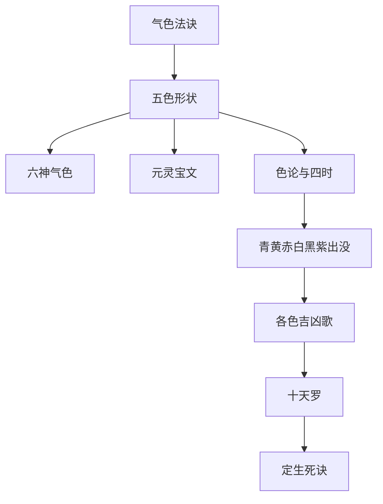

## 本章要义

本章接[[xuanxue/taiqing-06-shenqi|心术神气]]，专讲气色：侵晨帷幄中看，才是本脏清气；酒怒汗后的浮暴之气不算。五色正者如瓜、蜡、火、脂、漆，配肾黑、心赤、肝青、肺白、脾黄。六神气色是青龙、朱雀、螣蛇、勾陈、白虎、玄武。元灵宝文按部位应期；色论讲正色、准头发、四时旺相休囚。青黄赤白黑紫各有出没形状与吉凶歌，歌后插对应色图。十天罗与两套「死候」口诀最容易被读成医书，必须分开看。

这是**术数文献，不是医学，也不是诊断**。歌诀里的病死、刑狱、产难、中风、五脏「绝」，以及「休废」名目，都是相书应期套语，不能用来判断病情或生死，也不能代替就医。

本章整体**艰深**（气色吉凶歌）。可与[[xuanxue/mayi-02-qianliugong|麻衣气色与前六宫]]对读。下一章收[[xuanxue/taiqing-08-xingshen|形神体象]]。

## 底本

旧题后周王朴《太清神鉴》，实出宋人。本章据 youngzs/xuanxue 仓库「气色法诀」至「定病气生死之诀」全录，不删段。底本「共就檐光」或为若就；「主要忧鲜」按忧少；「不详」按不祥；「司机旺」按四时；「左右取下」按目下；「脾之并」按脾病；「堪责」按勘责；「心照」按心绝；「元武／元壁」即玄武、玄壁；《妙观经。色论》被空行切断，原文仍按两段收录。应期、死候一律作文献对读，不作诊断依据。

## 对读

### 气色法诀

> 难度：艰深

凡看人气色，须天色方晓，傍起时，就帷幄中以纸烛照看辨认，方验吉凶无失。

**白话：** 凡看人气色，须在天色刚亮、傍起的时候，在帷幄里用纸烛照看辨认，这样验吉凶才少失。

共就檐光处面背，非本分气色者也。

**白话：** 如果一起就在檐光处、面对面或背光处看，那就不是本分气色。

辄不得洗面盥漱饮汤药，然后看之，亦难验矣。

**白话：** 也不得先洗脸、盥漱、饮汤药然后再看，那样也难以应验。

且五脏初气色，即早朝面，养息于心，故侵晨观之，则见五脏五色清气，朝于面也。

**白话：** 五脏最初的气色，就是早朝面上的色，养息在心里，所以侵晨看，才能见到五脏五色的清气朝于面。

其凶恶气色，无时朝发于面。

**白话：** 那些凶恶气色，没有定时，随时朝发于面。

或触事愤怒而发，或感物忧喜而成，或饮酒而色赤青，或营干而乱，理色活漫，皆非本脏之色。

**白话：** 或触事愤怒而发，或感物忧喜而成，或饮酒而色赤青，或因营干而乱，理色活漫，都不是本脏之色。

一时亟发而成，故吉凶难辨也。

**白话：** 一时急发而成，所以吉凶难辨。

其有不于早晚看者，第令凝神静坐，良久看之，庶几有征焉。

**白话：** 有不在早晚看的，只让他凝神静坐，看久了，或许也有征验。

若夫不拘早晚，酒后醉中，怒间汗后，更不待停而看者，此则又有一时浮暴之气发见。

**白话：** 至于不拘早晚，酒后醉中、怒间汗后，更不等停就看的，这时又有一时浮暴之气发见。

其先见之吉凶，难可得也。

**白话：** 原先已见的吉凶，就难以再得了。

### 气色形状

> 难度：艰深

青色如瓜，黄色如蜡，赤色如火，白色如脂，黑色如漆。

**白话：** 青色如瓜，黄色如蜡，赤色如火，白色如脂，黑色如漆。

*图注：五格青忧、黄昌、赤火殃、白破财、黑病，对应「青色如瓜……黑色如漆」及后文五色所主。口诀是术数总诀，不是医学。*

此五者，色之正，发之甚者也。

**白话：** 这五种，是色之正，发得最甚的。

五脏所生，一曰水。

**白话：** 五脏所生：一曰水。

水之于物为精，其脏在肾，其神元冥，发色为黑，其旺在冬，精具矣则神从之也，二曰火。

**白话：** 水在物为精，其脏在肾，其神元冥（玄冥），发色为黑，旺在冬；精具备了，神就跟着它。二曰火。

火之于物为气，其脏在心，其神丹元，发色为赤，其旺在夏，神至矣则魂从之矣。

**白话：** 火在物为气，其脏在心，其神丹元，发色为赤，旺在夏；神到了，魂就跟着它。

三曰木。

**白话：** 三曰木。

木之于物为魂，魂者阳物也，其脏在肝，其神龙烟，发色为青，其旺在春，魂在矣则魄配之也。

**白话：** 木在物为魂，魂是阳物，其脏在肝，其神龙烟，发色为青，旺在春；魂在了，魄就配上它。

四曰金，金之于物为魄，魄者阴物也，其脏在肺，其神皓华，发色为白，其旺在秋，精神魂魄备，其意在焉，故五曰土。

**白话：** 四曰金。金在物为魄，魄是阴物，其脏在肺，其神皓华，发色为白，旺在秋。精神魂魄都备了，意就在其中，所以五曰土。

土之于物为意，意者精气也，其脏在脾，其神长黄，发色为黄，其旺四季也。

**白话：** 土在物为意，意是精气，其脏在脾，其神长黄，发色为黄，旺在四季。

是故皆朝于一面，而息于五脏也。

**白话：** 因此都朝于一张脸上，而休息在五脏里。

五色所生定忧辱。

**白话：** 五色所生，用来定忧辱。

青色主忧事，若色厚者主忧重，色轻者主忧微，色散者主要忧鲜，色盛者主忧紧。

**白话：** 青色主忧事：色厚主忧重，色轻主忧微，色散主忧少（底本「主要忧鲜」），色盛主忧紧。

色白主哭事，若色厚者主大丧，色浮者主轻丧，色散者主外服也，色显者主丧近也。

**白话：** 白色主哭事：色厚主大丧，色浮主轻丧，色散主外服，色显主丧近。

赤色主扰，若色盛者主刑狱，色浓者主刑死，色暗者主病重，色散者主并瘥也。

**白话：** 赤色主扰：色盛主刑狱，色浓主刑死，色暗主病重，色散主并愈。

黄色主喜庆，若色盛者主大庆，色薄者主小喜，色散者主喜退，急者主喜近也。

**白话：** 黄色主喜庆：色盛主大庆，色薄主小喜，色散主喜退，急者主喜近。

### 六神气色

> 难度：艰深

两眼黑白分明，神元红黄，精彩射人者，谓之青龙之色，主迁转官职，招进财帛喜庆之事。

**白话：** 两眼黑白分明，神元红黄，精彩射人的，叫作青龙之色，主迁转官职，招进财帛喜庆之事。

面色赤如撒丹，扰如烟昏者，病臊者，谓之朱雀之色，主有官灾口舌惊扰之事。

**白话：** 面色赤如撒丹，扰如烟昏的，病臊的，叫作朱雀之色，主有官灾口舌惊扰之事。

面上拂拂如灰土色，精神昏浊者，谓之螣蛇之色，主惊扰怪梦不详家宅不安之事。

**白话：** 面上拂拂如灰土色，精神昏浊的，叫作螣蛇之色，主惊扰、怪梦不祥、家宅不安之事。

眼色湛浊，黑白不分，神光昏翳，眼下青铺者，谓之勾陈之色，主牵连负累迍滞之事。

**白话：** 眼色湛浊，黑白不分，神光昏翳，眼下青铺的，叫作勾陈之色，主牵连负累、迍滞之事。

两眼白气闪闪，似泪不泪，莹白光者，谓之白虎之色，主丧凶亡服外孝之事。

**白话：** 两眼白气闪闪，似泪不泪，莹白光的，叫作白虎之色，主丧亡、凶服、外孝之事。

唇黑而颤，口傍左右，黑气拂拂者，谓之元武之色，主阴私小人相害，失脱损盗之事。

**白话：** 唇黑而颤，口旁左右黑气拂拂的，叫作玄武之色（底本「元武」），主阴私、小人相害、失脱损盗之事。

*图注：青龙、朱雀、勾陈、螣蛇、白虎、玄武分位。对应「六神气色」六条。色恶则应灾是术数，不是病征。*

### 元灵宝文

> 难度：艰深

夫气之色发天府如豆大，贯鬓边有黄色应者，主得藩郡之任。

**白话：** 气之色发在天府，如豆大，贯到鬓边又有黄色应的，主得藩郡之任。

黄色光在印堂当中，有一紫色入豆者，一年内主大拜。

**白话：** 黄色光在印堂当中，有一粒紫色如豆的，一年内主大拜。

黄色在天部，贯金匮及连至精舍道衡，又华盖上盘旋萦绕者，主得兵权，及转职赏财，兼产，主得贵子。

**白话：** 黄色在天部，贯金匮并连到精舍、道衡，又在华盖上盘旋萦绕的，主得兵权，以及转职赏财，兼主生产、得贵子。

紫色如小蚕许，主将加官，或自封拜，其次领镇。

**白话：** 紫色如小蚕那样大，主将加官，或自己封拜，其次领镇。

如颧骨上两道黄色横者，主出外必当，喜事旬日至。

**白话：** 如果颧骨上两道黄色横着，主出外必当，喜事旬日到。

如青色从耳门前出，下临大海者，受少惊恐。

**白话：** 如果青色从耳门前出，下临大海，受少许惊恐。

若黑来，主有闻忧内应。

**白话：** 若黑气来，主有所闻之忧，内里应验。

黄在两法令上，及连至准头者，横财四十日内应。

**白话：** 黄在两法令上，又连到准头的，横财四十日内应。

更寿上有应者，得财万贯已上。

**白话：** 寿上更有应的，得财万贯以上。

青在山根，通过两眼头者，主阴私公事。

**白话：** 青在山根，通过两眼头的，主阴私公事。

紫色从两天中天府直下者，又如蚕丝，三五月半年外作丞郎。

**白话：** 紫色从两天中、天府直下的，又像蚕丝，三五月到半年外作丞郎。

青色从天庭上如韭叶大垂二寸者，主外服期至十日至。

**白话：** 青色从天庭上如韭叶大、下垂二寸的，主外服，期至十日到。

红色如梧桐子许在地部上，主百日内在南方领郡。

**白话：** 红色如梧桐子那样大，在地部上，主百日内在南方领郡。

天中黄色直下来中正者，八十日内恩赐诏书至，少赤色眉上垂下者，主勘事。

**白话：** 天中黄色直下到中正的，八十日内恩赐诏书至；稍有赤色从眉上垂下的，主勘事。

青色或在目上，赤色垂贯眼，及颧上赤者，四十日内忧危刑法。

**白话：** 青色或在目上，赤色垂贯眼，及颧上赤的，四十日内忧危刑法。

印堂有黑赤极分明，命门青者，一月内中风，六十日内死，润泽赤者即不死。

**白话：** 印堂有黑赤极分明，命门青的：一月内中风，六十日内死；润泽而赤的即不死。——术数死候，不是卒中诊断。

赤色从耳门出似马肝色，此是将染腹疾之厄。

**白话：** 赤色从耳门出，似马肝色，这是将染腹疾之厄。仍非内科。

赤色如筋在准上下至人中，二十日内被人损，外口舌公事至。

**白话：** 赤色如筋，在准上、下至人中，二十日内被人损，外有口舌公事至。

赤色从年上分贯两颧者，八十日内有大杀，公事及身不至死。

**白话：** 赤色从年上分开贯两颧的，八十日内有大杀；公事及身，不至死。

地部上起赤色者，吃酒浊病。

**白话：** 地部上起赤色的，吃酒、浊病。

赤色贯两令上者，忧公事，四十日至。

**白话：** 赤色贯两法令上的，忧公事，四十日到。

赤色从鼻尾中下入家舍者，奴婢中有阴私口舌事成。

**白话：** 赤色从鼻尾中下入家舍的，奴婢中有阴私口舌事成。

赤色如毛，从耳边出，至及兰台上应者，一月内主马失坠厄。

**白话：** 赤色如毛，从耳边出，到兰台上应的，一月内主马失、坠落之厄。

眼头上下有黄色下垂者，左是男喜，右是女喜，及妻有喜。

**白话：** 眼头上下有黄色下垂的：左是男喜，右是女喜，及妻有喜。

赤色从眉头连幞颊额边出者，主亏官物、被堪责事情，二十日内至。

**白话：** 赤色从眉头连幞头、颊额边出的，主亏官物、被勘责（底本「堪责」），二十日内至。

如黄色似蚕丝钱许者，贯左右两眉毛上，更印中应时八十日内，主朝判府推也。

**白话：** 如果黄色似蚕丝、钱许大，贯左右两眉毛上，印中又应时，八十日内主朝中判府推官。

色黄如印足起贯边地者，二十日内遭公事失位远行之忧，若黄色应即解之。

**白话：** 色黄如印，足起贯边地的，二十日内遭公事、失位、远行之忧；若有黄色应，即解。

赤色从太阳上起入边地起者，被损失眼睑。

**白话：** 赤色从太阳上起、入边地起的，被损、伤眼睑。

色如筋许从外入者，被人谋己，从内出者，拟有相诉之说谨慎。

**白话：** 色如筋许从外入的，被人谋算自己；从内出的，拟有相诉之说，要谨慎。

眼上下脸俱赤者，主家有重病人。

**白话：** 眼上下睑都赤的，主家有重病人。

若印部有左右赤色，忧父母厄。

**白话：** 若印部左右有赤色，忧父母之厄。

年上微赤，主患脾之并，老不至安。

**白话：** 年上微赤，主患脾之病（底本「脾之并」），老来不得安。

寿上及准头者，亦忧重病。

**白话：** 寿上及准头的，也忧重病。

若色从金匮起，贯连寿上甲匮不到悬璧，主得财，其喜兼得水土官，一年内至。

**白话：** 若色从金匮起，贯连寿上、甲匮，不到悬壁，主得财，其喜兼得水土官，一年内至。

东起贯大海内，当年主水灾。

**白话：** 从东起贯入大海内，当年主水灾。

地部紫色圆黄色，主贵显。

**白话：** 地部紫色圆、黄色，主贵显。

赤色如撒者，二七日内主争讼事。

**白话：** 赤色如撒的，十四日内主争讼事。

或如麻筋在两法令上 入狱厄；微赤，刑欲，并两肝来鬓上至争竞之事。

**白话：** 或如麻筋在两法令上，入狱之厄；微赤，刑狱；并两颧来鬓上，至争竞之事。（底本「刑欲」「两肝」。）

黄色如筋斜两位者，主东南上勾当公事得财，或丁部南上奉使得财物。

**白话：** 黄色如筋斜过两位的，主东南上勾当公事得财，或丁部南上奉使得到财物。

若更临金匮如车轮者，得财万数。

**白话：** 若更临金匮如车轮的，得财以万数。

### 色论

> 难度：艰深

天之苍苍，其色正邪？云雾乃其气耳。

**白话：** 天苍苍的，那是正色吗？云雾不过是它的气罢了。

人之赋形受命，于天地相为流通，是所禀之气有变动，而色有定体也。

**白话：** 人赋形受命，与天地相流通，所以所禀之气有变动，而色有定体。

定体之色，不止于苍苍，其属有五行之异。

**白话：** 定体之色，不止于苍苍，其属有五行的不同。

金色白，木色青，水色黑，火色赤，土色黄。

**白话：** 金色白，木色青，水色黑，火色赤，土色黄。

*图注：标印堂色、目色。对应五行正色「金白木青水黑火赤土黄」。大者一生、小者三月是术数，不是诊断。*

得正色为五行，不相克者不滞为贵，杂色蔽之即差。

**白话：** 得正色为五行，不相克、不滞的为贵；杂色遮蔽它就差了。

然色之正，不可无气，现日月角温粹可爱为贵。

**白话：** 然而色之正，不可无气；现于日月角、温粹可爱的为贵。

如枯燥昏暗，不独难发，亦平生多主脾胸心腹之疾，水火狱讼之厄。

**白话：** 如果枯燥昏暗，不但难发，也平生多主脾胸心腹之疾、水火狱讼之厄。——部位吉凶是术数，不能当病名。

或因骨肉法部局可取，纵发则灾立至。

**白话：** 或因骨肉、法部、格局可取，纵然发了，灾也立刻到。

古人有蚕吐丝之说，自颔而开。

**白话：** 古人有蚕吐丝之说，从颔下开。

其吐丝也，通体明快。

**白话：** 它吐丝，通体明快。

人之将发，自准头而开。

**白话：** 人将要发，从准头开。

其顿发见无翳，则职分不免有凶。

**白话：** 若顿发而见无翳，则职分不免有凶。

或无瑕翳，则全吉矣。

**白话：** 或无瑕翳，则全吉。

更在知五色所生，非吉凶之属，论色无出此者。

**白话：** 更在于知道五色所生，不只是吉凶一类；论色超不出这些。

有神色未透天庭亦发者，是其准头开而得部位贵，皆以相应，不必至天庭也。

**白话：** 有神色未透天庭也发的：是准头开了，又得部位贵，都已相应，不必到天庭。

或有阴晴未定，不必至准头也。

**白话：** 或有阴晴未定的，也不必到准头。

所谓贵处，印堂、帝座、内府、驿马、龙虎、日月、地角是也。

**白话：** 所谓贵处：印堂、帝座、内府、驿马、龙虎、日月、地角。

无贵而顿觉，是谓不详。

**白话：** 无贵而突然觉得发了，叫作不祥（底本「不详」）。

此说非言可尽，修养之功，消息之至可见矣。

**白话：** 这说不是言语可以穷尽的，修养的功夫、消息的火候，才可以看见。

若夫观之寂然，难取难舍，有道者之色；观之滢然，不杂不乱，得意者之色；如娇如满，自得者之色；视之惨然，阴合阳散，细人之色；视之茫然，如得如失，有忧之色。

**白话：** 至于看上去寂然，难取难舍，是有道者之色；看上去滢然，不杂不乱，是得意者之色；如娇如满，是自得者之色；看上去惨然，阴合阳散，是细人之色；看上去茫然，如得如失，是有忧之色。

其顿发皆准头也。

**白话：** 那些顿发，都在准头。

（《妙观经。色论》同）

**白话：** （《妙观经》「色论」同。）

五行之人，得其本色，或得相生之色者善。

**白话：** 五行之人，得其本色，或得相生之色的为善。

五色得地者，春色要青，夏色要红，秋色要白，冬色要黑，又尽善也。

**白话：** 五色得地的：春色要青，夏色要红，秋色要白，冬色要黑，又是尽善。

（余与《玮琳洞中秘密经》同）司机旺、相、休、囚：春三月青色旺，赤色相，白色囚，黑色死；夏三月赤色旺，青色相，黑色囚，白色死；秋三月白色旺，赤色相，青色囚，黑色死；冬三月黑色旺，白色相，赤色囚，青色死。

**白话：** （其余与《玮琳洞中秘密经》同。）四时旺、相、休、囚（底本「司机」）：春三月青色旺、赤色相、白色囚、黑色死；夏三月赤色旺、青色相、黑色囚、白色死；秋三月白色旺、赤色相、青色囚、黑色死；冬三月黑色旺、白色相、赤色囚、青色死。

### 四季气色形状

> 难度：艰深

春欲起，夏欲横，秋欲下，冬欲藏。

**白话：** 春欲起，夏欲横，秋欲下，冬欲藏。

失其时者，皆不利也。

**白话：** 失其时的，都不利。

亦犹四时物理。

**白话：** 也如同四时物理。

且春欲起者，春有出生之象； 夏欲横者，夏有长养之象；秋欲下者，秋有收敛之象，冬欲藏者，冬有闭塞之象。

**白话：** 春欲起，是春有出生之象；夏欲横，是夏有长养之象；秋欲下，是秋有收敛之象；冬欲藏，是冬有闭塞之象。

其有或方或圆，形象万端者，亦在别术断之。

**白话：** 其中或方或圆、形象万端的，也要在别的术里断。

### 青色出没

> 难度：艰深

青色初起如铜青。

**白话：** 青色初起如铜青。

将盛之时，如草木初生；欲去之时，如碧云之色，霏霏然浮散。

**白话：** 将盛之时，如草木初生；欲去之时，如碧云之色，霏霏然浮散。

五行属木，旺在春，相于夏，囚于秋，死于冬。

**白话：** 五行属木，旺在春，相于夏，囚于秋，死于冬。

发则主忧。

**白话：** 发则主忧。

枯主外忧，润主大忧。

**白话：** 枯主外忧，润主大忧。

混主远忧，三主忧解，应在亥卯未日及月，以色深浅断之。

**白话：** 混主远忧，「三」主忧解，应在亥卯未日及月，以色的深浅断。

### 青色吉凶歌

> 难度：艰深

天中光泽得诏贵，枯燥须忧诏责亡。

**白话：** 天中光泽，得诏而贵；枯燥，须忧诏责、亡。

秋色发从年上去，阴私口舌厄难当。

**白话：** 秋色从年上去发，阴私口舌之厄难当。

阳尺忧行兼疾病，天庭主客系堪忧。

**白话：** 阳尺忧出行兼疾病；天庭主客被系，堪忧。

交友妇须通外客，司空或起被徒囚。

**白话：** 交友：妇须通外客；司空或起，被徒囚。

巷路但成百里威，太阳定与妻相打，外伤枉死被谗言。

**白话：** 巷路但成百里之威；太阳定与妻相打；外伤枉死、被谗言。

若是太阴连如日，必遭县宰恶笞鞭。

**白话：** 若是太阴连如日，必遭县宰恶笞鞭。

房小春发当生子，寿上当忧口舌牵。

**白话：** 房小春发当生子；寿上当忧口舌牵。

坑堑对须看大怪，陂池（寿上应以上同）蛇怪不堪言。

**白话：** 坑堑相对须看大怪；陂池（寿上应，以上同）蛇怪不堪言。

山林花鸟妖呈异，栏枥马牛有怪愆。

**白话：** 山林花鸟妖呈异；栏枥马牛有怪愆。

忽在井灶釜鸣响，不然井溢涌寒泉。

**白话：** 忽然在井灶，釜鸣响；不然井溢、涌寒泉。

命门甲匮忧凶厄，准头兄弟父母丧。

**白话：** 命门、甲匮忧凶厄；准头兄弟父母丧。

散失主边防失职，人中愁有别离伤。

**白话：** 散失主边防失职；人中愁有别离伤。

承浆不如当遭病，大海须防水溺亡。

**白话：** 承浆不如，当遭病；大海须防水溺亡。

若临日月须忧贼，若有川文官禄全。

**白话：** 若临日月须忧贼；若有川文，官禄全。

日角临蚕如傅粉，印堂退口病延迟。

**白话：** 日角临蚕如傅粉；印堂退口，病延迟。

道上或逢忧阻滞，山林蛇虎厄难当。

**白话：** 道上或逢忧阻滞；山林蛇虎厄难当。

若来金匮并墙壁，财物三旬共可伤，奸门怕被外妻挠。

**白话：** 若来金匮并墙壁，财物三十日共可伤；奸门怕被外妻挠。

眼下横来病苦缠，寿上若逢忧病厄，更忧债负祸来煎。

**白话：** 眼下横来病苦缠；寿上若逢忧病厄，更忧债负祸来煎。

口畔入来忧饿死，更兼枉滥事相牵。

**白话：** 口畔入来忧饿死，更兼枉滥事相牵。

三位囚伤子孙损，半日之间入墓眠。

**白话：** 三位囚伤子孙损，半日之间入墓眠。

天门三十日财至，天井圆珠武官位。

**白话：** 天门三十日财至；天井圆珠，武官之位。

病人值此病难安，囚人见之尤迍滞。

**白话：** 病人值此，病难安；囚人见之，尤其迍滞。

*图注：印堂一带青色示意，对应「青色吉凶歌」全段。图注已写明不是真实皮肤病。*

### 黄色出没

> 难度：艰深

黄色初起，如蚕吐丝。

**白话：** 黄色初起，如蚕吐丝。

将盛之时，如茧之未缫，或如马尾。

**白话：** 将盛之时，如茧之未缫，或如马尾。

欲去之时，如柳色之花，抟聚班驳然。

**白话：** 欲去之时，如柳色之花，抟聚斑驳然。

五行属土，旺在两季。

**白话：** 五行属土，旺在两季。

相于春，休于夏，囚于秋，死于冬。

**白话：** 相于春，休于夏，囚于秋，死于冬。

又为胎养之。

**白话：** 又为胎养之气。

发则皆主吉庆，但不宜入口，即病瘟疫。

**白话：** 发则都主吉庆，但不宜入口，入口即病瘟疫。——术数应期，不是传染病学。

如则在酉申寅年戌日应之，旬则在子戌辰旬应之，万无一差，须以深浅断远近为定耳。

**白话：** 日则（底本「如则」）在酉、申、寅年、戌日应之，旬则在子、戌、辰旬应之，万无一差，须以深浅断远近为定。

### 黄色吉凶歌

> 难度：艰深

黄色天中列土分，圆光重大拜公卿。

**白话：** 黄色在天中，列土分封；圆光重大，拜公卿。

更过年上井灶部，有功常受赐高勋，或如月出照年上（天中入），定当宿卫入朝门。

**白话：** 更过年上、井灶部，有功常受赐高勋；或如月出照年上（从天中入），定当宿卫入朝门。

若经两阙（天中入）即征拜，金匮（天中入）诏赐帛与银。

**白话：** 若经两阙（从天中入）即征拜；金匮（从天中入）诏赐帛与银。

忽至阙廷（天中入）官骤转，不然即是得财盈。

**白话：** 忽然到阙廷（从天中入）官骤转；不然就是得财盈。

或是龙形须受赏，如悬钟鼓主槐庭。

**白话：** 或是龙形须受赏；如悬钟鼓，主槐庭。

若似蚕丝官必得，春来年上喜忻忻。

**白话：** 若似蚕丝，官必得；春来年上，喜忻忻。

武库光润将军福，亦主喜庆阳尺并。

**白话：** 武库光润，将军之福；也主喜庆，阳尺一并。

母墓喜并田宅事，更宜父母少灾迍。

**白话：** 母墓喜并田宅事，更宜父母少灾迍。

司空百日得财宝，右府里内敕来征。

**白话：** 司空百日得财宝；右府里内敕来征。

重眉交友如棋子，七个旬中左右丞。

**白话：** 重眉、交友如棋子，七十日中左右丞。

更过（重眉过）山林天中者，征为博士最为荣。

**白话：** 更过（从重眉过）山林、天中的，征为博士最为荣。

印堂如月六旬内，拜作将军镇百城。

**白话：** 印堂如月，六十日内拜作将军、镇百城。

便似连刀天庭至（上至天庭），下及准头亦分明。

**白话：** 便似连刀从天庭至（上至天庭），下及准头也分明。

断他县令忽迁转，长吏分官直阙庭。

**白话：** 断他县令忽然迁转；长吏分官，直入阙庭。

火体发明多喜庆，亦言远信至逡巡。

**白话：** 火体发明多喜庆；也说远信至，逡巡即到。

山根听向皆称遂，太阳必定得财庆。

**白话：** 山根听向都称遂；太阳必定得财庆。

少阳喜庆重重过，鱼尾有吉引前行。

**白话：** 少阳喜庆重重过；鱼尾有吉引前行。

若似龙形年上见，连色天中拜上卿。

**白话：** 若似龙形在年上见，连色到天中，拜上卿。

眉眼之下有子象，左黄生男右生女。

**白话：** 眉眼之下有子象：左黄生男，右生女。

妇女有以反前谕，金匮家内财帛人。

**白话：** 妇女有的要反过来论（底本「反前谕」）；金匮，家内财帛入。

寿上柳叶主财入，归来远信至中庭。

**白话：** 寿上如柳叶，主财入；归来远信至中庭。

出自准头庭冲位（天中天庭），骤贵封侯起有乘。

**白话：** 出自准头冲向庭位（天中、天庭），骤贵封侯，起有凭乘。

兰台必得尚书绶，内厨酒食倍逢恩。

**白话：** 兰台必得尚书绶；内厨酒食倍逢恩。

大海惟宜涉江者，日月三公位显清。

**白话：** 大海惟宜涉江的人；日月，三公之位显而清。

甲匮牛马喜方成。

**白话：** 甲匮：牛马之喜方成。

眉位有园多好事，酒樽酒馔得丰醇。

**白话：** 眉位有圆多好事；酒樽酒馔得丰醇。

*图注：印堂一带黄色示意，对应「黄色吉凶歌」全段。示意不是真实肤色病变。*

### 赤色出没

> 难度：艰深

赤色初起，如火始然。

**白话：** 赤色初起，如火始燃。

将盛之时，炎炎如绛缯。

**白话：** 将盛之时，炎炎如绛缯。

欲去之时，如连珠累累然而去。

**白话：** 欲去之时，如连珠累累然而去。

于五行属火。

**白话：** 在五行属火。

旺在夏，相于春，囚于秋，死于冬。

**白话：** 旺在夏，相于春，囚于秋，死于冬。

发，主公私斗讼口舌惊扰之事。

**白话：** 发，主公私斗讼、口舌惊扰之事。

润，主刑厄。

**白话：** 润，主刑厄。

细薄，主口舌鞭笞。

**白话：** 细薄，主口舌鞭笞。

应寅午戌并巳未如，旬中则辰戌，以色定之。

**白话：** 应在寅午戌并巳未日（底本「如」），旬中则辰戌，以色定之。

### 赤色吉凶歌

> 难度：艰深

天中连印笔头赤，中旬车马惊令死。

**白话：** 天中连印，笔头赤，中旬车马惊，令死。

下来年上争竞灾，左右远行须病住。

**白话：** 下来年上，争竞之灾；左右远行，须病住。

阳尺惊恐厄斗生，武库友妇折伤灾。

**白话：** 阳尺惊恐、斗厄生；武库友妇折伤之灾。

天庭必有忧囚事，若见司空斗骂来。

**白话：** 天庭必有忧囚事；若见司空，斗骂来。

交友朋求离别去，在职当忧上位刑。

**白话：** 交友朋求离别去；在职当忧上位之刑。

无职定同父友斗，额角如值死于兵。

**白话：** 无职定与父友斗；额角如值，死于兵。

印堂争斗被忧囚，若在山根惊怕忧。

**白话：** 印堂争斗被忧囚；若在山根，惊怕忧。

太阳夫妻求离别，年上暴厄亦堪愁。

**白话：** 太阳夫妻求离别；年上暴厄也堪愁。

又却断他生贵子，房中妻不产贤侯。

**白话：** 却又断他生贵子；房中妻不产贤侯。

三男三女病灾迍，寿上如豆与妻争。

**白话：** 三男三女病灾迍；寿上如豆，与妻争。

年上准头连发此，夫妻争斗太难明。

**白话：** 年上准头连发此，夫妻争斗太难明。

命门甲匮须兵死，准头官府事牵萦。

**白话：** 命门甲匮须兵死；准头官府事牵萦。

墙壁之上财必失，外圆当紫得官荣。

**白话：** 墙壁之上财必失；外圆当紫，得官荣。

武官巡捕看鱼尾，盗贼收擒倍称情。

**白话：** 武官巡捕看鱼尾，盗贼收擒倍称情。

牛角看来牛马厄。

**白话：** 牛角看来，牛马之厄。

山林蛇虎又堪惊。

**白话：** 山林蛇虎又堪惊。

忽眼下如蚕丝发，妻子因何争斗声。

**白话：** 忽然眼下如蚕丝发，妻子因何争斗声。

金匮奸门招挠事，承浆为酒起喧争。

**白话：** 金匮、奸门招挠事；承浆为酒起喧争。

陂池井部相连接，因水逢财却称情。

**白话：** 陂池、井部相连接，因水逢财却称情。

田上见之田地退，口边横入祸全生，酒樽酒肉宜相会，地阁田岸有讼成。

**白话：** 田上见之田地退；口边横入祸全生；酒樽酒肉宜相会；地阁田岸有讼成。

若在山林须慎火。

**白话：** 若在山林须慎火。

又兼家内损财并。

**白话：** 又兼家内损财一并。

命门发到山根上，更过眉上左耳平。

**白话：** 命门发到山根上，更过眉上左耳平。

只定六旬遭法死，妇人右耳疾来频。

**白话：** 只定六十日遭法死；妇人右耳疾来频。——术数死候，不是刑法或耳科。

*图注：印堂一带赤色示意，对应「赤色吉凶歌」全段。示意不是炎症或皮肤病。*

### 白色出没

> 难度：艰深

白色初起，如白尘拂拂。

**白话：** 白色初起，如白尘拂拂。

将盛之时，如腻粉散点，或如白纸。

**白话：** 将盛之时，如腻粉散点，或如白纸。

欲去之时，如灰垢之散。

**白话：** 欲去之时，如灰垢之散。

五行属金。

**白话：** 五行属金。

旺在秋，相于夏，囚于春，死于冬。

**白话：** 旺在秋，相于夏，囚于春，死于冬。

发，主哭泣忧挠。

**白话：** 发，主哭泣忧挠。

润，主哀泣。

**白话：** 润，主哀泣。

细，忧重；浮，忧轻；散，病瘥。

**白话：** 细，忧重；浮，忧轻；散，病瘥。

应在巳酉丑日，旬在子戌旬中应之，及秋月。

**白话：** 应在巳酉丑日，旬在子戌旬中应之，及秋月。

### 白色吉凶歌

> 难度：艰深

天中春色来年上，斗战刀兵事可愁。

**白话：** 天中春色来年上，斗战刀兵事可愁。

左厢必定主忧恼，阳尺将行走外州。

**白话：** 左厢必定主忧恼；阳尺将行走外州。

发在奸门因妇女，皮乾入狱内遭囚。

**白话：** 发在奸门因妇女；皮乾入狱内遭囚。

又主男女相妒害，交友妇须被外求。

**白话：** 又主男女相妒害；交友妇须被外求。

山根见者主忧囚，男女逢他必死忧。

**白话：** 山根见者主忧囚；男女逢他必死忧。

寿上徒囚君不见，堂上父母死堪愁。

**白话：** 寿上徒囚你看不见；堂上父母死堪愁。

命门甲匮凶来急，内厨酒肉致伤亡。

**白话：** 命门甲匮凶来急；内厨酒肉致伤亡。

承浆逢见身当丧，大海遭时主水殃。

**白话：** 承浆逢见身当丧；大海遭时主水殃。

印堂白气哭爷娘，若在命门兄弟当。

**白话：** 印堂白气哭爷娘；若在命门，兄弟当。

奸门若招主私动，中岳横纹家有丧。

**白话：** 奸门若招主私动；中岳横纹家有丧。

日月角中忧重服，法令陂池脚足伤。

**白话：** 日月角中忧重服；法令、陂池脚足伤。

眼下横纹夫妇斗，准头还是竞田庄。

**白话：** 眼下横纹夫妇斗；准头还是竞田庄。

地阁横遮牛马损，若侵年寿死公婆。

**白话：** 地阁横遮牛马损；若侵年寿，死公婆。

入口分明忧口舌，囷仓上有贼还多。

**白话：** 入口分明忧口舌；囷仓上有贼还多。

*图注：印堂一带白色示意，对应「白色吉凶歌」全段。示意不是苍白病容。*

### 黑色出没

> 难度：艰深

黑色初起，如乌鸟尾。

**白话：** 黑色初起，如乌鸦之尾。

将盛之时，如黑发得膏。

**白话：** 将盛之时，如黑发得膏。

欲去之时，如落垢味。

**白话：** 欲去之时，如落垢之味。

五行属水。

**白话：** 五行属水。

旺于冬，相于秋，囚于夏，死于春。

**白话：** 旺于冬，相于秋，囚于夏，死于春。

发，主病灾厄。

**白话：** 发，主病灾厄。

润，主死亦兵亡。

**白话：** 润，主死，也主兵亡。

枯翳客死，散主病痊。

**白话：** 枯翳主客死；散主病痊。

日应在申子辰日，旬应在甲寅旬及冬月，以旺为应。

**白话：** 日应在申子辰日，旬应在甲寅旬及冬月，以旺为应。

### 黑色吉凶歌

> 难度：艰深

天中必定失官勋，忽于颧上似官刑。

**白话：** 天中必定失官勋；忽然在颧上，似官刑。

若还至下来年上，病患相缠丧此身。

**白话：** 若还至下、来年上，病患相缠，丧此身。

天狱年上应狱死，高广逢时病主亡，阳尺过来凶可得，天庭客死在他乡。

**白话：** 天狱、年上应狱死；高广逢时病主亡；阳尺过来凶可得；天庭客死在他乡。

四煞贼来成凶贼，司空病疾苦缠身。

**白话：** 四煞贼来成凶贼；司空病疾苦缠身。

右府生来忧此位，重眉不利远行征。

**白话：** 右府生来忧此位；重眉不利远行征。

额角黑广善为偷，印堂移徙看他州。

**白话：** 额角黑广善为偷；印堂移徙看他州。

山根必死于旬日，太阳疾病厄堪忧。

**白话：** 山根必死于旬日；太阳疾病厄堪忧。

牢狱至眼忧牢，法令入口形分八。

**白话：** 牢狱至眼，忧牢狱；法令入口，形分八。

更有眉头青色应，白日饮酒还醉杀。

**白话：** 更有眉头青色应，白日饮酒还醉杀。

眼目更兼赤色间，二旬或讼见血光。

**白话：** 眼目更兼赤色间，二十日或讼见血光。

外阳发被人欺劫，年上忧死困灾伤。

**白话：** 外阳发，被人欺劫；年上忧死、困灾伤。

男女忧他男女厄，寿上入耳卒中亡。

**白话：** 男女忧他男女厄；寿上入耳，卒中亡。

命下甲匮遭烧死，准头忧病外来殃。

**白话：** 命下甲匮遭烧死；准头忧病、外来殃。

黑发三阳黑气多，失官停职事波波。

**白话：** 黑发三阳黑气多，失官停职事波波。

更上发来年寿上，天中有黑见阎罗。

**白话：** 更上发来年寿上；天中有黑见阎罗。

黑气入口死于夏，颧上兄弟妇奔逃。

**白话：** 黑气入口死于夏；颧上兄弟妇奔逃。

奸门切忌女相干，日角若临妻亦亡。

**白话：** 奸门切忌女相干；日角若临，妻亦亡。

井部黑气水溺死，印堂退光非谬假。

**白话：** 井部黑气水溺死；印堂退光不是假。

横飞寿上防逢灾，六十日内须应也。

**白话：** 横飞寿上防逢灾，六十日内须应也。

黑气额上父母死，生来眼下子孙殃。

**白话：** 黑气额上父母死；生来眼下子孙殃。

若见下来年寿上，自然病起入冥途。

**白话：** 若见下来年寿上，自然病起入冥途。

黑气三阳至盗门，奸死贼寇岂堪论。

**白话：** 黑气三阳至盗门，奸死贼寇岂堪论。

更见黑气鼻准上，知君财破避无门。

**白话：** 更见黑气鼻准上，知君财破避无门。

黑生妻部及年上，妻厄身灾非是旺。

**白话：** 黑生妻部及年上，妻厄身灾不是旺。

更兼入井下陂池，切记水殃心莫忘。

**白话：** 更兼入井下陂池，切记水殃心莫忘。

黑气朦朦散面门，四季切忌小灾迍。

**白话：** 黑气朦朦散面门，四季切忌小灾迍。

若生口入气厨灶，必定遭他毒药人。

**白话：** 若生口、入气厨灶，必定遭他毒药人。

黑色天中年寿上，更从地阁似烟笼。

**白话：** 黑色天中年寿上，更从地阁似烟笼。

又如黑色初发散，此个须臾命必终。

**白话：** 又如黑色初发散，这个须臾命必终。

眉间横入左右耳，百日之中人定死。

**白话：** 眉间横入左右耳，百日之中人定死。

天明天井忌失财，驿马常防遭险坠。

**白话：** 天明、天井忌失财；驿马常防遭险坠。

虎角频遭虎犬伤，人中井部水中亡。

**白话：** 虎角频遭虎犬伤；人中、井部水中亡。

年寿山根同位断，地阁争田讼见殃。

**白话：** 年寿、山根按同位断；地阁争田讼见殃。

若侵法令遭公讼，大海见之奴婢逃。

**白话：** 若侵法令遭公讼；大海见之奴婢逃。

墙壁生来合中岳，定归泉下哭声高。

**白话：** 墙壁生来合中岳，定归泉下哭声高。

*图注：印堂一带黑色示意，对应「黑色吉凶歌」全段。示意不是瘀青或肤疾。*

### 紫色出没

> 难度：艰深

紫色初起，如兔毫。

**白话：** 紫色初起，如兔毫。

将盛之时，如紫草。

**白话：** 将盛之时，如紫草。

欲去之时，如淡烟笼枯水，隐隐然得土木之余气，为四时胎养之气。

**白话：** 欲去之时，如淡烟笼枯水，隐隐然得土木的余气，为四时胎养之气。

亦旺在四季，更无休囚。

**白话：** 也旺在四季，更无休囚。

发皆为吉，应日亦与黄色同意矣。

**白话：** 发都为吉，应日也与黄色同意。

### 紫色吉凶歌

> 难度：艰深

紫色天中八时分，兰台月角得财频。

**白话：** 紫色天中，八时分封；兰台、月角得财频。

法令生来逢印信，终是刑名不及身。

**白话：** 法令生来逢印信，终是刑名不及身。

寿上俄然一字横，家中新妇喜分明。

**白话：** 寿上俄然一字横，家中新妇喜分明。

天门川字将军禄，天井圆珠享大荣。

**白话：** 天门川字，将军之禄；天井圆珠，享大荣。

元壁福堂知积庆，若当地阁创家居。

**白话：** 玄壁、福堂知积庆（底本「元壁」）；若当地阁，创家居。

山根忽有终加职，驿马全生喜有余。

**白话：** 山根忽有，终加职；驿马全生，喜有余。

元壁左边迁官职，山林精舍喜相须。

**白话：** 玄壁左边迁官职；山林、精舍喜相须。

陂池位上增余福，中岳横纹贵自如。

**白话：** 陂池位上增余福；中岳横纹贵自如。

*图注：印堂一带紫色示意，对应「紫色吉凶歌」全段。示意不是真实皮肤病。*

### 十天罗

> 难度：艰深

十天罗者，天之凶杀之神也。

**白话：** 十天罗，是天上的凶杀之神。

人亦有所像，多满面黑色四起，为死气天罗；白色者，为丧哭天罗；青色者，为忧滞天罗。

**白话：** 人面上也有所像：多满面黑色四起，为死气天罗；白色的，为丧哭天罗；青色的，为忧滞天罗。

《玉管照神》局又云：“青色深者，亦主丧死。

**白话：** 《玉管照神》局又说：「青色深的，也主丧死。」

黄色者，为疾病天罗；如脂膏涂抹者，为酒食天罗；眼流而视急者，奸淫天罗；色焦如火者，为破败天罗；如醉如睡者，为牢狱天罗；笑语失节者，为鬼掩天罗；气如雾昏者，为退散天罗也。

**白话：** 黄色的，为疾病天罗；如脂膏涂抹的，为酒食天罗；眼流而视急的，为奸淫天罗；色焦如火的，为破败天罗；如醉如睡的，为牢狱天罗；笑语失节的，为鬼掩天罗；气如雾昏的，为退散天罗。

### 论气色定生死诀

> 难度：艰深

凡气色者，额上忽有气如尘抹者，名曰医无休废，六十日内死。

**白话：** 凡气色：额上忽然有气如尘抹的，名叫医无休废，六十日内死。

额上连发际黑气，或白气状如蚯蚓横起者，名曰连天休废，二年内死。

**白话：** 额上连发际黑气，或白气状如蚯蚓横起的，名叫连天休废，二年内死。

左右鼻孔黑气横过如虚气者，名曰垂起休废，不出六日死。

**白话：** 左右鼻孔黑气横过如虚气的，名叫垂起休废，不出六日死。

左右取下如尘黑气者，名曰灵光体废，一年凶死。

**白话：** 左右目下（底本「取下」）如尘黑气的，名叫灵光休废（底本「体废」），一年凶死。

颐下拂拂如尘行连项者，名曰缠命休废，八十日内死。

**白话：** 颐下拂拂如尘行、连项的，名叫缠命休废，八十日内死。

印堂上有赤白色血者，名曰毁禄休废，受极刑死，九十日内死。

**白话：** 印堂上有赤白色如血的，名叫毁禄休废，受极刑死，九十日内死。

鼻上忽忽如尘起或如粉涂者，名曰理狱休废，主居官破位，三年内死。

**白话：** 鼻上忽忽如尘起或如粉涂的，名叫理狱休废，主居官破位，三年内死。

左右额上拂拂如尘起者，名曰傍行休废，二年内死，财破六亲离厄。

**白话：** 左右额上拂拂如尘起的，名叫傍行休废，二年内死，财破、六亲离厄。

左右两眼忽有白气贯入神光者，名曰烖（灾）神休废，一百日内死。

**白话：** 左右两眼忽然有白气贯入神光的，名叫灾神休废（底本「烖」自注灾），一百日内死。

口四边白色旋绕者，名曰守魂休废，五十日内死。

**白话：** 口四边白色旋绕的，名叫守魂休废，五十日内死。

左右耳边忽若尘成两三条者，名曰飞天休废，一百日内刑狱死。

**白话：** 左右耳边忽然像尘成两三条的，名叫飞天休废，一百日内刑狱死。

左右耳轮后气如粉气者，名曰飞天休废，六十日内死。

**白话：** 左右耳轮后气如粉气的，名叫飞天休废，六十日内死。

脑后连脑，白气如尘飞起成条者，名曰贯中休废，三十日主死，决也。

**白话：** 脑后连脑，白气如尘飞起成条的，名叫贯中休废，三十日主死，是决然的。以上都是术数死候口诀，不能用来判断生死。

### 定病气生死之诀

> 难度：艰深

五脏有五气，五气各有时。

**白话：** 五脏有五气，五气各有时。

春三月白气入口鼻者死。

**白话：** 春三月白气入口鼻的死。

此得囚死色也。

**白话：** 这是得了囚死之色。

余皆仿之。

**白话：** 其余都仿此。

凡看病人，青色从上入下者易瘥，从下去上者难愈。

**白话：** 凡看病人：青色从上入下的易愈，从下往上的难愈。——仍是术数，不是预后量表。

凡常白忽黑、常黑忽白、常肥常瘦、常瘦暴肥、神魂常静、而恍惚似醉者，色泽常青、而忽昏浊如暗者，丰足不常之变，尽为卒死之兆矣。

**白话：** 凡常白忽黑、常黑忽白、常肥忽瘦、常瘦暴肥、神魂常静而恍惚似醉的，色泽常青而忽然昏浊如暗的，丰足无常的变，都是卒死之兆。

病人日冥冥妄视舌卷缩者，谓之心照，即日死。

**白话：** 病人目冥冥妄视、舌卷缩的，叫作心绝（底本「心照」），即日死。

面色惨黄唇青短缩者，谓之脾绝，不出十日死。

**白话：** 面色惨黄、唇青短缩的，叫作脾绝，不出十日死。

齿牙干焦耳黑而聋者，谓之肾绝。

**白话：** 齿牙干焦、耳黑而聋的，叫作肾绝。

不出旬日死。

**白话：** 不出旬日死。

口张不合，眼睛反恶者，谓之肝绝，不出旬日死。

**白话：** 口张不合、眼睛反恶的，叫作肝绝，不出旬日死。

肌肤枯槁，鼻黑孔露者，谓之肺绝，不出旬日死。

**白话：** 肌肤枯槁、鼻黑孔露的，叫作肺绝，不出旬日死。

凡人目下五色并起者，不出十日死。

**白话：** 凡人目下五色并起的，不出十日死。

发直干脆者，不出半月死。

**白话：** 发直干脆的，不出半月死。

面色忽如马肝，望之亦如青龙之黑，不出三日死。

**白话：** 面色忽然如马肝，望去也如青龙之黑，不出三日死。

四墓发黑者死。

**白话：** 四墓发黑的死。

年上横黑气者死。

**白话：** 年上横黑气的死。

五命废得紫色者，皆得鬼色死之人也。

**白话：** 五命废而得紫色的，都是得鬼色、死之人。以上脏腑「绝」名是相书套语，不是中医诊断，更不能用来判断病人生死。
