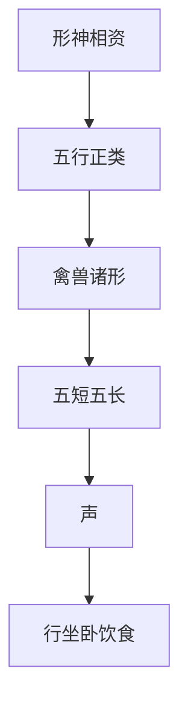

## 本章要义

《太清神鉴》卷四专论形与神。神须形才能安，形须神才能运；宁可神足而形不足，不可形足而神不足。形分阴阳刚柔、五行正类，又拿鹤凤龟犀虎狮龙等禽兽形来「类物性」。五短、五长看头面身手足是否一齐，再辅以声、行、坐、卧、饮食。这是**术数文献，不是医学**，不能当体检、性格或命运诊断。

本卷禽兽诸形、五短五长没有专图，只用三停、五行、清浊口诀图式对照：正形多要求三才/三停平满、五行相生、清厚有神。气色详前卷[[xuanxue/taiqing-07-qise|太清神鉴：气色]]，骨肉部位见[[xuanxue/taiqing-09-guti|额眉眼骨肉]]，神骨清浊可对读[[xuanxue/bingjian|冰鉴]]。

## 底本

旧题后周王朴《太清神鉴》卷四，工作底本 `/tmp/xuanxue-work/taiqing/04-juan4.txt`。括号里的《玉管照神局》《名贤相法》《月波洞中记》等是底本夹注，照录。虎形「入林」条底本自注有脱文。原文尽量保持底本用字，白话按通行文意疏通（如「头顶园厚」作「圆厚」、「掌薄捐疏」作「指疏」）。

## 对读

### 论形神

> 难度：进阶

二气未判，则一体冥寂；天地既形，则万物成体。

物之有体也，则其性；人之有形也，则其神。

形神相顺以成道，相资以成德。

故人之生也，有形斯有神，有神斯有道。

神须形而始安，形须神而始运。

**白话：** 阴阳二气还没分开时，只是一团冥寂；天地成形以后，万物才各自有体。物有了体，才见得出它的性；人有了形，才见得出他的神。形与神顺着彼此才能成「道」，互相依靠才能成「德」。所以人生下来：有形才有神，有神才有道。神要靠形才能安住，形要靠神才能运转。

盖形能养血，血能养气，气能养神。

是以形全则血全，血全则气全，气全则神全，两者不可不备。

其或神形有余，则为有福之兆；或形神欠亏，乃为祸之基。

故神足于形为贵，形过神者为贱。

乍可神足而形不足，不可形足而神不足也。

**白话：** 形能养血，血能养气，气能养神。所以形全则血全，血全则气全，气全则神全，形与神两样都不可缺。神形有余，旧说是有福的兆头；形神亏欠，旧说是祸的根子。神比形充足的为贵，形超过神的为贱。宁可神够而形不够，不可形够而神不够。这是术数旧说，不是医学。

*图注：侧看额骨、颧骨、颌骨。对应本段「神须形而始安」：神安在形上，骨是形的架子。图出《冰鉴》骨相口径，本卷用来记「形全神全」，不是单独讲青面联骨。*

### 论形

> 难度：进阶

夫人之生也，禀阴阳冲和之气，地之形，受五行中正之质，为万物之灵。

故头圆像天，足方像地，眼目像日月，声音像雷霆，血脉像江河，骨节像金石，鼻额像山岳，毛发像草木。

天欲高而圆，地与方而厚，日月欲光明，雷霆欲震响，江河欲流畅，金石欲坚，山岳欲峻，草木欲秀。

**白话：** 人生下来，禀阴阳冲和之气，受大地之形、五行中正之质，才称为万物之灵。所以头圆像天，足方像地，眼像日月，声音像雷霆，血脉像江河，骨节像金石，鼻额像山岳，毛发像草木。天要高而圆，地要方而厚，日月要光明，雷霆要震响，江河要流畅，金石要坚，山岳要峻，草木要秀。

故形也，有阴阳刚柔之义，有五形正类之体。

其男子也刚正雄略，乃得阳之宜也；女人也柔顺和媚，乃得阴之宜也。

其形分于五行者，木形长瘦，金形方正，水形肥而圆，土形重而厚，火形赤而上尖。

形正而不陷，乃五行正气。

其或水火相伤，金木相犯，皆为不合之相也，多招灾祸之凶。

**白话：** 形里有阴阳刚柔的义理，也有五行正类的体式。男子刚正雄略，才算得阳之宜；女子柔顺和媚，才算得阴之宜。按五行分：木形长瘦，金形方正，水形肥而圆，土形重而厚，火形色赤、上部尖。形端正、不塌陷，才叫五行正气。水火相伤、金木相犯，都是不合之相，旧说多招灾祸。

其形龙翔海岳，凤戏丹墀，狮坐龟游，虎踞马跃，攀猿舞鹤，回牛浮雁，此皆天地之纯粹，间世之英才也。

故汉高祖有龙颜之喜。

《玉管》云：“卜商有堂堂之貌，唐太宗天日之表，班超则燕颔虎头，黄琬凤睛龟背。

富贵之兆，故皆显著。”

其寒如瘦鹭，视似羊睛，蛇行雀走，犬暴豹声，斯皆贫贱之形发也。

其理浩博，非一言可尽辩也，宜精思以详之。

苟无其类，则吉凶无验矣。

**白话：** 形像龙翔海岳、凤戏丹墀、狮坐龟游、虎踞马跃、猿攀鹤舞、牛回雁浮，旧说都是天地纯粹之气、间隔一世才出的英才。所以传说汉高祖有龙颜之喜。《玉管》说：卜商堂堂之貌，唐太宗天日之表，班超燕颔虎头，黄琬凤睛龟背，都当作富贵之兆，因而显著。至于寒瘦如鹭、眼似羊睛、蛇行雀走、犬暴豹声，旧说都是贫贱之形发出来。道理很宽，不是一句话能辩完，要细想。如果对不上这类，吉凶就无从应验。本卷后面鹤凤龟犀虎狮龙诸形，没有专图，用三停、五行图式对照「像哪一类、停分匀不匀」。

故郭林宗观人有八法：一曰威，为尊严畏惮也。

如豪鹰博物，而百鸟目惊；似怒虎投林，而百兽自惧。

尽神色严，严而人所畏，则主权势也。

二曰厚，为风貌敦重也。

其量如沧海，器如百斛，引之不来，摇之不动，则主福禄也。

三曰清，谓精神翘秀也。

如桂林一枝，昆山片玉，洒然高秀，而无尘翳，俊才贵也。

或清而不厚，近乎薄也。

四曰古，谓骨气岩棱也。

其或部位相应，则为高贵之人。

或浊而不清，近乎俗也。

**白话：** 所以郭林宗观人有八法。一是威：尊严使人畏惮。像猛鹰一出、百鸟自惊，怒虎投林、百兽自惧。神色严，严到别人怕，旧说主权势。二是厚：风貌敦重。器量像沧海、像百斛之器，拉不来、摇不动，旧说主福禄。三是清：精神翘秀。像桂林一枝、昆山片玉，洒然高秀、没有尘翳，旧说是俊才之贵。清而不厚，就近于薄。四是古：骨气岩棱。部位再相应，才是高贵之人。浊而不清，就近于俗。

五曰孤，谓形骨露也。

其项长肩缩，脚斜脑偏，其坐如摇，其形如攫。

又似水中独鹤，雨中鹭鸶，则孤独也。

六曰薄，谓体貌劣弱，其形气轻怯也。

色昏不明，神露不藏，如一叶之舟，而在重波之上，见之者皆知其微薄，则主贫寒也，纵有衣食，必夭折矣。

七曰恶，谓体貌凶顽。

蛇鼠之形，豺狼之声，或性躁神惊，骨伤带破，主凶恶也。

八曰俗，谓形貌昏浊也。

如尘埃之中物，纵有衣食，主迍滞也。

（《名贤相法》五总龟八形与前观人八法同）大抵受气有清浊，成形有贵贱。

故丰厚谨严者，不富则贵；浅薄清躁，不贫则夭。

女人之气与其和，形与严谨，言语柔而不暴，缓而不迫，行坐欲端而不侧，视欲正而不流，则大贵也。

**白话：** 五是孤：形骨外露。项长肩缩，脚斜脑偏，坐着像摇，形像要抓取；又像水中独鹤、雨中鹭鸶，旧说主孤独。六是薄：体貌劣弱，形气轻怯。色昏不明，神露不藏，像一叶小舟在重浪上，一看就知微薄，旧说主贫寒，纵有衣食也易夭折。七是恶：体貌凶顽。蛇鼠之形、豺狼之声，或性躁神惊、骨伤带破，旧说主凶恶。八是俗：形貌昏浊，像尘埃里的东西，纵有衣食也主淹滞。《名贤相法》五总龟八形与这八法相同。大抵受气有清浊，成形有贵贱。丰厚谨严的，不富则贵；浅薄清躁的，不贫则夭。女人旧说要气和、形严谨，言语柔而不暴、缓而不迫，行坐端正不侧，视正不流，才许大贵。女相专论见卷六，不要用男脸冒充。

*图注：对应本段八法里的「清」「厚」「薄」。图出麻衣十观口径：清而瘦可许贵，浊有神谓之厚多富，浊无神谓之软孤或夭。本卷「清而不厚近乎薄」「浊而不清近乎俗」是同一条线，不是另立一套。*

### 五形

> 难度：进阶

人禀天地之气，而有五行之类也。

故木形者，耸而瘦，挺而直，长而露节，头隆而额耸也。

或肉重而肥，腰偏而背瘦，非木之善。

金形者，小而坚，方而正。

形短不为之不足，肉坚不为之有余也。

水形者，短而浮，阔而厚，则俯然而流也。

土形者，敦而厚，重而实，背隆腰厚，其形似龟也。

火形者，上尖而下阔，上轻而下重，性躁急而炎炎也。

**白话：** 人禀天地之气，才分成五行一类。木形：耸而瘦，挺而直，长而关节外露，头隆额耸。若肉重而肥、腰偏背瘦，就不是好木形。金形：小而坚，方而正。形短不算不足，肉坚不算有余。水形：短而浮，阔而厚，像俯身而流。土形：敦厚、重实，背隆腰厚，形似龟。火形：上尖下阔，上轻下重，性躁急像火在烧。

故五形欲得相生无克，如木形之人，木之声高而亮，其性仁而静，相之善也。

其或五行相克，声音相反，为形重灾祸之人也。

（《玉管照神局》同）

**白话：** 所以五形要相生、不要相克。比如木形人，声音也像木那样高而亮，性仁而静，才是善相。若五行相克、声音与形相反，旧说是形上带着灾祸的人。《玉管照神局》说法相同。

*图注：图出《人物志》「木骨、金筋、火气、土肌、水血」。本卷五形讲的是整身轮廓：木长瘦、金方正、水肥圆、土厚重、火上尖。两套都是五行类物，不是同一条文。后面鹤凤龟犀虎狮龙没有专图，用这张对照「像哪一行」：鹤凤清瘦近木，龟土厚近土，虎狮头圆项短近金土，龙五岳起、三才平满是正局。*

### 论看形神体象

> 难度：进阶

凡看形神，须类物性，行飞腾越，先有所肖。

后看气色衰旺，五岳四渎朝对如何，虽有好形神，而五位无出彩者，此人应事歇灭而如初也。

形神虽不足，五岳虽不应，而有长旺色者，衣食自然。

凡看形神，须察气色看之，则万无一失也。

**白话：** 凡看形神，先按物性去类：走、飞、腾、跃，先看像什么。然后再看气色衰旺、五岳四渎是否朝对。就算形神好，五位没有出彩，旧说这人做事会歇灭、仍回到原样。形神不足、五岳不应，却有长旺之色，旧说衣食仍自然。凡看形神，都要兼看气色，旧说才少失。气色专论见前卷，不是医学诊断。

### 论形不足

> 难度：进阶

形之不足者：头顶尖薄，肩膊狭斜，腰肋疏细，肢节短促；掌薄捐疏，唇蹇额塌，鼻仰耳反，臀低胸陷；一眉曲，一眉直，一眼仰，一眼低，一睛大，一睛小，一颧高，一颧低；一手有纹，一手无纹；睡中开眼，男子女声；齿黄而露，口臭而尖；秃顶无发，眼深不见；行走欹斜，颜色痿怯；头小而身大，上短而下长。

此谓之形不足也，多疾而短命，福薄而贫贱矣。

**白话：** 形不足的条目：头顶尖薄，肩膊狭斜，腰肋疏细，肢节短促；掌薄、指疏（底本「捐疏」），唇歪额塌，鼻仰耳反，臀低胸陷；一眉曲一眉直，一眼仰一眼低，一睛大一睛小，一颧高一颧低；一手有纹一手无纹；睡中开眼，男作女声；齿黄而露，口臭而尖；秃顶无发，眼深看不见神；行走歪斜，颜色痿怯；头小身大，上短下长。旧说这叫形不足，多疾短命、福薄贫贱。这是术数应验话，不是医学。

### 论形有余

> 难度：进阶

形之有余者：头顶园厚，腹背丰隆；额阔口方，唇红齿白；耳圆成珠，鼻直如胆；眼分黑白，眉秀疏长；肩膊齐厚，胸前平广；腹圆垂下，出语宏亮；行坐端正，五岳朝起；三停相称，肉腻骨细，手长足方，望之巍巍然而来，仰之怡怡然而坐，此皆谓形有余也。

形有余者，令人长寿少病，富而有荣矣。

**白话：** 形有余的条目：头顶圆厚（底本「园厚」），腹背丰隆；额阔口方，唇红齿白；耳圆如珠，鼻直如胆；眼黑白分明，眉秀疏长；肩膊齐厚，胸前平广；腹圆下垂，出语宏亮；行坐端正，五岳朝起；三停相称，肉腻骨细，手长足方；远远看去巍巍而来，近看怡然而坐。旧说这叫形有余，令人长寿少病、富而有荣。同样不是医学。

### 鹤形

> 难度：进阶

鹤形者：三才相等，眼细眉长，鼻尖而小，身长垂口，身体上下，一般细长，面正地阁小，五官俱好，正鹤形也；或行缓者，单鹤形也；面部有杂，鼻大口小，或口大准起者，孤鹤形也；五色不分，神气不足，病鹤形也。

**白话：** 鹤形：三才（上中下）相等，眼细眉长，鼻尖而小，身长、口垂，身体上下一般细长，面正而地阁小，五官都好，叫正鹤形；走得缓的，叫单鹤形；面部驳杂，鼻大口小，或口大准头高起，叫孤鹤形；五色不分、神气不足，叫病鹤形。没有鹤形专图，用三停图对照「三才相等」，用清浊图对照「神气足不足」。

正鹤形 正鹤形神大贵人，生来衣食不曾贫。

命居三馆把卿位，寿算仍须过百春。

**白话：** 正鹤形神是大贵人，生来不缺衣食。旧说命里能居三馆、做到卿位，寿数还要过百岁。

单鹤形 单鹤形神艺出群，生来聪俊过常人。

贵当富显驰千里，财帛犹丰不受贫。

**白话：** 单鹤形神才艺出群，生来比常人聪俊。旧说贵而富显、名驰千里，财帛仍丰、不受贫。

孤鹤形 孤鹤形神恶毒人，妨儿克子只孤身，妻儿生别生离去，老至须教独受贫。

**白话：** 孤鹤形神旧说是恶毒人，妨儿克子、只剩孤身；妻儿生离，老来独自受贫。

病鹤形 病鹤形人命不长，生来破败少田庄。

中年定受贫寒苦，无子无孙走路旁。

**白话：** 病鹤形人旧说命不长，生来破败、少田庄。中年定受贫寒，无子无孙、走在路旁。

### 凤形

> 难度：进阶

凤形者：额长，三停平满，耳轮贴肉，山根高耸，准头圆润，眼长而尾起，口如莲，眉粗而秀，仓库五官六府俱好，正凤形也；其或眉尖眼尖，下短或身侧，小凤形也；身长耸，其精神缓急者，丹凤形也。

如额低精神慢，眉长不应，是病凤形也。

**白话：** 凤形：额长，三停平满，耳轮贴肉，山根高耸，准头圆润，眼长而尾上起，口如莲，眉粗而秀，仓库与五官六府都好，叫正凤形；眉尖眼尖，下停短或身子侧，叫小凤形；身长而耸、精神有缓有急，叫丹凤形。额低、精神慢、眉长却与部位不应，是病凤形。三停平满对照三停图；本卷只录正、小、病三首口诀，丹凤形有说无诗，照底本不补。

正凤形 正凤形高贵且强，生居九鼎出朝堂。

一生聪智多文学，大国为臣小国王。

**白话：** 正凤形高贵且强，旧说生居九鼎、出于朝堂。一生聪智、多文学，大国为臣、小国为王。

小凤形 小凤形神福禄强，生来富贵不寻常。

中年显达官荣盛，大业洪勋远播扬。

**白话：** 小凤形神福禄强，生来富贵不寻常。中年显达、官荣盛，大业功勋远播。

病凤形 病凤形神虽性灵，聪明文学有声名。

都缘难得官班位，纵得官班却见迍。

**白话：** 病凤形神虽然性灵，聪明文学有声名。只因难得官位，纵得官位也多淹滞。

### 龟形

> 难度：进阶

龟形者，头圆项短，身大背厚，眼细口大，面阔元壁朝接，山根高起，正龟形也；其或精神乱过者，出水龟形也；或诸部位有不应，然而精神美悦者，戏龟形也；五色不分，诸位不应。

而多厚黑，精神足者，藏龟形也。

**白话：** 龟形：头圆项短，身大背厚，眼细口大，面阔、垣壁朝接（底本「元壁」），山根高起，叫正龟形；精神过乱，叫出水龟形；诸部位有不应、但精神美悦，叫戏龟形；五色不分、诸位不应，却多厚黑而精神足，叫藏龟形。土形「形似龟」与正龟形都重背厚，对照五行图土厚。

正龟形 正龟形神寿年多，生居两辅众难过。

初年名远扬千里。

后者荣华万国歌。

**白话：** 正龟形神寿年多，旧说生居两辅之位、众人难及。初年名扬千里，后来荣华、万国称颂。

出水龟形 出水龟形久必荣，生来聪敏起名声。

寿虽七十身孤独，兄弟妻儿定不成。

**白话：** 出水龟形久后必荣，生来聪敏、能起名声。旧说寿虽七十却身孤独，兄弟妻儿定不成。

戏龟形 戏龟形人文艺多，只宜晚禄供山河。

中年虽得荷衣挂，末岁须防给谏过。

**白话：** 戏龟形人文艺多，只宜晚禄供奉。中年虽得官衣，晚年须防给谏一类过失。

藏龟形 藏龟形人衣食荣，初依父母有空名。

年老难免饥寒苦，独力孤形少弟兄。

**白话：** 藏龟形人衣食看似荣，初年靠父母、只有空名。年老难免饥寒，独力孤形、少弟兄。

### 犀形

> 难度：进阶

犀形者：头四方，印堂阔，地阁厚重，眼圆眉大薄，五岳正，天庭起，行步起，行步熏而阔，五官六府惧好，正犀形也；面部同而步急速，手腰背动举者，出水犀形也；面部五官六府有破，不举短促，是入水犀形也；面虽部位一同而五官不正，身长侧者，戏犀形也。

**白话：** 犀形：头四方，印堂阔，地阁厚重，眼圆、眉大而薄，五岳正，天庭起，行步起、行步阔（底本「熏而阔」），五官六府俱好（底本「惧好」），叫正犀形；面部相同而步急速，手、腰、背都动着举起，叫出水犀形；面部五官六府有破、不举而短促，是入水犀形；面部位差不多而五官不正、身长而侧，叫戏犀形。

正犀形 正犀形神是贵人，职居馆殿足金银。

寿年八十人皆敬，百世荣华及子孙。

**白话：** 正犀形神是贵人，职居馆殿、金银足。旧说寿到八十、人人敬，荣华及于子孙。

出水犀形 出水犀形是正郎，晚年高职坐朝堂。

金珠钱宝家盈万，寿算应当七十亡。

**白话：** 出水犀形旧说是正郎，晚年高职坐朝堂。金珠钱宝家盈万，寿算当在七十。

入水犀形 入水犀形食禄多，出群英俊众难过。

寿年七十庄田盛，一世荣华争奈何。

**白话：** 入水犀形食禄多，出群英俊、众人难及。寿年七十、庄田盛，一世荣华。

戏犀形 戏犀形神艺出群，生来卓立不求人。

锦衣玉食谁能及，更寿年高六十春。

**白话：** 戏犀形神才艺出群，生来卓立不求人。锦衣玉食少人及，寿到六十。

### 虎形

> 难度：进阶

虎形者：头圆项短，地阁重厚，九州团促，眉浓口大，面阔鼻大，五官六府俱好，正虎形也；行走急速，腰身正，视不定（海鹏案：此处有脱文。）

此入林虎形也；面部虽同，精神带慢，顾视偏斜者，此落坑虎形也。

**白话：** 虎形：头圆项短，地阁重厚，九州团促，眉浓口大，面阔鼻大，五官六府都好，叫正虎形。行走急速、腰身正、视不定——底本海鹏案：这里有脱文。下文接着「此入林虎形也」。面部虽同，精神带慢、顾视偏斜，是落坑虎形。中间「出林」只见于口诀，总说里没有专条，照底本不补。

正虎形 正虎形人是大僚，文操武略富偏饶。

生来便有三公位，老后须登驷马骄。

**白话：** 正虎形人是大僚，文武都有、财富偏多。旧说生来便有三公之位，老来须登驷马。

出林虎形 出林虎形性正刚，生来聪智足文章。

初年荣达高官职，位入星郎耀四方。

**白话：** 出林虎形性正刚，生来聪智、文章足。初年荣达高官，位入星郎、名耀四方。

入林虎形 入林虎形是正郎，名传声价最高强。

只缘心志多藏毒，暗恐消磨寿不长。

**白话：** 入林虎形是正郎，名传声价最高。只因心志多藏毒，旧说暗里消磨、寿不长。

落坑虎形 落坑虎形不可亲，毒忿生来爱陷人。

锦帛资财虽积蓄，争知寿不过多春。

**白话：** 落坑虎形不可亲，毒忿生来爱陷人。锦帛资财虽能积，旧说寿过不了多少年。

### 狮子形

> 难度：进阶

狮子形者：额方眉大，口阔鼻大，耳大眼大，身肥；天地相应，三才平满，仓库厚，元壁起，五官六府俱好，正狮子形也；若或面部虽同，身小眼部不应，小狮子形也；行慢身重，多精神者，坐狮子形也；若行步踯躅，瞻视不正，精神美悦者，戏狮子形也。

**白话：** 狮子形：额方眉大，口阔鼻大，耳大眼大，身肥；天地相应，三才平满，仓库厚，垣壁起，五官六府都好，叫正狮子形；面部虽同，身小、眼部不应，叫小狮子形；行慢身重、精神多，叫坐狮子形；行步踯躅、瞻视不正、精神却美悦，叫戏狮子形。三才平满对照三停图。

正狮子形 正狮子形额正方，眉浓眼大口须长。

九州高耸耳朝口，出世须教作郡王。

**白话：** 正狮子形额正方，眉浓眼大、口须长。九州高耸、耳朝口，旧说出世当作郡王。

小狮子形 小狮子形主晚荣，生来荣显负清明。

锦帛钱财成巨万，自宜营运保前程。

**白话：** 小狮子形主晚荣，生来荣显、负清明之气。锦帛钱财成巨万，宜自己营运、保住前程。

坐狮子形 坐狮子形是贵人，生来衣食足金银。

清资定入公卿位，寿算仍须八十春。

**白话：** 坐狮子形是贵人，生来衣食足、金银够。清资定入公卿，寿算仍须八十。

戏狮子形 戏狮子形衣食足，位归侯相镇山河。

玉宝珠金多积蓄，一生快乐任婆娑

**白话：** 戏狮子形衣食足，位归侯相、镇山河。玉宝珠金多积蓄，一生快乐任游。

### 龙形

> 难度：进阶

龙形者：五岳起，三才平满，天地相朝，凤节丰浓，印堂起方寸，边地起，入门阔，眉分八彩，目长二寸，耳长四寸，五官六府俱好者，正龙形也，男即大贵之相，女即妃后之贵也。

若有五色者，定五龙之形也，别述青黄赤白黑五品相。

倘或行步不同，面部有杂，一处不应，即是卧龙形也，即主多禄之位。

或常虎头燕额，即是山龙形也，主将军节度之权。

面上二停身一停。

此主侯伯之位；面上一停身占二停，此主将帅之职也。

**白话：** 龙形：五岳起，三才平满，天地相朝，骨节丰浓（底本「凤节」），印堂起方寸，边地起，入门阔，眉分八彩，目长二寸，耳长四寸，五官六府都好，叫正龙形。男即大贵，女即妃后之贵——女相只在这里提一句，专论见卷六，须用女底图。若有五色，定为五龙之形，另述青黄赤白黑五品，本卷不展开。行步不同、面部有杂、一处不应，即卧龙形，旧说主多禄。常作虎头燕颔，即山龙形，主将军节度之权。面上占二停、身上占一停，主侯伯；面上占一停、身上占二停，主将帅。

正龙形 正龙天下贵无双，上天仪表万邦王。

一流河水须镇断，四方归贡走梯航。

**白话：** 正龙天下贵无双，仪表如上天、为万邦之王。旧说一流河水也须镇断，四方来贡、梯航而至。

卧龙形 卧龙合主三台位，阐世文章天下名。

官爵定须居一品，及第人皆震一鸣。

**白话：** 卧龙合主三台之位，阐世文章、天下闻名。官爵定居一品，及第一鸣惊人。

山龙形 山龙本是将军位，文武俱全镇庙堂。

三代侯门生贵子，出为兵帅入为王。

**白话：** 山龙本是将军之位，文武俱全、镇庙堂。三代侯门生贵子，出为兵帅、入朝为王。

### 五短之形

> 难度：进阶

一头短，二面短，三身短，四手短，五足短。

五者俱短，骨细肉滑，印堂明润，五岳朝界者，少卿公侯之相也。

虽俱五短，而骨粗恶，五岳缺陷，则为下贱之人也。

其或上长下短，则多富贵；上短下长，主居贫下矣。

**白话：** 五短：一头短，二面短，三身短，四手短，五足短。五者都短，又骨细肉滑、印堂明润、五岳朝拱，旧说是少卿公侯之相。虽都短，骨粗恶、五岳缺陷，则为下贱。或者上长下短，多富贵；上短下长，主居贫下。上长下短、上短下长，用三停图对照头面身的长短比例，不是另画五短图。

### 五长之形

> 难度：进阶

一头长，二面长，三身长，四手长，五足长。

五者俱长，而骨貌半隆，清秀滋润者，善。

如骨肉枯槁，筋脉迸露，虽俱五长，反为贫贱之辈也。

或有手短足长者，主贫而贱；足短手长者，富而贵也。

**白话：** 五长：一头长，二面长，三身长，四手长，五足长。五者都长，骨貌丰隆（底本「半隆」）、清秀滋润，才算善。若骨肉枯槁、筋脉迸露，虽都长，反为贫贱。或者手短足长，主贫而贱；足短手长，富而贵。与五短一样，没有专图，用三停匀称来记「一齐才算数，枯露则反」。

*图注：发际到眉、眉到准头、准头到地阁，三段宜匀。本卷没有鹤凤龟犀虎狮龙、五短五长的专图。正鹤「三才相等」、正凤「三停平满」、正狮正龙「三才平满」都落在这张图上；五短五长的「上长下短则多富贵、上短下长主居贫下」，是把上停/下停的长短用到头面身手足。图是男脸三停，只说明比例关系，不表示某一种禽兽形。*

### 论声

> 难度：进阶

人之性，动于心而形于身。

故声者，气实藏之。

气构众虚而成响，内以传意，外以应物。

人有声犹钟鼓之响，若大则声宏，若小则声短。

神清气和，则声润而圆畅也；神浊气促，则声焦急而轻嘶也。

（《玉管照神局》音西，噎也，有马鸣也。）

故贵人之声，出于丹田之内，与心气和通，汪洋而外达。

何则？丹田者，声之根也；心气者，声之端也；舌端者，声之表也。

夫根深则表重，根浅则表轻，（《玉管照神局》云：“是知声发于根而见夫表也。）

**白话：** 人的性，动于心而表现于身。所以声，其实是气藏在里面。气构许多虚处才成响，对内传意，对外应物。人有声像钟鼓：大则声宏，小则声短。神清气和，声就润而圆畅；神浊气促，声就焦急而轻嘶。《玉管照神局》注「嘶」为噎，又有马鸣之义。贵人之声出于丹田，与心气相通，汪洋而外达。为什么？丹田是声之根，心气是声之端，舌端是声之表。根深则表重，根浅则表轻。《玉管》说：可知声发于根而见于表。

若夫清而圆，坚而亮，缓而烈，急而和，长而有力有威；若音大如洪钟发响，鼍（钟）鼓震响；音小似寒泉飞韵，琴徽奏曲；接其语则粹然而后动，与之言则悠然而后立；是以声之善者，远而不断，浅而能清，深而能藏，大而不浊，小而能新，细而不乱，出而能明，余响激烈，笙篁宛转流行，能圆能方，如斯之相，并主福禄长年。

**白话：** 善声：清而圆，坚而亮，缓而烈，急而和，长而有力有威。音大如洪钟、鼍鼓震响；音小似寒泉飞韵、琴徽奏曲。接他的话，他沉静之后才动；同他说话，他悠然之后才立定。所以善声：远而不断，浅而能清，深而能藏，大而不浊，小而能新，细而不乱，出而能明，余响激烈，像笙篁宛转流行，能圆能方。旧说这样的相主福禄长年。

若夫小人之声，发于舌端，喘急促而不远，不离唇上，紊杂而断续，急而又嘶，缓而不涩，深而带滞，浅而带躁；或大而散，或长而破，或轻而不匀，或缭绕而无节，或睚眦而暴，或烦乱而浮，粗浊飞散，蹇浅讷涩；或如破钟之响、败鼓之声，或如寒鸡哺雏，饿鸭哽肉，或似病猿求侣，或以孤雁失群；细如秋蚓发吟，大似寒蝉晚噪；雄者如犬暴吠，雌者似羊孤鸣。

如斯之声，皆为浅薄也。

或男作女声细者（《玉管照神局》注云：“谓其柔细而不刚烈也。”）

一世孤穷；女作男声暴者，主一世妨害（《玉管照神局》注云：“谓其刚暴而不和也。”）。

然则身小而音大者，吉；身大而音小者，凶；身声相称者，善。

**白话：** 小人之声发于舌端，喘急促而不远，不离唇上，紊乱断续；急而又嘶，缓而不畅（底本「缓而不涩」与下文对看，意谓缓却不润），深而带滞，浅而带躁；或大而散，或长而破，或轻而不匀，或绕来绕去没有节，或睚眦而暴，或烦乱而浮，粗浊飞散，蹇浅讷涩；或像破钟败鼓，或像寒鸡哺雏、饿鸭哽肉，或像病猿求侣、孤雁失群；细如秋蚓，大似寒蝉晚噪；雄的像犬暴吠，雌的像羊孤鸣。这样的声，都算浅薄。男作女声而细的，《玉管》注：柔细而不刚烈，旧说一世孤穷；女作男声而暴的，注：刚暴而不和，主一世妨害。身小音大者吉，身大音小者凶，身与声相称者善。

或干湿不齐者，谓之罗网声；或小或大者，谓之雌雄声，或先进而后急，或先急而后进，或声未止而气绝，或声未举而色先变，皆薄浅之相也。

是以神定于内，而气和于外，则声安而言有先后之序，乃无变色也。

苟神不安，必气不和，则其言先后失序，辞色杂错，皆是小人薄劣之相也。

且声如破筒者富，破瓦者贱，破木则贫，破竹者苦。

公鹅声者多破散，公鸭声者多贱徒。

暴如豺狼者，毒害多。

汪声深堂者，为福人。

故声细如啼，贫贱孤栖；声粗如哭，灾祸相逐。

声音明快，意相远大；声音嫩娇，家活水消。

**白话：** 干湿不齐，叫罗网声；忽小忽大，叫雌雄声；或先缓后急，或先急后缓（底本「先进」「后进」），或声未止而气先绝，或声未出而色先变，都是浅薄之相。所以神定于内、气和于外，声才安、话才有先后之序，也不会变色。神不安则气不和，话就先后失序、辞色杂乱，都是小人薄劣之相。又：声如破筒者富，破瓦者贱，破木则贫，破竹者苦。公鹅声多破散，公鸭声多贱徒。暴如豺狼者毒害多。声音汪然如在深堂，为福人。声细如啼，贫贱孤栖；声粗如哭，灾祸相逐。声音明快，意相远大；声音嫩娇，家业如水消。

人之禀五行之形，其声亦有无行之象。

故木音高畅（《玉管照神局》注云：“嘹亮高畅，激越而和。”）

火音焦烈（《玉管照神局》注云：“发之太严，如火之烈，其或躁戾浅暴者，谓之火浊，不善之应也。”），金音如润（《玉管照神局》注云：“和则不戾，润则不枯，叩之为清，击之为纯，又如桐篁奏曲，玉磬流音也。”）

水音圆急（《玉管照神局》注云：“圆而清，急而畅，坚而不散，长而有力，或条达而流，或锵洋而奋。”），土音沉厚（沉则不浅，厚则不薄，洋然发在咽喉之间也。）若与形相生则吉，相克则凶。

为声音分三主，可决成败耳。

初声高者，初主强；中声薄者，中主弱；后声微者，晚年卑。

是以声音主发闭之人，不可不善。

不善者并为凶恶，必多灾难形厄。

有官则多失位，有财则破散，男则不能保其室，女则不能保其家矣。

（《玉管照神局》并《月波洞中记》同。）

**白话：** 人禀五行之形，声也有五行之象（底本「无行」当作「五行」）。木音高畅，《玉管》注：嘹亮高畅，激越而和。火音焦烈，注：发得太严像火烈，躁戾浅暴叫火浊，是不善之应。金音润，注：和则不戾，润则不枯，叩清击纯，如桐篁奏曲、玉磬流音。水音圆急，注：圆而清，急而畅，坚而不散，长而有力，或条达而流，或锵洋而奋。土音沉厚：沉则不浅，厚则不薄，洋然发在咽喉之间。与形相生则吉，相克则凶。声音又分三主，可决成败：初声高，初主强；中声薄，中主弱；后声微，晚年卑。所以声音主一个人的发与闭，不可不善。不善的一并作凶恶，必多灾难形厄；有官多失位，有财则破散，男不能保室，女不能保家。《玉管照神局》与《月波洞中记》同。

凡声最难辨，大抵舌头圆全，清润响快，不宜焦急沉滞，刑破而促。

若人大而声小者，非远器也；人小而声大者，良器也。

又须于五行神论，听五声合与不合，刑与不刑断制，不可言论也，略具五声诀于后：

金声韵长，清响远闻，金圆润则贵，金破则贱。

土声韵重，响亮远闻，重则贵，近薄则贱也。

火声清烈，调畅不懦，完润而慢则贵，焦破则贫贱。

木声韵条达，初全终散，沉重则贵，如轻则贱也。

水声韵清细响急，长细则贵，如轻则贱也。

论五声又不以形类，盖为声无形，但听而会意，则详酌其理。

然后较其吉凶，万不失一也。

**白话：** 声最难辨。大抵舌头圆全，清润响快，不宜焦急沉滞、刑破而促。人大而声小，不是远器；人小而声大，是良器。还须按五行神去听：五声合不合、刑不刑，不是口头能说死，下面略具五声诀。金声韵长，清响远闻，圆润则贵，破则贱。土声韵重，响亮远闻，重则贵，近薄则贱。火声清烈，调畅不懦，完润而慢则贵，焦破则贫贱。木声韵条达，初全终散，沉重则贵，轻则贱。水声韵清细而急，长细则贵，轻则贱。论五声又不按形去类，因为声无形，只能听而会意，详酌其理，再较吉凶，旧说才少失。

### 五音

> 难度：进阶

五行散为万物，人生万物之上而声亦辨。

其故木音嘹呖高畅，激越而和；火音焦裂躁怒，如火烈烈；金音和而不戾，润而不枯，玉磬流音；水音圆而清，急而畅，或条达而流，或激而发；土音深而不浅，厚而不薄，浑然如发在咽喉之间也。

与形相养相生者吉，与形相克相犯者凶。

**白话：** 五行散为万物，人在万物之上，声也要辨。所以木音嘹呖高畅，激越而和；火音焦裂躁怒，如火烈烈；金音和而不戾，润而不枯，如玉磬流音；水音圆而清，急而畅，或条达而流，或激而发；土音深而不浅，厚而不薄，浑然像从咽喉发出。与形相养相生者吉，与形相克相犯者凶。与上节五声诀是同一套，这里收成五音专条。

### 行部

> 难度：进阶

行者，进退之节，去就之义，所以见其贵贱之分也。

人之善行如舟之遇水，无所往而不利也。

不善行者，如舟之失水，必有澡阳没溺之患也。

是以贵人之行，如水而流下，身重而脚轻。

（《玉管照神局》注曰：“身端直如水之流下，倏然而往，体不摇也。”）

小人之行，如火炎上，身轻而脚重。

（《玉管照神局》注曰：“如火摇动，其身不正，其脚摇而动。”）

故行不欲昂首而蹶，又不欲侧身而折，太高则亢，太卑则曲，太急则暴，太缓则迟。

周旋而不失其节、进退各中其度者，至贵人也。

**白话：** 行，是进退的节、去就的义，用来见贵贱之分。善行像船遇水，无所往而不利。不善行像船失水，必有漂荡没溺之患（底本「澡阳」）。贵人之行如下水，身重脚轻。《玉管》注：身端直如下水，倏然而往、体不摇。小人之行如火向上，身轻脚重。注：如火摇动，身不正、脚也摇。所以行不要昂首而蹶，也不要侧身而折；太高则亢，太卑则曲，太急则暴，太缓则迟。周旋不失节、进退各中度，才是至贵之人。

且行而头低者多智虑，行而头昂者少情义。

行而偃胸者愚下，行而身平者福而吉。

如虎步者福禄，如龙奔者权贵。

如鹅鸭之步者，家累千金；如马鹿之骤者，奔波一世。

如牛行者富而寿，如蛇行者毒而夭。

雀跳者食不足，猿踯者苦不停。

龟行者福寿，鹤步者灭禄。

雁行者聪明而贤，鼠行者多疑而贱。

行如流舟者富贵，行如急犬者微贱。

蹭蹬而来者，性行不吉；泄泄而往者，财食有余。

脚跟不至地，穷而夭寿。

发足急如奔走者，贱居人下。

行而左右偷视者，心怀望窃；行而回面后顾者，情多惊乱。

**白话：** 行而头低者多智虑，头昂者少情义。行而挺胸前突者愚下（底本「偃胸」），身平者福而吉。如虎步者福禄，如龙奔者权贵。如鹅鸭步者家累千金，如马鹿急骤者奔波一世。牛行者富而寿，蛇行者毒而夭。雀跳者食不足，猿踯者苦不停。龟行者福寿，鹤步者减禄（底本「灭禄」）。雁行者聪明而贤，鼠行者多疑而贱。行如流水之舟者富贵，如急犬者微贱。蹭蹬而来者性行不吉，慢慢而去者财食有余。脚跟不至地，穷而夭寿。一抬脚就急奔，贱居人下。左右偷视，心怀觊觎；回面后顾，情多惊乱。

大体行之贵也，腰不欲折，头不欲低，发足欲急，进身欲直，起走欲阔，端然而往不凝滞者，贵相也。

行者进退去就之间，欲中规矩。

不及徐动有理者，善也。

肥人形重，行欲如飞，瘦人形轻，行欲如疑，此乃贵相。

若斜身偏肩，如鹊之跳、如蛇之趋者，皆不善也。

**白话：** 行贵的大体：腰不要折，头不要低，发足要利落，进身要直，步子要阔，端然而往、不凝滞，才是贵相。进退去就之间要中规矩。从容移动而有理，是善。肥人形重，行却要像飞；瘦人形轻，行却要像有所疑，这才是贵相。斜身偏肩，像鹊跳、像蛇趋，都是不善。

### 论坐

> 难度：进阶

坐所以安止。

欲沉静平正，身不斜不侧，深重盘石，腰背如有所助，终日不倦，神色愈清者贵相。

若如醉如病，如有所思者，皆不善相也。

又云：人之行者属阳，坐者属阴。

故行者体阳为动，坐者像阴为静。

凝然不动者，作之德也；坐而膝摇者，薄劣之人也。

坐而头低者，贫苦之辈也；坐而转身回面者毒，坐而摇头摆脑者狡，公然如石不动者富贵，恍然如猿不定者贫贱。

坐定神气不转者，忠良福禄；坐定乱色变容者，凶恶愚贱。

坐之为道，不端不正，其相不令，能谨能严，其福日添也。

**白话：** 坐是为了安止。要沉静平正，身不斜不侧，像深重的盘石，腰背像有所支撑，终日不倦、神色愈清，才是贵相。如醉如病、像有所思，都是不善。又说：行属阳，坐属阴。行体阳为动，坐像阴为静。凝然不动，是作事的德；坐而膝摇，是薄劣之人。坐而头低，贫苦之辈；坐而转身回面者毒，摇头摆脑者狡；公然如石不动者富贵，恍然如猿不定者贫贱。坐定神气不转，忠良福禄；坐定乱色变容，凶恶愚贱。坐之道：不端不正，其相不善；能谨能严，福才日添。

### 论卧

> 难度：进阶

卧者，休息之期也。

欲得安而静，恬然不动者，福寿之人也。

如狗之蟜者上相，如龙曲者贵人。

睡而开口者短命，梦中咬牙者兵死。

睡开眼者，恶死道路；睡中呓语者，贱中奴婢。

仰形如尸者，贫苦命短；卧中气粗如吼者，愚浊易死。

合面覆卧者饿死，就床便困者顽贱。

爱侧睡者吉庆，多展转者性乱。

少睡者神清而贵，多睡者神浊而贱。

卧易觉者聪敏，卧难醒者愚顽。

喘息不闻者高寿，喘息润匀者命长。

气入多寿，气少短命。

气出嘘嘘之声者，即死丧。

夫睡卧轻摇，未尝安席者，下相也。

**白话：** 卧是休息的时候。要安而静、恬然不动，才是福寿之人。睡姿如狗蜷曲（底本「蟜」）是上相，如龙曲是贵人。睡而开口者短命，梦中咬牙者兵死。睡开眼者恶死道路，睡中呓语者贱为奴婢。仰卧如尸者贫苦命短，卧中气粗如吼者愚浊易死。伏卧者饿死，一上床就困者顽贱。爱侧睡者吉庆，多辗转者性乱。少睡者神清而贵，多睡者神浊而贱。容易醒者聪敏，难醒者愚顽。喘息不闻者高寿，喘息匀润者命长。气入多则寿，气少则短命。气出嘘嘘之声，旧说即死丧。睡卧轻摇、从未安席，是下相。以上都是术数旧说，不是睡眠医学。

### 论饮食

> 难度：进阶

气血资之以状，姓名系之以存者，饮食也。

故食物不欲语，嚼物不欲怒。

食急者易肥，食迟者多疾。

食少而肥者性宽，食多而瘦者性乱。

饮缓者性和，食如啄者贫。

敛口食者淳和，哆口食者不义，食而齿出者贫苦短命。

嚼似牛者福禄，食如羊者尊荣。

食如虎者将率之权，食如猿者使者之位。

边食边顾，终身穷饥。

食快而不留，祥而不暴，嚼不欲声，吞不欲鸣矣。

（余与《五总龟》同）

**白话：** 气血靠它来充实形状，姓名靠它来存续的，是饮食。所以吃东西不要说话，嚼东西不要发怒。吃得急的易肥，吃得慢的多疾。吃少而肥者性宽，吃多而瘦者性乱。喝得缓者性和，吃像鸟啄者贫。敛口吃者淳和，张大口吃者不义，吃时齿外露者贫苦短命。嚼似牛者福禄，食如羊者尊荣。食如虎者将帅之权，食如猿者使者之位。边吃边东张西望，终身穷饥。吃要快而不留、安详而不暴，嚼不要出声，吞不要出响。其余与《五总龟》相同。这是观人旧说，不是食疗。
