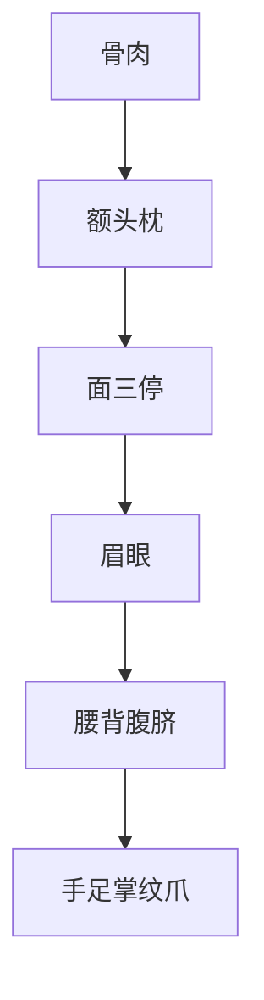

## 本章要义

《太清神鉴》卷五从骨肉讲到额、头、枕骨、面三停，再及眉眼、腰背腹脐、手足掌纹爪。肉要坚实、骨要直耸，肥不欲纹满，瘦不欲骨露。额分贵贱，额纹、枕骨旧说各有名目；眉主贤愚，也连着兄弟；眼为木星、所以生神。这是**术数文献，不是医学**，额纹、枕骨、掌纹、黑痣都不能当体检。

前卷形神体象见[[xuanxue/taiqing-08-xingshen|形神体象]]，格局与女相见[[xuanxue/taiqing-10-geju|格局与女相]]。眉为兄弟宫，可对读[[xuanxue/mayi-03-houliugong|麻衣后六宫]]。

*图注：五步环对应骨肉总法、额头枕、面三停、眉眼、腰背手足。额纹枕骨掌纹黑痣都不能当体检。术数文献，不是医学。*

## 底本

旧题后周王朴《太清神鉴》卷五，工作底本 `/tmp/xuanxue-work/taiqing/05-juan5.txt`。额纹、枕骨条底本自注：四库本原有图示符号，此处略。夹注《玉管照神局》《玮琳洞中秘密经》《五总龟》《观妙经》照录。原文尽量保持底本，白话疏通明显讹字（如「近于寒」「两节这者」「延寿这福」）。

## 对读

### 论骨肉

> 难度：进阶

立天之道，曰阴与阳；立地之道，曰柔与刚。

故地者具刚柔之体，而能生育万物也。

山者地之刚也，土者地之柔也。

刚而柔则崒嵂而不秀，柔而刚则虚浮而不实。

故人之有骨肉者，亦若是矣。

故肉丰而不欲有余，骨少而不欲不足。

有余则阴胜于阳，不足则阳胜于阴。

阴阳相反，谓之一偏之相。

肉当坚而实，骨当直而耸。

肉不欲在骨之内，为阴之不足；骨不欲生肉之外，为阳之有余。

**白话：** 立天之道叫阴与阳，立地之道叫柔与刚。地具备刚柔之体，才能生育万物。山是地之刚，土是地之柔。刚过而少柔，就高耸却不秀；柔过而少刚，就虚浮而不实。人的骨肉也是这样。所以肉要丰，却不要有余；骨要少，却不要不足。肉有余则阴胜阳，骨不足则阳胜阴。阴阳相反，叫一偏之相。肉当坚而实，骨当直而耸。肉不要缩在骨里面，那是阴不足；骨不要生在肉外面，那是阳有余。

故人肥则气短，马肥则气喘。

是肉不欲多，骨不欲少也，乃阴阳和平，刚不欲横，横则性刚而多横；肉不欲缓，缓则性柔而多滞。

遍体生毛，则性刚而又急。

肥不欲纹满者，近死之应。

香而暖，白而润，皮欲细而滑，皆美质也。

肉重而粗，皮硬而堆块，色昏而枯，皮黑而臭，癃费多者，非令相也。

若人神气不名，筋不露骨，肉不居体，皮不包肉，皆死之兆也。

又云肉充为肤，宽，肥人宜轻清不露，瘦人宜竖重不枯。

反此者皆不善。

若为肉横者，为带杀肉病，此主凶暴贫夭也。

**白话：** 所以人肥则气短，马肥则气喘。肉不要太多，骨不要太少，才是阴阳和平。刚不要横，横则性刚而多蛮横；肉不要缓，缓则性柔而多滞。遍体生毛，性刚而又急。肥而纹满，旧说近死之应。香而暖、白而润、皮细而滑，都是美质。肉重而粗，皮硬而堆块，色昏而枯，皮黑而臭，癃闭耗费多，不是善相。若神气不名（神气散而不立），筋不附骨、肉不居体、皮不包肉，都是死兆。又说肉充为肤、要宽：肥人宜轻清不露骨，瘦人宜竖重不枯槁。反此都不善。肉横的，叫带杀肉病，旧说主凶暴贫夭。这是术数，不是医学。

巍巍峰岳，竖立万福，坚刚而峻，郁茂而秀，此乃天地之骨也。

人之有骨节，亦象山岳金石，欲峻而不欲广，欲圆而不欲粗。

瘦者不欲肉少而骨露，露者多艰少寿也。

（《玉管照神局》注云：“肉不辅骨则骨露，乃多难少福之人也。”）

肥者不与骨隐而肉重，重者乃逆滞夭寿也。

（《玉管照神局》注云：“肉肥重乃迟滞之人也。

肥不与满，或满而盈者，乃速死之人也。”）

骨与肉相称，气与色相和者，福禄之相也。

背攒而体偏，骨寒而肩缩，不贫则夭，不夭则贫矣。

（《玉管照神局》注云：“谓背攒而体偏，骨寒而肩缩，凡物有万状，人有万形，亦有折除。或穷而寿，或富而夭。故云不贫则夭也，”）

**白话：** 巍巍峰岳，竖立而多福，坚刚而峻、郁茂而秀，这是天地之骨。人的骨节也像山岳金石：要峻不要广，要圆不要粗。瘦的不要肉少而骨露，露则多艰少寿。《玉管》注：肉不辅骨则骨露，是多难少福之人。肥的不要骨隐而肉过重，重则迟滞夭寿。注：肉肥重是迟滞之人；肥不要满，满而盈是速死之人。骨与肉相称、气与色相和，才是福禄之相。背攒体偏、骨寒肩缩，不贫则夭，不夭则贫。注：万物万形也有折除，或穷而寿、或富而夭，所以说不贫则夭。

日角之左，月角之右，有骨直起，名金城骨，位至公卿。

印堂有骨棱至天庭，名天柱骨，从天庭贯顶名伏犀骨，位至三公。

半顶以前主初年，半顶以后主晚年。

或有侧断者，有迍滞之失。

面上有骨卓起者，颧骨也，主有权势。

灌区相连入耳，名玉梁骨，主寿考。

自臂至肘名龙骨，象君，欲长而大；自肘至腕名虎骨，象臣，欲短而小，故龙衔虎则福，虎衔龙则贱。

夫骨之法，与峻长而舒，圆而竖，直而节应紧，滑而不粗恶，筋而不缠，则为上相也。

且人虽有奇骨，亦须形相称，色相助，方成会器。

苟诸位不应，虽福寿而不贵也，宜细详之。

（《玉管照神局》同。又与《五总龟》相骨同。）

**白话：** 日角之左、月角之右有骨直起，名金城骨，旧说位至公卿。印堂有骨棱到天庭，名天柱骨；从天庭贯顶，名伏犀骨，位至三公。半顶以前主初年，半顶以后主晚年。若侧断，有淹滞之失。面上骨卓起的是颧骨，主权势。连贯入耳的名玉梁骨（底本「灌区」），主寿。自臂至肘名龙骨，象君，要长而大；自肘至腕名虎骨，象臣，要短而小。所以龙衔虎则福，虎衔龙则贱。骨法：峻长而舒，圆而竖，直而节要紧，滑而不粗恶，有筋而不缠，才是上相。虽有奇骨，也须形相称、色相助，才成大器。诸位不应，虽福寿也不贵，要细看。《玉管》同，又与《五总龟》相骨同。

骨者体之干，所受宜清滑长细，内外肉相称。

若骨坚半轻细，与骨肉薄者，近于寒也。

大抵须得耸直不横不露，与肉副应者，为善相也。

薰工论比骨法曰：“凤凰骨，鹦鹉骨，骆驼骨，犀牛骨，猿骨。”

次说微妙难晓，用意深者亦可知也。

**白话：** 骨是体的干，所受宜清滑长细，内外与肉相称。若骨坚却半轻半细、骨肉都薄，近于寒薄（底本「近于寒」）。大抵要耸直、不横不露，与肉相副，才是善相。薰工论比骨法说：凤凰骨、鹦鹉骨、骆驼骨、犀牛骨、猿骨。后面说得微妙难晓，用意深的人也可以推知。本卷不另绘图。

### 论额部

> 难度：进阶

分一面之贵贱，辨三辅之荣辱，莫不定乎额也。

故天庭、天中、司空，俱列乎额，是非摄诸部位，系人之贵贱也。

故其骨欲隆然而起，耸然而阔，其峻如立壁，印堂上至天庭有隐隐骨而见者，少达而荣。

边地山林，皆欲丰广，坑陷贫贱。

额两边辅角骨起长大者，三品之贵。

天中、天庭、司空、中正、印堂五位得端正明净，总显达之人也。

若狭小而发乱低覆者，愚而贫贱也。

额面小窄，至老贫厄；额大面方，至老吉昌。

额角高耸，职位崇重；天中丰隆，仕宦有功。

额小面广，贵处人上。

额方峻起，吉无不利。

额莹无瑕，一世荣华。

（余与《玮琳洞中秘密经》同）

**白话：** 分一面的贵贱、辨三辅的荣辱，没有不取决于额的。天庭、天中、司空都列在额上，是非收摄诸部位，系着人的贵贱。所以骨要隆起、耸而阔，峻如立壁；印堂上至天庭隐隐见骨，旧说少年显达而荣。边地、山林都要丰广，坑陷则贫贱。额两边辅角骨起而长大，三品之贵。天中、天庭、司空、中正、印堂五位端正明净，总是显达之人。额狭小、发乱低覆，愚而贫贱。额面小窄，至老贫厄；额大面方，至老吉昌。额角高耸，职位崇重；天中丰隆，仕宦有功。额小面广，贵处人上。额方峻起，吉无不利。额莹无瑕，一世荣华。其余与《玮琳洞中秘密经》同。

*图注：额为南岳，宜开阔有骨。对应本段天庭、天中、司空、中正、印堂都在额上，骨欲隆起如立壁。图是部位示意，不是某一种额纹。*

### 论头部

> 难度：进阶

头部者，处一体之尊，为百骸之长，群阳会集之府，五行正宗之乡。

高而圆，藏虚而大者，令首也。

天高峻而清圆，故三光得以照万物，无为而自运，故道济天下而体常不动，曲成万物之性而常不流。

是以头之像，天之形也。

欲得峻而起，丰满而圆，像天之德也。

欲得严正在上，不侧不摇。

若夫尖薄而小，缺陷而倾者，贫下之仪也。

得坐低斜，或摇或摆，贼劣之相也。

故骨欲丰满而起，俊秀而凸，短则欲厚，长则欲方。

顶突者崇贵，侧陷者夭薄。

头皮厚者足衣食，头皮薄者贫贱。

皮青者吉善，皮白者下贱，皮黄者贫苦，皮赤者凶灾。

头有余皮者，财食丰足；头有肉角者，必有富贵。

左偏损父，右偏损母。

耳后有骨名寿堂骨，耳上有骨名玉楼骨，并至官禄。

行不欲摇头，坐不欲低头，皆为贫弱之相也。

**白话：** 头处一体之尊，为百骸之长，是群阳会集之府、五行正宗之乡。高而圆、内藏虚而大，才是善首。天高峻清圆，三光才能照万物；无为自运，道济天下而体常不动，曲成万物之性而常不流。所以头像天。要峻而起、丰满而圆，才像天之德。要严正在上，不侧不摇。尖薄而小、缺陷而倾，是贫下之仪。坐着低斜、或摇或摆，是贼劣之相。骨要丰满而起、俊秀而凸；短则要厚，长则要方。顶突者崇贵，侧陷者夭薄。头皮厚者足衣食，薄者贫贱。皮青吉善，皮白下贱，皮黄贫苦，皮赤凶灾。头有余皮，财食丰足；头有肉角，必有富贵。左偏损父，右偏损母。耳后骨名寿堂骨，耳上骨名玉楼骨，并主官禄。行不要摇头，坐不要低头，都是贫弱之相。

是以身小头大，卑贱之辈；身大头小，触事不了。

头不应身，先贵后贫；头通四角，高权超卓。

牛头四方，富贵吉昌；虎头高起，福禄无比。

狗头尖圆，悲涕流涟；鹿头侧长，志意雄刚。

獭头横阔，心意豁达；象头高厚，福禄长寿。

犀牛崒嵂，富贵无失；驼头蒙洪，福禄永终。

蛇头尖薄，财禄寥落；头尖锐，穷厄无计。

**白话：** 所以身小头大，卑贱之辈；身大头小，触事不了。头不应身，先贵后贫；头通四角，高权超卓。牛头四方，富贵吉昌；虎头高起，福禄无比。狗头尖圆，悲涕涟涟；鹿头侧长，志意雄刚。獭头横阔，心意豁达；象头高厚，福禄长寿。犀头高峻，富贵无失；驼头蒙洪，福禄永终。蛇头尖薄，财禄寥落；头尖锐，穷厄无计。与前卷禽兽形是同一套类物，本卷只记头形。

### 额纹

> 难度：进阶

额之有纹，贵贱可断。

若额方广丰隆而有好纹者，则爵禄崇也。

如额尖狭缺陷，更有恶纹者，则贫贱无疑矣。

三纹偃上者（“三纹偃上者”与以下各种形状的额纹，在《四库全书》本《太清神鉴》中皆有图示之符号，可参看，此处略。）

名曰偃月纹，主朝郎。

三纹偃上，一纹直贯者，名曰天柱骨纹，主节察武臣。

王字纹者，主公侯。

天中竖纹，下至印堂，名曰悬云纹，主卿监。

印堂两纹直上，长三寸者，名曰蛇行纹也，主道路。

井字纹者，主员外。

川字纹者，主忧虑刑丧。

十子纹者，主吉昌。

田字纹者，主富贵。

山字纹者，侍从之荣贵。

乙字纹者，京朝之要职。

水印纹者，主荣贵显达。

额上乱纹交紊，则贫苦多灾。

妇女额有三横纹者，则妨夫害子，贫夭俱至矣。

**白话：** 额上有纹，旧说可断贵贱。额方广丰隆又有好纹，爵禄才崇。额尖狭缺陷又有恶纹，则贫贱无疑。三纹向上偃，叫偃月纹，主朝郎（四库本原有符号图，工作本略，下面各纹都没有专图）。三纹偃上、一纹直贯，叫天柱骨纹，主节察武臣。王字纹主公侯。天中竖纹下至印堂，叫悬云纹，主卿监。印堂两纹直上、长三寸，叫蛇行纹，主道路奔波。井字纹主员外。川字纹主忧虑刑丧。十字纹（底本「十子」）主吉昌。田字纹主富贵。山字纹主侍从荣贵。乙字纹主京朝要职。水印纹主荣贵显达。额上乱纹交紊，贫苦多灾。妇女额有三横纹，旧说妨夫害子、贫夭都到。女纹只在这里提一句，女相专论见卷六。

*图注：额纹复用额部图。偃月、天柱、王字、悬云、蛇行、井、川、十、田、山、乙、水印都写在额上，四库符号图已略。本图只标额的位置，不要把「额」点当成某一种纹。乱纹、女额三横也落在同一块。*

### 枕头部

> 难度：进阶

人之骨法中贵者，莫不出于头额之骨。

头骨额骨之奇者，莫不出乎脑骨成枕，人之有此，如山石有玉，江海有珠，一身恃以显荣者也。

故人虽有骨奇异，亦须形貌相副，神气清越，方受天禄。

不然，恐未尽善也。

夫脑后名曰星台，若有骨者名曰枕骨。

凡丰起者，主其人一生富寿。

如或低陷，必主贫夭。

**白话：** 骨法里贵的，没有不出自头额之骨。头骨额骨之奇，没有不出自脑后成枕。人有此，如山石有玉、江海有珠，一身靠它显荣。虽有奇骨，也须形貌相副、神气清越，才受天禄。不然就未尽善。脑后名叫星台，有骨叫枕骨。丰起，主一生富寿；低陷，必主贫夭。下面各枕名，四库本原有符号图，工作本略，本笔记也不另绘图。

三骨皆圆者（“三骨皆圆者”与以下各种形状的枕骨，在《四库全书》本《太清神鉴》中皆有图示之符号，可参看。此处略。）

名曰三才枕，主使相。

四角各有一骨耸起，中央亦耸者，名曰五岳枕，主封侯。

两骨尖起者，名曰双龙枕，主节枢将军之贵。

四边高中凹者，名曰车轮枕，主公侯。

三骨并者，名曰连光枕，小者为二千石，大者为将相。

一骨弯仰上者，名曰偃月骨，主卿监。

一骨弯俯下者，名曰覆月枕，主朝郎。

两骨俯仰者，名背枕骨，主武关防，又主高文贵显。

上一骨下二骨分排而圆者，名三星枕，主两副制官职。

两方骨皆起角者，名曰四方枕，大者为二千石，小者全禄。

一骨耸起而圆者名曰圆月枕，主任馆殿清职。

上方下圆者，名曰垂露枕，主为员外郎。

上下圆棱似杯者名曰玉樽枕，大者主卿相，小者主刺史。

三骨直起，一骨下横承之者，名曰山字枕，主聪明富贵。

一骨圆一骨方者，名曰叠玉枕，主富而荣。

一骨耸起而尖峻者，名曰象牙枕，主兵将之权。

骨起四角者名曰悬斜枕，主节度武臣。

一骨横截者，名曰一阳枕，主巨富寿高。

大凡骨得近下者过脑而易辨，近上者浅而难验矣。

骨者一定之相，有之则应也。

故古人有言头无恶骨，面无好痣，殆不爽矣。

（《玮琳洞中秘密经》同）。

**白话：** 三骨皆圆，名三才枕，主使相。四角各耸、中央也耸，名五岳枕，主封侯。两骨尖起，名双龙枕，主节枢将军。四边高、中凹，名车轮枕，主公侯。三骨并列，名连光枕，小者二千石，大者将相。一骨弯仰上，名偃月骨，主卿监。一骨弯俯下，名覆月枕，主朝郎。两骨一俯一仰，名背枕骨，主武关防，又主高文贵显。上一骨、下二骨分排而圆，名三星枕，主两副制官职。两方骨皆起角，名四方枕，大者二千石，小者全禄。一骨耸起而圆，名圆月枕，主任馆殿清职。上方下圆，名垂露枕，主员外郎。上下圆棱似杯，名玉樽枕，大者卿相，小者刺史。三骨直起、一骨在下横承，名山字枕，主聪明富贵。一骨圆一骨方，名叠玉枕，主富而荣。一骨耸起而尖峻，名象牙枕，主兵将之权。骨起四角，名悬斜枕，主节度武臣。一骨横截，名一阳枕，主巨富寿高。大凡骨近下、过脑的容易辨，近上的浅而难验。骨是一定之相，有则应。所以古人说头无恶骨、面无好痣，大概不错。《玮琳洞中秘密经》同。面痣详卷六，不是医学。

### 论面部

> 难度：进阶

面之三停，自发际下至眉间为上停，自眉间至鼻准为中停，自准人中至颌为下停。

夫三停者，以像三才也，上像天，中像人，下像地。

上停长而丰隆，方而广阔者，主贵；中停隆而准、峻而静者，主寿也；下停方而满、端而厚者，主富也。

若上停尖狭缺陷者，主多刑厄之灾，妨克父母，卑贱之相也。

中停短小偏塌者，主不义不仁，智识短少，不得兄弟妻儿之力，亦中年破散也。

下停长而狭、尖而薄者，主无田宅，一生贫苦而艰辛也。

三停皆称，乃上相之人矣。

**白话：** 面之三停：发际下至眉间为上停，眉间至鼻准为中停，准头、人中至颌为下停。三停像三才：上像天，中像人，下像地。上停长而丰隆、方而广阔，主贵；中停隆、准峻而静，主寿；下停方而满、端而厚，主富。上停尖狭缺陷，主多刑厄、妨克父母，卑贱之相。中停短小偏塌，主不义不仁、智识短少，不得兄弟妻儿之力，也主中年破散。下停长而狭、尖而薄，主无田宅，一生贫苦艰辛。三停都相称，才是上相。格局卷还要用三停口诀，这里先立部位。

### 论眉部

> 难度：进阶

眉者，媚也，为两月之翠盖，一面之仪表。

是谓目之英华，主贤愚之辨也。

故欲疏而细，平而阔，秀而长者，性聪敏也，若夫粗而浓、逆而乱、短而蹙者，性凶顽也。

眉过眼者富，短不覆眼者乏财，压眼者穷逼。

头昂者气刚，卓而竖者性暴，尾下垂性懦。

眉头交者，贫薄妨兄弟；毛逆者，妨妻不良；骨棱起者，凶恶多滞。

眉中黑痣，聪贵而贤；眉高居头，中年大贵。

眉生白毫，多寿；上有直理者，富贵；横理者，贫苦。

中有缺者，多奸计；薄如无者，多狡佞。

**白话：** 眉，就是媚，是两眼的翠盖、一面的仪表。称为目的英华，主辨贤愚。所以要疏而细、平而阔、秀而长，才性聪敏；粗而浓、逆而乱、短而蹙，性凶顽。眉过眼者富，短不覆眼者乏财，压眼者穷逼。眉头昂者气刚，卓而竖者性暴，尾下垂性懦。眉头相交，贫薄妨兄弟；毛逆，妨妻不良；骨棱起，凶恶多滞。眉中黑痣，聪贵而贤；眉高居头，中年大贵。眉生白毫，多寿；上有直纹，富贵；横纹，贫苦。中有缺，多奸计；薄得像没有，多狡佞。

是以眉高耸秀，威权禄厚；眉毛长垂，高寿无疑。

眉色光泽，求官易得；眉交不分，早岁归坟。

眉如弯弓，性善不雄；眉如初月，聪明超越。

眉垂如柳，贫浪无守；弯弯似蛾，好色性多。

眉覆眉仰，两母所养；眉如高直，身当清职；眉头交破，迍邅常有也。

**白话：** 所以眉高耸秀，威权禄厚；眉毛长垂，高寿无疑。眉色光泽，求官易得；眉交不分，早岁归坟。眉如弯弓，性善不雄；眉如初月，聪明超越。眉垂如柳，贫浪无守；弯弯似蛾，好色性多。一覆一仰，旧说两母所养；眉高而直，身当清职；眉头交破，淹滞常有。

*图注：眉为保寿官，亦为兄弟宫。对应「眉者一面之仪表」「眉头交者贫薄妨兄弟」。*

*图注：图题「须眉」，口诀「眉主早成，须主晚运」出《冰鉴》。本卷只论眉、不论须。用来对照「眉高居头，中年大贵」「眉毛长垂，高寿」：早成看眉，不要把须的点当成卷五专条。*

*图注：左右两眉为兄弟宫。对应「眉头交者，贫薄妨兄弟」。后六宫详解见麻衣，本图只标位置。术数文献，不是医学。*

### 论眼部

> 难度：进阶

眼本清净，所以生神，为木星。

欲长秀分明，白如玉，黑如漆，耸而入鬓者，大贵之相也。

若短小而明有异光，轮动乐人者，此又贵而有寿。

若睛凸四露，视有神采者，亦主权杀。

或大而无光，长而无神，外无上下堂，赤脉相侵，睛视不远，眼频动摇，睡沉重不合，目瞳黄者，不善相也。

董正曰：“眼头如眼尾。”

开合含异光者，神仙之相，非凡相也。

更有白刃当前，还目惊溃而眼不及闪者，此主贵权上将之相也。

**白话：** 眼本清净，所以生神，属木星。要长秀分明，白如玉、黑如漆，耸而入鬓，才是大贵之相。若短小却明、有异光，眼轮转动而能悦人，又贵而有寿。睛凸四露、视有神采，也主权杀。大而无光，长而无神，外无上下眼堂，赤脉相侵，睛视不远，眼频动摇，睡沉而合不拢，瞳黄，都是不善相。董正说：「眼头如眼尾。」开合含异光，旧说是神仙之相，非凡相。更有白刃在前、目光惊溃而眼来不及闪的，主贵权上将。神从眼发，不是眼科。

*图注：眼为监察官，神从此发。点在眼侧，不遮瞳孔。对应「眼本清净，所以生神」。本卷要长秀分明、白如玉黑如漆；凸露、无神、赤脉、瞳黄都落在这两点上。*

### 腰背

> 难度：进阶

行步缓而轻，坐起正而实，是谓有腰。

前视如复物，后视如带臼，是谓有背。

有背无腰，初发后滞；有腰无背，初困终亨，于是发中亦多忧疑。

两者全备，则一生享富贵，毁辱不能及，利害不能动，即有德之人。

且相腰背之法，又不以魁伟而取。

但小以应小，大以应大，皆可矣。

故腰背有旋生者，举止重，正面开，精神藏，阴骘满，气色明，然后能生。

欲知生之时，金以四，木以三，水以一，土以五，火则不能生也。

欲渐不欲顿，欲停不欲偏，如臃肿肥大，乃肉滞矣。

非谓之腰背，则牛行步缓取之，得矣。

（《观妙经》腰背论同上）

**白话：** 行步缓而轻，坐起正而实，叫有腰。前看像负着东西，后看像带着臼，叫有背。有背无腰，初发后滞；有腰无背，初困终亨，发起来也多忧疑。两者全备，一生享富贵，毁辱不能及、利害不能动，才是有德之人。相腰背不以魁伟为取，小应小、大应大即可。腰背有旋生的：举止重，正面开，精神藏，阴骘满，气色明，然后能生。要知生的时候：金以四、木以三、水以一、土以五，火则不能生。要渐不要顿，要停匀不要偏；臃肿肥大是肉滞，不叫有腰背。用牛行步缓来取，就对了。《观妙经》腰背论同上。

### 论腰

> 难度：进阶

腰者，为腹之山，如肠依山，以恃其安危也。

欲得端而直，阔而厚者，福禄之人也。

弱夫偏而陷、狭而薄者，微贱之徒也。

或薄短者，多成多破；广长者，保禄永终。

直而厚者，富贵也；细而薄者，贫贱。

凹而陷者，穷下；袅而曲者，轻劣。

蜥蜴腰者，性宽而善；件蜂腰者，性鄙而和。

夫臀高而腰陷者，主贱；腰高而臀陷者，主贫。

大体腰欲端阔，臀欲平圆，则称也。

**白话：** 腰是腹的山，像肠依山，安危靠它。要端而直、阔而厚，才是福禄之人。偏而陷、狭而薄（底本「弱夫」），是微贱之徒。薄短，多成多破；广长，保禄到终。直而厚，富贵；细而薄，贫贱。凹而陷，穷下；袅而曲，轻劣。蜥蜴腰，性宽而善；蜂腰（底本「件蜂腰」），性鄙而和。臀高腰陷主贱，腰高臀陷主贫。大体腰要端阔，臀要平圆，才相称。

### 论背

> 难度：进阶

背者，一身之基址也。

人不论肥瘦轻重，皆欲有背。

夫有背者号为有上，须得丰隆不俗，如龟背而广厚平阔，前看如昂，后看如俯，福相也。

或屈而视下，头低而蟠者，非贵相也。

**白话：** 背是一身的基址。不论肥瘦轻重，都要有背。有背号为有上，须丰隆不俗，像龟背那样广厚平阔，前看如昂、后看如俯，才是福相。屈而视下、头低而蜷，不是贵相。与前卷正龟「身大背厚」对照。

### 论腹

> 难度：进阶

腹者，内包六腑，圆长者可辨其贫富；下养元灵，扁大者可知其愚智。

故腹欲得圆而大者，智而荣贵；扁而长者，愚而卑贱。

大而近下者，名光朝野；小而近下者，清聪长者。

圆如玉壶者，巨富；窄如雀肚者，至贫。

圆而近下者，富贵；圆而近上者，贫贱。

尖而长者，愚而贱；横而圆者，智而荣。

如抱儿者，富贵；如虾蟆者，贫贱。

贪婪如牛肚者，积财；蹇缩如狗肚者，贱；如羊独者，贫。

如衣裘者富，如筲箕者贫寒。

肚有三壬者，贵而寿。

肚有好痣者智，肚端而妍者才巧，肚扁薄而丑者愚苦。

又云，腹者，包容脏腑，乃身之营也。

欲阔大而垂囊，若横凸者非也。

或若雀腹鼠腹，不为贵相也。

**白话：** 腹内包六腑，圆长可辨贫富；下养元灵，扁大可知愚智。腹要圆而大，智而荣贵；扁而长，愚而卑贱。大而近下，名光朝野；小而近下，清聪长者。圆如玉壶，巨富；窄如雀肚，至贫。圆而近下，富贵；圆而近上，贫贱。尖而长，愚而贱；横而圆，智而荣。如抱儿，富贵；如虾蟆，贫贱。贪婪如牛肚，积财；蹇缩如狗肚，贱；如羊肚（底本「羊独」），贫。如穿裘衣那样厚，富；如筲箕，贫寒。肚有三壬，贵而寿。肚有好痣者智，肚端而妍者才巧，肚扁薄而丑者愚苦。又说：腹包容脏腑，是身之营。要阔大而垂囊，横凸就不对。雀腹鼠腹，不为贵相。

### 论脐

> 难度：进阶

脐者，是筋脉会要之地，为脏腑总领之关。

古脐欲深而阔，不欲浅而狭。

深而阔者，智而有福；浅而狭者，愚而多贱。

生近上者衣食，生近下者贫薄。

低向下者有识，突向上者无智。

圆而正者善士，斜而丑者恶人。

藏而深者福禄，凸而出者贱矣。

大能吞万物者，名荣邦国；小而一撮者，恶传千里。

**白话：** 脐是筋脉会要之地、脏腑总领之关。脐要深而阔，不要浅而狭。深而阔，智而有福；浅而狭，愚而多贱。生得近上，有衣食；近下，贫薄。低向下者有识，突向上者无智。圆而正是善士，斜而丑是恶人。藏而深，福禄；凸而出，贱。大得像能容万物，名荣邦国；小得只一撮，恶名传千里。这是观人旧说，不是腹诊。

### 论四肢

> 难度：进阶

夫手足者谓之四肢，以象四时。

加之以首，谓之五体，以象五行。

故四时不调，则万物夭阏；四肢不端，则一生困苦。

五行不和，则万物不生；五体不称，则一世贫贱。

是以手足犹木之枝干，节多者则不材之木也。

故手足欲软而滑净，筋骨不露，其白如玉，其直如笋，其滑如苔，其软如绵者，富贵之人。

其或硬而粗大，筋缠骨出，其粗如土，其硬如石，其曲如柴，其肉如肿者，皆为贫徒矣。

**白话：** 手足叫四肢，像四时。加上头叫五体，像五行。四时不调，万物夭折；四肢不端，一生困苦。五行不和，万物不生；五体不称，一世贫贱。手足像木的枝干，节多就是不材之木。所以手足要软而滑净，筋骨不露，白如玉、直如笋、滑如苔、软如绵，才是富贵之人。硬而粗大，筋缠骨出，粗如土、硬如石、曲如柴、肉如肿，都是贫徒。

### 论手

> 难度：进阶

手者，其用所以执持，其情所以取舍。

故纤长者性慈而好施，厚短者性鄙而好取。

手垂过膝者，间世英贤；手不过腰者，一生贫贱。

身小而手大者福，身大而手小者贫。

手端厚者福，手薄削者贫。

手粗硬者下贱，手细软者清贵。

手暖香者清华，手臭汗者浊下。

指纤而长者聪俊，指短而秃者愚贱。

指柔和密者积蓄，指硬而疏者破散。

指如春笋者清华富贵，如鼓槌者顽愚。

如剥葱者食禄，如竹节者贫贱。

手薄硬如鸡爪者，无智而贫；手倔强如猪蹄者，愚鲁而贱。

手软如绵囊者至富。

手皮连如鹅足者至贫。

掌长而厚者贵，掌短而薄者贱。

掌硬而圆者愚，掌软而方者富。

四边丰起而中凹者富，四畔薄弱而中凸者财散。

掌润泽者富，掌干枯者贫。

掌红如噀血者荣归，黄如拂土者至贫。

青色者贫苦，白色者寒贱。

掌中心生黑痣子，智而富；掌中四散多横理者，愚而贫也。

**白话：** 手的用处是执持，情意是取舍。纤长者性慈好施，厚短者性鄙好取。手垂过膝，间隔一世的英贤；手不过腰，一生贫贱。身小手大者福，身大手小者贫。手端厚者福，薄削者贫。粗硬下贱，细软清贵。暖香清华，臭汗浊下。指纤长聪俊，短秃愚贱。指柔而密则积蓄，硬而疏则破散。如春笋，清华富贵；如鼓槌，顽愚。如剥葱，食禄；如竹节，贫贱。薄硬如鸡爪，无智而贫；倔强如猪蹄，愚鲁而贱。软如绵囊，至富。皮连如鹅蹼，至贫。掌长而厚贵，短而薄贱。硬而圆愚，软而方富。四边丰起、中凹则富；四畔薄弱、中凸则财散。润泽富，干枯贫。红如喷血，荣归；黄如拂土，至贫。青则贫苦，白则寒贱。掌心生黑痣，智而富；掌中四散多横纹，愚而贫。

*图注：痣因部位吉凶不同，不可一概。本卷「眉中黑痣，聪贵而贤」「掌中心生黑痣子，智而富」「肚有好痣者智」都是部位例，没有专图。这张标的是印堂、目下、准头，用来记「先认部位再论痣」，不是说这三处等于眉痣或掌痣。面痣全文见卷六。*

### 相掌纹

> 难度：进阶

一井二井，钱财万贯。

横纹过指最为强，寿限无过得久长。

若得掌中生十字，一生富贵坐高堂。

手背纹多，作事蹉跎，成败几次，方得成和。

一纹华盖，二纹破财，三纹多成多败克妻。

若说华盖纹，初主不安宁，交入中限后，末中事方成。

又云手之有纹者，亦象木之有理。

木之纹理，美为奇材，手之有美纹者，乃为贵质也。

故手掌不可无纹，有纹者上相，无纹者下贱。

纹深而细者吉，纹粗而浅者贱。

**白话：** 一井二井，钱财万贯。横纹过指最强，寿限得久长。掌中生十字，一生富贵坐高堂。手背纹多，做事蹉跎，成败几次才得成。一纹为华盖，二纹破财，三纹多成多败、克妻。华盖纹：初主不安宁，交入中限后、末运事才成。又说：手有纹像木有理。木理美是奇材，手有美纹才是贵质。掌不可无纹，有纹上相，无纹下贱。纹深而细吉，粗而浅贱。

掌上三纹：上画应天，象君象父，定其贵贱；中画应人，象贤象愚，辨其贫富；下画应地，象臣象母，主起寿夭。

三纹莹净，纹无破者，福禄之相也。

纵理多者，性乱而灾；横理多者，性急而贱。

竖理直上贯指者，百谋皆遂；乱理散出指缝者，事事破散。

纹理如乱丝者，聪明美禄；纹粗如横木者，愚鲁浊贱。

纹如乱挫者，一世贫苦；纹如撒糠者，一世快乐。

有穿钱纹、辨钱纹者，主进资财；有端笏纹、插笏纹者，文官朝列。

十指上纹如旋螺者荣贵，傍泻如篣筐者破散。

十指上横纹三约者贵，多有奴婢；十指上纹横一钩者贱，被驱使。

有逸纹者将相，有血纹者无印。

有偃月纹车轮纹者吉庆，有阴骘纹延寿这福。

有印纹者贵，田纹富，井纹贵，十子者禄。

有策纹上贯指，名光万国；有按剑纹而加权印者，领军四海。

有法关纹者，凶灾逆而妨害；有夜叉纹者，下贱而愈穷。

大凡纹杂，主大好；而或叉破者，皆为缺陷无成之相矣。

**白话：** 掌上三纹：上画应天，象君象父，定贵贱；中画应人，象贤愚，辨贫富；下画应地，象臣象母，主寿夭。三纹莹净无破，福禄之相。纵纹多，性乱而灾；横纹多，性急而贱。竖纹直上贯指，百谋皆遂；乱纹散出指缝，事事破散。如乱丝，聪明美禄；粗如横木，愚鲁浊贱。如乱锉（底本「乱挫」），一世贫苦；如撒糠，一世快乐。穿钱纹、辨钱纹，主进资财；端笏纹、插笏纹，文官朝列。十指纹如旋螺，荣贵；旁泻如畚箕（底本「篣筐」），破散。十指横纹三道，贵，多有奴婢；横一钩，贱，被驱使。逸纹将相，血纹无印。偃月纹、车轮纹吉庆，阴骘纹延寿之福（底本「这福」）。印纹贵，田纹富，井纹贵，十字纹有禄。策纹上贯指，名光万国；按剑纹加权印，领军四海。法关纹，凶灾逆而妨害；夜叉纹，下贱而愈穷。大凡纹杂，主大好；若被叉破，都是缺陷无成之相。

### 手背纹

> 难度：进阶

手背之纹，其验尚矣，故有五和之理。

五者皆近指上两节这者，谓之龙纹，主天子之师。

下节一为公侯，中节一为使相，无名指有者主要卿监，小指有主朝郎，大指有主巨富。

手背五指皆横纹者，主封侯王；立理贯者，主拜将相。

手背食指之本，亦谓之明堂，有异纹黑痣子主才艺高贵，若成飞禽字体者，又为清显之贵。

大指本有横纹者，谓之玉钏纹，主人敬爱。

一纹二纹者，主朝帝之荣；三纹以上者，主翰苑之贵，男女皆同。

其纹顺得周匝，若或断者绝者，取证无验矣。

**白话：** 手背之纹，应验由来已久，所以有五和之理。五指都靠近指上两节的（底本「两节这者」），叫龙纹，主天子之师。下节一为公侯，中节一为使相，无名指有者主卿监，小指有主朝郎，大指有主巨富。手背五指皆横纹，主封侯王；立纹贯穿，主拜将相。手背食指根也叫明堂，有异纹、黑痣主才艺高贵；若成飞禽、字体，又为清显之贵。大指根有横纹，叫玉钏纹，主人敬爱。一纹二纹，主朝帝之荣；三纹以上，主翰苑之贵，男女皆同。纹要顺而周匝，若断、若绝，取证就无验。

### 爪部

> 难度：进阶

爪之为相，亦可择其美恶，见其贤愚也。

尖而长者聪明，坚而厚者寿。

秃而粗者愚钝，缺而落者病弱。

色红而莹者主贵，色黄而薄者主贱。

色清莹者忠良之性，色白净者闲逸之情。

如桐叶者荣华，如半月者快乐。

如甋瓦者技巧，如板瓦者淳重。

如尖锋者聪俊，如皱石者愚下。

**白话：** 爪也可以择美恶、见贤愚。尖而长聪明，坚而厚寿。秃而粗愚钝，缺而落病弱。色红而莹主贵，黄而薄主贱。清莹忠良，白净闲逸。如桐叶荣华，如半月快乐。如筒瓦（底本「甋瓦」）技巧，如板瓦淳重。如尖锋聪俊，如皱石愚下。不是甲病诊断。

### 论足

> 难度：进阶

上载一身，下运百体，一为身之良马，一为地之体象。

故虽居其至下，而其功至大，是可别其妍丑，而审其贵贱也。

欲平而厚，正而长，腻而软，乃富贵之相也。

不可侧而薄，横而短，粗而硬，乃贫贱之质也。

足下无纹理者下贱，足下有黑痣者二千石禄。

虽大而薄者贱，虽厚而拘者贫贱。

脚下城跟者，福及子孙；脚下旋纹者，名举千里。

脚下薄如板者贫愚，脚下凹容鱼者富贵。

足纤长者，忠良之贵；足指齐端者，豪选之贤。

足厚四寸者，巨荣极富；足排三德者，两省之权。

大体贵人之足小而厚，贱人之足薄而大焉。

**白话：** 足上载一身、下运百体，一是身的良马，一是地的体象。虽居最下，功却最大，可以别妍丑、审贵贱。要平而厚、正而长、腻而软，才是富贵之相。侧而薄、横而短、粗而硬，是贫贱之质。足下无纹下贱，足下有黑痣主二千石禄。虽大而薄者贱，虽厚而拘挛者贫贱。脚跟如城，福及子孙；脚下旋纹，名扬千里。薄如板，贫愚；凹处能容鱼，富贵。足纤长，忠良之贵；足指齐端，豪选之贤。足厚四寸，巨荣极富；足排三德，两省之权。大体贵人足小而厚，贱人足薄而大。

足下细软而多纹者，贵相也；粗硬而无纹路者，贫贱。

足下有龟纹者，二千石禄；足下有禽纹者，八位之职。

足下五指有五策纹者，平生贤哲。

足下有井纹者，升朝之官。

足下有锦绣纹者，食禄万钟。

足下有纹如花树者，横财无数。

足下有纹如剪刀者，藏镪巨万。

足下有纹如人形者，贵压千官。

有三策纹者福而禄，有把螺纹者富而贵。

两小指无则是也，两小指皆有，谓之十螺纹，主性节吝。

十指皆无螺纹者，多破散矣。

**白话：** 足下细软而多纹，贵相；粗硬而无纹，贫贱。足下龟纹，二千石禄；禽纹，八位之职。五指有五策纹，平生贤哲。井纹，升朝之官。锦绣纹，食禄万钟。如花树，横财无数。如剪刀，藏钱巨万。如人形，贵压千官。三策纹，福而禄；把螺纹，富而贵。两小指没有螺纹才算正；两小指都有，叫十螺纹，主性吝啬。十指都无螺纹，多破散。条目全部保留，仍是术数，不是足诊。
