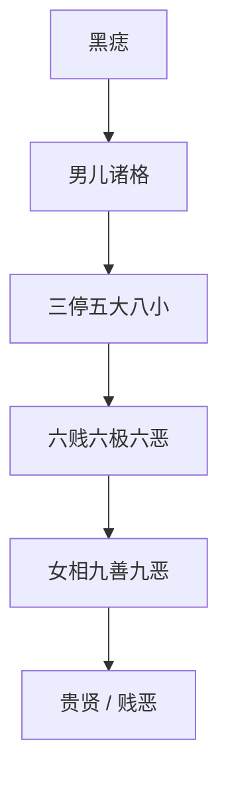

## 本章要义

《太清神鉴》卷六把前面的部位收成格局。先论黑痣：显处多凶、隐处多吉，面上各部各有旧说；再列男儿贵格、两府、两制、正郎、员郎、豪富、寿夭、先贱后贵、先富后贫，以及四相不露、三停、五大八大、五小八小、六贱六极六恶。后半专论女相：体柔用弱为正，九善九恶、贵贤与贱恶分条。女相部位与男相同，专论用女相底图，不要拿男脸去套。

这是**术数文献，不是医学**。痣、格、克夫、产厄、刑死都是旧说应验话，不能当体检、婚育或法律预测。前卷骨肉手足见 [[xuanxue/taiqing-09-guti|额眉眼骨肉]]，十二宫位置可对读 [[xuanxue/mayi-02-qianliugong|麻衣前六宫]]、[[xuanxue/mayi-03-houliugong|麻衣后六宫]]。

## 底本

旧题后周王朴《太清神鉴》卷六，工作底本 `/tmp/xuanxue-work/taiqing/06-juan6.txt`。女相各条照录，不删「女人贱恶部」。夹注「余与前同」照录。原文尽量保持底本用字，白话疏通明显讹字（如「耳日斜视」当作「耳目」、「发垂这」当作「发垂者」、「要必害夫」当作「妻必害夫」、「口似胚芽」按口似含丹一类疏通）。

## 对读

### 黑痣部

> 难度：进阶

夫黑痣者，若山之生林木，地之出堆阜。

**白话：** 黑痣，好比山上长林木、地上起土堆。

山有美质，则生善木以显其秀；地积污土，则长恶阜以文其浊。

**白话：** 山有美质，就长好树来显它的秀；地积污土，就长恶堆来标明它的浊。

是以万物之理，无所不然。

**白话：** 所以万物的道理，没有不是这样的。

古人之有美质也，则生奇痣以新其贵；生有浊质，则生恶痣以表其贱。

**白话：** 「新」当作「彰」一类。古人有美质，就生奇痣来显他的贵；生而质浊，就生恶痣来表他的贱。

故汉高祖左股有七十二黑子，则见帝王之瑞相也。

**白话：** 所以汉高祖左腿有七十二颗黑子，旧说是帝王的瑞相。这是史传附会，不是医学。

凡黑痣生于显处者多凶，生于隐暗之中者多吉。

**白话：** 黑痣生在显眼处，多凶；生在隐蔽处，多吉。

故生于面者，皆不利也。

**白话：** 所以生在脸上的，旧说都不利。

黑痣其色黑如墨，赤如朱，善也。

**白话：** 痣色黑如墨、赤如朱，才算善。

带赤色者主口舌斗竞；带白色者，主忧刑；带黄色者，主遗忘失脱。

**白话：** 带赤色，主口舌争斗；带白色，主忧、刑；带黄色，主遗忘、失脱。

此文理之辨相也。

**白话：** 以上是按文理来辨相。

*图注：红点示例印堂、目下、准头三处。痣的吉凶因部位而不同，不可一概。对应「凡黑痣生于显处者多凶」。术数文献，不是医学。*

### 头面黑痣

> 难度：进阶

生发中者主富寿，近上者尤猛贵。

**白话：** 生在头发里的，主富寿；越靠近头顶，越猛贵。

额上有七星黑者，主大贵。

**白话：** 额上有七星排列的黑痣，主大贵。

天中主妨父，天庭主妨母，司空妨父母。

**白话：** 天中的痣妨父，天庭的妨母，司空的妨父母。

印堂心主贵，两耳轮上主富，耳内主寿，颐上主财。

**白话：** 印堂当中主贵，两耳轮上主富，耳内主寿，下巴上主财。

眼胲上主作贼，山根上主克害，山根下主兵死，鼻侧主病苦死。

**白话：** 眼胞上主作贼，山根上主克害，山根下主兵死，鼻侧主病苦死。都是术数话，不是医学。

目上穷困多，眉中主富寿，唇上主吉利，鼻头主妨害刀厄，鼻梁主蹇滞。

**白话：** 目上多穷困，眉中主富寿，唇上主吉利，鼻头主妨害、刀厄，鼻梁主蹇滞。

人中主求妇易，口侧聚财难，口中主酒食，舌上主虚言，唇下主破财，口角主失职，承浆主醉死，左厢主横死。

**白话：** 人中主求妇容易，口侧聚财难，口中主酒食，舌上主虚言，唇下主破财，口角主失职，承浆主醉死，左厢主横死。

高广主亲妨克，阳尺主客死，辅角主病死，边地主外死，转角主贫下，山林主虫伤。

**白话：** 高广主妨克亲人，阳尺主客死，辅角主病死，边地主外死，转角主贫下，山林主虫伤。

虎角主军门，劫门主弓箭死，青路主客道死。

**白话：** 虎角主军门，劫门主弓箭死，青路主客死在道路上。

太阳主妇吉，鱼尾主井亡，奸门主刀杀，天中主水厄，元中主清慎，夫左主丧妻。

**白话：** 太阳主妇吉，鱼尾主井亡，奸门主刀杀，天中主水厄，元中主清慎，夫座之左主丧妻。与上条「天中妨父」是同一部位的不同应验话，并存。

长男主克长子，中男主克中儿，次男主克次儿。

**白话：** 长男部位克长子，中男克中儿，次男克次儿。

金匮主破散，书上无主职，学堂主无学，命门主火厄。

**白话：** 金匮主破散，「书上」无职，学堂主无学，命门主火厄。

仆使主为贱，婴门主饥寒，小吏主贫薄，中堂主克妻，外宅主无屋，奴婢妨奴。

**白话：** 仆使主为贱，婴门主饥寒，小吏主贫薄，中堂主克妻，外宅主无屋，奴婢部位妨奴。

双坑堑主落崖，陂池主溺水，匮上主客亡，三阳主缢死，盗部主奸窃，两厨主乏食，祖宅主移屋。

**白话：** 双坑堑主落崖，陂池主溺水，匮上主客亡，三阳主缢死，盗部主奸窃，两厨主缺食，祖宅主搬家。

大海主水厄，年上主贫困，地角主少田宅，牢狱主刑厄之灾也。

**白话：** 大海主水厄，年上主贫困，地角主少田宅，牢狱主刑厄。这些都是部位名目上的旧说，不是诊断。

### 男儿贵格

> 难度：进阶

眼势入天仓，眉清目更长。

**白话：** 眼势伸进天仓，眉清、目更长。

准圆年寿起，法令贯颐堂。

**白话：** 准头圆、年上寿上起，法令纹贯到颐堂。

两眉过耳耸，唇丹口四方。

**白话：** 两眉过耳而耸，唇红、口四方。

承浆朝地角，色正见神光。

**白话：** 承浆朝向地阁，色正而见神光。

起背如披甲，眉清额又方。

**白话：** 背起像披着甲，眉清、额又方。

官高名四海。万古播忠良。

**白话：** 旧说官高、名满四海，万古传他忠良。

又云：眉为华盖眼为星，华盖高兮眼贵明。

**白话：** 又说：眉是华盖，眼是星。华盖要高，眼要明。

地势朝天乘步稳，必当年少作公卿。

**白话：** 地阁朝天、步履稳，旧说少年就能作公卿。

### 两府格

> 难度：进阶

额广而平，天庭不陷，鼻隆而直，地阔不尖。

**白话：** 额广而平，天庭不塌，鼻隆而直，地阁宽而不尖。

瘦人有肩背，肥人神愈清。

**白话：** 瘦人要有肩有背，肥人神要更清。

边广地广，龙骨与虎骨相成。

**白话：** 边地广、地阁广，龙骨与虎骨相成。

肉光滑，眉秀轻完满。

**白话：** 肉光滑，眉秀、轻、完满。

兰台廷尉分明，耳贴肉而生，分明为五岳朝正。

**白话：** 鼻翼兰台、廷尉分明，耳贴肉而生，才算五岳朝正。

口旁有肉起，不论肥瘦，天仓不陷。

**白话：** 口旁有肉起，不论肥瘦，天仓都不塌。

骨隆而肉称，色正而光，声不论大小，清圆不破。

**白话：** 骨隆而肉相称，色正而有光；声音不论大小，要清圆不破。

肩隆有背有胸，上长下短，手足龙虎相吞。

**白话：** 肩隆、有背有胸，上身长、下身短，手足龙虎相吞。

目不论大小，神藏不露，眼囊大而藏睛。

**白话：** 目不论大小，神要藏不露，眼胞大而能藏睛。

神贵不乱，厚而不俗，坐稳行轻。

**白话：** 神贵而不乱，厚重而不俗，坐得稳、走得轻。

此乃两府格也。

**白话：** 这就是两府格。

### 两制格

> 难度：进阶

瘦人额广，肥人额平。

**白话：** 瘦人额要广，肥人额要平。

色正肉滑，发细鬓清。

**白话：** 色正、肉滑，发细、鬓清。

目藏神而远，天仓不陷，鼻隆而直，地角不尖，瘦人肩背厚，肥人神愈清。

**白话：** 目藏神而看得远，天仓不塌，鼻隆而直，地角不尖；瘦人肩背厚，肥人神更清。

边广地广，龙骨与虎骨相成。

**白话：** 边地广、地阁广，龙骨与虎骨相成。

君臣相称，耳耸金匮平。

**白话：** 君臣骨相称，耳耸、金匮平。

眉轻清秀，色正而明。

**白话：** 眉轻、清、秀，色正而明。

### 正郎格

> 难度：进阶

瘦人色正，肥人不俗，精神隐藏，鼻直口方，肩背丰隆。

**白话：** 瘦人色正，肥人不俗，精神藏而不露，鼻直口方，肩背丰隆。

瘦人肩背不寒，肥人骨肉相称，举止自重。

**白话：** 瘦人肩背不寒薄，肥人骨肉相称，举止自重。

### 员郎格

> 难度：进阶

面目神藏而远，额方骨耸，金匮方平。

**白话：** 面目神藏而远，额方、骨耸，金匮方而平。

瘦人肩背不寒，肥人骨肉相称，举止贵气自重。

**白话：** 瘦人肩背不寒，肥人骨肉相称，举止有贵气、自重。

### 男豪富

> 难度：进阶

耳耸天兼长，眉疏口四方。

**白话：** 耳耸、兼长，眉疏、口四方。

背隆如负物，胸起似昂藏。

**白话：** 背隆像背着东西，胸起像昂藏。

鼻直兼圆准，色老辅神光。

**白话：** 鼻直、准头圆，色老成而辅着神光。

二阳成不陷，颧骨插天仓。

**白话：** 二阳成而不塌，颧骨插向天仓。

手足如绵软，双绦寿带长。

**白话：** 手足软如绵，法令双绦、寿带长。

不唯身主富，更定子孙昌。

**白话：** 不只自身主富，还定子孙昌盛。

### 长寿禄

> 难度：进阶

耳耸势兼长，眉清口四方。

**白话：** 耳耸、势兼长，眉清、口四方。

额方分日月，眼下露神光。

**白话：** 额方、日月角分开，眼下露神光。

鼻直兼圆准，颐方法令长。

**白话：** 鼻直、准圆，颐方、法令长。

脑圆成玉枕，地角辅承浆。

**白话：** 脑圆而成玉枕，地角辅着承浆。

牛项兼鹳目，肩隆井灶藏。

**白话：** 项如牛、目如鹳，肩隆、井灶藏。

骨刚过上寿，清德寿无疆。

**白话：** 骨刚，过上寿；清德，寿无疆。术数话，不是医学。

### 夭寿

> 难度：进阶

眉促又相连，唇轻额又尖。

**白话：** 眉促又相连，唇轻、额又尖。

鼻低横有骨，头细却无肩。

**白话：** 鼻低、横里有骨，头细却没有肩。

眼露还无寿，形寒不老年。

**白话：** 眼露就无寿，形寒活不久。不是医学。

额亏边地窄，轮反而朝前。

**白话：** 额亏、边地窄，耳轮反而朝前。

色嫩兼生火，声焦命岂延。

**白话：** 色嫩又带火色，声焦，命岂能延。

眼光浮泛露，三十入黄泉。

**白话：** 眼光浮泛外露，旧说三十入黄泉。术数死候，不是寿命预测。

### 先贱后贵

> 难度：进阶

额小初年滞，神清色且牢。

**白话：** 额小，初年滞；神清、色牢。

气寒神自远，势怯意偏豪。

**白话：** 气寒而神自远，势怯而意偏豪。

光额终成器，颐完禄位高。

**白话：** 额后发光，终成器；颐完，禄位高。

色黄虽未发，五岳已相朝。

**白话：** 色黄虽还没发，五岳已经相朝。

莫道多迍滞，逢时自发苗。

**白话：** 别说一路迍滞，逢时自己会发苗。

不唯官禄位，财帛自相招。

**白话：** 不只官禄，财帛也会自来。

### 先富后贫

> 难度：进阶

额广荣初岁，神清色不牢。

**白话：** 额广，初年荣；神清，可是色不牢。

鼻高无脸骨，肉薄起声焦。

**白话：** 鼻高却没有脸骨，肉薄、声焦。

掌厚还筋露，脐深耳不朝。

**白话：** 掌厚却筋露，脐深、耳不朝。

背虽如负物。胸薄不生毫。

**白话：** 背虽像背着东西，胸薄、不生毫。

色嫩初生好，中年祸必招。

**白话：** 色嫩，初年生得好，中年必招祸。

君看今已富，终主自萧条。

**白话：** 你看他现在已富，终究会自己萧条。

### 四相不露

> 难度：进阶

眼睛露，黑白分明不为露。

**白话：** 眼睛露：黑白分明，就不算露。

鼻露窍，山根正不为露。

**白话：** 鼻露孔：山根正，就不算露。

口露齿，唇不褰不为露。

**白话：** 口露齿：唇不翻卷，就不算露。

耳反轮，贴肉生不为露。

**白话：** 耳反轮：贴肉而生，就不算露。

又云：一露二露，有裩无裤。

**白话：** 又说：露了一处两处，旧说有裩无裤，穷到只剩贴身衣。

露齿结喉，身不自由。

**白话：** 露齿又结喉，身不自由。

鹭鸶类鹤，终是不足。

**白话：** 鹭鸶只是像鹤，终究不够。

更看骨法形气决之。

**白话：** 还要再看骨法、形、气来决断。

（余与前同）

**白话：** 其余与前面相同。

### 三停

> 难度：进阶

上停长者大吉昌，中停长者近君王。

**白话：** 上停长，大吉昌；中停长，近君王。

下停长者皆庸俗，远走他方主不良。

**白话：** 下停长，都庸俗；远走他乡，主不良。

又云：身三停相称及上下匀调，则为富贵之人也。

**白话：** 又说：身的三停相称、上下匀调，才是富贵之人。

上长下短，背耸三山，则为公卿之位。

**白话：** 上长下短，背耸如三山，则为公卿之位。

上短下长，腰身怯薄，一生奔波，贫苦之辈矣。

**白话：** 上短下长，腰身怯薄，一生奔波，是贫苦之辈。

*图注：男脸三停，只对上面男儿格局。发际到眉为上停，眉到准头为中停，准头到地阁为下停，对应「身三停相称及上下匀调」。女相不要用这张男脸，用后面女性十二宫底图。*

*图注：上停主禄与初年、中停主寿与中年、下停主富与晚年。口诀图式，不是脸型图。女相仍用下面女性十二宫底图，不要读成医学三停。*

### 五大

> 难度：进阶

五大之形：一头大，二眼大，三腹大，四耳大，五口大。

**白话：** 五大之形：一头大，二眼大，三腹大，四耳大，五口大。

五大者，须得生成无缺陷，则主富寿矣。

**白话：** 五大必须生成没有缺陷，才主富寿。

或头大而无角，眼大而昏浊，腹大而不圆垂，耳大而无轮廓，口大而唇薄，则反主贫贱也。

**白话：** 若头大却无骨角，眼大却昏浊，腹大却不圆垂，耳大却无轮廓，口大却唇薄，反而主贫贱。

### 八大

> 难度：进阶

八大者：眼虽大，昏且浊；鼻虽大，梁柱弱；口虽大，两垂角；耳虽大，门孔薄；头虽大，无骨著；声虽大，宫商亏；面虽大，薄却皮；身虽大，停不齐。

**白话：** 八大：眼虽大却昏浊；鼻虽大梁柱弱；口虽大两角下垂；耳虽大门孔薄；头虽大没有骨著；声虽大宫商亏；面虽大皮却薄；身虽大三停不齐。

以上八者，如不相应，则反为贫贱之人也。

**白话：** 以上八者如果互不相应，反而为贫贱之人。

### 五小

> 难度：进阶

五小之形：一头小，二眼小，三腹小，四耳小，五口小。

**白话：** 五小之形：一头小，二眼小，三腹小，四耳小，五口小。

若五者端正无缺陷，而俱小者，乃贵相也。

**白话：** 若五者端正无缺陷、又都小，反而是贵相。

其或三四小而一二大，则主贫贱。

**白话：** 若三四个小、一两个大，则主贫贱。

若夫头小而有角，眼小而清秀，腹小而圆垂，耳小而轮廓成，口小而唇齿正，反为贵人也。

**白话：** 若头小而有骨角，眼小而清秀，腹小而圆垂，耳小而轮廓成，口小而唇齿正，反而是贵人。

### 八小

> 难度：进阶

眼虽小，秀且长；鼻虽小，梁柱直；口虽小，棱且方；耳虽小，坚且圆；头虽小，平且正；声虽小，宫且高；面虽小，清且朝；身岁小，正且齐。

**白话：** 「身岁小」当作「身虽小」。眼虽小却秀长；鼻虽小梁柱直；口虽小有棱而方；耳虽小坚而圆；头虽小平而正；声虽小宫调高；面虽小清而朝拱；身虽小正而齐。

以上八者，有如相应端美，则为富贵之人也。

**白话：** 以上八者如果相应、端美，则为富贵之人。

### 六贱

> 难度：进阶

六贱者：额角缺陷、天中薄下为一贱，背胸俱薄为二贱，音声雌散为三贱，耳日斜视为四贱，鼻曲低塌为五贱，目无光彩为六贱。

**白话：** 「耳日」当作「耳目」。六贱：额角缺陷、天中薄而下为一贱；背胸都薄为二贱；声音雌而散为三贱；耳目斜视为四贱；鼻曲低塌为五贱；目无光彩为六贱。

有此六贱者，主为供役也。

**白话：** 有这六贱，旧说主供役。

### 六极

> 难度：进阶

六极者：身大头小为一极，男主妨妇，女主妨夫；额狭而小为二极，不得父母之力；目小为三极，主无见识，又主不得朋友力；耳小为四极，主寿命短促；鼻小为五极，主无爵禄，有官亦多失位；口小为六极，主饥寒。

**白话：** 六极：身大头小为一极，男妨妇、女妨夫；额狭而小为二极，不得父母之力；目小为三极，无见识，也不得朋友力；耳小为四极，寿命短；鼻小为五极，无爵禄，有官也多失位；口小为六极，主饥寒。术数话，不是医学。

犯此六极者，乃寒贱之人也。

**白话：** 犯这六极，是寒贱之人。

### 六恶

> 难度：进阶

六恶者：一曰羊睛直视，主性不仁，常怀毒害；二曰唇不掩齿，主性不和，难共交往；三曰结喉，主妨妻杀子，多招灾厄；四曰头小，主贫而夭；五曰三停不正，主贫而贱；六曰定立如走，主奔波寒苦。

**白话：** 六恶：一是羊睛直视，性不仁、常怀毒害；二是唇掩不住齿，性和不来、难交往；三是结喉，妨妻杀子、多灾厄；四是头小，贫而夭；五是三停不正，贫而贱；六是站着也像在走，奔波寒苦。

有此六恶，不可与同处矣。

**白话：** 有这六恶，旧说不可与同处。这是相书戒条，不是交往指南。

### 男克子孙

> 难度：进阶

两眼如离舍，唇褰鼻准尖。

**白话：** 两眼像分开的屋子，唇翻、鼻准尖。

发粗眉又重，骨弱下垂肩。

**白话：** 发粗、眉又重，骨弱、肩下垂。

车立如寒势，头低步纵前。

**白话：** 「车立」按站立。站着像发寒，头低、步往前纵。

三阳低小小，妻室愈难全。

**白话：** 三阳低而小，妻室愈难保全。

色嫩多财破，声雌没谷田。

**白话：** 色嫩多破财，声雌没有谷田。

六亲难偶合，晚岁定孤眠。

**白话：** 六亲难合，晚岁定孤眠。

### 相无兄弟

> 难度：进阶

耳反家门破，颐尖兄弟孤。

**白话：** 耳反，家门破；颐尖，兄弟孤。

假饶三两个，譬似不如无。

**白话：** 就算有两三个兄弟，也像不如没有。

### 孤独无妻

> 难度：进阶

人生孤独相何如，骨颊高兮气不和。

**白话：** 孤独之相什么样？骨颊高、气不和。

更兼鱼尾枯无肉，妻中似有磨。

**白话：** 再加上鱼尾枯、没有肉，妻上像有折磨。

### 带杀格

> 难度：进阶

两眼如狼目，眉昂势似侵。

**白话：** 两眼如狼目，眉昂、势像侵人。

神凶兼外射，笑语却生嗔。

**白话：** 神凶又外射，笑语里却生嗔。

举止如鹰坐，戈钺生掌纹。

**白话：** 举止像鹰蹲着，掌上生戈钺纹。

色轻兼带火，声大返雌音。

**白话：** 色轻又带火，声大反而雌。

鼻准尖无信，斜窥定有刑。

**白话：** 鼻准尖则无信，斜眼窥人定有刑。

须知三角眼，法死不须论。

**白话：** 须知三角眼，旧说法死不必再论。术数刑候，不是法律。

### 辨美恶有二十

> 难度：进阶

头虽圆，折腰肢。

**白话：** 头虽圆，腰却折。

额虽广，尖却颐。

**白话：** 额虽广，颐却尖。

骨虽峻，皮却粗。

**白话：** 骨虽峻，皮却粗。

鼻虽厚，梁柱低。

**白话：** 鼻虽厚，梁柱低。

发虽黑，粗且浓。

**白话：** 发虽黑，却粗且浓。

眼虽长，眉且蹙。

**白话：** 眼虽长，眉却蹙。

背虽隆，手如枝。

**白话：** 背虽隆，手却细如枝。

胸虽阔，背成坑。

**白话：** 胸虽阔，背却成坑。

舌虽红，口吹火。

**白话：** 舌虽红，口却像吹火。

唇虽方，齿不齐。

**白话：** 唇虽方，齿不齐。

腰虽厚，行如驰。

**白话：** 腰虽厚，走起来像跑。

脚虽厚，粗无纹。

**白话：** 脚虽厚，粗而没有纹。

身虽大，声音细。

**白话：** 身虽大，声音细。

面虽白，身粗黑。

**白话：** 面虽白，身却粗黑。

肉虽丰，结却喉。

**白话：** 肉虽丰，却结喉。

面虽短，眼却长。

**白话：** 面虽短，眼却长。这一条与上条都是一处美、一处折除。

气虽清，行步欹。

**白话：** 气虽清，步却歪。

语虽和，神似痴。

**白话：** 语虽和，神却像痴。

色虽明，视东西。

**白话：** 色虽明，眼睛却东张西望。

坐虽正，食淋漓。

**白话：** 坐虽正，吃起来淋漓。

行止二十种，皆有折除，恶善相杂。

**白话：** 以上二十种行止，都有折除，恶善相杂。

若失相者，或富则夭，或寿则贫，或贵则贫，或先富后贫，或先贵后贱，宜精察而裁之。

**白话：** 若失了相，或富而夭，或寿而贫，或贵而贫，或先富后贫，或先贵后贱，要精察再裁断。

### 女子相

> 难度：进阶

一阴一阳，其道不可乱；一刚一柔，其道不可易，确然处乎上者，天也；颓然处乎下者，地也。

**白话：** 一阴一阳，这个道不能乱；一刚一柔，这个道不能改。确然在上的是天，颓然在下的是地。

天以刚健为道，地以柔和为德，是天地之常仪，乾坤之大理也。

**白话：** 天以刚健为道，地以柔和为德，这是天地的常仪、乾坤的大理。

且人之生也，禀阴禀阳，分柔分刚。

**白话：** 人出生，禀阴或禀阳，分柔或分刚。

男资纯阳之质也，故其体刚而用健；女受纯阴之形也，故其体柔而用弱。

**白话：** 男资纯阳之质，所以体刚而用健；女受纯阴之形，所以体柔而用弱。这是书中的阴阳框架，不是现代性别论。

若夫男子者，形反柔而懦，性反雌而弱；女人者，形反刚而勇，性反雄而暴，皆非得中正和平之美，是得差忒郁勃之气也。

**白话：** 若男子形反而柔懦、性反而雌弱；女人形反而刚勇、性反而雄暴，都不是中正和平之美，而是差忒、郁勃之气。

故女体性柔和，仪貌秀媚者，富贵贞洁之良；心性刚暴，形质雄恶者，贫贱凶灾之兆也。

**白话：** 所以女体性柔和、仪貌秀媚，旧说是富贵贞洁之良；心性刚暴、形质雄恶，旧说是贫贱凶灾之兆。下面各条都是相书旧说，不是妇科、也不是品行鉴定。

略举此，见女人之大概也。

**白话：** 略举这些，看女人相的大概。

*图注：本图是女脸，不是男脸十二宫。宫名与男相同：命宫在印堂，官禄在人物左额（照片右侧），迁移在发际两侧。本节以下九善九恶、贵贤贱恶都落在这张女脸上，禁止用男脸十二宫冒充。术数文献，不是医学。*

### 女人九善

> 难度：进阶

头圆额平，为一善。

**白话：** 头圆额平，是第一善。

骨细肉滑，为二善。

**白话：** 骨细肉滑，是第二善。

发黑唇红，为三善。

**白话：** 发黑唇红，是第三善。

眼大眉秀，为四善。

**白话：** 眼大眉秀，是第四善。

指纤掌软，纹如乱丝，为五善。

**白话：** 指纤掌软、纹如乱丝，是第五善。

语声小圆，清如流泉，为六善。

**白话：** 语声小而圆、清如流泉，是第六善。

笑不见睛，口不见齿，为七善。

**白话：** 笑不见睛、口不见齿，是第七善。

行步详缓，坐卧端雅，为八善。

**白话：** 行步详缓、坐卧端雅，是第八善。

神气清媚，皮肤香洁，为九善。

**白话：** 神气清媚、皮肤香洁，是第九善。

女人有此九善，为邑封之贵也。

**白话：** 女人有这九善，旧说是邑封之贵。

### 女人九恶

> 难度：进阶

蝇面为一恶，主妨夫。

**白话：** 蝇面是第一恶，主妨夫。

结喉为二恶，主招横祸。

**白话：** 结喉是第二恶，主招横祸。

蓬头为三恶，主下贱。

**白话：** 蓬头是第三恶，主下贱。

蛇行雀步为四恶，主贫贱。

**白话：** 蛇行雀步是第四恶，主贫贱。

眉逆而交为五恶，主穷下妨克。

**白话：** 眉逆而生又相交，是第五恶，主穷下妨克。

鼻上生勾纹为六恶，主妨克招厄。

**白话：** 鼻上生勾纹是第六恶，主妨克招厄。

目露四白为七恶，主毒害凶狡。

**白话：** 目露四白是第七恶，主毒害凶狡。

雄声为八恶，主刚暴再嫁。

**白话：** 雄声是第八恶，主刚暴再嫁。

旋毛生鬓为九恶，主顽贱克子。

**白话：** 旋毛生在鬓上是第九恶，主顽贱克子。

女人有此九恶，不可同居矣。

**白话：** 女人有这九恶，旧说不可同居。这是相书戒条，不是相处指南。

### 女人贵贤部

> 难度：进阶

龙角纤纤细起，直入发际者，后妃。

**白话：** 龙角纤细而起、直入发际，旧说后妃。

天中印堂有肉环起者，后妃，微者夫人。

**白话：** 天中、印堂有肉环起，后妃；微的，夫人。

伏犀隐隐而起者，郡主。

**白话：** 伏犀骨隐隐而起，郡主。

龙角、虎角、辅角隐隐皆起涉入额者，并主将帅夫人。

**白话：** 龙角、虎角、辅角都隐隐起而伸进额，并主将帅夫人。

头圆项短者，主富；额平面方者，主贵。

**白话：** 头圆项短主富；额平面方主贵。

眉长而秀者贤妇，眼秀而清者贵阁。

**白话：** 眉长而秀是贤妇，眼秀而清是贵阁。

鼻直如削者，贵而多寿；眉分八字者，性和而福。

**白话：** 鼻直如削，贵而多寿；眉分八字，性和而福。

口细有棱者，令妇；舌如莲花者，淑质。

**白话：** 口细有棱，令妇；舌如莲花，淑质。

唇如朱砂者，令妻；齿如石榴者，命妇。

**白话：** 唇如朱砂，令妻；齿如石榴，命妇。

人中深又直者，多子；目下润泽者，宜儿。

**白话：** 人中深又直，多子；目下润泽，宜儿。术数话，不是妇产。

耳红而圆者，贵妇；耳成轮廓者，贤富。

**白话：** 耳红而圆，贵妇；耳成轮廓，贤而富。

左耳厚者，先生男；右耳厚者，先生女。

**白话：** 左耳厚先生男，右耳厚先生女。人物自身的左右。

唇多纹理者，多子；颐生重颔者，富豪。

**白话：** 唇多纹理，多子；颐生重颔，富豪。

发青黑如细丝者，贵妇；章红如绵者邑封。

**白话：** 「章」当作「掌」。发青黑如细丝，贵妇；掌红如绵，邑封。

骨细而肉腻者，贵质；肉洁体香者，令相。

**白话：** 骨细肉腻，贵质；肉洁体香，令相。

性缓气柔者，福寿；神静色安者，贞洁。

**白话：** 性缓气柔，福寿；神静色安，贞洁。

笑而闭目者，和美；行而详缓者，淑丽；掌中足底生黑痣者，贵而益夫；腋下乳间生旋毛者，善生贵子矣。

**白话：** 笑而闭目，和美；行而详缓，淑丽；掌中、足底生黑痣，贵而益夫；腋下、乳间生旋毛，旧说善生贵子。隐处之痣见本章黑痣部「隐暗之中者多吉」。

### 女人贱恶部

> 难度：进阶

头尖者下贱，额狭者贫厄。

**白话：** 头尖下贱，额狭贫厄。以下各条是卷六原题「女人贱恶部」的旧说，照录对读，不是品行鉴定，也不是医学。

额角有旋毛者，再嫁、恶死；额狭而发垂这，贫穷、灾祸。

**白话：** 「发垂这」当作「发垂者」。额角有旋毛，再嫁、恶死；额狭而发垂，贫穷、灾祸。

发卷挛及赤黄者，穷下；鬓蓬枯燥而粗硬者，厄恶。

**白话：** 发卷挛又赤黄，穷下；鬓蓬、枯燥、粗硬，厄恶。

眉粗浓而逆生者，妨夫、产厄；眉薄散而头交者，重嫁、害子。

**白话：** 眉粗浓而逆生，妨夫、产厄；眉薄散而眉头相交，重嫁、害子。

目露而白者，妨夫；目深而偷视者，奸私克害。

**白话：** 目露而白，妨夫；目深而偷视，奸私克害。

目下有壅肉者，死厄克儿；赤缕贯睛者，产难。

**白话：** 目下有壅肉，死厄克儿；赤缕贯睛，产难。不是产科。

目生三角者，凶恶；目大而平满者，淫邪。

**白话：** 目生三角，凶恶；目大而平满，淫邪。

瞻视不正、瞳子横者外情；鼻陷孔露者，贫下克夫。

**白话：** 瞻视不正、瞳子横，外情；鼻陷孔露，贫下克夫。

鼻尖曲者，狠毒贫贱；人中平狭者，无子。

**白话：** 鼻尖曲，狠毒贫贱；人中平狭，无子。

两头额高危者，凶暴；口如吹火者，孤孀。

**白话：** 「两头额」按两额角。两额角高危，凶暴；口如吹火，孤孀。

口如一撮者，贫贱；口大而绰者，穷，当三嫁。

**白话：** 口如一撮，贫贱；口大而宽绰，穷，当三嫁。

口薄而尖者，心怀毁谤；唇薄如一字者，下贱毒性。

**白话：** 口薄而尖，心怀毁谤；唇薄如一字，下贱毒性。

唇起如龙嘴者，克夫恶死；唇褰齿露者，妨害寿夭。

**白话：** 唇起如龙嘴，克夫恶死；唇翻齿露，妨害寿夭。

唇青香黑者，淫秽下贱；耳反而垂者，妨夫害子。

**白话：** 「香」或为「而」。唇青而黑，淫秽下贱；耳反而垂，妨夫害子。

目小黧黑者，命短穷困；面横生拳骨者，不良害夫；蝇生麻点者，孤穷克子。

**白话：** 目小黧黑，命短穷困；面横生拳骨，不良害夫；面上生蝇麻点，孤穷克子。

面凹而额窄者，贫下；额尖而鼻绰者，贱苦。

**白话：** 面凹额窄，贫下；额尖鼻宽，贱苦。

项薄似马面者，妨夫；项长结喉者，自害。

**白话：** 项薄像马面，妨夫；项长结喉，自害。

手短而指秃者，下贱贫苦；足阔而脚薄者，寒穷奔波。

**白话：** 手短指秃，下贱贫苦；足阔脚薄，寒穷奔波。

遍体生粗毛者，性顽孤寡；两腋下生硬毛者，身贱而下。

**白话：** 遍体生粗毛，性顽孤寡；两腋下生硬毛，身贱而下。

肉粗骨硬者，一生寒贱；皮薄而气臭者，百年穷苦。

**白话：** 肉粗骨硬，一生寒贱；皮薄气臭，百年穷苦。

声雄而大者，妨夫不良；声小而破者，无财多破也。

**白话：** 声雄而大，妨夫不良；声小而破，无财多破。

掩口笑者外情，摇膝坐者偷滥。

**白话：** 掩口笑，外情；摇膝坐，偷滥。

小狭者，无子无财；小白者，绝子绝贵。

**白话：** 底本「小狭」「小白」承上，当指口小而狭、目小而白一类。口小而狭，无子无财；目小而白，绝子绝贵。

胸高臀凸者，一生为婢；腰折而项瘿者，百年孤苦。

**白话：** 胸高臀凸，一生为婢；腰折而项有瘿，百年孤苦。

行如奔马者，妨夫下贱；行如马跳者，奔波穷。

**白话：** 行如奔马，妨夫下贱；行如马跳，奔波穷。

颊赤而燥者，性暴妨害；气浊而神昏者，主多灾厄。

**白话：** 颊赤而燥，性暴妨害；气浊神昏，多灾厄。

目下有罗纹者，杀夫害子；目下有立理者，孤孀无子。

**白话：** 目下有罗纹，杀夫害子；目下有竖纹，孤孀无子。

目上斜纹者，嫁必私逃；井灶有纹者，要必害夫。

**白话：** 「要必」当作「妻必」。目上斜纹，嫁必私逃；井灶有纹，妻必害夫。

有钓理者，淫盗妨夫；有立理者，恶死。

**白话：** 「钓理」即勾纹。有勾纹，淫盗妨夫；有竖纹，恶死。

人中有横纹者，害杀夫。

**白话：** 人中有横纹，害杀夫。

其余女人之相，与男无远。

**白话：** 其余女人的相，与男人相去不远。

更以前诸男子相一一推之，贵贱吉凶，可自命矣。

**白话：** 再用前面各条男子相一一去推，贵贱吉凶，可以自己推定。

### 女富贵

> 难度：进阶

鼻直如悬胆，唇方口似胚芽。

**白话：** 鼻直如悬胆，唇方；「口似胚芽」按口似含葩、方正疏通。

眉疏并眼秀，齿白更方颐。

**白话：** 眉疏又眼秀，齿白、颐更方。

耳耸垂珠软，神和色又怡。

**白话：** 耳耸、垂珠软，神和、色又怡。

额方分日月，体白润香肌。

**白话：** 额方、日月角分开，体白润、肌香。

坐稳如山立，神严貌不卑。

**白话：** 坐稳如山立，神严、貌不卑。

莫言当自贵，更主子孙奇。

**白话：** 别只说她自己贵，还主子孙奇。

### 女贫贱

> 难度：进阶

额窄又高眉，唇掀口不齐。

**白话：** 额窄、眉又高，唇掀、口不齐。

面轻身铁硬，体薄更无威。

**白话：** 面轻、身铁硬，体薄更无威。

耳小垂珠浅，鬈毛鼻骨低。

**白话：** 耳小、垂珠浅，发鬈、鼻骨低。

哭形须再嫁，鬼脸定无儿。

**白话：** 哭形须再嫁，鬼脸定无儿。

淫光生眼角，嫉妒更奸欺。

**白话：** 眼角生淫光，嫉妒更奸欺。

莫言今受苦，晚岁更孤凄。

**白话：** 别只说她现在受苦，晚岁更孤凄。

### 妇人孤独

> 难度：进阶

妇人眼下肉常无，不杀三夫杀两夫。

**白话：** 妇人眼下常常没有肉，旧说不杀三夫也杀两夫。这是相书克夫话，不是婚姻预测。

见人掩口笑不断，爱逐行人半夜逋。

**白话：** 见人掩口笑个不停，爱跟着行人半夜逃走。卷六到此结束。
